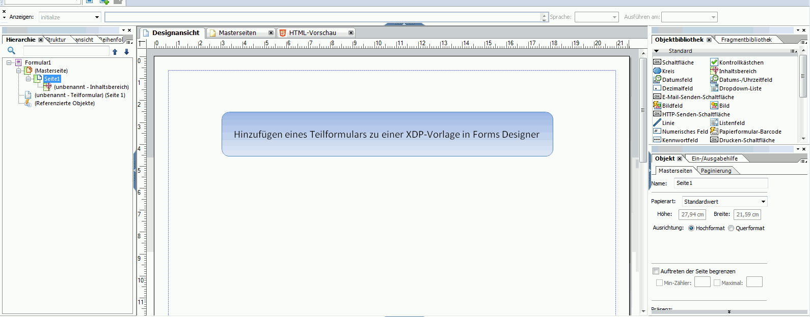
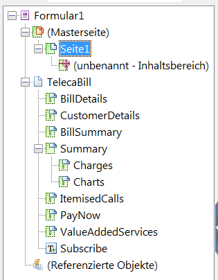
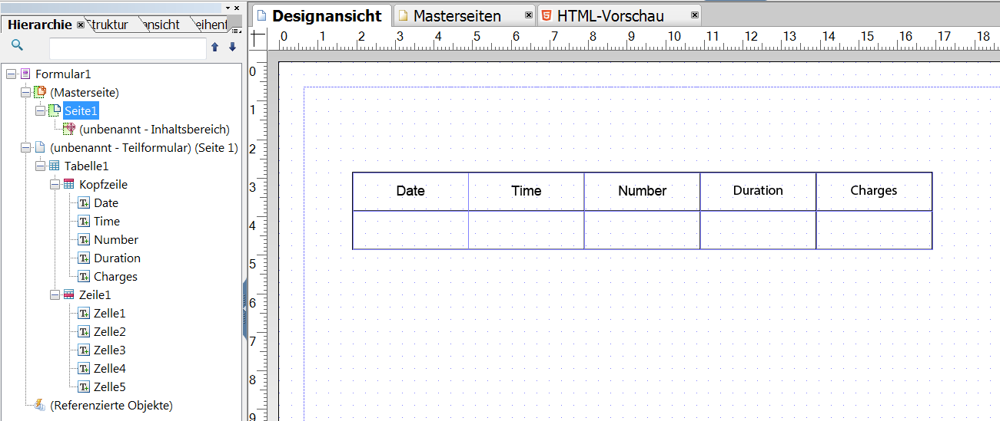
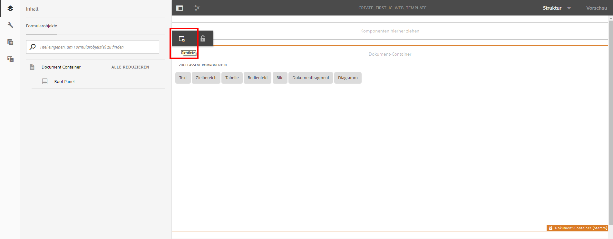
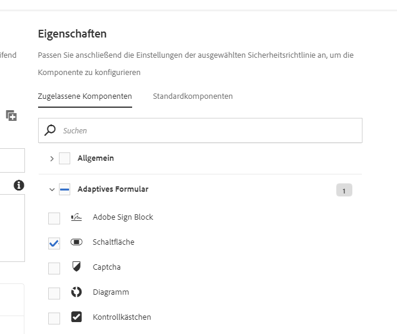

# Tutorial: Erstellen Sie Vorlagen {#tutorial-create-templates}

Erstellen Sie Druck- und Webvorlagen für die interaktive Kommunikation

Dieses Tutorial ist ein Schritt im [Erstellen der ersten interaktiven Kommunikation](/help/forms/using/create-your-first-interactive-communication.md) Reihe. Es wird empfohlen, der Serie in chronologischer Reihenfolge zu folgen, um den vollständigen Anwendungsfall zu verstehen, auszuführen und zu demonstrieren.

Um eine interaktive Kommunikation zu erstellen, müssen auf dem AEM-Server Vorlagen für Druck- und Webkanäle verfügbar sein.

Die Vorlagen für den Druckkanal werden in Adobe Forms Designer erstellt und auf den AEM-Server hochgeladen. Diese Vorlagen stehen dann zur Verfügung, während Sie eine interaktive Kommunikation erstellen.

Die Vorlagen für den Webkanal werden in AEM erstellt. Vorlagenautoren und Administratoren können Webvorlagen erstellen, bearbeiten und aktivieren. Nachdem sie erstellt und aktiviert wurden, stehen diese Vorlagen zur Verfügung, während Sie eine interaktive Kommunikation erstellen.

In diesem Tutorial werden Sie durch die Schritte zum Erstellen von Vorlagen für Druck- und Webkanäle geführt, sodass sie beim Erstellen von interaktiver Kommunikation verfügbar sind. Am Ende dieser Schulung können Sie Folgendes:

* Erstellen Sie XDP-Vorlagen für den Druckkanal mit Adobe Forms Designer
* Laden Sie die XDP-Vorlagen auf den AEM Forms Server hoch
* Erstellen und aktivieren Sie Vorlagen für den Webkanal

## Erstellen Sie eine Vorlage für den Druckkanal {#create-template-for-print-channel}

Erstellen und verwalten Sie eine Vorlage für den Druckkanal von interaktiver Kommunikation mit folgenden Aufgaben:

* [Erstellen Sie eine XDP-Vorlage mit dem Forms Designer](/help/forms/using/create-templates-print-web.md#create-xdp-template-using-forms-designer)
* [Laden Sie die XDP-Vorlagen auf den AEM Forms Server hoch](/help/forms/using/create-templates-print-web.md#upload-xdp-template-to-the-aem-forms-server)
* [XDP-Vorlage für Layoutfragmente erstellen](/help/forms/using/create-templates-print-web.md#create-xdp-template-for-layout-fragments)

### Erstellen Sie eine XDP-Vorlage mit dem Forms Designer {#create-xdp-template-using-forms-designer}

Basierend auf [Anwendungsfall](/help/forms/using/create-your-first-interactive-communication.md) und [Anatomie](/help/forms/using/planning-interactive-communications.md)erstellen Sie die folgenden Teilformulare in der XDP-Vorlage:

* Rechnungsdetails: Enthält ein Dokumentfragment
* Kundendetails: Umfasst ein Dokumentfragment
* Rechnungszusammenfassung: Umfasst ein Dokumentfragment
* Zusammenfassung: Umfasst ein Dokumentfragment (Teilformular &quot;Gebühren&quot;) und ein Diagramm (Teilformular &quot;Diagramme&quot;)
* Aufrufe: Enthält eine Tabelle (Layout-Fragment)
* Jetzt bezahlen: Enthält ein Bild
* Mehrwert-Services: Enthält ein Bild

Diese Unterformulare werden nach dem Hochladen der XDP-Datei auf den Forms-Server als Zielbereiche in der Druckvorlage angezeigt. Alle Entitäten wie Dokumentfragmente, Diagramme, Layoutfragmente und Bilder werden bei der Erstellung der interaktiven Kommunikation Zielbereichen hinzugefügt.

Führen Sie die folgenden Schritte aus, um eine XDP-Vorlage für den Druckkanal zu erstellen:

1. Öffnen Sie Forms Designer und wählen Sie **Datei** > **Neu** > **Leeres Formular verwenden,** Tippen **Nächste** und tippen Sie anschließend auf **Beenden** , um das Formular zur Vorlagenerstellung zu öffnen.

   Stellen Sie sicher, dass die **Objektbibliothek** und die Option **Objekt** im Menü **Fenster** ausgewählt werden.

1. Ziehen Sie die Komponente **Teilformular** aus der **Objektbibliothek** in das Formular.
1. Wählen Sie das Teilformular aus, um die Optionen für das Teilformular im Fenster **Objekt** im rechten Bereich anzuzeigen.
1. Wählen Sie die **Teilformular** Registerkarte und wählen Sie **Fluss** von **Inhalt** Dropdown-Liste. Ziehen Sie den linken Endpunkt des Teilformulars, um die Länge anzupassen.
1. Führen Sie auf der Registerkarte **Bindungen** folgende Schritte aus:

   1. Angeben **BillDetails** im **Name** -Feld.
   1. Wählen Sie **Keine Datenbindung** aus der Dropdown-Liste **Datenbindung**.

   

1. Wählen Sie auf ähnliche Weise das Stammteilformular aus und wählen Sie die **Teilformular** und wählen Sie **Fluss** von **Inhalt** Dropdown-Liste. Führen Sie auf der Registerkarte **Bindungen** folgende Schritte aus:

   1. Angeben **TelecaBill** im **Name** -Feld.
   1. Wählen Sie **Keine Datenbindung** aus der Dropdown-Liste **Datenbindung**.

   

1. Wiederholen Sie die Schritte 2 bis 5, um die folgenden Teilformulare zu erstellen:

   * BillDetails
   * CustomerDetails
   * BillSummary
   * Zusammenfassung - Wählen Sie die **Teilformular** Registerkarte und wählen Sie **Position** von **Inhalt** Dropdown-Liste für dieses Teilformular. Fügen Sie die folgenden Teilformulare in das Teilformular **Zusammenfassung** ein.

      * Gebühren
      * Diagramme
   * ItemisedCalls
   * PayNow
   * Mehrwert - Service

   Um Zeit zu sparen, können Sie auch vorhandene Teilformulare kopieren und einfügen, um neue Teilformulare zu erstellen.

   Um die **Diagramme** Teilformular rechts neben dem Teilformular &quot;Gebühren&quot;wählen Sie die **Diagramme** Teilformular aus dem linken Bereich, wählen Sie die **Layout** und geben Sie einen Wert für **AnchorX** -Feld. Der Wert muss größer als der Wert für das Feld **Breite** für das Teilformular **Gebühren** sein. Wählen Sie das Teilformular **Gebühren** und wählen Sie die Registerkarte **Layout**, um den Wert des Felds **Breite** anzuzeigen.

1. Ziehen Sie das Objekt **Text** aus der **Objektbibliothek** in das Formular, und geben Sie den Text **XXXX zum Abonnieren wählen** in das Feld ein.
1. Klicken Sie mit der rechten Maustaste auf das Textobjekt im linken Bereich und wählen Sie **Objekt umbenennen** und geben Sie den Namen des Textobjekts als **Abonnieren**.

   

1. Wählen Sie **Datei** > **Speichern unter**, um die Datei im lokalen Dateisystem zu speichern:

   1. Navigieren Sie zum Speicherort der Datei und geben Sie den Namen **create_first_ic_print_template** ein.
   1. Wählen Sie **.xdp** aus der Dropdown-Liste **Dateityp**.
   1. Tippen Sie auf **Speichern**.

### Laden Sie die XDP-Vorlagen auf den AEM Forms Server hoch {#upload-xdp-template-to-the-aem-forms-server}

Nachdem Sie eine XDP-Vorlage mit dem Forms-Designer erstellt haben, müssen Sie sie auf den AEM Forms-Server hochladen, damit die Vorlage beim Erstellen der interaktiven Kommunikation verwendet werden kann.

1. Wählen Sie **[!UICONTROL Formulare]** > **[!UICONTROL Formulare &amp; Dokumente]**.
1. Tippen Sie auf **Erstellen** > **Datei hochladen**.

   Navigieren Sie zu und wählen Sie die **create_first_ic_print_template** Vorlage (XDP) und tippen Sie auf **Öffnen** , um die XDP-Vorlage auf den AEM Forms-Server zu importieren.

### XDP-Vorlage für Layoutfragmente erstellen {#create-xdp-template-for-layout-fragments}

Um ein Layoutfragment für den Druckkanal der interaktiven Kommunikation zu erstellen, erstellen Sie ein XDP mit Forms Designer und laden Sie es auf den AEM Forms-Server hoch.

1. Öffnen Sie Forms Designer und wählen Sie **Datei** > **Neu** > **Leeres Formular verwenden,** Tippen **Nächste** und tippen Sie anschließend auf **Beenden** , um das Formular zur Vorlagenerstellung zu öffnen.

   Stellen Sie sicher, dass die **Objektbibliothek** und die Option **Objekt** im Menü **Fenster** ausgewählt werden.

1. Ziehen Sie die **Verzeichnis** -Komponente aus **Objektbibliothek** in das Formular ein.
1. Gehen Sie im Dialogfeld „Tabelle“ folgendermaßen vor:

   1. Geben Sie die Anzahl der Spalten als **5** an.
   1. Spezifizieren Sie die Anzahl von Zeilen im Hauptteil als **1**.
   1. Aktivieren -sie das Kontrollkästchen **Kopfzeile in Tabelle einschließen**.
   1. Registerkarte **OK**.

1. Tippen Sie im linken Bereich neben **Tabelle** 1 auf **+** und klicken Sie mit der rechten Maustaste auf **Zelle1** und wählen Sie **Objekt umbenennen** in **Datum**.

   Benennen Sie **Zelle2**, **Zelle3**, **Zelle4** und **Zelle5** in **Zeit**, **Anzahl**, **Dauer** und **Kosten** um.

1. Klicken Sie auf die Textfelder Kopfzeile im **Designer-Ansicht** und benennen Sie sie in um **Zeit**, **Zahl**, **Dauer** und **Gebühren**.

   

1. Wählen Sie **Zeile 1** aus dem linken Bereich und wählen Sie **Objekt** > **Bindung** > **Zeile für jedes Datenelement wiederholen**.

   

1. Ziehen Sie die **Textfeld** -Komponente aus **Objektbibliothek** der **Designer-Ansicht**.

   

   Ziehen Sie die Komponente **Textfeld** in die Zeilen **Zeit**, **Anzahl**, **Dauer** und **Kosten**.

1. Wählen Sie **Datei** > **Speichern unter**, um die Datei im lokalen Dateisystem zu speichern:

   1. Navigieren Sie zum Speicherort der Datei und geben Sie den Namen als **table_lf**.
   1. Wählen Sie **.xdp** aus der Dropdown-Liste **Dateityp**.
   1. Tippen Sie auf **Speichern**.

   Nachdem Sie eine XDP-Vorlage mit dem Forms-Designer erstellt haben, müssen Sie sie auf den AEM Forms-Server [hochladen](/help/forms/using/create-templates-print-web.md#upload-xdp-template-to-the-aem-forms-server) , damit die Vorlage beim Erstellen der von Layout-Fragmenten verwendet werden kann.

## Erstellen Sie eine Vorlage für den Webkanal {#create-template-for-web-channel}

Erstellen und verwalten Sie eine Vorlage für den Webkanal von interaktiver Kommunikation mit folgenden Aufgaben:

* [Ordner für Vorlagen erstellen](/help/forms/using/create-templates-print-web.md#create-folder-for-templates)
* [Vorlage erstellen](/help/forms/using/create-templates-print-web.md#create-the-template)
* [Vorlage aktivieren](/help/forms/using/create-templates-print-web.md#enable-the-template)
* [Aktivieren von Schaltflächen in interaktiven Kommunikationen](/help/forms/using/create-templates-print-web.md#enabling-buttons-in-interactive-communications)

### Ordner für Vorlagen erstellen {#create-folder-for-templates}

Um eine Webkanal-Vorlage zu erstellen, definieren Sie einen Ordner, in dem Sie die erstellten Vorlagen speichern können. Sobald Sie eine Vorlage in einem Ordner erstellt haben, müssen Sie die Vorlage aktivieren, damit die Formularbenutzer den Webkanal einer interaktiven Kommunikation basierend auf der Vorlage erstellen können.

Führen Sie die folgenden Schritte aus, um einen Ordner für die bearbeitbaren Vorlagen zu erstellen:

1. Tippen **Instrumente**  > **Konfigurationsbrowser**.
   * Weitere Informationen finden Sie in der Dokumentation zum Konfigurationsbrowser.
1. Tippen Sie auf der Seite &quot;Konfigurationsbrowser&quot;auf **Erstellen**.
1. Im **Konfiguration erstellen** Dialogfeld, geben Sie **Create_First_IC_templates** als Titel für den Ordner festlegen, überprüfen Sie **Bearbeitbare Vorlagen** und tippen Sie auf **Erstellen**.

   

   Die **Create_First_IC_templates** wird erstellt und im **Konfigurationsbrowser** Seite.

### Vorlage erstellen {#create-the-template}

Basierend auf [Anwendungsfall](/help/forms/using/create-your-first-interactive-communication.md) und [Anatomie](/help/forms/using/planning-interactive-communications.md)erstellen Sie die folgenden Bedienfelder in der Webvorlage:

* Rechnungsdetails: Enthält ein Dokumentfragment
* Kundendetails: Umfasst ein Dokumentfragment
* Rechnungszusammenfassung: Umfasst ein Dokumentfragment
* Zusammenfassung der Gebühren: Umfasst ein Dokumentfragment und ein Diagramm (zweispaltiges Layout)
* Aufrufe: Enthält eine Tabelle
* Jetzt bezahlen: Enthält eine **Jetzt bezahlen** Schaltfläche und Bild
* Mehrwert-Services: Enthält ein Bild und eine **Abonnieren** Schaltfläche.

Beim Erstellen der interaktiven Kommunikation werden alle Elemente wie Dokumentfragmente, Diagramme, Tabellen, Bilder und Schaltflächen hinzugefügt.

Führen Sie die folgenden Schritte aus, um eine Vorlage für den Webkanal im Ordner **Create_First_IC_templates** zu erstellen:

1. Navigieren Sie durch Auswahl zum entsprechenden Vorlagenordner **Instrumente** > **Vorlagen** > **Create_First_IC_templates** Ordner.
1. Tippen Sie auf **Erstellen**.
1. Im **Auswählen eines Vorlagentyps** Konfigurationsassistent, wählen Sie **Interaktive Kommunikation - Webkanal** und tippen **Nächste**.
1. Im **Vorlagendetails** Konfigurationsassistent, geben Sie **Create_First_IC_Web_Template** als Vorlagentitel. Geben Sie eine optionale Beschreibung ein und tippen Sie auf **Erstellen**.

   Eine Bestätigungsmeldung, dass die Variable **Create_First_IC_Web_Template** angezeigt.

1. Tippen Sie auf **Öffnen**, um die Vorlage im Vorlageneditor zu öffnen.
1. Wählen Sie **Anfänglicher Inhalt** aus der Dropdown-Liste neben der Option **Vorschau**.

   

1. Tippen **Stammbereich** und tippen Sie dann auf **+** um die Liste der Komponenten anzuzeigen, die Sie der Vorlage hinzufügen können.
1. Wählen Sie **Bereich** aus der Liste, um einen Bereich über dem **Stammbereich** hinzuzufügen.
1. Wählen Sie die Registerkarte **Inhalt** im linken Bereich. Der neue Bereich, der in Schritt 8 hinzugefügt wurde, wird im **Stammbereich** in der Inhaltsstruktur angezeigt.

   

1. Wählen Sie das Bedienfeld aus und tippen Sie auf  (Konfigurieren).
1. Im Bereich „Eigenschaften“:

   1. Geben Sie in das Feld „Name“ **BillDetails** ein.
   1. Geben Sie in das Feld „Titel“ **Rechnungsdetails** ein.
   1. Wählen Sie **1** aus der Dropdown-Liste **Anzahl der Spalten**.
   1. Tippen  , um die Eigenschaften zu speichern.

   Der Name des Bereichs wird in der Inhaltsstruktur auf **Rechnungsdetails** aktualisiert.

1. Wiederholen Sie die Schritte 7 bis 11, um der Vorlage Bereiche mit den folgenden Eigenschaften hinzuzufügen:

   | Name | Titel | Spaltenanzahl |
   |---|---|---|
   | customerdetails | Kundendetails | 1 |
   | billsummary | Rechnungszusammenfassung | 1 |
   | summarycharges | Zusammenfassung der Gebühren | 2 |
   | itemisedcalls | Einzeln aufgeführte Anrufe | 1 |
   | paynow | Jetzt zahlen | 2 |
   | vas | Mehrwert - Service | 1 |

   Das folgende Bild zeigt die Inhaltsstruktur, nachdem alle Bereiche zur Vorlage hinzugefügt wurden:

   

### Vorlage aktivieren {#enable-the-template}

Nachdem Sie die Webvorlage erstellt haben, müssen Sie sie zur Erstellung der interaktiven Kommunikation aktivieren.

Führen Sie die folgenden Schritte aus, um die Webvorlage zu aktivieren:

1. Tippen **Instrumente**  > **Vorlagen**.
1. Navigieren Sie zum **Create_First_IC_Web_Template** Vorlage, wählen Sie sie aus und tippen Sie auf **Aktivieren**.
1. Registerkarte **Aktivieren** erneut zur Bestätigung.

   Die Vorlage ist aktiviert und ihr Status wird als „Aktiviert“ angezeigt. Sie können diese Vorlage beim Erstellen von interaktiver Kommunikation für den Webkanal verwenden.

### Aktivieren von Schaltflächen in interaktiven Kommunikationen {#enabling-buttons-in-interactive-communications}

Basierend auf den Anwendungsfall müssen Sie die Schaltflächen **Jetzt bezahlen** und **Abonnieren** einbeziehen (adaptive Formularkomponenten) in der interaktiven Kommunikation. Führen Sie die folgenden Schritte aus, um die Verwendung dieser Schaltflächen in der interaktiven Kommunikation zu aktivieren:

1. Auswählen **Struktur** aus der Dropdown-Liste neben dem **Vorschau** -Option.
1. Wählen Sie im Stammbereich **Dokument-Container** mit der Inhaltsstruktur und tippen Sie auf **Richtlinie**, um die Komponenten auszuwählen, die für die Verwendung in der interaktiven Kommunikation erlaubt sind.

   

1. Wählen Sie auf der Registerkarte **Zugelassene Komponenten** im Abschnitt **Eigenschaften** die Option **Schaltfläche** aus den Komponenten **Adaptives Formular**.

   

1. Tippen  , um die Eigenschaften zu speichern.
