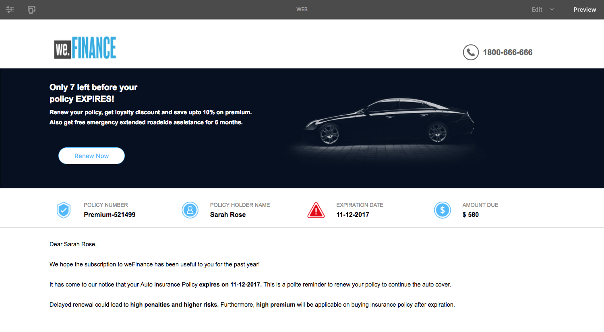

# NICHT VERÖFFENTLICHEN Erstellen des ersten adaptiven Dokuments {#do-not-publish-create-your-first-adaptive-document}

## Nutzungsszenario {#use-case}

Wir Finance ist ein führendes Unternehmen im Bereich Finanzdienstleistungen, das umfassende und personalisierte Finanzlösungen anbietet, die den Anforderungen verschiedener Kundenprofile gerecht werden.

Eine Kfz-Versicherung läuft ab und sendet ihr eine interaktive Erinnerung mit einer PDF und einem Verlängerungsangebot. Die Mitteilung enthält auch weitere Informationen, wie Loyalitätsbelohnungen und Rabattangebote.

Das Portal wird auf der AEM der Adobe ausgeführt. Die Web- und Print-Willkommenskanalausgabe wird mithilfe der Mehrkanalfunktionen des adaptiven Dokuments erstellt.

Am Ende des Tutorials wird Ihnen ein adaptives Dokument ähnlich dem folgenden angezeigt:
    Das Erstellen Ihres ersten Tutorials für adaptive Dokumente ist in Schritte kategorisiert. Jeder Schritt ist ein vollständiger Artikel an sich.

<table> 
 <tbody>
  <tr>
   <th>Sie werden lernen</th> 
   <th>
    <ul> 
     <li>Erstellen eines adaptiven Dokuments und Formulardatenmodells.</li> 
     <li>Erstellen von Vorlagen und Designs für adaptive Dokumente</li> 
     <li>Verwenden des Regeleditors zum Erstellen von Geschäftsregeln.  </li> 
     <li>Veröffentlichen eines adaptiven Dokuments   </li> 
    </ul> </th> 
  </tr>
  <tr>
   <td>Voraussetzung</td> 
   <td>
    <ul> 
     <li>Richten Sie AEM Autoreninstanz ein. </li> 
     <li>AEM Forms-Add-on installieren. Detaillierte Informationen finden Sie unter <a href="/help/forms/using/installing-configuring-aem-forms-osgi.md" target="_blank">Installieren und Konfigurieren von AEM Forms</a>.</li> 
     <li>Beziehen Sie den JDBC-Datenbanktreiber (JAR-Datei) vom Datenbankanbieter. Die Beispiele im Tutorial basieren auf der SQL-Datenbank und verwenden den Oracle MySQL JDBC-Datenbanktreiber. </li> 
     <li>Richten Sie eine Datenbank mit Kundendaten ein. Eine Datenbank ist für die Erstellung eines adaptiven Dokuments unerlässlich. In diesem Lernprogramm wird eine Datenbank zur Demonstration der Formulardatenmodell- und Persistenzfunktionen von AEM Forms verwendet. </li> 
     <li>Erstellen/importieren und aktivieren <a href="/help/forms/using/web-channel-print-channel.md">Vorlagen für Druck- und Webkanäle</a>.</li> 
     <li>Vergewissern Sie sich, dass <a href="/help/forms/using/document-fragments.md">Dokumentfragmente basierend auf dem FDM</a>.</li> 
    </ul> </td> 
  </tr>
 </tbody>
</table>

## Schritt 1: Erstellen Sie ein Formulardatenmodell {#step-create-form-data-model}

Ein Formulardatenmodell ermöglicht die Verbindung eines adaptiven Dokuments mit unterschiedlichen Datenquellen. Zum Beispiel AEM-Benutzerprofil, RESTful-Webdienste, SOAP-basierte Webdienste, OData-Dienste und relationale Datenbanken. Ein Formulardatenmodell ist ein einheitliches Datenrepräsentationsschema von Geschäftseinheiten und Diensten, die in verbundenen Datenquellen verfügbar sind. Sie können das Formulardatenmodell mit einem adaptiven Dokument verwenden, um Daten aus verbundenen Datenquellen abzurufen. Weitere Informationen zum Formulardatenmodell finden Sie unter [AEM Forms-Datenintegration](/help/forms/using/data-integration.md).

Ziele:

* Datenbankinstanz (Microsoft Dynamics) als Datenquelle konfigurieren
* Formulardatenmodell mit Microsoft Dynamics als Datenquelle erstellen
* Hinzufügen von Datenmodellobjekten zum Datenmodell
* Konfigurieren der Lese- und Schreibdienste für Datenmodellobjekte
* Testen des Formulardatenmodells und der konfigurierten Dienste mit Testdaten

## Schritt 2: Erstellen eines adaptiven Dokuments {#step-create-an-adaptive-document}

Die Kundenkommunikation zentralisiert und verwaltet die Erstellung, Zusammenstellung und Bereitstellung sicherer, personalisierter und interaktiver Schriftstücke, wie z. B. Geschäftskorrespondenz, Briefe, Dokumente, Aussagen, Leistungsbenachrichtigungen, Vermögensverwaltungsprospekte, Marketing-Mails, Rechnungen und Willkommenskits.

Mit adaptiven Dokumenten können Sie Kundenkommunikation erstellen, die ansprechend, responsiv, dynamisch und adaptiv ist. AEM Forms bietet einen Drag &amp; Drop-WYSIWYG-Editor zum Erstellen adaptiver Dokumente.

<!--`For more information about adaptive documents, see [Introduction to authoring adaptive documents](/forms/using/introduction-ad-authoring.md).`-->

Ziele:

* Erstellen Sie die Druck- und Webausgabe eines adaptiven Dokuments basierend auf dem Formulardatenmodell.
* Layout-Felder eines adaptiven Formulars zur Anzeige von Informationen für den Kunden
* Erstellen Sie Regeln zum Abrufen und Anzeigen von Informationen aus dem Formulardatenmodell in das adaptive Dokument.

<!---->

## Schritt 3: Regeln auf adaptive Dokumentfelder anwenden (nur Webkanal) {#step-apply-rules-to-adaptive-document-fields-web-channel-only}

Das adaptive Dokument bietet einen Editor zum Schreiben von Regeln für adaptive Dokumentobjekte. Diese Regeln definieren Aktionen zum Trigger von Dokumentobjekten auf der Grundlage von Vorgabebedingungen und Benutzeraktionen für das Dokument. Dies trägt zur Gewährleistung der Genauigkeit und Beschleunigung des Benutzererlebnisses in der Webversion des adaptiven Dokuments bei. Weitere Informationen zu adaptiven Dokumentregeln und zum Regeleditor finden Sie unter [Regeleditor](/help/forms/using/rule-editor.md).

Ziele:

* Erstellen und Anwenden von Regeln auf die Webkanalfelder des adaptiven Dokuments
* Verwenden von Regeln zum Trigger von Dokumentdatenmodelldiensten im Webkanal

## Schritt 4: Adaptives Dokument formatieren (nur Webkanal) {#step-style-the-adaptive-document-web-channel-only}

Adaptive Dokumente bieten einen Editor zum Erstellen von Designs für adaptive Dokumente und Inline-Stile. Ein Design enthält Stildetails für Komponenten und Bedienfelder und Sie können ein Design auf Webkanälen verschiedener Dokumente wiederverwenden. Die Stile umfassen Eigenschaften wie Hintergrundfarben, Statusfarben, Transparenz, Ausrichtung und Größe. Wenn Sie das Design auf Ihr Dokument anwenden, spiegelt der angegebene Stil die entsprechenden Komponenten des Dokuments wider. Weitere Informationen finden Sie unter [Designs](/help/forms/using/themes.md).

Ziele:

* Erstellen Sie ein Design für den Webkanal des adaptiven Dokuments
* Anwenden des Designs auf den Webkanal des adaptiven Dokuments
* Überprüfen des Erscheinungsbilds des Webkanals für adaptive Dokumente auf Mobilgeräten und Desktop

## Schritt 5: Veröffentlichen des adaptiven Dokuments {#step-publish-the-adaptive-document}

Nachdem Sie das Erstellen des adaptiven Dokuments abgeschlossen haben, müssen Sie es veröffentlichen, damit es in Ihrer Veröffentlichungsinstanz verfügbar ist, wo die Agenten das adaptive Dokument verwenden können, um die darauf basierenden Kommunikationsinstanzen zu erstellen.

Um das adaptive Dokument zu veröffentlichen, müssen die Dokumentautoren über die erforderlichen Berechtigungen verfügen.
