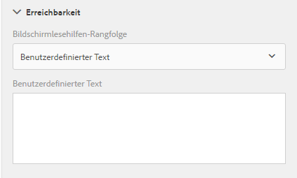
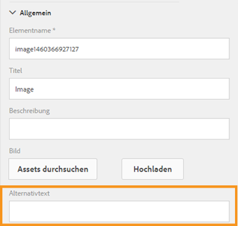

# Zugreifbare adaptive Formulare erstellen {#creating-accessible-adaptive-forms}

## Einführung {#introduction}

Ein barrierefreies Formular ist ein Formular, das jeder verwenden kann, einschließlich Benutzer mit Behinderungen. Adobe Experience Manager (AEM) enthält mehrere Funktionen, die die Nutzung adaptiver Formulare für Benutzer mit unterschiedlichen Fähigkeiten verbessern. Die Lösung unterstützt außerdem Verfasser von Strukturen bei der Erstellung anpassbarer Formulare.

Die Integration von Barrierefreiheit in adaptive Formulare ermöglicht nicht nur die größte potenzielle Zielgruppe für den Inhalt, sie ist auch eine Anforderung beim Bereitstellen von Dokumenten in Regionen, in denen die Einhaltung von Barrierefreiheitsstandards obligatorisch ist. Mit AEM Forms können Formularentwickler die Barrierefreiheitsstandards einhalten.

Beim Verfassen eines adaptiven Formulars muss der Autor die folgenden Punkte berücksichtigen, um barrierefreie adaptive Formulare zu erstellen:

* Angabe von angemessenen Beschriftungen für Formularsteuerelemente
* Angabe von Textäquivalenten für Bilder
* Bereitstellung von ausreichendem Farbkontrast
* Sicherstellen, dass Formularsteuerelemente mit der Tastatur aufgerufen werden können

## Angabe von angemessenen Beschriftungen für Formularsteuerelemente {#provide-proper-labels-for-form-controls}

Die Beschriftung oder der Titel einer Komponente gibt an, was die Formularkomponente darstellt. Beispiel: Der Text „Vorname“ weist darauf hin, dass der Benutzer seinen Vornamen in ein Textfeld eingeben muss. Damit die Beschriftung von Bildschirmlesegeräten erkannt werden kann, wird sie programmgesteuert mit einer Formularkomponente verknüpft. Alternativ dazu kann das Formularsteuerelement mit zusätzlichen Barrierefreiheitsinformationen konfiguriert werden.

Die Beschriftung, die von Bildschirmlesegeräten erkannt wird, muss nicht unbedingt mit der visuellen Beschriftung identisch sein. In einigen Fällen möchten Sie den Zweck des Steuerelements möglicherweise genauer angeben. Für jedes Feldobjekt in einem Formular können die Barrierefreiheitsoptionen verwendet werden, um anzugeben, wie das Bildschirmlesegerät das entsprechende Formularfeld identifiziert.

Gehen Sie wie folgt vor, um die Barrierefreiheitsoptionen zu verwenden:

1. Wählen Sie eine Komponente aus und tippen Sie auf .
1. Klicken Sie in der Randleiste auf **Ein-/Ausgabehilfe**, um die gewünschte Barrierefreiheitsoption auszuwählen.

### Barrierefreiheitsoptionen in Formularkomponenten {#accessibility-options-in-form-components}

**Autoren benutzerdefinierter** TextForm stellen den Inhalt in der Barrierefreiheitsoption Benutzerdefiniertes Textfeld bereit. Die Hilfstechnologie, z. B. Bildschirmlesehilfen, verwendet diesen benutzerdefinierten Text. In den meisten Szenarien ist die Verwendung der Einstellung „Titel“ die beste Option. Sie sollten nur dann benutzerdefinierten Text für Bildschirmlesegeräte erstellen, wenn die Option „Titel“ oder eine Kurzbeschreibung nicht möglich ist.

**Kurze** BeschreibungBei den meisten Komponenten wird die Kurzbeschreibung zur Laufzeit angezeigt, wenn der Benutzer den Mauszeiger über die Komponente bewegt. Sie können diese Option im Feld „Kurzbeschreibung“ unter der Option für den Hilfeinhalt festlegen.

**** TitelVerwenden Sie diese Option, damit AEM Forms die mit dem Formularfeld verknüpfte visuelle Beschriftung als Bildschirmlesehilfen-Text verwenden kann.

**** NameSie können auf der Registerkarte &quot;Bindung&quot;im Feld &quot;Name&quot;einen Wert angeben. Der Name darf keine Leerzeichen enthalten.

**Wenn Sie &quot;** Ohne&quot;auswählen, hat das Formularobjekt keinen Namen im veröffentlichten Formular. Keine ist keine empfohlene Einstellung für Formularsteuerelemente.

>[!NOTE]
>
>Optionsfelder und Kontrollkästchen können nur zwei Optionen für die Barrierefreiheit aufweisen, nämlich „Benutzerdefinierter Text“ und „Titel“.

>[!NOTE]
>
>Bei XFA-basierten adaptiven Formularen wird die Barrierefreiheitsoption von den in der XDP festgelegten Barrierefreiheitsoptionen übernommen. QuickInfo von XDP werden der Kurzbeschreibung zugeordnet, und die Beschriftung wird dem Titel zugeordnet. Die anderen Optionen bleiben gleich.

## Angabe von Textäquivalenten für Bilder  {#provide-text-equivalents-for-images}

Durch Bilder können einigen Benutzern Aspekte veranschaulicht werden. Für Benutzer, die Bildschirmlesegeräte verwenden, verringern Bilder allerdings die Barrierefreiheit Ihres Formulars. Wenn Sie Bilder verwenden möchten, sollten Sie Textbeschreibungen für alle Bilder angeben.

Stellen Sie sicher, dass der Text das Objekt und seinen Zweck im Formular beschreibt. Ein Bildschirmlesegerät liest den alternativen Text, wenn ein Bild auftritt. Für jedes Bild muss ein alternativer Text angegeben sein.

Wählen Sie eine Bildkomponente aus und tippen Sie auf . Geben Sie in der Randleiste unter „Eigenschaften“ alternativen Text für ein Bild ein.

## Bereitstellung von ausreichendem Farbkontrast {#provide-sufficient-color-contrast}

Bei Barrierefreiheitsdesigns müssen zusätzliche Richtlinien zur Farbverwendung beachtet werden. Formularautoren können Farben verwenden, um das Erscheinungsbild von Formularen zu verbessern, indem sie verschiedene Formularkomponenten hervorheben. Bei einer falschen Farbnutzung kann ein Formular allerdings für Personen mit unterschiedlichen Fähigkeiten schwieriger oder gar nicht lesbar werden.

Sehbehinderte Benutzer sind auf einen hohen Kontrast zwischen Text und Hintergrund angewiesen, um digitale Inhalte lesen zu können. Ohne ausreichend Kontrast kann ein Formular für einige Benutzern schwieriger oder überhaupt nicht zu lesen sein.

Es wird empfohlen, dass Sie die Standardschrift und -hintergrundfarben verwenden: Inhalt in schwarzer Farbe auf einem weißen Hintergrund. Wenn Sie die Standardfarben ändern, wählen Sie entweder eine dunkle Vordergrundfarbe auf einer hellen Hintergrundfarbe oder umgekehrt.

Weitere Informationen zum Ändern des Farbkontrasts und des Themas für adaptive Formulare finden Sie unter [Erstellen benutzerdefinierter Themen für adaptive Formulare](/help/forms/using/creating-custom-adaptive-form-themes.md).

## Sicherstellen, dass Formularsteuerelemente mit der Tastatur aufgerufen werden können  {#ensure-that-form-controls-are-keyboard-accessible}

Ein barrierefreies Formular kann vollständig mit nur der Tastatur oder einem ähnlichen Eingabegerät ausgefüllt werden. Benutzer mit eingeschränkter Mobilität bzw. Sehfähigkeit haben möglicherweise keine andere Wahl, als die Tastatur zu nutzen, und viele Benutzer, die eine Maus verwenden könnten, ziehen es vor, Eingaben per Tastatur vorzunehmen. Indem Sie mehrere Eingabeverfahren ermöglichen, erstellen Sie Formulare, die nicht nur barrierefrei sind, sondern auch den Vorlieben aller Benutzer entgegenkommen.

Die folgenden Tastaturbefehle sind in AEM Forms verfügbar.

| Aktion | Tastaturbefehl |
|---|---|
| Den Cursor in einem Formular vorwärts bewegen | Registerkarte |
| Den Cursor in einem Formular rückwärts bewegen | Umschalt+Tab |
| Zum nächsten Bereich wechseln | Alt+Nach-rechts-Taste |
| Zum vorherigen Bereich wechseln | Alt+Nach-links-Taste |
| Die ausgefüllten Daten in einem Formular zurücksetzen | Alt+R |
| Formular senden | Alt+S | configuring-watched-folder-endpoints.md |