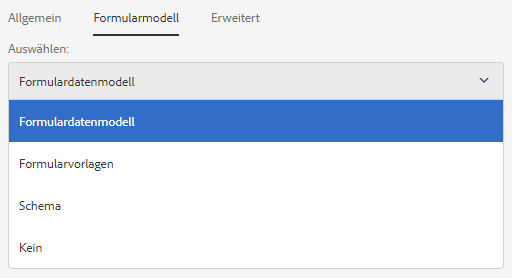
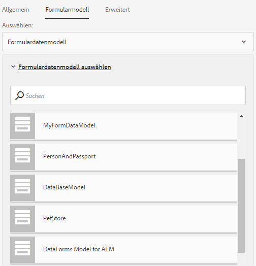
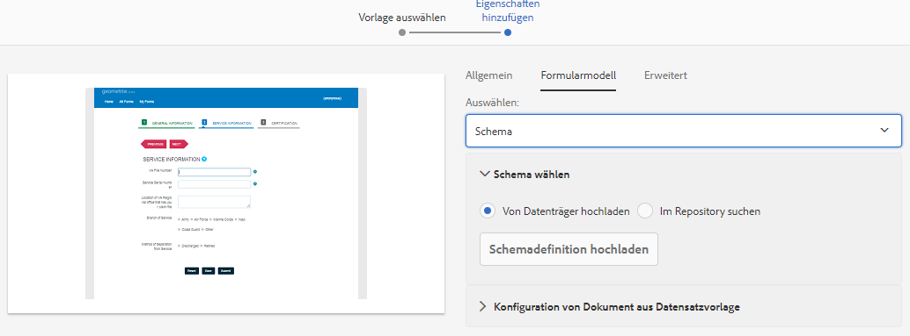
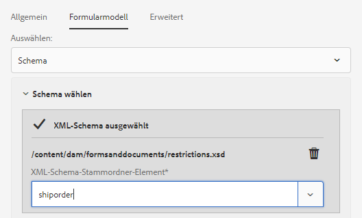

# Erstellen eines adaptiven Formulars {#creating-an-adaptive-form}

>[!CAUTION]
>
>AEM 6.4 hat das Ende der erweiterten Unterstützung erreicht und diese Dokumentation wird nicht mehr aktualisiert. Weitere Informationen finden Sie in unserer [technische Unterstützung](https://helpx.adobe.com/de/support/programs/eol-matrix.html). Unterstützte Versionen suchen [here](https://experienceleague.adobe.com/docs/?lang=de).

## <strong>Erstellen eines adaptiven Formulars</strong> {#strong-create-an-adaptive-form-strong}

Führen Sie die folgenden Schritte aus, um ein adaptives Formular zu erstellen.

1. Zugriff auf die AEM Forms-Autoreninstanz unter `https://[server]:[port]/<custom-context-if-any>.`

   ```
   
   ```

1. Geben Sie Ihre Anmeldedaten auf der AEM Anmeldeseite ein.

   Nachdem Sie angemeldet sind, tippen Sie oben links auf **[!UICONTROL Adobe Experience Manager > Forms > Forms und Dokumente]**.

   >[!NOTE]
   >
   >Bei einer Standardinstallation lautet der Benutzername `admin` und das Kennwort `admin`.

1. Tippen Sie auf **[!UICONTROL Erstellen]** und wählen Sie **[!UICONTROL Adaptives Formular]**.
1. Eine Option zum Auswählen einer Vorlage wird angezeigt. Weitere Informationen zu Vorlagen finden Sie unter [Adaptive Formularvorlagen](/help/forms/using/creating-adaptive-form.md#p-adaptive-form-templates-p). Tippen Sie auf eine Vorlage, um sie auszuwählen, und dann auf „Weiter“.
1. Die Option „Eigenschaften hinzufügen“ wird angezeigt. Geben Sie die Werte für die folgenden Eigenschaftenfelder an. Die Felder „Titel“ und „Name“ sind obligatorisch.

   * **[!UICONTROL Titel:]** Gibt den Anzeigenamen des Formulars an. Der Titel erleichtert Ihnen die Identifizierung des Formulars in der Benutzeroberfläche von AEM Forms.
   * **[!UICONTROL Name:]** Gibt den Namen des Formulars an. Im Repository wird ein Knoten mit dem angegebenen Namen erstellt. Wenn Sie mit der Eingabe des Titels beginnen, wird automatisch ein Wert für das Feld „Name“ vorgeschlagen. Sie können den vorgeschlagenen Wert gegebenenfalls ändern. Im Feld „Name“ dürfen nur alphanumerische Zeichen, Bindestriche und Unterstriche eingegeben werden. Alle ungültigen Eingaben werden durch Bindestriche ersetzt.
   * **[!UICONTROL Beschreibung:]** Gibt detaillierte Informationen zum Formular an.
   * **[!UICONTROL Tags:]** Gibt Tags an, die eine eindeutige Identifizierung des adaptiven Formulars ermöglichen. Tags erleichtern die Suche nach dem Formular. Um die Tags zu erstellen, geben Sie neue Tag-Namen in das Feld **Tags** ein.

1. Sie können ein adaptives Formular erstellen, das auf den folgenden Formularmodellen basiert:

   * [Formulardatenmodell](#fdm)
   * [XFA-Formularvorlage ](/help/forms/using/creating-adaptive-form.md#p-create-an-adaptive-form-based-on-an-xfa-form-template-p)
   * [XML- oder JSON-Schema](/help/forms/using/creating-adaptive-form.md#p-create-an-adaptive-form-based-on-xml-or-json-schema-p)
   * Keine oder ohne Formularmodell

   Sie können diese auf der Registerkarte **[!UICONTROL Formularmodell]** konfigurieren. Sie befindet sich auf der Seite **[!UICONTROL Eigenschaften hinzufügen]**. Standardmäßig ist das ausgewählte Formularmodell **[!UICONTROL Keines]**.

1. Tippen Sie auf **Erstellen**. Ein adaptives Formular wird erstellt und es wird ein Dialogfeld zum Öffnen des Formulars zur Bearbeitung angezeigt.

   Sobald Sie alle Eigenschaften angegeben haben, klicken Sie auf **[!UICONTROL Erstellen]**. Ein adaptives Formular wird erstellt und es wird ein Dialogfeld zum Öffnen des Formulars zur Bearbeitung angezeigt.

   Sobald Sie alle Eigenschaften angegeben haben, klicken Sie auf **[!UICONTROL Erstellen]**. Ein adaptives Formular wird erstellt und es wird ein Dialogfeld zum Öffnen des Formulars zur Bearbeitung angezeigt.

1. Tippen Sie auf **[!UICONTROL Öffnen]**, um das neu erstellte Formular in einer neuen Registerkarte zu öffnen. Das Formular wird zur Bearbeitung geöffnet und zeigt die in der Vorlage verfügbaren Inhalte an. Er zeigt auch die Seitenleiste an, um das neu erstellte Formular entsprechend den Anforderungen anzupassen.

   Je nach Typ des adaptiven Formulars werden auf der Registerkarte **[!UICONTROL Datenmodellobjekte]** des **[!UICONTROL Inhaltbrowsers]** in der Seitenleiste die Formularelemente angezeigt, die in der zugeordneten XFA-Formularvorlage, dem XML-Schema oder JSON-Schema vorhanden sind. Sie können diese Elemente auch per Drag &amp; Drop verschieben, um Ihr adaptives Formular zu erstellen.

   Informationen zur Authoring-Oberfläche für adaptive Formulare und zu verfügbaren Komponenten finden Sie unter [Einführung in das Authoring adaptiver Formulare](/help/forms/using/introduction-forms-authoring.md).

   >[!NOTE]
   >
   >Lassen Sie Popup-Fenster in Ihrem Browser zu, um das neu erstellte Formular in einer neuen Registerkarte zu öffnen.

## Erstellen eines adaptiven Formulars basierend auf einem Formulardatenmodell {#fdm}

[AEM Forms-Datenintegration](/help/forms/using/data-integration.md) ermöglicht Ihnen die Integration mehrerer Datenquellen und die Zusammenführung von Entitäten und Diensten, um ein Formulardatenmodell zu erstellen. Dabei handelt es sich um eine Erweiterung des JSON-Schemas. Sie können ein Formulardatenmodell verwenden, um ein adaptives Formular zu erstellen. Die in einem Formulardatenmodell konfigurierten Entitäten oder Datenmodellobjekte sind als Datenmodellobjekte für die Formularbearbeitung verfügbar. Sie sind an die jeweiligen Datenquellen gebunden und werden verwendet, um ein Formular vorauszufüllen und die übermittelten Daten zurück in die entsprechenden Datenquellen zu schreiben. Sie können auch Dienste aufrufen, die in einem Formulardatenmodell mithilfe von Regeln für adaptive Formulare konfiguriert wurden.

So verwenden Sie ein Formulardatenmodell zum Erstellen eines adaptiven Formulars:

1. Wählen Sie auf der Registerkarte „Formularmodell“ im Bildschirm „Eigenschaften hinzufügen“ **[!UICONTROL Formulardatenmodell]** aus der Dropdownliste **[!UICONTROL Auswählen aus]**.

   

1. Tippen Sie auf **[!UICONTROL Formulardatenmodell auswählen]**, um es zu erweitern. Alle verfügbaren Formulardatenmodelle werden aufgelistet.

   Wählen Sie ein Formulardatenmodell aus.

   

>[!NOTE]
>
>Sie können das Formulardatenmodell für ein adaptives Formular auch ändern. Anweisungen hierfür finden Sie unter [Bearbeiten von Formularmodelleigenschaften eines adaptiven Formulars](#edit-form-model).

## Erstellen eines adaptiven Formulars basierend auf einer XFA-Formularvorlage {#create-an-adaptive-form-based-on-an-xfa-form-template}

Sie können Ihre XFA-Formularvorlagen erneut verwenden, um adaptive Formulare zu erstellen. Laden Sie zu diesem Zweck eine XFA-Formularvorlage hoch und verknüpfen Sie sie mit einem adaptiven Formular. Die Elemente der Formularvorlage (XFA-Formular) werden zum Zeitpunkt des Authoring adaptiver Formulare zur Verwendung in der Inhaltssuche bereitgestellt. Sie können die Formularvorlagenelemente per Drag &amp; Drop aus der Inhaltssuche in das Formular ziehen.

>[!NOTE]
>
>[Hochladen der XFA-Formularvorlage](/help/forms/using/get-xdp-pdf-documents-aem.md) zu AEM Forms hinzu, bevor Sie mit der Erstellung eines adaptiven Formulars auf der Basis der Formularvorlage beginnen.

Führen Sie die folgenden Schritte aus, um eine XFA-Formularvorlage als Formularmodell für Ihr adaptives Formular zu verwenden:

1. Im **[!UICONTROL Eigenschaften hinzufügen]** Seite, öffnen Sie die **[!UICONTROL Formularmodell]** Registerkarte.
1. Wählen Sie auf der Registerkarte Formularmodell aus der Dropdown-Liste die Option **[!UICONTROL Formularvorlagen]**. Alle Formularvorlagen, die über die AEM Forms-Benutzeroberfläche in das Repository hochgeladen werden, werden zur Auswahl aufgelistet. Wählen Sie eine Vorlage aus der Liste aus.

   
   **Abbildung:** *Auswählen einer Formularvorlage*

   >[!NOTE]
   >
   >Sie können auch die Formularvorlage für ein adaptives Formular ändern. Anweisungen hierfür finden Sie unter [Bearbeiten von Formularmodelleigenschaften eines adaptiven Formulars](#edit-form-model).

## Erstellen eines adaptiven Formulars basierend auf einem XML- oder JSON-Schema {#create-an-adaptive-form-based-on-xml-or-json-schema}

XML- und JSON-Schemas stellen die Struktur dar, in der Daten vom Back-End-System in Ihrer Organisation produziert oder genutzt werden. Sie können ein Schema mit einem adaptiven Formular verknüpfen und dem adaptiven Formular mithilfe der Elemente aus dem Schema dynamische Inhalte hinzufügen. Die Elemente des Schemas stehen auf der Registerkarte „Datenmodellobjekt“ des Inhalts-Browsers für das Erstellen von adaptiven Formularen zur Verfügung. Sie können die Schemaelemente zum Erstellen des Formulars ziehen und ablegen.

In den folgenden Dokumenten erfahren Sie, wie Sie ein XML- oder JSON-Schema für das Authoring adaptiver Formulare entwerfen.

* [Adaptive Formulare mithilfe des XML-Schemas erstellen](/help/forms/using/adaptive-form-xml-schema-form-model.md)
* [Erstellen adaptiver Formulare mithilfe eines JSON-Schemas](/help/forms/using/adaptive-form-json-schema-form-model.md)

Führen Sie folgende Schritte aus, um ein XML- oder JSON-Schema als Formularmodell für ein adaptives Formular zu verwenden:

1. Tippen Sie auf der Seite zum Erstellen adaptiver Formulare beim Schritt **[!UICONTROL Eigenschaften hinzufügen]** auf die Registerkarte **[!UICONTROL Formularmodell]**.
1. Wählen Sie auf der Registerkarte „Formularmodell“ **[!UICONTROL Schema]** aus dem Dropdown-Feld **[!UICONTROL Auswählen]**.

1. Tippen Sie auf **[!UICONTROL Schema auswählen]** und führen Sie einen der folgenden Schritte aus:

   * **[!UICONTROL Von Datenträger hochladen]** – Wählen Sie diese Option und tippen Sie auf „Schemadefinition hochladen“, um ein XML- oder JSON-Schema in Ihrem Dateisystem zu suchen und hochzuladen. Die hochgeladene Schemadatei befindet sich im Formular und ist für andere adaptive Formulare nicht zugänglich.
   * **[!UICONTROL Im Repository suchen]** - Wählen Sie diese Option aus der Liste der Schemadefinitionsdateien, die im Repository verfügbar sind. Wählen Sie die XML- oder JSON-Schemadatei als Formularmodell aus. Das ausgewählte Schema wird durch Verweis mit dem Formular verknüpft und kann in anderen adaptiven Formularen verwendet werden.

   >[!CAUTION]
   >
   >Stellen Sie sicher, dass der Dateiname des JSON-Schemas mit **.schema.json**. Beispiel: mySchema.schema.json

   
   **Abbildung:** *Auswählen eines XML- oder JSON-Schemas*

1. (Nur für XML-Schema) Nachdem Sie ein XML-Schema ausgewählt oder hochgeladen haben, geben Sie ein Stammelement der ausgewählten XSD-Datei an, das mit dem adaptiven Formular zugeordnet werden soll.

   
   **Abbildung:** *XSD-Stammelement auswählen*

>[!NOTE]
>
>Sie können das Schema für ein adaptives Formular ändern. Anweisungen hierfür finden Sie unter [Bearbeiten von Formularmodelleigenschaften eines adaptiven Formulars](#edit-form-model).

## Adaptive Formularvorlagen {#adaptive-form-templates}

Eine Vorlage bietet eine Grundstruktur für adaptive Formulare und definiert deren Erscheinungsbild (Layouts und Stile). Sie enthält vorformatierte Komponenten einschließlich bestimmter Eigenschaften und einer Struktur für Inhalte. Standardmäßig stellt AEM Forms einige adaptive Formularvorlagen bereit. Um das vollständige Vorlagenpaket einschließlich erweiterter Vorlagen zu erhalten, müssen Sie das AEM Forms Add-On-Paket installieren. Weitere Informationen finden Sie unter [Installieren des Add-On-Pakets für AEM Forms](/help/forms/using/installing-configuring-aem-forms-osgi.md).

Darüber hinaus können Sie mit dem Vorlagen-Editor eigene Vorlagen erstellen. Weitere Informationen zum Arbeiten mit Vorlagen finden Sie unter [Adaptive Formularvorlagen](/help/forms/using/template-editor.md).

>[!NOTE]
>
>Wenn Sie ein adaptives Formular öffnen, das mit der erweiterten Vorlage zur Bearbeitung erstellt wurde, wird eine Fehlermeldung angezeigt. Die erweiterte Vorlage verfügt über eine Signaturschritt-Komponente und Acrobat Sign ist dafür standardmäßig aktiviert. Erstellen und wählen Sie eine [Acrobat Sign-Cloud-Konfiguration](/help/forms/using/adobe-sign-integration-adaptive-forms.md) und [Signierer konfigurieren](/help/forms/using/working-with-adobe-sign.md#addsignerstoanadaptiveform) um den Fehler zu beheben.

## Formularmodelleigenschaften eines adaptiven Formulars bearbeiten {#edit-form-model}

Adaptive Formulare werden ohne Formularmodell (unter Verwendung der Option &quot;Keine&quot;für Formularmodell) oder mit einem Formularmodell wie einer Formularvorlage, einem XML-Schema oder einem JSON-Schema oder einem Formulardatenmodell erstellt. Sie können das Formularmodell für ein adaptives Formular von &quot;Ohne&quot;in ein anderes Formularmodell ändern. Für adaptive Formulare, die auf einem Formularmodell basieren, können Sie eine andere Formularvorlage, ein XML-Schema, ein JSON-Schema oder ein Formulardatenmodell für dasselbe Formularmodell auswählen. Sie können jedoch nicht zwischen Formularmodellen wechseln.

1. Wählen Sie das adaptive Formular aus und tippen Sie auf das Symbol **Eigenschaften**.
1. Öffnen Sie die Registerkarte **[!UICONTROL Formularmodell]** und wählen Sie eine der folgenden Vorgehensweisen.

   * Wenn das adaptive Formular ohne Formularmodell vorliegt, können Sie ein anderes Formularmodell auswählen und dementsprechend eine Formularvorlage, ein XML- oder JSON-Schema oder ein Formulardatenmodell auswählen.
   * Wenn das adaptive Formular auf einem Formularmodell basiert, können Sie eine andere Formularvorlage, ein XML- oder JSON-Schema oder ein Formulardatenmodell für dasselbe Formularmodell auswählen.

1. Tippen Sie auf **[!UICONTROL Speichern]**, um die Eigenschaften zu speichern.

## Automatisches Speichern eines adaptiven Formulars {#auto-save-an-adaptive-form}

Standardmäßig werden die Inhalte eines adaptiven Formulars in einer Benutzeraktion gespeichert, z. B. durch Drücken der Schaltfläche &quot;Speichern&quot;. Sie können auch ein adaptives Formular so konfigurieren, dass Inhalt basierend auf einem Ereignis oder einem Zeitintervall automatisch gespeichert wird. Die Option &quot;Automatisches Speichern&quot;ist in folgenden Bereichen hilfreich:

* Automatisches Speichern des Inhalts für anonyme und angemeldete Benutzer
* Inhalt eines Formulars ohne oder mit minimalem Benutzereingriff speichern
* Speichern von Inhalt eines Formulars basierend auf einem Benutzerereignis starten
* Wiederholtes Speichern des Formularinhalts nach einem bestimmten Zeitintervall

### Automatisches Speichern für ein adaptives Formular aktivieren {#enable-auto-save-for-an-adaptive-form}

Die Option „Automatisches Speichern“ ist standardmäßig nicht aktiviert. Sie können die Option „Automatisches Speichern“ über die Registerkarte „Automatisches Speichern“ eines adaptiven Formulars aktivieren. Die Registerkarte „Automatisches Speichern“ bietet mehrere weitere Konfigurationsoptionen. Führen Sie zum Aktivieren und Konfigurieren der Option „Automatisches Speichern“ für ein adaptives Formular folgende Schritte durch: 

1. Um auf den Abschnitt für das automatische Speichern in den Eigenschaften zuzugreifen, wählen Sie eine Komponente aus und tippen Sie auf  > **[!UICONTROL Container für ein adaptives Formular]** und anschließend auf .
1. Im **[!UICONTROL Automatisches Speichern]** Abschnitt **[!UICONTROL Aktivieren]** die Option &quot;Automatisches Speichern&quot;.
1. Im **[!UICONTROL Adaptives Formularereignis]** Geben Sie 1 oder TRUE ein, um das Formular automatisch zu speichern, wenn es in den Browser geladen wird. Sie können auch einen bedingten Ausdruck für ein Ereignis angeben, das, wenn es ausgelöst wird und &quot;true&quot;zurückgibt, mit dem Speichern des Formularinhalts beginnt.
1. Geben Sie den Trigger an. Das automatische Speichern wird basierend auf Ihrer Konfiguration ausgelöst. Ihre Optionen sind:

   * **[!UICONTROL Zeitbasiert:]** Wählen Sie diese Option, um den Inhalt anhand eines bestimmtes Zeitintervalls zu speichern.
   * **[!UICONTROL Ereignisbasiert:]** Wählen Sie diese Option, um den Inhalt beim Auslösen eines Ereignisses zu speichern.

   Wenn Sie einen Trigger auswählen, ist das Feld &quot;Strategiekonfiguration&quot;aktiviert. Das Feld &quot;Strategiekonfiguration&quot;ermöglicht Folgendes:

   * ein Zeitintervall angeben, wenn Sie **[!UICONTROL Zeitbasiert]** für den Auslöser wählen.
   * Den Namen des Ereignisses angeben, wenn Sie **[!UICONTROL Ereignisbasiert]** für den Auslöser wählen.

   Sie können auch eine eigene benutzerdefinierte Strategie erstellen und der Liste hinzufügen. Weitere Informationen finden Sie unter [Benutzerdefinierte Strategie zum automatischen Speichern von Formularen implementieren](/help/forms/using/auto-save-an-adaptive-form.md#p-implement-a-custom-strategy-to-enable-autosave-for-adaptive-forms-p).

1. (Nur zeitbasiertes automatisches Speichern) Führen Sie die folgenden Schritte aus, um die Optionen für das zeitbasierte automatische Speichern zu konfigurieren.

   1. Im **[!UICONTROL Automatisches Speichern in diesem Intervall]** Legen Sie das Zeitintervall in Sekunden fest. Das Formular wird wiederholt gespeichert, nachdem die im Intervallfeld angegebene Anzahl von Sekunden abgelaufen ist.

1. (Nur ereignisbasiertes automatisches Speichern) Führen Sie die folgenden Schritte aus, um Optionen für ereignisbasiertes automatisches Speichern zu konfigurieren.

   1. Geben Sie im Feld **Automatisch nach diesem Ereignis speichern** ein [GuideBridge](https://helpx.adobe.com/de/aem-forms/6/javascript-api/GuideBridge.html)-Ereignis an. Das Formular wird immer dann gespeichert, wenn der Ausdruck „TRUE“ ergibt.

1. (Optional) Um den Inhalt automatisch für anonyme Benutzer zu speichern, wählen Sie die Option **Automatisches Speichern für anonyme Benutzer aktivieren** und klicken Sie auf **[!UICONTROL OK]**.

   >[!NOTE]
   >
   >Damit die Option zum automatischen Speichern für anonyme Benutzer funktioniert, stellen Sie sicher, dass Sie den allgemeinen Forms-Konfigurationsdienst so konfiguriert ist, dass alle Benutzer Formulare in der Vorschau anzeigen, überprüfen und zu signieren können.
   >
   >Um den Service zu konfigurieren, wechseln Sie zur Konfiguration der AEM-Web-Konsole unter `https://[server]:[host]/system/console/configMgr` und bearbeiten Sie den **[!UICONTROL allgemeinen Konfigurations-Service von Forms]** so, dass die Option **[!UICONTROL Alle Benutzer]** im Feld **[!UICONTROL Zulassen]** ausgewählt wird, und speichern Sie dann die Konfiguration.
