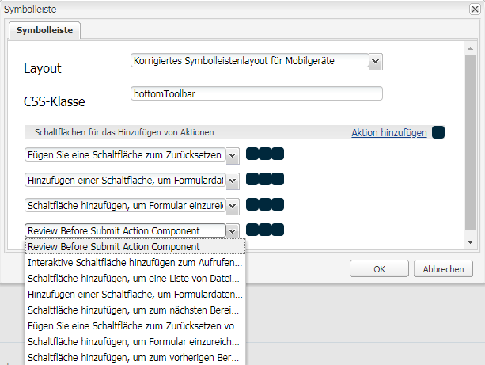

# Erstellen einer benutzerdefinierten Symbolleistenaktion  {#creating-a-custom-toolbar-action}

## Voraussetzungen {#prerequisite}

Bevor Sie eine benutzerdefinierte Symbolleistenaktion erstellen, machen Sie sich mit den Informationen unter [Verwendung clientseitiger Bibliotheken](/help/sites-developing/clientlibs.md) und [Entwickeln mit CRXDE Lite](/help/sites-developing/developing-with-crxde-lite.md) vertraut.

## Was ist eine Aktion {#what-is-an-action-br}

Ein adaptives Formular enthält eine Symbolleiste, mit der ein Formularautor mehrere Optionen konfigurieren kann. Diese Optionen werden als Aktionen für das adaptive Formular definiert. Klicken Sie in der Symbolleiste für den Bereich auf die Schaltfläche zum Bearbeiten, um die Aktionen festzulegen, die von adaptiven Formularen unterstützt werden.


Neben den standardmäßig bereitgestellten Aktionen können Sie auch benutzerdefinierte Aktionen in der Symbolleiste erstellen. Beispielsweise können Sie eine Aktion hinzufügen, damit der Benutzer alle adaptiven Formularfelder überprüfen kann, bevor das Formular gesendet wird.

## Schritte zum Erstellen einer benutzerdefinierten Aktion in einem adaptiven Formular {#steps}

Zur Veranschaulichung der Erstellung einer benutzerdefinierten Symbolleistenaktion erstellen Sie mit den folgenden Schritten eine Schaltfläche, über die Endbenutzer alle adaptiven Formularfelder überprüfen können, bevor Sie ein ausgefülltes Formular senden.

1. Alle von adaptiven Formularen unterstützten Standardaktionen sind im Ordner `/libs/fd/af/components/actions` vorhanden. Kopieren Sie in CRXDE den Knoten `fileattachmentlisting` von `/libs/fd/af/components/actions/fileattachmentlisting` in `/apps/customaction`.

1. Benennen Sie nach dem Kopieren des Knotens in den Ordner `apps/customaction` den Knotennamen in `reviewbeforesubmit` um. Ändern Sie außerdem die Eigenschaften `jcr:title` und `jcr:description` des Knotens.

   Die Eigenschaft `jcr:title` enthält den Namen der Aktion, die Symbolleisten-Dialogfeld angezeigt wird. Die Eigenschaft `jcr:description` enthält weitere Informationen, die angezeigt werden, wenn ein Benutzer den Mauszeiger über der Aktion bewegt.

   

1. Wählen Sie den Knoten `cq:template` im Knoten `reviewbeforesubmit` aus. Stellen Sie sicher, dass der Wert der Eigenschaft `guideNodeClass` `guideButton` ist, und ändern Sie die Eigenschaft `jcr:title` entsprechend.
1. Ändern Sie die Eigenschaft type im Knoten `cq:Template` . Für das aktuelle Beispiel ändern Sie die Typeigenschaft in „button“.

   Der Typwert wird als CSS-Klasse in der generierten HTML für die Komponente hinzugefügt. Benutzer können diese CSS-Klasse verwenden, um ihre Aktionen zu formatieren. Die Standardstile für mobile und Desktopgeräte werden für die Typwerte „button“, „submit“, „reset“ und „save“ bereitgestellt.

1. Wählen Sie die benutzerdefinierte Aktion aus dem Dialogfeld zur Symbolleistenbearbeitung des adaptiven Formulars. Eine Überprüfungsschaltfläche wird in der Symbolleiste für den Bereich angezeigt.

    

1. Um die Überprüfungsschaltfläche mit einer Funktion zu versehen, fügen Sie JavaScript- und CSS-Code und serverseitigen Code in der Datei init.jsp hinzu, die sich im Knoten `reviewbeforesubmit` befindet.

   Fügen Sie den folgenden Code in `init.jsp` hinzu.

   ```
   <%@include file="/libs/fd/af/components/guidesglobal.jsp" %>
   <guide:initializeBean name="guideField" className="com.adobe.aemds.guide.common.GuideButton"/>
   
   <c:if test="${not isEditMode}">
           <cq:includeClientLib categories="reviewsubmitclientlibruntime" />
   </c:if>
   
   <%--- BootStrap Modal Dialog  --------------%>
   <div class="modal fade" id="reviewSubmit" tabindex="-1">
       <div class="modal-dialog">
           <div class="modal-content">
               <div class="modal-header">
                   <h3>Review the Form Fields</h3>
               </div>
               <div class="modal-body">
                   <div class="modal-list">
                       <table>
                           <tr>
                               <td>
                                   <label>Your Name is: </label>
                               </td>
                           </tr>
                           <tr>
                               <td>
                                   <label>Your Pan Number is: </label>
                               </td>
                           </tr>
                           <tr>
                               <td>
                                   <label>Your Date Of Birth is: </label>
                               </td>
                           </tr>
                           <tr>
                               <td>
                                   <label>Your Total 80C Declaration Amount is: </label>
                               </td>
                           </tr>
                           <tr>
                               <td>
                                   <label>Your Total HRA Amount is: </label>
                               </td>
                           </tr>
                       </table>
                   </div>
               </div><!-- /.modal-body -->
               <div class="modal-footer">
                   <div class="fileAttachmentListingCloseButton col-md-2 col-xs-2 col-sm-2">
                       <button data-dismiss="modal">Close</button>
                   </div>
               </div>
           </div><!-- /.modal-content -->
       </div><!-- /.modal-dialog -->
   </div><!-- /.modal -->
   ```

   Fügen Sie den folgenden Code in der Datei `ReviewBeforeSubmit.js` hinzu.

   ```
   /*anonymous function to handle show of review before submit view */
   $(function () {
       if($("div.reviewbeforesubmit button[id*=reviewbeforesubmit]").length > 0) {
           $("div.reviewbeforesubmit button[id*=reviewbeforesubmit]").click(function(){
               // Create the options object to be passed to the getElementProperty API
               var options = {},
                   result = [];
               options.somExpressions = [];
               options.propertyName = "value";
               guideBridge.visit(function(model){
                   if(model.name === "name" || model.name === "pan" || model.name === "dateofbirth" || model.name === "total" || model.name === "totalmonthlyrent"){
                           options.somExpressions.push(model.somExpression);
                   }
               }, this);
               result = guideBridge.getElementProperty(options);
   
               $('#reviewSubmit .reviewlabel').each(function(index, item){
                   var data = ((result.data[index] == null) ? "No Data Filled" : result.data[index]);
                   if($(this).next().hasClass("reviewlabelvalue")){
                       $(this).next().html(data);
                   } else {
                       $(this).after($("<td></td>").addClass("reviewlabelvalue col-md-6 active").html(data));
                   }
               });
               // added because in mobile devices it was causing problem of backdrop
               $("#reviewSubmit").appendTo('body');
               $("#reviewSubmit").modal("show");
           });
       }
   });
   ```

   Fügen Sie den folgenden Code zur Datei `ReviewBeforeSubmit.css` hinzu.

   ```css
   .modal-list .reviewlabel {
       white-space: normal;
       text-align: right;
       padding:2px;
   }
   
   .modal-list .reviewlabelvalue {
       border: #cde0ec 1px solid;
       padding:2px;
   }
   
   /* Adding icon for this action in mobile devices */
   /* This is the glyphicon provided by bootstrap eye-open */
   /* .<type> .iconButton-icon */
   .reviewbeforesubmit .iconButton-icon {
       position: relative;
       top: -8px;
       font-family: 'Glyphicons Halflings';
       font-style: normal;
   }
   
   .reviewbeforesubmit .iconButton-icon:before {
       content: "\e105"
   }
   ```

1. Um die Funktion der benutzerdefinierten Aktion zu überprüfen, öffnen Sie das adaptive Formular im Vorschaumodus und klicken Sie in der Symbolleiste auf „Überprüfen“.

   >[!NOTE]
   >
   >Die `GuideBridge`-Bibliothek wird im Authoring-Modus nicht geladen. Daher kann diese benutzerdefinierte Aktion nicht im Authoring-Modus verwendet werden.

   

## Stichproben {#samples}

Das folgende Archiv enthält ein Inhaltspaket. Das Paket enthält ein adaptives Formular, das mit der oben genannten Demonstration der benutzerdefinierten Symbolleistenaktion verknüpft ist.

[Datei laden](assets/customtoolbaractiondemo.zip)
