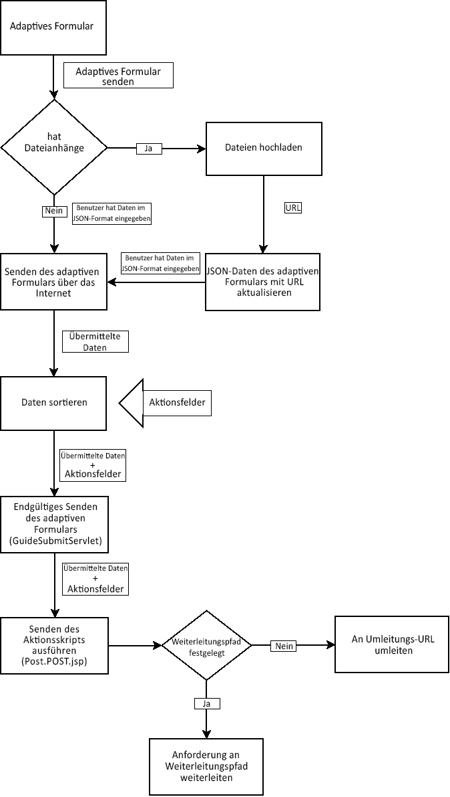
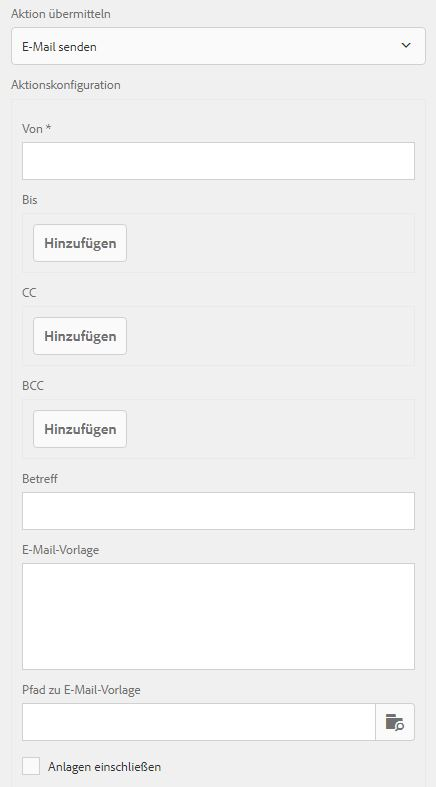

# Schreiben benutzerdefinierter Übermittlungsaktionen für adaptive Formulare {#writing-custom-submit-action-for-adaptive-forms}

Adaptive Formulare benötigen Übermittlungsaktionen für die Verarbeitung der von Benutzern angegebenen Daten. Eine Übermittlungsaktion bestimmt die Aufgabe, die für die Daten ausgeführt wird, die Sie mit einem adaptiven Formular senden. Adobe Experience Manager (AEM) enthält [OOTB-Übermittlungsaktionen](/help/forms/using/configuring-submit-actions.md) , die benutzerdefinierte Aufgaben zeigen, die Sie mit den vom Benutzer gesendeten Daten ausführen können. Sie können beispielsweise Aufgaben wie das Senden von E-Mails oder das Speichern von Daten durchführen.

## Workflow für eine Übermittlungsaktion {#workflow-for-a-submit-action}

Das Flussdiagramm zeigt den Workflow für eine Sendeaktion an, die ausgelöst wird, wenn Sie auf die **[!UICONTROL Einsenden]** in einem adaptiven Formular. Die Dateien in der Dateianlagenkomponente werden auf den Server geladen und die Formulardaten werden mit den URLs der hochgeladenen Dateien aktualisiert. Innerhalb des Clients werden die Daten im JSON-Format gespeichert. Der Client sendet eine Ajax-Abfrage an ein internes Servlet, das die angegebenen Daten schönt und im XML-Format zurückgibt. Der Client ordnet diese Daten in Aktionsfeldern an. Die Daten werden über eine Übermittlungsaktion für Formulare an das endgültige Servlet (Guide Submit-Servlet) gesendet. Anschließend übergibt das Servlet die Steuerung an die Übermittlungsaktion. Die Übermittlungsaktion kann die Anfrage an eine andere Sling-Ressource weiterleiten oder den Browser an eine andere URL weiterleiten.



### XML-Datenformat {#xml-data-format}

Die XML-Daten werden mit dem Abfrageparameter **`jcr:data`** an das Servlet gesendet. Übermittlungsaktionen können den Parameter zur Verarbeitung der Daten aufrufen. Der folgende Code beschreibt das Format der XML-Daten. Die Felder, die an das Formularmodell gebunden sind, befinden sich im Bereich **`afBoundData`**. Nicht gebundene Felder befinden sich im Bereich `afUnoundData`. Weitere Informationen zum Format der `data.xml` -Datei, siehe [Einführung in das Vorausfüllen von Feldern in adaptiven Formularen](/help/forms/using/prepopulate-adaptive-form-fields.md).

```xml
<?xml ?>
<afData>
<afUnboundData>
<data>
<field1>value</field2>
<repeatablePanel>
    <field2>value</field2>
</repeatablePanel>
<repeatablePanel>
    <field2>value</field2>
</repeatablePanel>
</data>
</afUnboundData>
<afBoundData>
<!-- xml corresponding to the Form Model /XML Schema -->
</afBoundData>
</afData>
```

### Aktionsfelder {#action-fields}

Eine Übermittlungsaktion kann ausgeblendete Eingabefelder hinzufügen (mithilfe der HTML [input](https://developer.mozilla.org/de/docs/Web/HTML/Element/Input) -Tag) auf die wiedergegebene Formular-HTML. Diese verborgenen Felder können Werte enthalten, die bei der Verarbeitung der Formularübermittlung benötigt werden. Beim Senden des Formulars werden diese Feldwerte als Anfrageparameter zurückgesendet, die die Übermittlungsaktion bei der Übermittlungsverarbeitung verwenden kann. Die Eingabefelder werden als Aktionsfelder bezeichnet.

Beispielsweise kann eine Übermittlungsaktion, die auch die zum Ausfüllen eines Formulars benötigte Zeit erfasst, die verborgenen Eingabefelder hinzufügen `startTime` und `endTime`.

Ein Skript kann die Werte der Felder `startTime` und `endTime` bereitstellen, wenn das Formular ausgegeben bzw. bevor das Formular übermittelt wird. Das Skript für die Übermittlungsaktion, `post.jsp`, kann dann mithilfe von Abfrageparametern auf diese Felder zugreifen und die für das Ausfüllen des Formulars benötigte Gesamtzeit berechnen.

### Dateianhänge {#file-attachments}

Übermittlungsaktionen können auch die Dateianlagen verwenden, die Sie mit der Dateianlagerungskomponente hochladen. Skripts für Übermittlungsaktionen können auf diese Dateien mit dem Sling [RequestParameter API](https://sling.apache.org/apidocs/sling5/org/apache/sling/api/request/RequestParameter.html) zugreifen. Mit der Methode [isFormField](https://sling.apache.org/apidocs/sling5/org/apache/sling/api/request/RequestParameter.html#isFormField()) der API lässt sich identifizieren, ob es sich beim Abfrageparameter um eine Datei oder ein Formularfeld handelt. Sie können die Abfrageparameter in einer Übermittlungsaktion wiederholen, um die Dateianlagenparameter zu identifizieren.

Mit dem folgenden Beispielcode werden die Dateianhänge in der Abfrage identifiziert. Anschließend werden die Daten mit [Get API](https://sling.apache.org/apidocs/sling5/org/apache/sling/api/request/RequestParameter.html#get()) in die Datei eingelesen. Schließlich wird mit den Daten ein Dokumentobjekt erstellt und an eine Liste angehängt.

```java
RequestParameterMap requestParameterMap = slingRequest.getRequestParameterMap();
for (Map.Entry<String, RequestParameter[]> param : requestParameterMap.entrySet()) {
    RequestParameter rpm = param.getValue()[0];
    if(!rpm.isFormField()) {
        fileAttachments.add(new Document(rpm.get()));
    }
}
```

### Weiterleitungspfad und Umleitungs-URL {#forward-path-and-redirect-url}

Nach dem Ausführen der gewünschten Aktion leitet das Sende-Servlet die Abfrage an den Weiterleitungspfad weiter. Eine Aktion verwendet die setForwardPath-API, um den Weiterleitungspfad im Guide Submit-Servlet festzulegen.

Wenn die Aktion keinen Weiterleitungspfad bereitstellt, leitet das Übermittlungs-Servlet den Browser mithilfe der Umleitungs-URL um. Der Autor konfiguriert die Umleitungs-URL über die Konfiguration der Danksagungsseite im Dialogfeld für die Bearbeitung adaptiver Formulare. Sie können die Umleitungs-URL auch über die Übermittlungsaktion oder die setRedirectUrl-API im Guide Submit-Servlet konfigurieren. Sie können die an die Umleitungs-URL gesendeten Abfrageparameter auch mit der setRedirectParameters-API im Guide Submit-Servlet konfigurieren.

>[!NOTE]
>
>Ein Autor stellt die Umleitungs-URL bereit (über die Konfiguration der Dankeseite). [Vordefinierte Sende-Aktionen](/help/forms/using/configuring-submit-actions.md) verwenden die Umleitungs-URL, um den Browser von der Ressource, auf die der Weiterleitungspfad verweist, umzuleiten.
>
>Sie können eine benutzerdefinierte Übermittlungsaktion schreiben, die eine Anforderung an eine Ressource oder ein Servlet weiterleitet. Adobe empfiehlt, dass das Skript, das das Ressourcen-Handling für den Weiterleitungspfad durchführt, die Abfrage an die Umleitungs-URL weiterleitet, wenn die Verarbeitung abgeschlossen ist.

## Übermittlungsaktion {#submit-action}

Eine Übermittlungsaktion ist ein sling:Folder , der Folgendes enthält:

* **addfields.jsp**: Dieses Skript stellt die Aktionsfelder bereit, die der HTML-Datei während der Ausgabe hinzugefügt werden. Verwenden Sie dieses Skript, um im Skript „post.POST.jsp“ verborgene Eingabeparameter hinzuzufügen, die während der Übermittlung benötigt werden.
* **dialog.xml**: Dieses Skript ähnelt dem Dialogfeld für die CQ-Komponente. Es enthält Konfigurationsinformationen, die der Autor anpasst. Die Felder werden auf der Registerkarte &quot;Übermittlungsaktionen&quot;im Dialogfeld &quot;Bearbeiten des adaptiven Formulars&quot;angezeigt, wenn Sie die Übermittlungsaktion auswählen.
* **post.POST.jsp**: Das Submit-Servlet ruft dieses Skript mit den Daten, die Sie übermitteln, und den zusätzlichen Daten aus den vorherigen Bereichen auf. Jede Erwähnung einer Aktionsausführung auf dieser Seite impliziert die Ausführung des Skripts „post.POST.jsp“. Um die Übermittlungsaktion mit den adaptiven Formularen zu registrieren, die im Dialogfeld &quot;Bearbeiten&quot;des adaptiven Formulars angezeigt werden sollen, fügen Sie diese Eigenschaften zum Sling hinzu:Folder:

   * **guideComponentType** vom Typ „String“ mit dem Wert **fd/af/components/guidesubmittype**
   * **guideDataModel** vom Typ String , der den Typ des adaptiven Formulars angibt, für das die Übermittlungsaktion gilt. **xfa** wird für XFA-basierte adaptive Formulare unterstützt, während **xsd** wird für XSD-basierte adaptive Formulare unterstützt. **basic** wird für adaptive Formulare unterstützt, die weder XDP noch XSD verwenden. Um die Aktion auf mehreren verschiedenen Typen adaptiver Formulare anzuzeigen, fügen Sie die entsprechenden Strings hinzu. Trennen Sie die Zeichenfolgen durch Kommas. Um beispielsweise eine Aktion in XFA- und XSD-basierten adaptiven Formularen sichtbar zu machen, geben Sie die Werte an **xfa** und **xsd** bzw.
   * **jcr:description** vom Typ „String“. Der Wert dieser Eigenschaft wird in der Liste &quot;Übermittlungsaktion&quot;auf der Registerkarte &quot;Übermittlungsaktionen&quot;des Dialogfelds &quot;Bearbeiten&quot;für adaptive Formulare angezeigt. Die vordefinierten Aktionen befinden sich im CRX-Repository im Verzeichnis **/libs/fd/af/components/guidesubmittype**.

## Erstellen einer benutzerdefinierten Übermittlungsaktion {#creating-a-custom-submit-action}

Führen Sie die folgenden Schritte aus, um eine benutzerdefinierte Übermittlungsaktion zu erstellen, die die Daten im CRX-Repository speichert und anschließend eine E-Mail an Sie sendet. Das adaptive Formular enthält die OOTB-Übermittlungsaktion Store Content (veraltet), die die Daten im CRX-Repository speichert. Zudem stellt CQ eine [Mail](https://experienceleague.adobe.com/docs/experience-manager-release-information/aem-release-updates/previous-updates/aem-previous-versions.html?lang=de)-API zum Senden von E-Mails bereit. Vor der Verwendung der Mail-API [konfigurieren](https://docs.adobe.com/docs/en/cq/current/administering/notification.html?#Configuring the Mail Service) den Dienst Day CQ Mail über die Systemkonsole. Sie können die Aktion „Inhalt speichern“ (veraltet) erneut verwenden, um Daten im Repository zu speichern. Die Aktion „Inhalt speichern“ (veraltet) ist im Ordner /libs/fd/af/components/guidesubmittype/store im CRX-Repository verfügbar.

1. Melden Sie sich unter der URL https://&lt;server>:&lt;port>/crx/de/index.jsp bei CRXDE Lite an. Erstellen Sie einen Knoten mit der Eigenschaft „sling:Folder“ und dem Namen „store_and_mail“ im Ordner /apps/custom_submit_action. Erstellen Sie den Ordner „custom_submit_action“, sofern dieser nicht bereits vorhanden ist.

   

1. **Füllen Sie die erforderlichen Konfigurationsfelder aus.**

   Fügen Sie die Konfiguration hinzu, die für die Speichern-Aktion erforderlich ist. Kopieren Sie den Knoten **cq:dialog** der Speichern-Aktion aus dem Ordner /libs/fd/af/components/guidesubmittype/store in den Ordner „action“ unter /apps/custom_submit_action/store_and_email.

   

1. **Geben Sie Konfigurationsfelder an, um den Autor zur E-Mail-Konfiguration aufzufordern.**

   Das adaptive Formular enthält auch eine E-Mail-Aktion, die E-Mails an Benutzer sendet. Passen Sie diese Aktion basierend auf Ihren Anforderungen an. Navigieren Sie zu /libs/fd/af/components/guidesubmittype/email/dialog. Kopieren Sie die Knoten im Knoten cq:dialog in den Knoten cq:dialog Ihrer Sendeaktion (/apps/custom_submit_action/store_and_email/dialog).

   

1. **Machen Sie die Aktion im Dialogfeld für die Bearbeitung adaptiver Formulare verfügbar.**

   Fügen Sie im Knoten „store_and_email“ die folgenden Eigenschaften ein:

   * **guideComponentType** vom Typ **String** mit dem Wert **fd/af/components/guidesubmittype**
   * **guideDataModel** des Typs **Zeichenfolge** und Wert **xfa, xsd, basic**
   * **jcr:description** vom Typ **String** mit dem Wert **Store and Email Action**

1. Öffnen Sie ein beliebiges adaptives Formular. Klicken Sie auf die Schaltfläche **Bearbeiten** neben **Start**, um das Dialogfeld **Bearbeiten** des Containers für adaptive Formulare zu öffnen. Die neue Aktion wird auf der Registerkarte **Aktionen übermitteln** angezeigt. Wenn Sie die Aktion **Store and Email** auswählen, wird die im Knoten „dialog“ hinzugefügte Konfiguration angezeigt.

   

1. **Verwenden Sie die Aktion, um eine Aufgabe durchzuführen.**

   Fügen Sie der Aktion das Skript „post.POST.jsp“ hinzu. (/apps/custom_submit_action/store_and_mail/).

   Führen Sie die OOTB-Speicheraktion aus (Skript „post.POST.jsp“). Verwenden Sie die [FormsHelper.runAction](https://docs.adobe.com/docs/en/cq/current/javadoc/com/day/cq/wcm/foundation/forms/FormsHelper.html#runAction(java.lang.String, java.lang.String, org.apache.sling.api.resource.Resource, org.apache.sling.api.SlingHttpServletRequest, org.apache.sling.api.SlingHttpServletResponse)) API, die CQ in Ihrem Code bereitstellt, um die Store-Aktion auszuführen. Fügen Sie der JSP-Datei den folgenden Code hinzu:

   `FormsHelper.runAction("/libs/fd/af/components/guidesubmittype/store", "post", resource, slingRequest, slingResponse);`

   Zum Senden der E-Mail wird im Code die E-Mail-Adresse des Empfängers aus der Konfiguration gelesen. Um den Konfigurationswert aus dem Skript der Aktion abzurufen, lesen Sie die Eigenschaften der aktuellen Ressource mit dem folgenden Code. Entsprechend können Sie die anderen Konfigurationsdateien lesen.

   `ValueMap properties = ResourceUtil.getValueMap(resource);`

   `String mailTo = properties.get("mailTo");`

   Verwenden Sie schließlich die CQ Mail-API zum Senden der E-Mail. Verwenden Sie die [SimpleEmail](https://commons.apache.org/proper/commons-email/apidocs/org/apache/commons/mail/SimpleEmail.html)-Klasse, um das E-Mail-Objekt wie unten dargestellt zu erstellen:

   >[!NOTE]
   >
   >Stellen Sie sicher, dass die JSP-Datei den Namen „post.POST.jsp“ hat.

   ```java
   <%@include file="/libs/fd/af/components/guidesglobal.jsp" %>
   <%@page import="com.day.cq.wcm.foundation.forms.FormsHelper,
          org.apache.sling.api.resource.ResourceUtil,
          org.apache.sling.api.resource.ValueMap,
                   com.day.cq.mailer.MessageGatewayService,
     com.day.cq.mailer.MessageGateway,
     org.apache.commons.mail.Email,
                   org.apache.commons.mail.SimpleEmail" %>
   <%@taglib prefix="sling" 
                   uri="https://sling.apache.org/taglibs/sling/1.0" %>
   <%@taglib prefix="cq" 
                   uri="https://www.day.com/taglibs/cq/1.0" 
   %>
   <cq:defineObjects/>
   <sling:defineObjects/>
   <%
           String storeContent = 
                       "/libs/fd/af/components/guidesubmittype/store";
           FormsHelper.runAction(storeContent, "post", resource, 
                                   slingRequest, slingResponse);
    ValueMap props = ResourceUtil.getValueMap(resource);
    Email email = new SimpleEmail();
    String[] mailTo = props.get("mailto", new String[0]);
    email.setFrom((String)props.get("from"));
           for (String toAddr : mailTo) {
               email.addTo(toAddr);
      }
    email.setMsg((String)props.get("template"));
    email.setSubject((String)props.get("subject"));
    MessageGatewayService messageGatewayService = 
                       sling.getService(MessageGatewayService.class);
    MessageGateway messageGateway = 
                   messageGatewayService.getGateway(SimpleEmail.class);
    messageGateway.send(email);
   %>
   ```

   Wählen Sie die Aktion im adaptiven Formular aus. Die Aktion sendet eine E-Mail und speichert die Daten.
