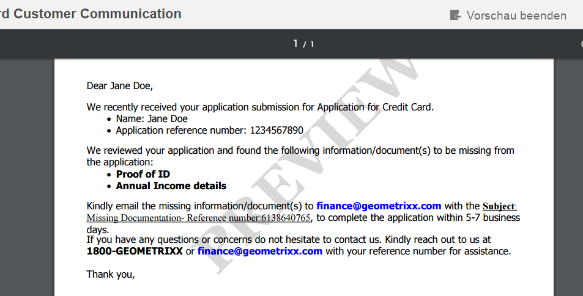

# Wasserzeichen in der PDF-Briefvorschau {#custom-watermark-in-letter-pdf-preview}

## Überblick {#overview}

Agent-Benutzer zeigen in der Benutzeroberfläche „Korrespondenz erstellen“ die Korrespondenz in der endgültigen Form an, in der sie zur Nachbearbeitung gesendet wird, z. B. für E-Mails oder zum Drucken.

Um die nicht autorisierte Verwendung dieser Daten zu verhindern, können Unternehmen der PDF-Vorschau ein Wasserzeichen hinzufügen. Das standardmäßige Wasserzeichen ist „VORSCHAU“ und wird über die gesamte PDF hinweg angezeigt.

Um das Wasserzeichen in der PDF-Vorschau zu aktivieren, wählen Sie unter **[!UICONTROL Correspondence Management-Konfigurationen]** die Option &quot;Wasserzeichen ]**während der Vorschau anwenden&quot;.**[!UICONTROL `https://[server]:[port]/system/console/configMgr`



Sie können folgende Schritte verwenden, um den Text und das Erscheinungsbild des Wasserzeichens anzupassen:

## Passen Sie die Benutzeroberfläche „Korrespondenz erstellen“ an {#customizewatermark-}

1. Gehen Sie zu `https://[server]:[port]/[ContextPath]/crx/de` und melden Sie sich als Administrator an.
1. Erstellen Sie im Ordner &quot;apps&quot;einen Ordner mit dem Namen **[!UICONTROL previewwatermark]** mit einem ähnlichen Pfad/einer ähnlichen Struktur wie der Ordner previewwatermark im Ordner libs:

   1. Klicken Sie mit der rechten Maustaste auf den Ordner **previewwatermark **unter folgendem Pfad und wählen Sie **Überlagerungsknoten**:

      `/libs/fd/cm/configFiles/previewwatermark`

   1. Stellen Sie sicher, dass das Dialogfeld „Überlagerungsknoten“ die folgenden Werte enthält:

      **Pfad:** /libs/fd/cm/configFiles/previewwatermark

      **Überlagerungsort:** /apps/

      **Knotentypen abgleichen:** Überprüft

      >[!NOTE]
      >
      >Nehmen Sie keine Änderungen in der /libs-Verzweigung vor. Alle Änderungen, die Sie vornehmen, gehen möglicherweise verloren, da diese Verzweigung sich ändern kann, wenn Sie:
      >
      >* Ihre Instanz aktualisieren
      >* Ein Hotfix anwenden
      >* Ein Feature Pack installieren


   1. Klicken Sie auf **OK** und dann auf **Alle speichern**. Der Ordner **[!UICONTROL previewwatermark]** wird im angegebenen Pfad erstellt.

1. Kopieren Sie die ddx-Datei aus dem Ordner &quot;/libs/fd/cm/configFiles/previewwatermark&quot;in den Ordner &quot;/apps/fd/cm/configFiles/previewwatermark&quot;und klicken Sie auf **[!UICONTROL Save All]**.
1. Nehmen Sie in der ddx-Datei unter „/apps/fd/cm/configFiles/previewwatermark/“ die gewünschten Änderungen vor.

   ```
   <DDX xmlns="https://ns.adobe.com/DDX/1.0/">
    <PDF result="output.pdf">
     <PDF source="input.pdf"/>
           <Watermark opacity="15%" rotation="45">
            <StyledText>
                     <p font-family="Georgia" font-size="70pt" color="black" font-weight="bold">
                         PREVIEW
                    </p>
            </StyledText>
           </Watermark>
    </PDF>
   </DDX>
   ```

   Weitere Informationen zum Anpassen von Darstellung, Text und Ausrichtung von Wasserzeichen finden Sie unter Hinzufügen und Entfernen von Wasserzeichen und Hintergründen im Dokument [Assembler-Dienst und DDX-Referenz](https://help.adobe.com/en_US/livecycle/11.0/ddxRef.pdf).

   >[!NOTE]
   >
   >In der ddx-Datei sollten die Verweise auf das Ergebnis und die Quelle für output.pdf und input.pdf unverändert bleiben. Der Name der ddx-Datei darf nicht geändert werden.

1. Klicken Sie auf **Alle speichern**.

