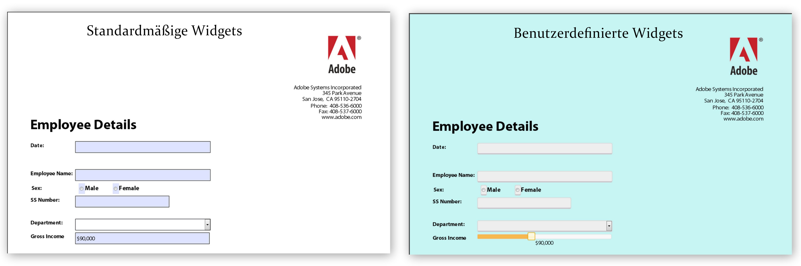

# Erstellen von benutzerspezifischen Erscheinungsbildern in HTML5-Formularen {#create-custom-appearances-in-html-forms}

>[!CAUTION]
>
>AEM 6.4 hat das Ende der erweiterten Unterstützung erreicht und diese Dokumentation wird nicht mehr aktualisiert. Weitere Informationen finden Sie in unserer [technische Unterstützung](https://helpx.adobe.com/de/support/programs/eol-matrix.html). Unterstützte Versionen suchen [here](https://experienceleague.adobe.com/docs/?lang=de).

Sie können benutzerdefinierte Widgets mit einer mobilen Forms einbinden. Sie können mithilfe des Erscheinungsbild-Framework vorhandene jQuery Widgets erweitern oder Ihre eigenen benutzerdefinierten Widgets entwickeln. Die XFA-Engine verwendet verschiedene Widgets. Detaillierte Informationen finden Sie unter [Erscheinungsbild-Framework für adaptive und HTML5-Formulare](/help/forms/using/introduction-widgets.md).


**Abbildung:** *Beispiel für ein standardmäßiges und benutzerdefiniertes Widget*

## Integrieren benutzerdefinierter Widgets mit HTML5-Formularen {#integrating-custom-widgets-with-html-forms}

### Profil erstellen  {#create-a-profile-nbsp}

Sie können ein Profil erstellen oder ein vorhandenes Profil auswählen, um ein benutzerdefiniertes Widget hinzuzufügen. Weitere Informationen zum Erstellen von Profilen finden Sie unter [Erstellen eines benutzerdefinierten Profils](/help/forms/using/custom-profile.md).

### Widget erstellen {#create-a-widget}

HTML5-Formulare bieten eine Implementierung des Widget-Frameworks, die zum Erstellen neuer Widgets erweitert werden kann. Die Implementierung ist ein jQuery-Widget *abstractWidget* , die erweitert werden können, um ein neues Widget zu schreiben. Das neue Widget kann nur durch Erweitern/Überschreiben der unten genannten Funktionen funktionsfähig gemacht werden.

<table> 
 <tbody> 
  <tr> 
   <td>Funktion/Klasse</td> 
   <td>Beschreibung</td> 
  </tr> 
  <tr> 
   <td>render</td> 
   <td>Die Renderfunktion gibt das jQuery-Objekt für das standardmäßige HTML-Element des Widgets zurück. Das standardmäßige HTML-Element sollte fokussierbar sein. Beispiel: &lt;a&gt;, &lt;input&gt;und &lt;li&gt;. Das zurückgegebene Element wird als $userControl verwendet. Wenn $userControl die oben stehende Bedingung erfüllt, laufen die Funktionen der Klasse „AbstractWidget“ ordnungsgemäß. Ansonsten müssen einige allgemeine APIs (focus, click) geändert werden. </td> 
  </tr> 
  <tr> 
   <td>getEventMap</td> 
   <td>Gibt eine Zuordnung zur Konvertierung von HTML-Elementen zu XFA-Ereignissen zurück.  <br /> {<br /> blur: XFA_EXIT_EVENT,<br /> }<br /> Dieses Beispiel zeigt, dass „blur“ ein HTML-Ereignis und XFA_EXIT_EVENT das entsprechende XFA-Ereignis ist. </td> 
  </tr> 
  <tr> 
   <td>getOptionsMap</td> 
   <td>Gibt eine Zuordnung zurück, die detailliert beschreibt, welche Aktion bei Änderung einer Option ausgeführt werden soll. Die Schlüssel sind die Optionen, die dem Widget übergeben werden, und die Werte sind die Funktionen, die aufgerufen werden, wenn eine Änderung in der jeweiligen Option erkannt wird. Das Widget bietet Handler für alle allgemeinen Optionen (außer value und displayValue)</td> 
  </tr> 
  <tr> 
   <td>getCommitValue</td> 
   <td>Das Widget-Framework lädt die Funktion jedes Mal, wenn der Wert des Widgets im XFAModel gespeichert wird (z. B. beim exit-Ereignis eines textField). Die Implementierung sollte den Wert zurückgeben, der im Widget gespeichert wird. Der Handler erhält den neuen Wert für die Option.</td> 
  </tr> 
  <tr> 
   <td>showValue</td> 
   <td>Standardmäßig wird in XFA beim enter-Ereignis der rawValue des Felds angezeigt. Diese Funktion wird aufgerufen, um dem Benutzer den rawValue anzuzeigen. </td> 
  </tr> 
  <tr> 
   <td>showDisplayValue</td> 
   <td>Standardmäßig wird in XFA beim exit-Ereignis der formattedValue des Felds angezeigt. Diese Funktion wird aufgerufen, um dem Benutzer den formattedValue anzuzeigen. </td> 
  </tr> 
 </tbody> 
</table>

Um ein eigenes Widget im oben erstellen Profil zu erstellen, müssen Sie die Verweise der JavaScript-Datei einschließen, die die überschriebenen und neu hinzugefügten Funktionen enthält. Das *sliderNumericFieldWidget* ist beispielsweise ein Widget für numerische Felder. Um das Widget in Ihrem Profil im Kopfzeilenabschnitt zu verwenden, fügen Sie die folgende Zeile ein:

```
window.formBridge.registerConfig("widgetConfig" , widgetConfigObject);
```

### Registrieren von benutzerdefinierten Widgets mit XFA Scripting Engine  {#register-custom-widget-with-xfa-scripting-engine-nbsp}

Wenn der Code des benutzerdefinierten Widgets fertig ist, registrieren Sie das Widget mit der Skripterstellungs-Engine, indem Sie die `registerConfig`-API für [Form Bridge](/help/forms/using/form-bridge-apis.md) verwenden. Es erfordert widgetConfigObject als Eingabe.

```
window.formBridge.registerConfig("widgetConfig",
        {
        ".<field-identifier>":"<name-of-the-widget>"
        }
    );
```

#### widgetConfigObject {#widgetconfigobject}

Die Widget-Konfiguration wird als JSON-Objekt (eine Sammlung von Schlüssel-Wert-Paaren) bereitgestellt, bei dem der Schlüssel die Felder identifiziert und der Wert das Widget darstellt, das mit diesen Feldern verwendet werden soll. Eine Beispielkonfiguration sieht wie folgt aus:

```
*{*

*“identifier1” : “customwidgetname”,  
“identifier2” : “customwidgetname2”,  
..  
}*
```

Hierbei ist „identifier“ ein jQuery CSS-Selektor, der für ein bestimmtes Feld, eine Gruppe von Feldern eines bestimmten Typs oder alle Felder steht. Im Folgenden ist der Wert des Bezeichners in verschiedenen Fällen aufgeführt:

| Typ des Bezeichners | ID | Beschreibung |
|---|---|---|
| Bestimmtes Feld mit name fieldname | Bezeichner:&quot;div.fieldname&quot; | Alle Felder mit dem Namen &quot;fieldname&quot;werden mithilfe des Widgets gerendert. |
| Alle Felder des Typs „type“ („type“ ist hier „NumericField“, „DateField“ usw.): | Kennung: &quot;div.type&quot; | Für „TimeField“ und „DateTimeField“ ist der Typ „textfield“, da diese Felder nicht unterstützt werden. |
| Alle Felder | Kennung: &quot;div.field&quot; |  |
