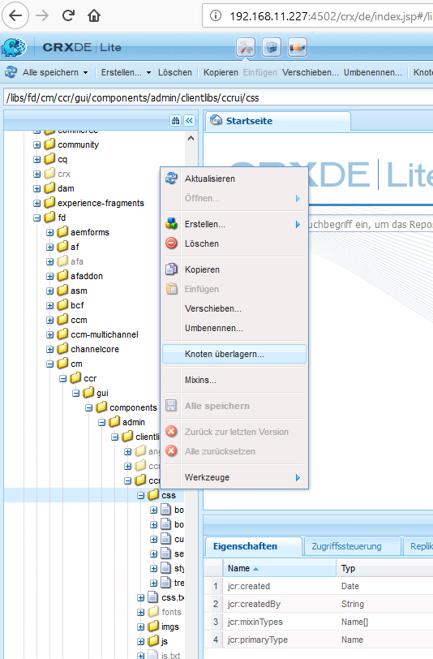
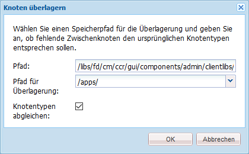
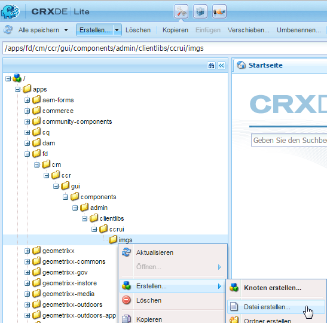
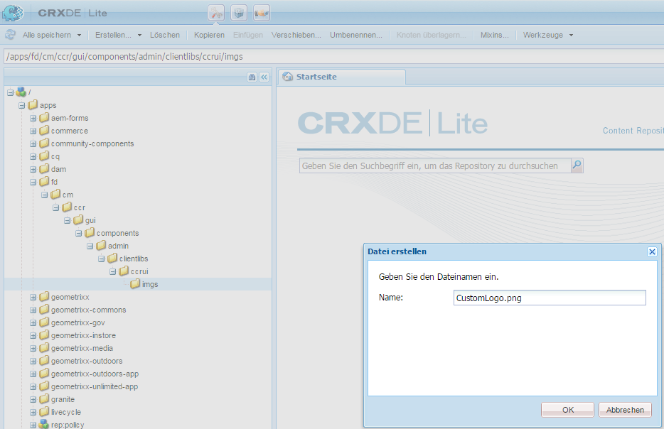

# Anpassen der Benutzeroberfläche „Korrespondenz erstellen“{#customize-create-correspondence-ui}

## Überblick {#overview}

Mit der Correspondence Management können Sie die dazugehörige Lösungsvorlage so umbenennen, dass Sie einen besseren Markenwert erzielen und die Markenstandards Ihres Unternehmens erfüllt werden. Die Umbenennung der Benutzeroberfläche umfasst das Ändern des Unternehmenslogo in der linken oberen Ecke der Benutzeroberfläche „Korrespondenz erstellen“.

Sie können das Logo in der Benutzeroberfläche „Korrespondenz erstellen“ mit Ihrem Firmenlogo ersetzen.


**im IFigure:** *Das benutzerdefinierte Symbol in der Benutzeroberfläche &quot;Korrespondenz erstellen&quot;*

### Ändern des Logos in der Benutzeroberfläche „Korrespondenz erstellen“{#changing-the-logo-in-the-create-correspondence-ui}

Um ein Logobild Ihrer Wahl einzurichten, führen Sie die folgenden Schritte durch:

1. Erstellen Sie die entsprechende [Ordnerstruktur in CRX](#creatingfolderstructure).
1. [Laden Sie die neue Logodatei ](#uploadlogo) in den Ordner hoch, den Sie in CRX erstellt haben.

1. [Richten Sie ](#createcss) CSS auf CRX ein, um auf das neue Logo zu verweisen.
1. Löschen Sie den Browserverlauf und aktualisieren Sie die Benutzeroberfläche &quot;Korrespondenz erstellen&quot;](#refreshccrui).[

## Erstellen der gewünschten Ordnerstruktur {#creatingfolderstructure}

Erstellen Sie die Ordnerstruktur wie nachfolgend beschrieben für das Hosten des benutzerdefinierten Logobilds und des Stylesheets. Die neue Ordnerstruktur mit dem /apps-Stammordner ist ähnlich der Struktur des /libs-Ordners.

Erstellen Sie bei jeder Anpassung eine parallele Ordnerstruktur in der /apps-Verzweigung, wie nachfolgend beschrieben.

Die /apps-Verzweigung (Ordnerstruktur):

* Stellt sicher, dass Ihre Dateien im Falle eines Updates für das System sicher sind. Bei einem Upgrade, Feature Pack oder einem Hotfix wird die /libs-Verzweigung aktualisiert und wenn Sie Ihre Änderungen in der /libs-Verzweigung hosten, werden sie überschrieben.
* Hilft Ihnen dabei, das vorhandene System/die Verzweigung nicht zu beeinträchtigen, was unter Umständen geschehen ist, falls Sie die Standardspeicherorte zum Speichern der benutzerdefinierten Dateien verwendet haben.
* Hilft den Ressourcen, höhere Priorität zu erhalten, wenn AEM nach Ressourcen sucht. AEM ist so konfiguriert, dass zuerst die /apps-Verzweigung und dann die /libs-Verzweigung nach einer Ressource gesucht wird. Dieser Mechanismus bedeutet, dass das System die Überlagerung verwendet (und alle dort definierten Anpassungen).

Führen Sie die folgenden Schritte aus, um die gewünschte Ordnerstruktur in der /apps-Verzweigung zu erstellen:

1. Gehen Sie zu `https://[server]:[port]/[ContextPath]/crx/de` und melden Sie sich als Administrator an.
1. Erstellen Sie im Anwendungsordner einen Ordner mit dem Namen `css` mit einem ähnlichen Pfad/einer ähnlichen Struktur wie der css-Ordner (im ccrui-Ordner).

   Schritte zum Erstellen des css-Ordners:

   1. Klicken Sie mit der rechten Maustaste auf den Ordner **css** unter folgendem Pfad und wählen Sie **Überlagerungsknoten**: `/libs/fd/cm/ccr/gui/components/admin/clientlibs/ccrui/css`

      

   1. Stellen Sie sicher, dass das Dialogfeld „Überlagerungsknoten“ die folgenden Werte enthält:

      **Pfad:** /libs/fd/cm/ccr/gui/components/admin/clientlibs/ccrui/css

      **Überlagerungsort:** /apps/

      **Knotentypen abgleichen:** Überprüft

      

      >[!NOTE]
      >
      >Nehmen Sie keine Änderungen in der /libs-Verzweigung vor. Alle Änderungen, die Sie vornehmen, gehen möglicherweise verloren, da diese Verzweigung sich ändern kann, wenn Sie:
      >
      >* Ihre Instanz aktualisieren
      >* Ein Hotfix anwenden
      >* Ein Feature Pack installieren


   1. Klicken Sie auf **OK**. Der css-Ordner wird in dem angegebenen Pfad erstellt.

1. Erstellen Sie im Anwendungsordner einen Ordner mit dem Namen `imgs` mit einem ähnlichen Pfad/einer ähnlichen Struktur wie der imgs-Ordner (im ccrui-Ordner).

   1. Klicken Sie mit der rechten Maustaste auf den Ordner **imgs** unter folgendem Pfad und wählen Sie **Überlagerungsknoten**: `/libs/fd/cm/ccr/gui/components/admin/clientlibs/ccrui/imgs`
   1. Stellen Sie sicher, dass das Dialogfeld „Überlagerungsknoten“ die folgenden Werte enthält:

      **Pfad:** /libs/fd/cm/ccr/gui/components/admin/clientlibs/ccrui/imgs

      **Überlagerungsort:** /apps/

      **Knotentypen abgleichen:** Überprüft

   1. Klicken Sie auf **OK**.

      >[!NOTE]
      >
      >Sie können die Ordnerstruktur im /apps-Ordner auch manuell erstellen.

1. Klicken Sie auf **Alle speichern**, um die Änderungen auf dem Server zu speichern.

## Hochladen des neuen Logos auf CRX {#uploadlogo}

Laden Sie Ihre benutzerdefinierte Logodatei auf CRX hoch. Standard-HTML-Regeln steuern die Darstellung des Logos. Die unterstützten Bildformate werden vom Browser bestimmt, den Sie verwenden, um auf AEM Forms zuzugreifen. Alle Browser unterstützen JPEG, GIF und PNG. Weitere Informationen finden Sie in der Browser-spezifischen Dokumentation zu den unterstützten Bildformaten.

* Die Standardabmessungen des Logobilds sind 48 px&amp;ast; 48 px. Stellen Sie sicher, dass das Bild dieser Größe oder größer als 48 px&amp;ast ist. 48 px.
* Wenn die Höhe des Logobilds größer ist als 50 Pixel, verkleinert die Benutzeroberfläche „Korrespondenz erstellen“ das Bild auf eine maximale Höhe 50 Pixel, da dies die Höhe der Kopfleiste ist. Beim Verkleinern des Bilds behält die Benutzeroberfläche „Korrespondenz erstellen“ das Seitenverhältnis bei.
* Die Benutzeroberfläche „Korrespondenz erstellen“ vergrößert Ihr Bild nicht, wenn es zu klein ist, daher sollten Sie ein Logobild mit einer Mindesthöhe von 48 Pixel und ausreichenden Breite verwenden.

Führen Sie die folgenden Schritte aus, um die benutzerdefinierte Logodatei auf CRX hochzuladen:

1. Rufen Sie `https://[server]:[port]/[contextpath]/crx/de` auf. Falls erforderlich, melden Sie sich als Administrator an.
1. Klicken Sie in CRXDE mit der rechten Maustaste auf den Ordner **imgs** an folgendem Speicherort und wählen Sie **Erstellen > Datei erstellen:**

   `/apps/fd/cm/ccr/gui/components/admin/clientlibs/ccrui/imgs/`

   

1. Im Dialogfeld „Datei erstellen“ geben Sie den Namen der Datei als „CustomLogo.png“ (oder den Namen der Logodatei) an.

   

1. Klicken Sie auf **Alle speichern**.

   Unter der neuen Datei, die Sie erstellt haben (hier „CustomLogo.png“) erscheint die Eigenschaft „jcr:content“.

1. Klicken Sie auf „jcr:content“ in der Ordnerstruktur.

   Die Eigenschaften von „jcr:content“ werden angezeigt.

   

1. Klicken Sie bei gedrückter Dublette auf die Eigenschaft **jcr:data**.

   Das Dialogfeld „jcr:data bearbeiten“ wird angezeigt.

   Klicken Sie nun auf den Ordner newlogo.png, klicken Sie in der Dublette auf jcr:content (dim-Option) und legen Sie den Typ nt:resource fest. Falls sie nicht vorhanden ist, erstellen Sie zuerst eine Eigenschaft mit dem Namen „jcr:content“.

1. Klicken Sie im Dialogfeld „jcr:data bearbeiten“, auf **Durchsuchen** und wählen Sie die Bilddatei, die Sie als Logo (hier CustomLogo.png) verwenden möchten.

   Die unterstützten Bildformate werden vom Browser bestimmt, den Sie verwenden, um auf AEM Forms zuzugreifen. Alle Browser unterstützen JPEG, GIF und PNG. Weitere Informationen finden Sie in der Browser-spezifischen Dokumentation zu den unterstützten Bildformaten.

   
   **Abbildung:** *Beispiel - CustomLogo.png als benutzerdefiniertes Logo verwenden*

1. Klicken Sie auf **Alle speichern**.

## Erstellen des CSS, um das Logo in der Benutzeroberfläche zu integrieren {#createcss}

Das benutzerdefinierte Logobild ist ein zusätzliches im Inhaltskontext zu ladendes Stylesheet.

Führen Sie die folgenden Schritte aus, um das Stylesheet für die Wiedergabe des Logos einzurichten:

1. Rufen Sie `https://[server]:[port]/[contextpath]/crx/de` auf. Falls erforderlich, melden Sie sich als Administrator an.
1. Erstellen Sie eine Datei mit dem Namen customcss.css (Sie können keinen anderen Dateinamen verwenden) an folgendem Speicherort:

   `/apps/fd/cm/ccr/gui/components/admin/clientlibs/ccrui/css/`

   Schritte zum Erstellen der customcss.css-Datei:

   1. Klicken Sie mit der rechten Maustaste auf den Ordner **css** und wählen Sie **Erstellen > Ordner erstellen**.
   1. Geben Sie im Dialogfeld &quot;Neue Datei&quot;den Namen der CSS als `customcss.css` ein (Sie können keinen anderen Dateinamen verwenden) und klicken Sie auf **OK**.
   1. Fügen Sie den folgenden Code zu der neu erstellte CSS-Datei hinzu. Geben Sie unter „content:url“ im Code den Namen des Bildes ein, das Sie in den imgs-Ordner in CRXDE hochgeladen haben.

      ```css
      .logo, .logo:after {
      content:url("../imgs/CustomLogo.png");
      }
      ```

   1. Klicken Sie auf **Alle speichern**.

## Aktualisieren der Benutzeroberfläche „Korrespondenz erstellen“, um das benutzerdefinierte Logo zu sehen  {#refreshccrui}

Löschen Sie den Browsercache und öffnen Sie dann die Instanz der Benutzeroberfläche „Korrespondenz erstellen“ in Ihrem Browser. Sie sollten nun Ihr eigenes Logo sehen können.


**LogoAbbildung:** *Das benutzerdefinierte Symbol in der Benutzeroberfläche &quot;Korrespondenz erstellen&quot;*

