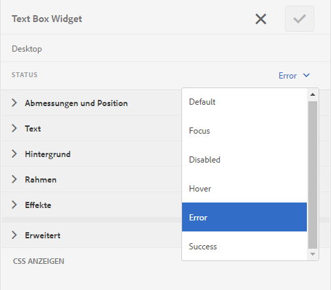

# Layout und Positionierung von Fehlermeldungen eines adaptiven Formulars anpassen {#customize-layout-and-positioning-of-error-messages-of-an-adaptive-form}

Sie können Layout und Positionierung von Fehlermeldungen eines adaptiven Formulars anpassen. Sie können die folgenden Anpassungen vornehmen:

* Position und Layout der Beschriftung eines Felds ohne Ändern der entsprechenden CSS-Eigenschaften anpassen
* Position von Inline-Fehlermeldungen anpassen
* Inhalt der dynamischen Hilfeanzeige anpassen
* Position der Feldkomponenten (Beschriftung, Widget, Kurzbeschreibung, Langbeschreibung und Komponenten der Hilfeanzeige) ohne Ändern der entsprechenden CSS-Eigenschaften anpassen

## Layout von Feldern anpassen  {#customize-layout-of-fields}

Sie können das Layout eines einzelnen Felds oder aller Felder anpassen, um die Position von Beschriftungen und Fehlermeldungen anzupassen. Führen Sie die folgenden Schritte aus, um ein benutzerdefiniertes Layout auf ein Feld anzuwenden:

### Layout eines einzelnen Felds anpassen  {#customize-layout-of-a-single-field}

Führen Sie die folgenden Schritte aus, um ein benutzerdefiniertes Layout auf ein einzelnes Feld anzuwenden:

1. Öffnen Sie das Formular im **Stilmodus**. Um das Formular im Stilmodus zu öffnen, tippen Sie in der Seitensymbolleiste auf  > **Style**.
1. Wählen Sie in der Seitenleiste unter **Formularobjekte** das Feld aus und tippen Sie auf die Bearbeitungsschaltfläche .
1. Wählen Sie den Status des Feldes, das Sie anpassen möchten, und geben Sie den Stil für diesen Status an.

   

### Layout aller Felder eines Formulars anpassen {#customize-layout-of-all-the-fields-of-a-form}

Mit AEM Forms können Sie jetzt ein Design erstellen und auf Ihr Formular anwenden. Im Design-Editor können Sie zentral den Stil von Formularkomponenten angeben. Beim Erstellen eines Designs geben Sie Stile auf der Komponentenebene an. Weitere Informationen zu Designs finden Sie unter [Designs in AEM Forms](/help/forms/using/themes.md).

Indem Sie Designs im Design-Editor erstellen, könen Sie das Layout aller Felder im Formular anpassen. Nachdem Sie ein Design erstellt haben, führen Sie die folgenden Schritte aus, um es auf ein Formular anzuwenden:

1. Öffnen Sie das Formular im Bearbeitungsmodus.
1. Wählen Sie im Bearbeitungsmodus eine Komponente aus, tippen Sie auf  > **Container für adaptive Formulare** und tippen Sie dann auf .
1. Wählen Sie in der Seitenleiste unter „Adaptives Formulardesign“ das Design, das Sie im Design-Editor erstellt haben.

## Benutzerdefiniertes Feldlayout definieren  {#create-a-custom-field-layout}

1. Öffnen Sie CRXDE Lite. Die Standardeinstellung ist `https://[Server]:[Port]/crx/de`.
1. Kopieren Sie ein Feldlayout vom Knoten „/libs/fd/af/layouts/field“ (z. B. defaultFieldLayout) in den Knoten „/apps“ (z. B. „/apps/af-field-layout“).
1. Benennen Sie den kopierten Knoten und die Datei „defaultFieldLayout.jsp“ um. Beispielsweise in „errorOnRight.jsp“. 

1. Ändern Sie den Wert der Eigenschaften &quot;qtip&quot;und &quot;jcr:description&quot;des kopierten Knotens. Ändern Sie z. B. den Wert der Eigenschaften in „Error On Right“ 

1. Um neue Stile und Verhaltensweisen hinzuzufügen, erstellen Sie eine Clientbibliothek unter dem Knoten „/etc“.

   Erstellen Sie z. B. im Verzeichnis „/etc/af-field-layout-clientlib“ den Knoten „client-library“. Fügen Sie die Kategorieneigenschaft mit dem Wert „af.field.errorOnRight“ und die style.less-Datei mit folgendem Code hinzu:

   ```css
   .widgetErrorWrapper {
   
    height: 38px;
    margin: 5px;
   
    .guideFieldWidget{
    width: 60%;
    float: left; 
    }
   
    .guideFieldError{
    overflow:hidden;
    width:40%; 
    }
   
   }
   ```

1. Beziehen Sie zur Verbesserung des Erscheinungsbilds und der Verhaltensweise die in der Layout-Datei (errorOnRight.jsp) erstellte Clientbibliothek ein.
1. Öffnen Sie das Dialogfeld „Bearbeiten“ und wählen Sie **Formatieren**. Wählen Sie im Dropdownfeld **Feldlayout konfigurieren** das neu erstellte Layout aus und klicken Sie auf **OK**.

Das ErrorOnRight.zip-Paket enthält Code, um Fehlermeldungen auf der rechten Seite der Felder anzuzeigen.

[Datei laden](assets/erroronright.zip)
