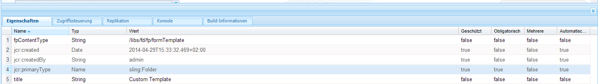

# Anpassen von Vorlagen für Forms Portal-Komponenten {#customizing-templates-for-forms-portal-components}

>[!CAUTION]
>
>AEM 6.4 hat das Ende der erweiterten Unterstützung erreicht und diese Dokumentation wird nicht mehr aktualisiert. Weitere Informationen finden Sie in unserer [technische Unterstützung](https://helpx.adobe.com/de/support/programs/eol-matrix.html). Unterstützte Versionen suchen [here](https://experienceleague.adobe.com/docs/?lang=de).

## Voraussetzungen {#prerequisites}

[Formularmetadaten verwalten](/help/forms/using/manage-form-metadata.md)

Kenntnisse im Bereich HTML und CSS

## Übersicht {#overview}

In der Benutzeroberfläche von AEM Forms können Sie jedem beliebigen Formular Metadaten hinzufügen. Benutzerdefinierte Metadaten können das Benutzererlebnis beim Auflisten und Suchen von Formularen in Ihrer Organisation verbessern.

Mit Forms Portal können Sie benutzerdefinierte Metadaten in Formularlisten verwenden. Beim Erstellen benutzerdefinierter Vorlagen für Assets können Sie das Layout ändern und benutzerdefinierte Metadaten mit Ihrem CSS-Stilsatz verwenden.

Führen Sie die folgenden Schritte aus, um eine benutzerdefinierte Vorlage für verschiedene Forms Portal-Komponenten zu erstellen.

## Benutzerdefinierte Vorlage erstellen {#creating-a-nbsp-custom-template}

1. Erstellen Sie einen sling:Folder-Knoten unter */apps *

   Fügen Sie eine fpContentType-Eigenschaft hinzu. Geben Sie die entsprechenden Werte für die Eigenschaft an, abhängig von der Komponente, für die Sie die benutzerdefinierte Vorlage definieren.

   * Komponente „Search &amp; Lister“: „/libs/fd/fp/formTemplate“
   * Komponente „Drafts &amp; Submissions“:

      * Bereich &quot;Entwürfe&quot;: /libs/fd/fp/draftsTemplate
      * Bereich &quot;Übermittlungen&quot;: /libs/fd/fp/submissionsTemplate
   * Link-Komponente: /libs/fd/fp/linkTemplate

   Fügen Sie einen Titel hinzu, der bei der Auswahl der Layoutvorlagen angezeigt werden soll.

   *Hinweis: Der Titel kann sich vom Knotennamen des von Ihnen erstellten sling:Folder unterscheiden. *
   *Die folgende Abbildung zeigt die Konfiguration der Komponente „Search &amp; Lister“.* 

1. Erstellen Sie eine Datei template.html in diesem Ordner, die als benutzerdefinierte Vorlage dienen soll.
1. Schreiben Sie die benutzerdefinierte Vorlage und verwenden Sie benutzerdefinierte Metadaten wie unten beschrieben.

## Arbeitsbeispiel {#working-example}

Im Folgenden finden Sie eine Beispielimplementierung einer benutzerdefinierten Vorlage, bei der Forms Portal ein benutzerdefiniertes Geometrixx Gov Card-Layout für die Komponente &quot;Search &amp; Lister&quot;abruft.

```mxml
<div class="__FP_boxes-container __FP_single-color">
    <div class="boxes __FP_boxes __FP_single-color" data-repeatable="true">
 <div class="__FP_boxes-thumbnail">
     
        </div>
        <h3 class="__FP_single-color" title="${name}" tabindex="0">${name}</h3>
        <p>${description}</p>
        <div class="boxes-icon-cont __FP_boxes-icon-cont">
            <div class="op-dow">
                <a href="${formUrl}" target="_blank" class="__FP_button ${htmlStyle}" title="${config-htmlLinkText}">${localize-Apply}</a>
                <a href="${pdfUrl}" class="__FP_button ${pdfStyle}" title="${config-pdfLinkText}">${localize-Download}</a>
            </div>
        </div>
    </div>
</div>
```

## Technische Spezifikationen für benutzerdefinierte Vorlagen {#technical-specifications-for-custom-templates}

Eine benutzerdefinierte Vorlage für eine beliebige Formularportal-Komponente enthält wiederholbare und nicht wiederholbare Einträge. Wiederholbare Einträge sind grundlegende Entitäten für die Auflistung. Beispiele für wiederholbare Einträge sind die Komponenten &quot;Search &amp; Lister&quot;, &quot;Drafts &amp; Submissions&quot;und &quot;Link&quot;.

Forms Portal bietet eine Syntax für Platzhalter zur Anzeige von benutzerdefinierten bzw. OOTB-Metadaten. Die Platzhalter werden nach der Anzeige der Ergebnisse von Formularen, Entwürfen oder Übermittlungen ausgefüllt.

Um einen wiederholbaren Eintrag einzuschließen, konfigurieren Sie den Wert des Attributs **data-repeatable** als **true**.

*Im gezeigten Beispiel sind oben in der benutzerdefinierten Vorlage zwei Div-Elemente vorhanden. Das erste mit der CSS-Klasse „__FP_boxes-container“ fungiert als Containerelement für die aufgelisteten Formulare. Das zweite mit der CSS-Klasse „__FP_boxes“ ist eine Vorlage für die Basiseinheiten, in diesem Fall ein Formular. Das Attribut **data-repeatable** im Div-Element weist den Wert **true** auf.

Jeder Platzhalter verfügt über einen exklusiven OOTB-Metadatensatz. Um benutzerdefinierte Metadaten an einer bestimmten Stelle im Formular anzuzeigen, fügen Sie die **$metadata_prop property** am Ort.

*Im Beispiel wird die Metadaten-Eigenschaft in mehreren Instanzen verwendet. Sie wird z. B. bei **description**,**name**,**formUrl**,**htmlStyle**,**pdfUrl**,**pdfStyle**und **path**in der genannten Weise verwendet.*

## Vordefinierte Metadaten {#out-of-the-box-metadata}

Verschiedene Forms Portal-Komponenten bieten exklusive OOTB-Metadatensätze, die Sie für die Auflistung verwenden können.

### Komponente „Suche und Auflister“ {#search-amp-lister-component}

* **Title**: Titel des Formulars
* **name**: Name des Formulars (meist identisch mit dem Titel)
* **description**: Beschreibung des Formulars
* **formUrl**: URL zur Ausgabe des Formulars als HTML
* **pdfUrl**: URL zur Ausgabe des Formulars als PDF
* **assetType**: Typ des Assets. Gültige Werte sind unter anderem **Form**,**PDF Form**,**Print Form** und **Adaptive Form**
* **htmlStyle**&amp; **pdfStyle**: Anzeigestil für HTML- bzw. PDF-Symbole für die Ausgabe. Gültige Werte sind **__FP_display_none****oder Leerlassen**

   *Hinweis: Denken Sie daran, die Klasse __FP_display_none in Ihrem benutzerdefinierten Stylesheet zu verwenden*

* **downloadUrl**: URL für das Herunterladen eines Assets.

Unterstützung für Lokalisierung, Sortierung und Verwendung von Konfigurationseigenschaften in der Benutzeroberfläche (nur Search &amp; Lister):

1. **Lokalisierungsunterstützung**: Verwenden Sie zum Lokalisieren von statischem Text das Attribut . **${localize-***YOUR_TEXT***}** und stellen Sie den lokalisierten Wert zur Verfügung, falls noch nicht vorhanden.

   *In dem genannten Beispiel werden die Attribute ${localize-Apply} und ${localize-Download} verwendet, um den Text &quot;Apply&quot;und &quot;Download&quot;zu lokalisieren.*

1. **Unterstützung für die Sortierung**: Klicken Sie auf das HTML-Element, um die Suchergebnisse zu sortieren. Um Sortierung in ein Tabellenlayout einzufügen, fügen Sie dem jeweiligen Tabellen-Header das Attribut „data-sortKey“ hinzu. Fügen Sie außerdem seinen Wert als die Metadaten hinzu, nach denen Sie sortieren möchten.

   So ist z. B. im Header „Title“ in der Rasteransicht der Wert für den Header „data-sortKey“ „title“. Klicken Sie auf die Überschrift, um die Werte in einer bestimmten Spalte zu sortieren.

1. **Verwenden von Konfigurationseigenschaften**: Die Komponente „Search &amp; Lister“ verfügt über mehrere Konfigurationen, die Sie in der Benutzeroberfläche verwenden können. Um beispielsweise HTML ToolTip-Text anzuzeigen, der im Bearbeitungsdialogfeld gespeichert wurde, verwenden Sie die **${config-htmlLinkText} -Attribut.** Verwenden Sie für PDF-QuickInfo-Text ebenfalls die **${config-pdfLinkText}** -Attribut.

### Komponente „Link“ {#link-component}

* **Title**: Titel des Formulars
* **formUrl**: URL zur Ausgabe des Formulars als HTML
* **target**: Zielattribut des Links. Gültige Werte sind &quot;_blank&quot;und &quot;_self&quot;.
* **linkText**: Linkbeschriftung

### Komponente &quot;Drafts &amp; Submissions&quot; {#drafts-amp-submissions-component}

* **Path**: Pfad des Entwurfs-/Übermittlungs-Metadatenknotens. Verwenden Sie ihn mit der Erweiterung .HTML als URL, um einen Entwurf oder eine Übermittlung zu öffnen.
* **contextPath**: Kontextpfad der AEM-Instanz
* **firstLetter**: Ersten Buchstaben (Großbuchstaben) des Titels des adaptiven Formulars, der als Entwurf gespeichert oder übermittelt wurde.
* **formName**: Der Titel des adaptiven Formulars, das als Entwurf gespeichert oder übermittelt wurde.
* **draftID**: ID für den aufgelisteten Entwurf (Nur in der Vorlage für den Bereich Entwurf verwenden).
* **submitID**: ID für die aufgelistete Übermittlung (Nur in der Vorlage für den Abschnitt Übermittlung verwenden).
* **status**: Status des gesendeten Formulars. (Nur in der Vorlage für den Abschnitt Übermittlung verwenden).
* **description**: Beschreibung des adaptiven Formulars, das mit dem Entwurf oder der Übermittlung verknüpft ist.
* **diffTime**: Differenz zwischen der aktuellen Zeit und der letzten Speicheraktion für den Entwurf. Alternativ können Sie zwischen der aktuellen Zeit und der letzten Übermittlungsaktion für die Übermittlung unterscheiden.
* **iconClass**: CSS-Klasse zur Anzeige des ersten Buchstabens des Entwurfs/der Übermittlung. Forms Portal umfasst die folgenden Klassen, die verschiedene farbige Hintergründe bieten.
* **owner**: Benutzer, der den Entwurf/die Übermittlung erstellt hat.
* **Today**: Erstellungsdatum des Entwurfs/der Übermittlung im Format TT:MM:JJJJ.
* **TimeNow**: Erstellungszeitpunkt des Entwurfs/der Übermittlung im 24-Stunden-Format HH:MM:SS.

*Hinweis:*

1. Geben Sie der CSS-Klasse für die Löschoption im Bereich „Drafts“ in der Komponente „Drafts &amp; Submissions“ den Namen „__FP_deleteDraft“. Schließen Sie außerdem das Attribut „draftID“ mit dem Wert **${draftID}** ein, bei dem es sich um die Entwurfs-ID des entsprechenden Entwurfs handelt.

1. Beim Erstellen von Links zu geöffneten Entwürfen und Übermittlungen können Sie **$path.html** als Wert der **href** -Attribut für das Anker-Tag.


**A**. Container-Element

**B.** „path“-Metadaten mit einer festen Hierarchie zum Abruf der für jedes Formular gespeicherten Miniatur.

**C.** Datenwiederholbares Attribut für den Vorlagenbereich jedes Formulars

**D.** Zu lokalisierender String „Apply“ 

**E.** Verwenden der Konfigurationseigenschaft „pdfLinkText“ 

**F.** Verwenden der Metadaten „pdfUrl“

## Tipps, Tricks und bekannte Probleme {#tips-tricks-and-known-issues}

1. Verwenden Sie in keiner benutzerdefinierten Vorlage einfache Anführungszeichen (&#39;).
1. Bei benutzerdefinierten Metadaten speichern Sie diese Eigenschaft nur im Knoten **jcr:content/metadata**. Wenn Sie sie an einem anderen Ort speichern, kann das Formularportal die Metadaten nicht anzeigen.
1. Stellen Sie sicher, dass der Name von benutzerdefinierten bzw. bereits vorhandenen Metadaten keinen Doppelpunkt (:) enthält. Wenn dies der Fall ist, können Sie ihn nicht auf der Benutzeroberfläche anzeigen.
1. **data-repeatable** hat keinerlei Bedeutung für eine Komponente des Typs **Link**. Adobe empfiehlt, diese Eigenschaften in einer Vorlage für eine Komponente des Typs „Link“ zu vermeiden.

## Ähnliche Artikel

* [Aktivieren von Formularportalkomponenten](/help/forms/using/enabling-forms-portal-components.md)
* [Erstellen einer Formularportalseite](/help/forms/using/creating-form-portal-page.md)
* [Auflisten von Formularen auf einer Webseite mithilfe von APIs](/help/forms/using/listing-forms-webpage-using-apis.md)
* [Verwenden der Komponente „Entwurf und Übermittlung“](/help/forms/using/draft-submission-component.md)
* [Anpassen der Speicherung von Entwürfen und gesendeten Formularen](/help/forms/using/draft-submission-component.md)
* [Beispiel zur Integrierung der Komponente für Entwurf und Übermittlung in die Datenbank](/help/forms/using/integrate-draft-submission-database.md)
* [Anpassen von Vorlagen für Forms Portal-Komponenten](/help/forms/using/customizing-templates-forms-portal-components.md)
* [Einführung in das Veröffentlichen von Formularen in einem Portal](/help/forms/using/introduction-publishing-forms.md)
