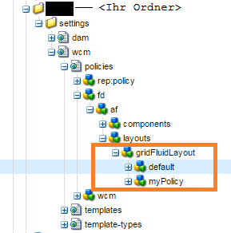

# Anzeigen von Komponenten basierend auf der verwendeten Vorlage {#displaying-components-based-on-the-template-used}

Wenn ein Formularersteller ein adaptives Formular anhand einer [Vorlage](/help/forms/using/template-editor.md) erstellt, kann der Formularersteller basierend auf der Vorlagenrichtlinie bestimmte Komponenten sehen und verwenden. Sie können eine Content-Richtlinie für Vorlagen angeben, mit der Sie eine Gruppe von Komponenten auswählen können, die Formularverfassern beim Formular-Authoring angezeigt wird.

## Ändern der Content-Richtlinie einer Vorlage {#changing-the-content-policy-of-a-template}

Wenn Sie eine Vorlage erstellen, wird sie unter `/conf` im Inhalts-Repository. Basierend auf den Ordnern, die Sie in der `/conf` -Verzeichnis, lautet der Pfad zu Ihrer Vorlage: `/conf/<your-folder>/settings/wcm/templates/<your-template>`.

Führen Sie die folgenden Schritte aus, um die Komponenten basierend auf der Content-Richtlinie einer Vorlage in der Seitenleiste anzuzeigen:

1. Öffnen Sie CRXDE Lite.

   URL: `https://<server>:<port>/crx/de/index.jsp`

1. Gehen Sie in CRXDE zu dem Ordner, in dem die Vorlage erstellt werden soll.

   Beispiel: `/conf/<your-folder>/`

1. Navigieren Sie in CRXDE zu: `/conf/<your-folder>/settings/wcm/policies/fd/af/layouts/gridFluidLayout/`

   Zum Auswählen einer Komponentengruppe ist eine neue Content-Richtlinie erforderlich. Kopieren Sie zum Erstellen einer neuen Richtlinie die Standardrichtlinie, fügen Sie sie ein und benennen Sie sie um.

   Pfad zur standardmäßigen Inhaltsrichtlinie: `/conf/<your-folder>/settings/wcm/policies/fd/af/layouts/gridFluidLayout/default`

   Kopieren Sie im Ordner `gridFluidLayout` die Standardrichtlinie, fügen Sie sie ein und benennen Sie sie um. Beispiel: `myPolicy`.

   

1. Wählen Sie die neue Richtlinie aus, die Sie erstellen, und wählen Sie die **Komponenten** Eigenschaft im rechten Bereich mit Typ `string[]`.

   Wenn Sie die Komponenteneigenschaft auswählen und öffnen, erscheint das Dialogfeld „Komponenten bearbeiten“. Im Dialogfeld „Komponenten bearbeiten“ können Sie Komponentengruppen mit den Tasten **+** und **-** hinzufügen oder entfernen. Sie können Komponentengruppen hinzufügen, die Komponenten enthalten, die von Autoren verwendet werden sollen.

   

   Nachdem Sie eine Komponentengruppe hinzugefügt haben, klicken Sie auf **„OK“**, um die Liste zu aktualisieren, und klicken Sie dann auf **Alle speichern** über der CRXDE-Adressleiste und aktualisieren Sie.

1. Ändern Sie die Content-Richtlinie in der Vorlage vom Standard zu der neu erstellten Richtlinie. ( `myPolicy` in diesem Beispiel.)

   Um die Richtlinie zu ändern, navigieren Sie in CRXDE zu `/conf/<your-folder>/settings/wcm/templates/<your-template>/policies/jcr:content/guideContainer/rootPanel/items`.

   Im `cq:policy` Eigenschaft, ändern `default` zum neuen Richtliniennamen ( `myPolicy`).

   

   Wenn Sie ein Formular mit der Vorlage erstellen, werden die hinzugefügten Komponenten in der Seitenleiste angezeigt.
