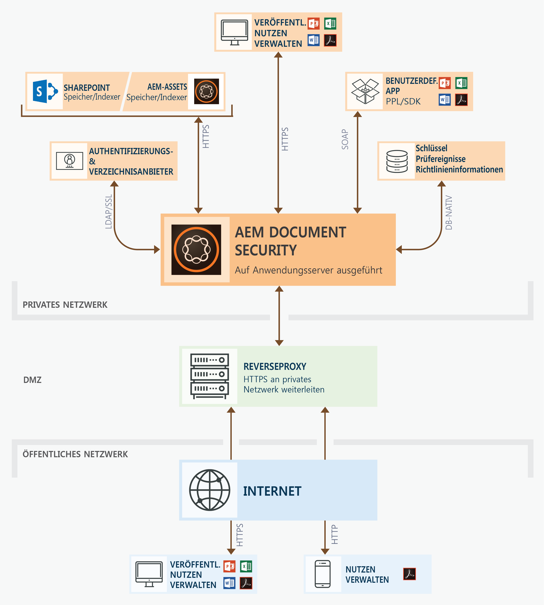

# Document Security-Angebote {#document-security-offerings}

>[!CAUTION]
>
>AEM 6.4 hat das Ende der erweiterten Unterstützung erreicht und diese Dokumentation wird nicht mehr aktualisiert. Weitere Informationen finden Sie in unserer [technische Unterstützung](https://helpx.adobe.com/de/support/programs/eol-matrix.html). Unterstützte Versionen suchen [here](https://experienceleague.adobe.com/docs/?lang=de).

Adobe Experience Manager Forms Document Security stellt sicher, dass nur autorisierte Benutzer Ihre Dokumente verwenden können. Mit Document Security können Sie alle Informationen, die Sie in einem unterstützten Format gespeichert haben, sicher verteilen. Zu den unterstützten Dateiformaten gehören Adobe Portable Document Format (PDF) sowie Microsoft Word-, Excel- und PowerPoint-Dateien.

Sie können Dokumente mithilfe von Richtlinien schützen. Die Vertraulichkeitseinstellungen, die Sie in einer Richtlinie angeben, bestimmen, wie ein Empfänger ein Dokument verwenden kann, auf das Sie die Richtlinie anwenden. Sie können beispielsweise angeben, ob Empfänger Text drucken oder kopieren, Text bearbeiten oder geschützten Dokumenten Signaturen und Kommentare hinzufügen können.

Die Richtlinien werden auf dem Document Security-Server gespeichert. Sie wenden die Richtlinien über Ihre Clientanwendung auf Dokumente an. Wenn Sie eine Richtlinie auf ein Dokument anwenden, schützen die in der Richtlinie angegebenen Vertraulichkeitseinstellungen die Informationen, die das Dokument enthält. Sie können das richtliniengeschützte Dokument an Empfänger verteilen, die durch die Richtlinie autorisiert sind.

Die folgende Abbildung zeigt die typische Architektur für die Dokumentensicherheit in AEM Forms:

## Document Security-Clients {#document-security-clients}

Document Security bietet verschiedene Clients zum Schützen von Dokumenten, zum Anzeigen und Bearbeiten geschützter Dokumente und Indexer, um die Volltextsuche in geschützten Dokumenten zu ermöglichen. Sie können einen Client auswählen, der auf Ihren Anforderungen und den Funktionen des Clients basiert.

Document Security Server ist die zentrale Komponente, über die Document Security Transaktionen wie die Benutzerauthentifizierung, die Echtzeit-Verwaltung von Richtlinien und die Anwendung von Vertraulichkeit durchführt. Der Server stellt außerdem ein zentrales Repository für Richtlinien, Auditdatensätze und andere zugehörige Informationen bereit.

Der Document Security-Server bietet eine webbasierte Oberfläche (Webseite) zum Erstellen von Richtlinien, zum Verwalten richtliniengeschützter Dokumente und zum Überwachen von Ereignissen, die mit richtliniengeschützten Dokumenten verknüpft sind. Administratoren können auch globale Optionen wie Benutzerauthentifizierung, Prüfung und Messaging für eingeladene Benutzer konfigurieren und Konten eingeladener Benutzer verwalten.

Der Server ist im AEM Forms Document Security-Add-On-Angebot enthalten. Sie können AEM Forms kontaktieren [Vertriebsteam](https://www.adobe.com/products/request-consultation/marketing-cloud.html?s_osc=70114000002JNwKAAW&amp;s_iid=70114000002JHs3AAG) , um das Document Security-Add-on zu erwerben.

### Protect-Dokumente {#protect-documents}

AEM Forms Document Security bietet verschiedene Tools zum Anwenden von Sicherheitsrichtlinien. Sie können ein Tool gemäß Ihren Anforderungen und Spezifikationen auswählen.

Sie können Document Security SDK, Adobe Acrobat, Document Security Extension für Microsoft Office oder Portable Protection Library verwendne, um die Sicherheitsrichtlinien anzuwenden und nachzuverfolgen:

* **Document Security SDK:** Das SDK ist ein Client mit vielen Funktionen. Sie können das Document Security SDK verwenden, um auf Document Server-Funktionen zuzugreifen, richtliniengeschützte Dokumente zu öffnen und benutzerdefinierte Erweiterungen, Plug-ins oder Anwendungen zu entwickeln. Sie können beispielsweise Erweiterungen entwickeln, um benutzerdefinierte Dateiformate zu schützen oder SDK mit Data Loss Prevention (DLP)-Lösungen zu integrieren. Erweiterungen, Anwendungen und Plug-ins, die mit dem Document Security SDK entwickelt wurden, senden Dokumente an einen bestimmten AEM Forms-Server und die Richtlinien werden auf den Server angewendet. Beachten Sie außerdem, dass das AEM Forms Document Security Client SDK (CSDK) den Schutz der mit der Portable Protection Library (PPL) geschützten Dokumente nicht aufheben kann und umgekehrt.

   Das Document Security SDK ist für Java und C++ verfügbar. Java SDK ist im AEM Forms Document Security-Angebot enthalten und wird bei der Bereitstellung von AEM Forms on JEE installiert. Sie können [AEM Supportteam](https://helpx.adobe.com/de/marketing-cloud/contact-support.html) um das C++-SDK zu erhalten. Das C++ SDK kann mit Microsoft Visual Studio 2013 kompiliert werden. Sie können die Seite [Document Security API-Dokumentation](https://help.adobe.com/de_DE/livecycle/11.0/Services/WS92d06802c76abadb76c48dfe12dbeb3e281-7ff0.2.html) aufrufen, um mehr über die Funktionen des SDK zu erfahren.

* **Adobe Acrobat:** Sie können Adobe Acrobat verwenden, um Sicherheitsrichtlinien auf PDF-Dokumente anzuwenden, die bei mit gängigen Desktop-Applikationen wie Microsoft Office, Webbrowsern oder beliebigen Anwendungen, die den Druck von PDF-Formaten unterstützen, erstellt wurden.

   Sie können Adobe Acrobat von der [Adobe-Website erwerben und herunterladen](https://acrobat.adobe.com/us/en/free-trial-download.html). Im Adobe Acrobat-Artikel [Sicherheitsrichtlinien für PDF-Dateien einrichten](https://helpx.adobe.com/acrobat/using/setting-security-policies-pdfs.html) finden Sie ausführliche Informationen zum Erstellen und Anwenden von Richtlinien in Adobe Acrobat.

* **Document Security Extension for Microsoft Office**: Sie können Document Security Extension for Microsoft Office verwenden, um vordefinierte Richtlinien auf Ihre Microsoft Office-Dateien in den Microsoft Office-Programmen anzuwenden. Die Erweiterung stellt sicher, dass nur autorisierte Personen richtliniengeschützte Microsoft Word-, Excel- und PowerPoint-Dateien verwenden können. Nur autorisierte Benutzer, die das Plug-in installiert haben, können die richtliniengeschützten Dateien verwenden.

   Die Document Security-Erweiterung ist als Plug-in für Microsoft Office verfügbar. Sie können die Erweiterung von [Website der Adobe](https://helpx.adobe.com/de/aem-forms/aem-document-security/download-installer.html). Später können Sie die [Document Security Extension für Microsoft Office](https://helpx.adobe.com/aem-forms/aem-document-security/aem-document-security-extension-help.html)-Hilfe zum Installieren, Konfigurieren und zur Verwendung der Erweiterung verwenden.

* **Portable Protection Library:** Portable Protection Library (PPL) schützt ein Dokument lokal, ohne es an den AEM Forms-Server zu senden. Nur Sicherheitsberechtigungen und Richtliniendetails werden über das Netzwerk übertragen. Mit PPL können Sie auch den Zugriff auf den Abruf von Richtlinien auf angemeldete Benutzer beschränken. Sie können Richtlinien mit dem Kontext des Benutzers abrufen, der als AEM-Benutzer angemeldet ist.

   Zusammen mit den oben genannten Funktionen, hat die Portable Protection Library alle Funktionen des Document Security SDK. Sie können Document Security SDK verwenden, um auf Document Server-Funktion zuzugreifen, richtliniengeschützte Dokumente zu öffnen und benutzerdefinierte Erweiterungen, Plug-Ins oder Anwendungen zu entwickeln. Beachten Sie außerdem, dass der AEM Forms Document Security Client SDK (CSDK) die mit der Portable Protection Library (PPL) geschützten Dokumente nicht aufheben kann und umgekehrt.

   Die Portable Protection Library ist für Java- und C++-Sprachen in 32-Bit- und 64-Bit-Versionen verfügbar.  Sie ist auch als OSGi-Bundle für AEM Forms unter OSGi verfügbar. Das C++ PPL kann mit Microsoft Visual Studio 2013 kompiliert werden. Wenn Sie das AEM Forms Document Security-Add-on lizenziert haben, können Sie sich an [AEM Forms Document Security](https://helpx.adobe.com/de/marketing-cloud/contact-support.html) Support-Team zur Beschaffung der Portable Protection Library. Später können Sie die Portable Protection Library-Hilfe (im Paket mit der Bibliothek) verwenden, um Portable Protection Library einzurichten und zu verwenden.

### Anzeigen oder Bearbeiten geschützter Dokumente {#view-or-edit-protected-documents}

* Für **PDF-Dokumente** können Sie Adobe Acrobat DC, Acrobat Reader und Acrobat Reader Mobile verwenden, um geschützte PDF-Dokumente anzuzeigen. Die meisten Benutzer haben Acrobat Reader bereits auf ihren Geräten installiert, sodass sie keine zusätzliche Software benötigen, um geschützte Dokumente anzuzeigen. Sie können die Acrobat Reader auch von herunterladen [Acrobat Reader-Download-Website](https://get.adobe.com/de/reader/).

* Für **Microsoft Office-Dokumente**, benötigen Sie Microsoft Office und AEM Forms Document Security Extension for Microsoft Office. Die Document Security-Erweiterung ist als Plug-in für Microsoft Office verfügbar. Sie können die Erweiterung von der Adobe-Website herunterladen.

### Indexgeschützte Dokumente {#index-protected-documents}

Microsoft Windows-Volltextsuchmaschinen (SharePoint Index Server) und Adobe Experience Manager (AEM) können Volltextsuchen für häufig verwendete Dokumentformate wie Textdateien, Microsoft Office-Dokumente und PDF-Dokumente durchführen. Sie können Document Security-Indexer verwenden, um Volltext-Suchmaschinen für die Suche nach geschützten PDF-Dokumenten zu aktivieren:

* **iFilter-Indexer:** Sie können den iFilter-Indexer verwenden, um geschützte PDF-Dokumente zu indexieren und die Volltextsuche mit Microsoft Windows-Suchmaschinen (Desktop Indexing Service und SharePoint Indexserver) in geschützten PDF-Dokumenten zu ermöglichen. Ausführlichere Informationen finden Sie unter [AEM SharePoint IFilter für geschützte Dokumente erstellen](assets/sharepoint-ifilter-doc-security.pdf).

* **AEM Forms Document Security-Impulszähler:** Sie können den AEM Document Security-Impulszähler verwenden, um geschützte PDF-Dokumente mt einem Index zu versehen und die Adobe Experience Manager aktivieren, um geschützte PDF-Dokumente zu suchen. Die Impulszähler sind Bestandteil der Document Security von AEM Forms. Diese sind in AEM Forms in JEE-Installationsprogrammen enthalten.
