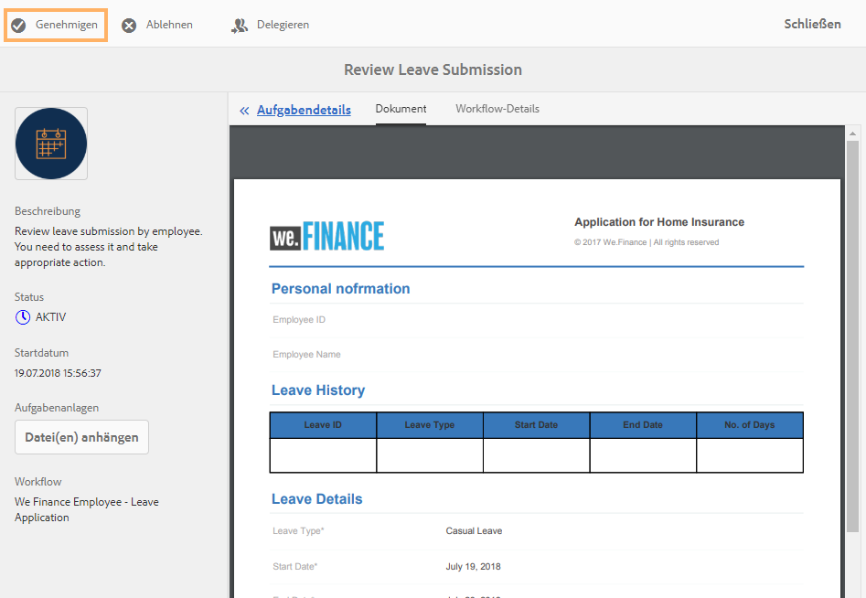

# Anleitung zur Referenz-Website für Mitarbeiter-Self-Service {#employee-self-service-reference-site-walkthrough}

>[!CAUTION]
>
>AEM 6.4 hat das Ende der erweiterten Unterstützung erreicht und diese Dokumentation wird nicht mehr aktualisiert. Weitere Informationen finden Sie in unserer [technische Unterstützung](https://helpx.adobe.com/de/support/programs/eol-matrix.html). Unterstützte Versionen suchen [here](https://experienceleague.adobe.com/docs/?lang=de).

## Voraussetzung {#prerequisite}

Richten Sie die Referenz-Sites wie unter [Einrichten und Konfigurieren von AEM Forms-Referenz-Sites](/help/forms/using/setup-reference-sites.md).

## Übersicht {#overview}

Mitarbeiter-Self-Service-Systeme, die in der Regel im Intranet des Unternehmens gehostet werden, bieten Mitarbeitern Zugriff auf eine Vielzahl von Informationen und Dienstleistungen, die sie von ihren Schreibtischen aus nutzen können. Sie ermöglicht und gibt den Mitarbeitern vollständige Kontrolle über die Durchführung von Maßnahmen wie den Zugriff auf ihre Beschäftigungsdetails, die Beantragung von Urlaub und die Vorlage von Ausgabenberichten. Auf der anderen Seite hilft es Unternehmen, die Prozesseffizienz zu verbessern und Kosten zu senken, während die Mitarbeiter informiert und engagiert bleiben.

Die Referenz-Website für Mitarbeiter-Self-Service zeigt, wie Sie AEM Forms nutzen können, um Mitarbeiter-Self-Service-Systeme in Ihrem Unternehmen zu implementieren.

>[!NOTE]
>
>Anwendungsfälle für Mitarbeiter-Self-Service sind sowohl auf We.Finance- als auch auf We.Gov-Referenz-Sites verfügbar. Die in den exemplarischen Vorgehensweisen verwendeten Beispiele, Bilder und Beschreibungen verwenden die We.Finance-Referenz-Website. Sie können diese Anwendungsfälle jedoch auch ausführen und Artefakte mit We.Gov überprüfen. Dazu müssen Sie **we-finance** mit **we-gov** in den genannten URLs.

## Umgehung des Fragebogens zu Interessenkonflikten {#conflict-of-interest-questionnaire-walkthrough}

Unternehmen fordern von Zeit zu Zeit ihre Mitarbeiter auf, einen Fragebogen zu Interessenkonflikten zu übermitteln, um externe Aktivitäten oder persönliche Beziehungen ihrer Mitarbeiter zu identifizieren, die möglicherweise in Konflikt mit ihrer Organisation stehen.

Die Compliance-Abteilung von Sarahs Organisation hat Mitarbeiter gebeten, den Fragebogen zu Interessenkonflikten einzureichen.

### Sarah sendet den Fragebogen zu Interessenkonflikten {#sarah-submits-the-conflict-of-interest-questionnaire}

Sarah geht zum Portal ihres Unternehmens, meldet sich an und klickt auf Mitarbeiter , um auf das Mitarbeiter-Dashboard zuzugreifen. Sie findet den Fragebogen zu Interessenkonflikten im Mitarbeiter-Dashboard und klickt auf **[!UICONTROL Anwenden]**.

**Abbildung:** *Organisationsportal*

**Abbildung:** *Mitarbeiter-Dashboard*

Sarah navigiert über die Schaltfläche Weiter und liest durch die Abschnitte Einführung und Definition. Sie beantwortet die Fragen im Abschnitt &quot;Fragen&quot;. Schließlich unterschreibt sie den Fragebogen und reicht ihn ein.

Das Unternehmensportal und der Fragebogen sind responsiv und mobilfreundlich. Der folgende Workflow zeigt, wie Sarah durch den Fragebogen navigiert und ihn auf ihrem Mobilgerät sendet.

**Funktionsweise**

Das Unternehmensportal und das Mitarbeiter-Dashboard sind AEM Sites-Seiten. Das Dashboard listet mehrere Self-Service-Optionen auf, z. B. den Fragebogen zu Interessenkonflikten. Die Schaltfläche Anwenden ist mit einem adaptiven Formular verknüpft.

Das adaptive Formular verwendet Regeln, um Informationen basierend auf der Antwort auf der Registerkarte Fragen ein-/auszublenden. Außerdem verwendet das Formular die Scribble-Komponente zum Signieren auf der Registerkarte &quot;Deklaration&quot;. Überprüfen Sie das adaptive Formular unter `https://[authorHost]:[authorPort]/editor.html/content/forms/af/we-finance/employee/self-service/conflict-of-interest.html`.

**Sehen Sie selbst**

Navigieren Sie zu `https://[publishHost]:[publishPort]/content/we-finance/global/en/self-service-forms.html` und melden Sie sich mit `srose/srose` als Benutzername/Kennwort für Sarah. Klicken **[!UICONTROL Arbeitnehmer]** , um auf das Dashboard zuzugreifen, und klicken Sie auf **[!UICONTROL Anwenden]** zum Fragebogen zu Interessenkonflikten. Überprüfen Sie den Fragebogen und reichen Sie ihn ein.

### Gloria überprüft und genehmigt die Übermittlung des Fragebogens zu Interessenkonflikten {#gloria-reviews-and-approves-the-conflict-of-interest-questionnaire-submission}

Der von Sarah vorgelegte Fragebogen zu Interessenkonflikten wird Gloria Rios zur Überprüfung zugewiesen. Gloria arbeitet als Compliance Officer in der Organisation. Gloria meldet sich bei ihrem AEM Posteingang an und überprüft die ihr zugewiesenen Aufgaben. Sie genehmigt den von Sarah gesendeten Fragebogen und schließt die Aufgabe ab.

**Abbildung:** *Glorias Posteingang*

**Abbildung:** *Aufgabe öffnen*

**Funktionsweise**

Die Übermittlungsaktion im Fragebogen zu Interessenkonflikten Trigger einen Workflow, der eine Aufgabe in Glorias Posteingang zur Genehmigung erstellt. Überprüfen Sie den Forms Workflow unter `https://[authorHost]:[authorPort]/editor.html/conf/global/settings/workflow/models/we-finance/employee/self-service/we-finance-employee-conflict-of-interest.html`

**Sehen Sie selbst**

Navigieren Sie zu `https://[publishHost]:[publishPort]/content/we-finance/global/en/login.html?resource=/aem/inbox.html` und melden Sie sich mit `grios/password` als Benutzername/Kennwort für Gloria Rios. Öffnen Sie die für den Fragebogen zu Interessenkonflikten erstellte Aufgabe und genehmigen Sie sie.

## Anleitung zum Antrag auf Unternehmenskarte {#corporate-card-application-walkthrough}

Sarah reist viel geschäftlich und benötigt eine Firmenkreditkarte, um ihre Rechnungen unterwegs zu bezahlen. Sie beantragt über das Mitarbeiterportal ihrer Organisation eine Firmenkarte.

### Sarah sendet den Antrag auf die Unternehmenskarte {#sarah-submits-the-corporate-card-application}

Sarah geht zum Portal ihrer Organisation, meldet sich an und klickt auf **[!UICONTROL Arbeitnehmer]** , um auf das Mitarbeiter-Dashboard zuzugreifen. Sie findet den Antrag auf die Unternehmenskarte im Mitarbeiter-Dashboard und klickt auf **[!UICONTROL Anwenden]**.

**Abbildung:** *Organisationsportal*

**Abbildung:** *Mitarbeiter-Dashboard*

Sie klickt **[!UICONTROL Anwenden]** auf der Anwendung Corporate Card. Eine einseitige Anwendung wird geöffnet. Sie füllt alle Details aus und klickt auf **[!UICONTROL Anwenden]** , um den Antrag zu übermitteln.

**Funktionsweise**

Das Unternehmensportal und das Mitarbeiter-Dashboard sind AEM Sites-Seiten. Das Dashboard listet mehrere Self-Service-Optionen auf, z. B. den Antrag auf Unternehmenskarte. Die Schaltfläche &quot;Anwenden&quot;in der Anwendung ist mit einem adaptiven Formular verknüpft.

Das adaptive Formular für die Anwendung auf Unternehmenskarten ist ein einfaches, einseitiges, responsives adaptives Formular. Es verwendet grundlegende adaptive Formularkomponenten wie Text, Telefon, numerisches Feld und numerische Schritte. Überprüfen Sie das adaptive Formular unter:\
`https://[authorHost]:[authorPort]/editor.html/content/forms/af/we-finance/employee/self-service/corporate-card.html`.

**Sehen Sie selbst**

Navigieren Sie zu `https://[publishHost]:[publishPort]/content/we-finance/global/en/self-service-forms.html` und melden Sie sich mit `srose/srose` als Benutzername/Kennwort für Sarah. Klicken **[!UICONTROL Arbeitnehmer]** , um auf das Dashboard zuzugreifen, und klicken Sie auf **[!UICONTROL Anwenden]** auf der Anwendung für die Unternehmenskarte. Füllen Sie die Details aus und senden Sie den Antrag.

### Gloria prüft und genehmigt den Antrag auf eine Unternehmenskarte {#gloria-reviews-and-approves-the-corporate-card-application}

Der von Sarah eingereichte Antrag auf eine Unternehmenskarte wird Gloria Rios zur Überprüfung zugewiesen. Gloria meldet sich bei ihrem AEM Posteingang an und überprüft die ihr zugewiesenen Aufgaben. Sie genehmigt den Antrag von Sarah und schließt die Aufgabe ab.

**Abbildung:** *Glorias Posteingang*

**Abbildung:** *Aufgabe öffnen*

**Funktionsweise**

Der Übermittlungs-Workflow im Antrag für die Unternehmenskarte Trigger einen Forms-Workflow, der eine Aufgabe in Glorias Posteingang zur Genehmigung erstellt. Überprüfen Sie den Forms Workflow unter `https://[authorHost]:[authorPort]/editor.html/conf/global/settings/workflow/models/we-finance/employee/self-service/we-finance-employee-corporate-card.html`

**Sehen Sie selbst**

Navigieren Sie zu `https://[publishHost]:[publishPort]/content/we-finance/global/en/login.html?resource=/aem/inbox.html` und melden Sie sich mit `grios/password` als Benutzername/Kennwort für Gloria Rios. Öffnen Sie die für den Antrag auf Unternehmenskarte erstellte Aufgabe und genehmigen Sie sie.

## Anleitung zur Übermittlung von Ausgabenberichten {#expense-report-submission-walkthrough}

Da Sarah während Geschäftsreisen verbringt, muss sie Ausgabenberichte zur Genehmigung einreichen. Die Self-Service-Option in ihrer Organisation ermöglicht es ihr, den Ausgabenbericht online einzureichen.

### Sarah sendet den Antrag auf den Spesenbericht {#sarah-submits-the-expense-report-application}

Sarah geht zum Portal ihrer Organisation, meldet sich an und klickt auf **[!UICONTROL Arbeitnehmer]** , um auf das Mitarbeiter-Dashboard zuzugreifen. Sie findet den Antrag auf einen Spesenbericht im Mitarbeiter-Dashboard und klickt auf **[!UICONTROL Anwenden]**.

**Abbildung:** *Organisationsportal*

**Abbildung:** *Mitarbeiter-Dashboard*

Sie klickt **[!UICONTROL Anwenden]** im Antrag &quot;Ausgabenbericht&quot;. Ein Antragsformular mit zwei Registerkarten - Berichtsname und Berichtsdetails - wird geöffnet. Die **+** auf der Registerkarte Berichtsdetails können Sie mehr als Ausgaben in einem Bericht hinzufügen.

Das Unternehmensportal und die Anwendungen sind responsiv und mobilfreundlich. Der folgende Workflow zeigt, wie Sarah durch den Ausgabenbericht navigiert und ihn auf ihrem Mobilgerät einreicht.

**Funktionsweise**

Das Unternehmensportal und das Mitarbeiter-Dashboard sind AEM Sites-Seiten. Das Dashboard listet mehrere Self-Service-Optionen auf, z. B. die Anwendung &quot;Ausgabenbericht&quot;. Die Schaltfläche Anwenden ist mit einem adaptiven Formular verknüpft.

Die Registerkarten Berichtsname und Berichtsdetails im adaptiven Formular sind Bereichskomponenten. Das Bedienfeld Berichtsdetails enthält das Bedienfeld &quot;Kosten&quot;. Es handelt sich dabei um einen wiederholbaren Bereich, der das Hinzufügen mehrerer Ausgaben in den Bericht ermöglicht. Überprüfen Sie das adaptive Formular und seine Konfigurationen unter `https://[authorHost]:[authorPort]/editor.html/content/forms/af/we-finance/employee/expense-report.html`.

**Sehen Sie selbst**

Navigieren Sie zu `https://[publishHost]:[publishPort]/content/we-finance/global/en/self-service-forms.html` und melden Sie sich mit `srose/srose` als Benutzername/Kennwort für Sarah. Klicken **[!UICONTROL Arbeitnehmer]** , um auf das Dashboard zuzugreifen, und klicken Sie auf **[!UICONTROL Anwenden]** über den Antrag auf einen Ausgabenbericht. Füllen Sie die Details aus und reichen Sie den Antrag ein.

### Gloria überprüft und genehmigt den Ausgabenbericht {#gloria-reviews-and-approves-the-expense-report}

Der von Sarah eingereichte Ausgabenbericht wird Gloria Rios zur Überprüfung zugewiesen. Gloria meldet sich bei ihrem AEM Posteingang an und überprüft die ihr zugewiesenen Aufgaben. Sie genehmigt den Antrag von Sarah und schließt die Aufgabe ab.

**Abbildung:** *Glorias Posteingang*

**Abbildung:** *Aufgabe öffnen*

**Funktionsweise**

Der Übermittlungs-Workflow im Antrag &quot;Ausgabenbericht&quot;Trigger einen Forms-Workflow, der eine Aufgabe in Glorias Posteingang zur Genehmigung erstellt. Überprüfen Sie den Forms Workflow unter `https://[authorHost]:[authorPort]/editor.html/conf/global/settings/workflow/models/we-finance/employee/self-service/we-finance-employee-expense-report-workflow.html`

**Sehen Sie selbst**

Navigieren Sie zu `https://[publishHost]:[publishPort]/content/we-finance/global/en/login.html?resource=/aem/inbox.html` und melden Sie sich mit `grios/password` als Benutzername/Kennwort für Gloria Rios. Öffnen Sie die für den Antrag &quot;Spesenbericht&quot;erstellte Aufgabe und genehmigen Sie sie.

## Anleitung zum Verlassen der Anwendung {#leave-application-walkthrough}

Sarah plant im nächsten Monat einen Familienurlaub und möchte sich um einen Wochenurlaub bewerben.

### Sarah reicht den Urlaubsantrag ein {#sarah-submits-the-leave-application}

Sarah geht zum Portal ihrer Organisation, meldet sich an und klickt auf **[!UICONTROL Arbeitnehmer]** , um auf das Mitarbeiter-Dashboard zuzugreifen. Sie findet den Urlaubsantrag im Mitarbeiter-Dashboard und klickt auf **[!UICONTROL Anwenden]**.

**Abbildung:** *Organisationsportal*

**Abbildung:** *Mitarbeiter-Dashboard*

Der Urlaubsantrag wird mit Sarahs Namen und Mitarbeiter-ID geöffnet, die im Formular vorausgefüllt sind. Es zeigt auch ihre Urlaubsbilanz und -geschichte. Sie füllt die Urlaubsdetails aus und reicht den Antrag zur Genehmigung ein.

Das Unternehmensportal und die Anwendungen sind responsiv und mobilfreundlich. Der folgende Workflow zeigt, wie Sarah durch den Antrag navigiert und ihn auf ihrem Mobilgerät sendet.

**Funktionsweise**

Das Unternehmensportal und das Mitarbeiter-Dashboard sind AEM Sites-Seiten. Das Dashboard listet mehrere Self-Service-Optionen auf, z. B. die Urlaubsanwendung. Die Schaltfläche Anwenden ist mit einem adaptiven Formular verknüpft.

Das adaptive Formular für die Urlaubsanwendung basiert auf dem Formulardatenmodell &quot;Mitarbeiter verlässt&quot;. Im Abschnitt &quot;Urlaubsausgleich&quot;wird die Tabelle mit der Urlaubsbilanz mit der Variablen `getLeavesOf` Formulardatenmodelldienst. Die Felder Start und Ende verwenden Regeln, um zu überprüfen, ob die Datumswerte mit dem aktuellen Datum oder danach übereinstimmen. Die Dauer des Urlaubs wird anhand der Variablen `calcBusinessDays` -Funktion.

Sie können das adaptive Formular und das Formulardatenmodell an den folgenden Stellen überprüfen:

`https://[authorHost]:[authorPort]/editor.html/content/forms/af/we-finance/employee/self-service/leave-application.html`

`https://[authorHost]:[authorPort]/aem/fdm/editor.html/content/dam/formsanddocuments-fdm/db`

**Sehen Sie selbst**

Navigieren Sie zu `https://[publishHost]:[publishPort]/content/we-finance/global/en/self-service-forms.html` und melden Sie sich mit `srose/srose` als Benutzername/Kennwort für Sarah. Klicken **[!UICONTROL Arbeitnehmer]** , um auf das Dashboard zuzugreifen, und klicken Sie auf **[!UICONTROL Anwenden]** auf Urlaubsantrag. Füllen Sie die Details aus und reichen Sie den Antrag ein.

### Gloria prüft und genehmigt den Urlaubsantrag {#gloria-reviews-and-approves-the-leave-application}

Der von Sarah eingereichte Urlaubsantrag wird Gloria Rios zur Überprüfung zugewiesen. Gloria meldet sich bei ihrem AEM Posteingang an und überprüft die ihr zugewiesenen Aufgaben. Sie genehmigt den Antrag von Sarah und schließt die Aufgabe ab.

**Abbildung:** *Glorias Posteingang*

**Abbildung:** *Aufgabe öffnen*

**Funktionsweise**

Der Übermittlungs-Workflow im Urlaubsantrag Trigger einen Forms-Workflow, der eine Aufgabe in Glorias Posteingang zur Genehmigung erstellt. Überprüfen Sie den Forms Workflow unter `https://[authorHost]:[authorPort]/editor.html/conf/global/settings/workflow/models/we-finance/employee/self-service/we-finance-employee-leave-application.html`

**Sehen Sie selbst**

Navigieren Sie zu `https://[publishHost]:[publishPort]/content/we-finance/global/en/login.html?resource=/aem/inbox.html` und melden Sie sich mit `grios/password` als Benutzername/Kennwort für Gloria Rios. Öffnen Sie die Aufgabe, die für den Antrag auf Verlassen erstellt wurde, und genehmigen Sie sie.
