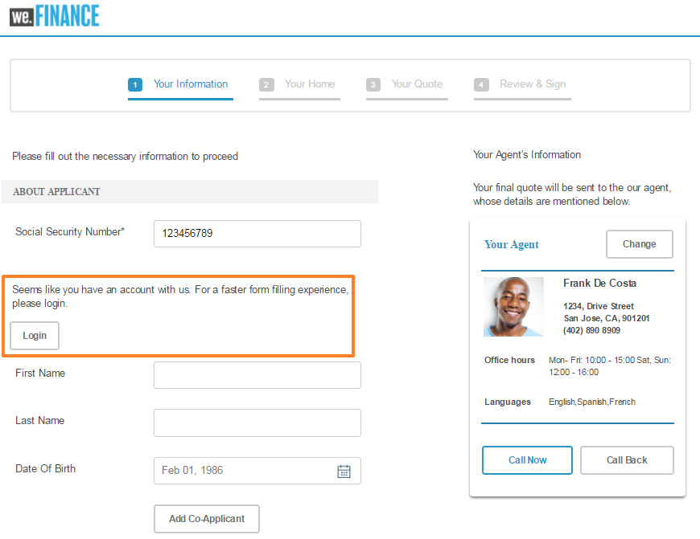
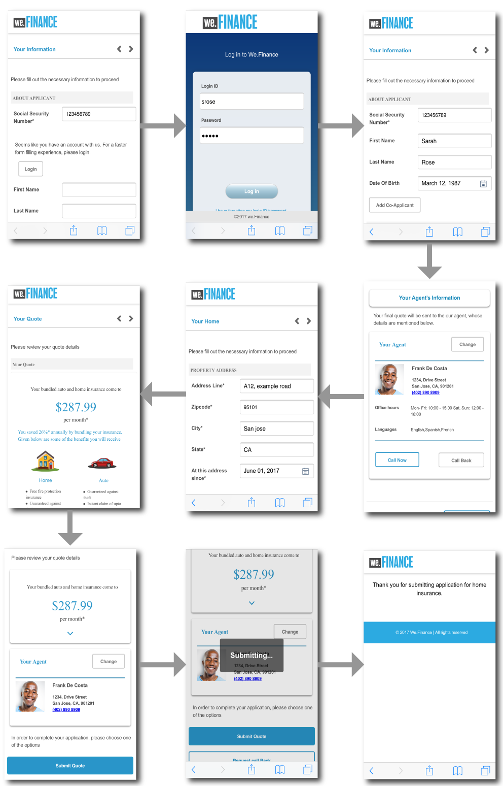
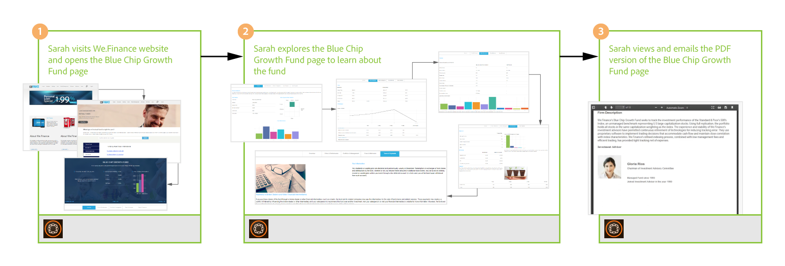
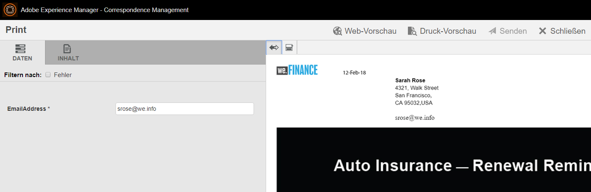

# Schrittweise Anleitung zur We.Finance-Referenz-Website {#we-finance-reference-site-walkthrough}

>[!CAUTION]
>
>AEM 6.4 hat das Ende der erweiterten Unterstützung erreicht und diese Dokumentation wird nicht mehr aktualisiert. Weitere Informationen finden Sie in unserer [technische Unterstützung](https://helpx.adobe.com/de/support/programs/eol-matrix.html). Unterstützte Versionen suchen [here](https://experienceleague.adobe.com/docs/?lang=de).

## Voraussetzungen {#pre-requisites}

Richten Sie die Referenz-Sites wie unter [Einrichten und Konfigurieren von AEM Forms-Referenz-Sites](/help/forms/using/setup-reference-sites.md).

## Szenarien für die We.Finance-Referenz-Site {#we-finance-reference-site-scenarios}

We.Finance ist ein führendes Unternehmen im Bereich Finanzdienstleistungen, das umfassende und personalisierte Finanzlösungen anbietet, die den Anforderungen verschiedener Kundenprofile gerecht werden. Sie bieten Kreditkarten, Hypotheken und Hausversicherungen an.

Ihr Ziel ist es, bestehende und potenzielle Kunden auf ihrem bevorzugten Gerät zu erreichen, die Vorteile ihrer Dienste zu erläutern und ihnen bei der Anmeldung bei ihren Diensten zu helfen. Darüber hinaus suchen sie nach weiteren Finanzprodukten wie Add-On-Karten, die für Kunden interessant sein könnten.

Lesen Sie weiter, um detaillierte exemplarische Vorgehensweisen zu We.Finance-Anwendungsfällen zu erhalten und zu verstehen, wie AEM Forms Finanzunternehmen dabei unterstützt, ihre Ziele zu erreichen. Die folgenden exemplarischen Vorgehensweisen werden behandelt:

* [Anleitung zum Kreditkartenantrag](#credit-card-application-walkthrough)
* [Anleitung zum Hypothekenantrag](#home-mortgage-application-walkthrough)
* [Anleitung zur Hypothekenanwendung mit Microsoft Dynamics](#home-mortgage-application-walkthrough-with-microsoft-dynamics)
* [Anleitung zum Antrag auf Hausversicherungen](#home-insurance-application-walkthrough)
* [Anleitung zum Vermögensmanagement](#wealthmanagementwalkthrough)
* [Anleitung zur Anwendung für automatische Versicherung](#autoinsuranceapplicationwalkthrough)

## Anleitung zum Kreditkartenantrag {#credit-card-application-walkthrough}

Das Szenario der We.Finance-Kreditkartenanwendung umfasst die folgenden Personen:

* Sarah Rose, We.Finance-Kunde
* Gloria Rios, Leiterin der Kreditkarte und Hypothek, We.Finance

Die folgende Infografik zeigt den schrittweisen Workflow des Kreditkartenantrags.

Sehen wir uns das Referenz-Website-Szenario im Detail an, um zu verstehen, wie die AEM Forms We.Finance dabei hilft, ihre Ziele zu erreichen.

### Sarah erhält einen Newsletter von We.Finance und beantragt eine Kreditkarte {#sarah-receives-a-newsletter-from-we-finance-and-applies-for-a-credit-card}

Sarah Rose ist eine bestehende We.Finance-Kundin. Sie erhält einen Newsletter von We.Finance über neue Kreditkarten. Sie findet die Angebote aufregend und beschließt, eine Kreditkarte zu beantragen. Sie klickt im Newsletter auf die Schaltfläche Jetzt beantragen , wodurch sie zum Kreditkartenantrag im We.Finance-Portal gelangt.

#### Funktionsweise {#how-it-works}

Der an Sarah gesendete Newsletter ist eine benutzerdefinierte Implementierung, bei der eine E-Mail an die angegebene E-Mail-ID Trigger wird. Die Schaltfläche Jetzt beantragen in der E-Mail ist mit dem Kreditkartenantrag verknüpft, der ein adaptives Formular in einer Veröffentlichungsinstanz ist.

#### Sehen Sie selbst {#see-it-yourself}

Öffnen Sie die folgende URL in der Veröffentlichungsinstanz, um eine Newsletter-E-Mail Trigger. Stellen Sie sicher, dass Sie `[emailID]` mit einem gültigen E-Mail-Konto, um den Newsletter zu erhalten. Öffnen Sie den Newsletter und klicken Sie auf **[!UICONTROL Jetzt anwenden]** , um zum Kreditkartenantrag zu gelangen.

`https://[publishServer]:[publsihPort]/content/campaigns/we-finance/start.html?app=cc&email=[emailID]&givenName=Sarah&familyName=Rose`

### Sarah findet das Angebot interessant und beschließt, einen Antrag zu stellen {#sarah-finds-the-offer-interesting-and-chooses-to-apply}

Sarah beschließt, sich um die Kreditkarte zu bewerben und tippt **[!UICONTROL Jetzt anwenden]** in der E-Mail. Sarah wird zum Kreditkartenantrag im We.Finance-Portal geleitet. Das Antragsformular ist in Abschnitte mit einem Kartenlayout unterteilt.

Sarah wählt eine Kreditkarte aus den verfügbaren Optionen aus und klickt auf **[!UICONTROL Weiter]**.

Auf der Seite &quot;Persönliche Informationen&quot;erhält Sarah, da sie ihre Sozialversicherungsnummer angibt, eine Aufforderung, sich mit ihren Anmeldeinformationen anzumelden.

Sarah ist eine bestehende We.Finance-Kundin. Sie meldet sich mit ihren Anmeldeinformationen für das We.Finance-Konto an und ihre persönlichen Daten werden automatisch im Formular ausgefüllt. Sarah füllt weiterhin das Antragsformular aus. Dann erscheint eine Erinnerung an ein Treffen, an dem sie teilnehmen muss. Sie klickt **[!UICONTROL Fortschritt speichern]** auf dem Antragsformular. Es speichert alle Informationen, die Sarah bisher ausgefüllt hat, und es wird ein Dialogfeld angezeigt, in dem bestätigt wird, ob sie eine E-Mail mit einer Verknüpfung zu ihrem Antragsentwurf erhalten möchte, die später abgeschlossen werden kann.

Sarah klickt **[!UICONTROL E-Mail senden]**. Sie erhält eine E-Mail mit einem Link zur Wiederaufnahme des Kreditkartenantrags.

<!--Theses sections used to be an accordion until converted to straight Markdown. When accordions are enabled, revert-->

### Sarah greift von ihrem Mobilgerät aus auf den Kreditkartenantrag zu {#a-sarah-access}

Wenn Sarah von ihrem Mobilgerät aus auf den Kreditkartenantrag zugreift, wird der responsive Antrag in einer für Mobilgeräte optimierten Ansicht geöffnet. In dieser Ansicht wird das Antragsformular jeweils als ein Abschnitt gerendert. Sarah kann Informationen progressiv anzeigen und bereitstellen, während sie durch die Anwendung navigiert.

### Funktionsweise {#a-how-it-works}

Die **[!UICONTROL Jetzt anwenden]** -Schaltfläche leitet Sarah zum Kreditkartenantrag weiter. Der Antrag ist ein adaptives Formular, das Sie in den Authoring-Instanzen unter `https://[host]:[Port]/editor.html/content/forms/af/we-finance/cc-app.html`.

Einige der wichtigsten Funktionen, die Sie im adaptiven Formular überprüfen können, sind:

* Sie basiert auf einem XSD-Schema.
* Es wird mit We Finance-Design A für die Formatierung und We.Finance-Vorlage für das Layout erstellt. Außerdem wird Layout ohne Bedienfeldtitel im Formular-Kopfzeilenlayout für die mobile Navigation verwendet. Es zeigt ein progressives Layout für Mobilgeräte an, wenn es von einem Mobilgerät aus geöffnet wird. Sie können die Vorlage unter `https://[host]:[Port]/libs/wcm/core/content/sites/templates.html/conf/we-finance` und das Thema unter `https://[host]:[Port]/editor.html/content/dam/formsanddocuments-themes/we-finance/we-finance-theme-a/jcr:content`.
* Es enthält adaptive Formularregeln zum Aufrufen von Formulardatenmodelldiensten, um Benutzerdetails des angemeldeten Benutzers vorab auszufüllen. Es ruft auch Dienste auf, um Informationen vorab mit der Sozialversicherungsnummer oder der E-Mail-Adresse auszufüllen, die im Formular angegeben ist. Sie können die Formulardatenmodelle und ihre Dienste unter `https://[host]:[Port]/aem/forms.html/content/dam/formsanddocuments-fdm`.
* Es verwendet verschiedene adaptive Formularkomponenten, um Eingaben zu erfassen und sich an Benutzerantworten anzupassen. Es verwendet auch Komponenten wie E-Mail, die HTML5-Eingabetypen unterstützen.
* Es verwendet die Signaturschritt-Komponente, um das ausgefüllte Formular anzuzeigen, und ermöglicht eine elektronische Signatur im Formular.
* Die Schaltfläche Fortschritt speichern generiert eine eindeutige ID für den Benutzer und speichert den teilweise ausgefüllten Antrag als Entwurf in einem Knoten in AEM Repository. Außerdem wird ein Dialogfeld angezeigt, in dem Sie nach der Berechtigung zum Senden einer E-Mail mit einem Link zu dem Knoten suchen, der den Antragsentwurf enthält. Über die Schaltfläche E-Mail senden im Bestätigungsdialogfeld wird eine E-Mail mit einem Link zu dem Knoten Trigger, der den Entwurf enthält.
* Es verwendet die Übermittlungsaktion &quot;AEM Workflow aufrufen&quot;, um den Kreditkartengenehmigungs-Workflow Trigger. Sie können den in diesem Formular verwendeten Workflow unter `https://[host]:[Port]/editor.html/conf/global/settings/workflow/models/we-finance-credit-card-workflow.html`

Es wird empfohlen, das Formular zu überprüfen, um das Schema, die Komponenten, Regeln, Formulardatenmodelle, den Arbeitsablauf für Formulare und die Übermittlungsaktion zu verstehen, die zum Erstellen des Formulars verwendet werden.

Weitere Informationen zu den Funktionen, die im adaptiven Formular des Kreditkartenantrags verwendet werden, finden Sie in der folgenden Dokumentation:

* [Einführung in das Authoring adaptiver Formulare](/help/forms/using/introduction-forms-authoring.md)
* [Adaptive Formulare mithilfe des XML-Schemas erstellen](/help/forms/using/adaptive-form-xml-schema-form-model.md)
* [Regeleditor](/help/forms/using/rule-editor.md)
* [Designs](/help/forms/using/themes.md)
* [-Datenintegration](/help/forms/using/data-integration.md)
* [Verwenden von Acrobat Sign in adaptiven Formularen](/help/forms/using/working-with-adobe-sign.md)
* [Formularzentrierte Workflows in OSGi](/help/forms/using/aem-forms-workflow.md)

### Sehen Sie selbst {#a-see-it-yourself}

Wenn Sie als Sarah Rose angemeldet sind, klicken Sie auf die **[!UICONTROL Jetzt anwenden]** auf dem Kreditkartenantrag. Füllen Sie einige Details aus, sehen Sie sich verschiedene adaptive Formularkomponenten an und klicken Sie auf **[!UICONTROL Fortschritt speichern]** um eine E-Mail mit einer **[!UICONTROL Fortsetzen]** -Schaltfläche, die mit dem Antragsentwurf verknüpft ist. Stellen Sie sicher, dass Sie Ihre E-Mail-ID im Antragsformular angeben, um die E-Mail zu erhalten.

Lesen Sie das We.Finance-Design, das unter folgender Adresse verfügbar ist:

`https://<host>:<AuthorPort>/editor.html/content/dam/formsanddocuments-themes/we-Finance/we-Finance-Theme-A/jcr:content`

Sie können die We.Finance-Vorlage unter folgender Adresse einsehen:

`https://<host>:<AuthorPort>/editor.html/conf/we-finance/settings/wcm/templates/we-finance-template/structure.html`

### Sarah setzt den Antrag fort und sendet ihn {#sarah-resumes-and-submits-the-application}

Sarah kommt später zurück und findet eine E-Mail von We.Finance. Sie klickt auf die **[!UICONTROL Fortsetzen]** in der E-Mail, über die sie zum Antragsentwurf für Kreditkarten gelangt. Die Informationen, die sie zuvor eingegeben hat, sind bereits vorausgefüllt. Sie füllt das verbleibende Antragsformular aus, unterzeichnet den Antrag und sendet ihn.

Alternativ kann sie auf ihren Antragsentwurf unter **[!UICONTROL My Forms]** auf der We.Finance-Homepage.

#### Funktionsweise {#how-it-works-1}

Über die Schaltfläche Fortsetzen in der E-Mail wird Sarah zu dem Knoten weitergeleitet, der ihren Antragsentwurf enthält.

#### Sehen Sie selbst {#see-it-yourself-1}

Sie müssen eine E-Mail mit einem Link zum Antragsentwurf in Ihrer E-Mail-ID erhalten haben, die Sie beim Ausfüllen des Antragsformulars angegeben haben. Füllen Sie die restlichen Abschnitte des Antrags aus und senden Sie ihn.

### We.Finance empfängt und genehmigt den Antrag {#approving-the-application}

We.Finance erhält den von Sarah gesendeten Kreditkartenantrag. Gloria Rios wird eine Aufgabe zugewiesen. Sie überprüft die Aufgabe in ihrem AEM Posteingang und genehmigt sie.

#### Funktionsweise {#how-it-works-2}

Wenn Sarah den Kreditkartenantrag ausfüllt und einreicht, werden ein Forms Workflow-Trigger und eine Aufgabe in Glorias AEM Posteingang erstellt.

AEM Forms on OSGi bietet formularzentrierte Workflows, mit denen Sie adaptive formularbasierte Workflows erstellen können. Diese Workflows können für Überprüfungen und Genehmigungen, Geschäftsprozessabläufe, den Start von Document Services, die Integration in den Acrobat Sign-Signatur-Workflow usw. verwendet werden. Weitere Informationen finden Sie unter [Formularzentrierte Workflows in OSGi](/help/forms/using/aem-forms-workflow.md).

Die folgende Abbildung zeigt den AEM Workflow, der den Kreditkartenantrag verarbeitet und eine PDF-Ausgabe des Antrags generiert.

#### Sehen Sie selbst {#see-it-yourself-2}

Sie können AEM Posteingang für die Site &quot;we.finance&quot;unter https://&lt;*hostname*>:&lt;*PublishPort*>/content/we-finance/global/en.html. Tippen Sie auf der Seite auf **[!UICONTROL Anmelden]**, wählen Sie die **[!UICONTROL Als Vertreter anmelden]** Kontrollkästchen aktivieren, melden Sie sich mit `grios/password` als Benutzernamen/Kennwort für Gloria Rios und genehmigen Sie den Kreditkartenantrag. Weitere Informationen zur Verwendung des AEM-Posteingangs für formularzentrierte Workflow-Aufgaben finden Sie unter [Verwalten von Formularanwendungen und Aufgaben im AEM-Posteingang](/help/forms/using/manage-applications-inbox.md).

Wenn Sie den Antrag genehmigen, erhält Sarah eine E-Mail mit dem Begrüßungs-Kit.

### Sarah erhält das Begrüßungs-Kit und beantragt eine Zusatzkarte {#sarah-receives-the-welcome-kit-and-applies-for-an-add-on-card}

Wenn Sarahs Kreditkartenantrag genehmigt wird, erhält sie eine E-Mail mit einem Link zum Begrüßungs-Kit. Sie öffnet das Begrüßungs-Kit, das Angaben zu ihrem Kreditkartenkonto enthält. Das Begrüßungs-Kit enthält auch für Sarah personalisierte Werbeangebote. Während sie nach unten scrollt, enthält das Begrüßungs-Kit ein eingebettetes Formular, um eine Zusatzkarte zu beantragen. Sarah füllt schnell die erforderlichen Informationen aus dem Begrüßungs-Kit aus und beantragt die Zusatzkarte. Ein Bestätigungsdialogfeld für den Zusatzkartenantrag wird angezeigt.

Das Begrüßungs-Kit ist für Sarah personalisiert und zeigt Informationen an, die für sie relevant sind. Es bietet ihr die Möglichkeit, eine PDF-Version des Begrüßungs-Kits herunterzuladen.

Das Begrüßungs-Kit enthält ein weiteres Antragsformular, das Sarah ausfüllen und übermitteln kann, um eine Zusatzkarte aus dem Begrüßungs-Kit zu beantragen, ohne das We.Finance-Portal zu besuchen.

#### Funktionsweise {#how-it-works-3}

Das Begrüßungs-Kit ist eine interaktive Kommunikation, die im `cq-we-finance-content-pkg.zip` Paket. Die interaktiven Karten in der Desktop-Version, auf denen die Vorteile der Kreditkarte im Begrüßungs-Kit dargestellt werden, sind ein benutzerdefiniertes Layout, das mithilfe des Standardkartenlayouts eines Dokumentfragments erstellt wird.

Der Zusatzkartenantrag ist ein eingebettetes adaptives Formular in der interaktiven Kommunikation des Begrüßungs-Kits.

#### Sehen Sie selbst {#see-it-yourself-3}

Klicken Sie auf **[!UICONTROL Fortsetzen]** in der E-Mail, die Sie im vorherigen Schritt erhalten haben. Er öffnet den Antragsentwurf. Füllen Sie alle Details aus und senden Sie den Antrag. Sie erhalten dann ein Begrüßungs-Kit. Prüfen Sie das Begrüßungs-Kit.

Sie können das Begrüßungs-Kit auch unter der folgenden URL anzeigen:

https://&lt;*Host*>:&lt;*port*>/content/aemforms-refsite/doclink.html?document=/content/forms/af/we-finance/credit-card/creditcardwelcomekit&amp;customerId=197&amp;channel=web

Sie können darauf in Autoren- und Veröffentlichungsinstanzen zugreifen.

### Sarah erhält einen Kreditkartenauszug {#sarah-receives-a-credit-card-statement}

Als Sarah beginnt, die Kreditkarte zu verwenden, erhält sie eine weitere E-Mail von We.Finance, die ihren Kreditkartenauszug enthält. Die folgenden Abbildungen zeigen die E-Mail mit einem Link zum Kreditkartenauszug auf einem Mobilgerät.

Sarah klickt in der E-Mail auf &quot;Auszug anzeigen&quot;, um den Kreditkartenauszug anzuzeigen. Die Anweisung ist eine interaktive Kommunikation. Es verfügt sowohl über Web- als auch über Print-Versionen (PDF). Die Anweisung wird in das Forms-Datenmodell integriert, um kundenspezifische Daten aus der Datenbank abzurufen. Der interaktive Auszug besteht aus verschiedenen Elementen:

* Anweisungszusammenfassung
* Detaillierter Ausgabenbericht
* Grafische Ausgabenanalyse
* Option zur Zahlung des fälligen Betrags innerhalb des Auszugs
* Zahlungsbeleg herunterladen

Sarah muss nicht zum Portal gehen oder in ihren E-Mails nach einer PDF-Version des Kreditkartenauszugs suchen, um die Offline-Archivierung durchzuführen. Sie klickt einfach auf die Download-Anweisung, um eine PDF-Version der Anweisung herunterzuladen.

Die detaillierte Anweisung wird in einer responsiven Tabelle dargestellt. Der Auszug bietet auch die Möglichkeit, einen Teil oder den gesamten fälligen Betrag innerhalb des Auszugs zu bezahlen.

Sarah plant die Zahlung innerhalb des Auszugs. Sarah kann auch die Flexi Pay-Option verwenden, um die Zahlung in gleiche Teile zu unterteilen.

#### Funktionsweise {#how-it-works-4}

Der Kreditkartenauszug ist eine interaktive Kommunikation. Die detaillierte Ausgabentabelle im Auszug ist eine responsive Tabelle. Die Grafik zur Ausgabenanalyse ist eine Diagrammkomponente, liest die Ausgabentabelle und generiert das Kreisdiagramm.

#### Sehen Sie selbst {#see-it-yourself-4}

Sie können den interaktiven Kreditkartenauszug unter der folgenden URL einsehen:

https://&lt;*hostname*>:&lt;*port*>/content/aemforms-refsite/doclink.html?document=/content/forms/af/we-finance/credit-card/credit-card-statement&amp;customerId=197&amp;channel=web

Sie können darauf in Autoren- und Veröffentlichungsinstanzen zugreifen.

Der Kreditkartenauszug zeigt Werbeangebote am Ende des Auszugs an. Sie können Adobe Target in die interaktive Kommunikation mit AEM Forms integrieren, um auf der Grundlage bestimmter Kundensegmente zielgerichtete Werbeangebote bereitzustellen. Informationen zum Konfigurieren der interaktiven Kommunikation für die Verwendung von Adobe Target für benutzerdefinierte und zielgerichtete Angebote finden Sie unter [Erstellen zielgerichteter Erlebnisse](/help/forms/using/experience-targeting-forms.md).

### We.Finance analysiert die Leistung des Kreditkartenantrags {#we-finance-analyzes-the-performance-of-the-credit-card-application}

We.Finance überprüft von Zeit zu Zeit die Leistung seines Kreditkartenantrags, um nach Problemen zu suchen, mit denen Kunden konfrontiert sein könnten. Sie verwenden diese Analyse, um fundierte Entscheidungen über die Änderungen zu treffen, die in der Kreditkartenanwendung erforderlich sind, um das Benutzererlebnis zu verbessern, die Abbruchrate von Formularen zu reduzieren und damit die Konvertierung zu verbessern. Sie nutzen die Integration von AEM Forms mit Adobe Analytics für ihre Analyse. Die folgende Abbildung zeigt ihr Analyse-Dashboard.

Weitere Informationen zur Interpretation des Analyse-Dashboards finden Sie unter [Anzeigen und Verstehen der Analyseberichte in AEM Forms](/help/forms/using/view-understand-aem-forms-analytics-reports.md).

#### Funktionsweise {#how-it-works-5}

Die Leistungsmetriken für das Kreditkartenantragsformular werden mit Adobe Analytics verfolgt. Weitere Informationen zum Konfigurieren von Adobe Analytics und zum Anzeigen von Berichten finden Sie unter [Konfigurieren der Analyse für Formulare und Dokumente](/help/forms/using/configure-analytics-forms-documents.md).

#### Sehen Sie selbst {#see-it-yourself-br}

Damit Sie den Analysebericht anzeigen und untersuchen können, stellen wir Seed-Daten für den Kreditkartenantrag auf der Referenz-Website bereit. Bevor Sie Seed-Daten verwenden, lesen Sie [Konfigurieren von Analytics](/help/forms/using/setup-reference-sites.md#configureanalytics). Führen Sie die folgenden Schritte in der Autoreninstanz aus, um den Bericht mit den Seed-Daten anzuzeigen:

1. Navigieren Sie zu **[!UICONTROL Forms und Dokumente]** UI unter https://&lt;*hostname*>:&lt;*AuthorPort*>/aem/forms.html/content/dam/formsanddocuments.

1. Klicken Sie auf , um die **[!UICONTROL We.Finance]** Ordner.
1. Auswählen **[!UICONTROL Kreditkartenantrag]** adaptives Formular und klicken Sie dann in der Symbolleiste auf **[!UICONTROL Analytics aktivieren]**.

1. Wählen Sie das adaptive Formular erneut aus und klicken Sie auf **[!UICONTROL Analytics-Bericht]** in der Symbolleiste, um den Bericht zu erstellen. Zunächst wird ein leerer Bericht angezeigt.

So generieren Sie einen Analysebericht mit Seed-Daten:

1. Geben Sie im Adressbrowser von CRXDE Lite Folgendes ein: `/apps/we-finance/demo-artifacts/analyticsTestData/Credit card Analytics Test Data`
1. Die Testdaten werden in der Ordnerstruktur auf der linken Seite ausgewählt.
1. Doppelklicken Sie auf die ausgewählte Datei, um ihren Inhalt im rechten Seitenbereich zu öffnen.
1. Kopieren Sie den gesamten Inhalt der Seed-Datendatei.
1. Navigieren Sie in CRXDE zu: `/content/dam/formsanddocuments/we-finance/cc-app/jcr:content/analyticsdatanode/lastsevendays`
1. Im **[!UICONTROL analyticsdata]** Feld unter **[!UICONTROL Eigenschaften]**, fügen Sie den kopierten Inhalt der Seed-Datendatei ein.

1. Auswählen **Kreditkartenantrag** adaptives Formular und klicken Sie auf **[!UICONTROL Analytics-Bericht]** in der Symbolleiste, um den Bericht mit Seed-Daten zu generieren.

**A/B-Tests des Kreditkartenantrags**

Zusätzlich zur Analyse und kontinuierlichen Verbesserung der Kreditkartenanwendung nutzt We.Finance die Integration von AEM Forms mit Target, um A/B-Tests zu erstellen. Dadurch können sie verschiedene Erlebnisse im Kreditkartenantragsformular bereitstellen und das Erlebnis identifizieren, das zu einer besseren Konversionsrate in Bezug auf das Ausfüllen und Übermitteln von Formularen führt.

Informationen zum Konfigurieren von Target auf dem AEM Forms-Server finden Sie unter [Target einrichten und in AEM Forms integrieren](/help/forms/using/ab-testing-adaptive-forms.md#set%20up%20and%20integrate%20target%20in%20aem%20forms).

Führen Sie die folgenden Schritte aus, um die Erstellung eines A/B-Tests für das We.Finance-Kreditkartenantragsformular zu erleben:

1. Navigieren Sie zu **[!UICONTROL Forms und Dokumente]** https://&lt;*hostname*>:&lt;*AuthorPort*>/aem/forms.html/content/dam/formsanddocuments.

1. Klicken Sie auf , um die **[!UICONTROL We.Finance]** Ordner.
1. Auswählen **[!UICONTROL Kreditkartenantrag]** adaptives Formular.
1. Klicken **[!UICONTROL Mehr]** in der Symbolleiste und wählen Sie **[!UICONTROL Konfigurieren von A/B-Tests]**. Die Seite A/B-Tests konfigurieren wird geöffnet.

1. Geben Sie eine **[!UICONTROL Aktivitätsname]**.
1. Wählen Sie in der Dropdown-Liste „Zielgruppe“ die Zielgruppe, deren Reaktionen auf verschiedene Varianten des Formulars Sie testen möchten. Dies könnten beispielsweise **Besucher, die Chrome verwenden** sein.
1. Geben Sie in den Feldern für **[!UICONTROL Erlebnisverteilung]** für die Erlebnisvarianten A und B deren Verteilung auf die Gesamtzielgruppe in Prozent an. Wenn Sie beispielsweise 40 bzw. 60 für Erlebnis A bzw. B angeben, wird Erlebnis A für 40 % der Zielgruppe und Erlebnis B für die restlichen 60 % bereitgestellt.
1. Klicken Sie auf **Konfigurieren**. Es wird ein Dialogfeld angezeigt, in dem die Erstellung des A/B-Tests bestätigt wird.
1. Klicken Sie auf **Fertig**.
1. Wählen Sie die **Kreditkartenantrag** Formular und klicken Sie auf **Bearbeiten**. Es bietet die Möglichkeit, eines der Erlebnisse zu öffnen. Klicken **Erlebnis B**. Das Formular wird im Bearbeitungsmodus geöffnet.

1. Ändern Sie das Formular nach Bedarf, um ein anderes Erlebnis als das Standarderlebnis A zu erstellen.
1. Navigieren Sie zur Benutzeroberfläche &quot;Forms und Dokumente&quot;, wählen Sie das Formular aus und klicken Sie auf **Mehr** und wählen Sie **A/B-Tests starten**.

1. Öffnen Sie jetzt das Formular mehrmals im Chrome-Browser mit der folgenden URL:

   `https://[hostname]:[port]/content/dam/formsanddocuments/we-finance/cc-app/jcr:content?wcmmode=disabled`

   >[!NOTE]
   >
   >Entfernen Sie das Cookie mit dem Namen **mbox** aus der Cookie-Persistenz des Browsers vor dem nächsten Öffnen des Formulars. Sie sehen das Erlebnis A und B des Formulars zufällig.

1. Wählen Sie das Formular aus, klicken Sie auf **Mehr** und klicken Sie auf **A/B-Testbericht**. Da Sie gerade mit dem Testen begonnen haben, finden Sie nicht viele Daten in dem Bericht. Stellen wir nun einige Seed-Daten bereit, um zu sehen, wie der A/B-Testbericht aussieht.

1. Öffnen Sie die CRXDE Lite und erstellen Sie eine Sicherungskopie der folgenden Datei: /libs/fd/fmaddon/gui/components/admin/targetreport/clientlibs/targetreport/js/targetreport.js
1. Ersetzen der Definition der Funktion `onReportLoadSuccess` in der oben genannten Datei mit der Funktionsdefinition in der folgenden Datei: /apps/we-finance/demo-artifacts/targetreport.js

   **Hinweis:** Diese Änderungen dienen nur dem Zweck der Demo. Stellen Sie sicher, dass Sie den Dateiinhalt nach Abschluss dieses Verfahrens wiederherstellen.

1. Aktualisieren Sie den von Ihnen erstellten Bericht. Daraufhin wird Folgendes angezeigt. Überprüfen Sie das Berichts-Dashboard.

Um den A/B-Test zu beenden, klicken Sie auf **A/B-Test beenden** im Berichterstellungs-Dashboard. Zu diesem Zeitpunkt werden Sie in einem Dialogfeld aufgefordert, ein Erlebnis zu deklarieren. Wählen Sie einen Gewinner und bestätigen Sie, dass Sie den A/B-Test beenden möchten.
 

Wenn Sie Erlebnis A als Gewinner auswählen, wird der A/B-Test beendet und in Zukunft wird nur Erlebnis A für alle Zielgruppen, einschließlich Chrome, bereitgestellt.

## Anleitung zum Hypothekenantrag {#home-mortgage-application-walkthrough}

Das Hypothekenszenario We.Finance umfasst die folgenden Personen:

* Sarah Rose, We.Finance-Kunde
* Gloria Rios, Leiterin der Kreditkarte und Hypothek, We.Finance
* John Doe, Kundenbetreuer, We.Finance

Die folgende Infografik zeigt den schrittweisen Arbeitsablauf eines Hypothekenantrags.

Sehen wir uns nun die Schritte im Referenz-Website-Szenario im Einzelnen an, um zu sehen, wie die AEM Forms We.Finance dabei unterstützt, ihre Ziele zu erreichen.

### Sarah besucht die We.Finance-Website und beantragt eine Hypothek {#sarah-visits-we-finance-website-and-applies-for-home-mortgage}

Sarah Rose plant, ein Haus zu kaufen und nach Hypothekenplänen zu suchen. Sie ist We.Finance-Kunde und besucht daher das We.Finance-Portal, um Hypothekenangebote zu erkunden. Sie geht in den Bereich Darlehen und findet einen Hypothekenrechner im Portal. Sie füllt die Details aus und klickt auf Meine Hypothek berechnen , wodurch ein Hypothekenplan zurückgegeben wird.

 
**Abbildung:** *Hypothekenrechner*

**Abbildung:** *Ergebnis des Hypothekenrechners*

#### Funktionsweise {#how-it-works-6}

Der Hypothekenrechner auf der Kreditseite ist ein eingebettetes adaptives Formular auf der AEM Sites-Seite. Sie können die Seite Darlehen im Bearbeitungsmodus unter `https://[authorHost]:[authorPort]/editor.html/content/we-finance/global/en/loan-landing-page.html`.

Der eingebettete Hypothekenrechner, ein adaptives Formular, verwendet Regeln, um den EMI-Betrag anhand der in den Berechnungsfeldern angegebenen Kreditdetails zu berechnen. Sie können das adaptive Formular unter `https://[authorHost]:[authorPort]/editor.html/content/forms/af/we-finance/hm-calc.html` überprüfen.

#### Sehen Sie selbst {#see-it-yourself-5}

Gehen Sie zum We.Finance-Portal unter `https://<publishHost>:<publishPort>/content/we-finance/global/en.html` und klicken Sie auf **[!UICONTROL Darlehen]**. Geben Sie Details in den Hypothekenrechner ein und sehen Sie sich die Ergebnisse an.

### Sarah findet das Angebot interessant und beschließt, einen Antrag zu stellen {#sarah-finds-the-offer-interesting-and-chooses-to-apply-1}

Sarah beschließt, einen Antrag auf Hypothek und Klicks zu stellen **[!UICONTROL Jetzt anwenden]** auf Hypothekenrechner. Dadurch wird der Antrag auf Hypothekendarlehen geöffnet.

Wenn Sarah von ihrem Mobilgerät aus auf den Hypothekenantrag zugreift, wird das Antragsformular in einer Ansicht geöffnet, die für die Anzeige auf einem Mobilgerät optimiert ist. In dieser Ansicht zeigt das Antragsformular jeweils einen Abschnitt an. Sarah kann Informationen progressiv anzeigen und bereitstellen, während sie durch das Antragsformular navigiert.

Die folgenden Abbildungen zeigen den Workflow, während Sarah durch den Hypothekenantrag auf ihrem Mobilgerät navigiert.

Wenn Sarah klickt **Jetzt anwenden** von ihrem Desktop aus, wird das Hypothekenantragsformular wie folgt geöffnet. Die Informationen, die Sarah im Hypothekenrechner bereitgestellt hat, sind im Antragsformular vorausgefüllt. Sarah füllt die restlichen Details aus und klickt auf **Weiter**.

Basierend auf den Informationen, die Sarah in der Hypothekenrechnerin ausgefüllt hat, werden ihr einige Hypothekenpläne vorgelegt. Sie wählt den Plan aus, der ihren Anforderungen entspricht, und füllt den Antrag weiter aus. Sie unterschreibt und sendet den Antrag schließlich.

Der eingereichte Antrag wird zur Genehmigung an We.Finance gesendet.

#### Funktionsweise {#how-it-works-7}

Die **Jetzt anwenden** -Schaltfläche leitet Sarah zum Hypothekenantrag weiter. Der Antrag ist ein adaptives Formular, das Sie in den Authoring-Instanzen unter `https://[host]:[Port]/editor.html/content/forms/af/we-finance/hm-app.html`.

Einige der wichtigsten Funktionen, die Sie im adaptiven Formular überprüfen können, sind:

* Sie basiert auf einem XSD-Schema, `homeMortgageApplication.xsd`.
* Es wird mit We Finance-Design B für die Formatierung und We.Finance-Vorlage für das Layout erstellt. Außerdem wird Layout ohne Bedienfeldtitel im Formular-Kopfzeilenlayout für die mobile Navigation verwendet. Es zeigt ein progressives Layout für Mobilgeräte an, wenn es von einem Mobilgerät aus geöffnet wird. Sie können die Vorlage und das Design, das im adaptiven Formular verwendet wird, an den folgenden Stellen in Ihrer AEM-Autoreninstanz überprüfen:

   * `https://[host]:[Port]/libs/wcm/core/content/sites/templates.html/conf/we-finance`
   * `https://[host]:[Port]/editor.html/content/dam/formsanddocuments-themes/we-finance/we-finance-theme-b/jcr:content`

* Der erste Tab Erste Schritte im Programm ist ein dynamischer Hypothekenrechner, der Optionen basierend auf der Benutzerauswahl anzeigt. Beispielsweise unterscheiden sich die Felder und Werte für Kauf- und Refinanzierungsoptionen. Diese Funktion wird mithilfe von Regeln zum Ein- und Ausblenden erreicht. Wenn Sie auf Weiter klicken und die Registerkarte Pläne initialisiert wird, wird außerdem ein Webdienst aufgerufen, der in einem Formulardatenmodell konfiguriert ist, um Hypothekenpläne abzurufen und anzuzeigen. Sie können die Formulardatenmodelle und konfigurierten Dienste unter `https://[host]:[Port]/aem/forms.html/content/dam/formsanddocuments-fdm`.
* Es verwendet verschiedene adaptive Formularkomponenten, um Eingaben zu erfassen und sich an Benutzerantworten anzupassen. Es verwendet auch Komponenten wie E-Mail, die HTML5-Eingabetypen unterstützen.
* Es verwendet die Signaturschritt-Komponente, um das ausgefüllte Formular anzuzeigen, und ermöglicht eine elektronische Signatur im Formular.
* Es verwendet die Übermittlungsaktion &quot;AEM Workflow aufrufen&quot;, um den Workflow &quot;We Finance Home Mortgage AEM&quot;Trigger. Sie können den in diesem Formular verwendeten Workflow unter `https://[host]:[Port]/editor.html/conf/global/settings/workflow/models/we-finance-home-mortgage-workflow.html`

Es wird empfohlen, das Formular zu überprüfen, um das Schema, die Komponenten, Regeln, Formulardatenmodelle, den Arbeitsablauf für Formulare und die Übermittlungsaktion zu verstehen, die zum Erstellen des Formulars verwendet werden.

Weitere Informationen zu den im adaptiven Formular für Hypothekenanträge verwendeten Funktionen finden Sie in der folgenden Dokumentation:

* [Einführung in das Authoring adaptiver Formulare](/help/forms/using/introduction-forms-authoring.md)
* [Adaptive Formulare mithilfe des XML-Schemas erstellen](/help/forms/using/adaptive-form-xml-schema-form-model.md)
* [Regeleditor](/help/forms/using/rule-editor.md)
* [Designs](/help/forms/using/themes.md)
* [-Datenintegration](/help/forms/using/data-integration.md)
* [Verwenden von Acrobat Sign in adaptiven Formularen](/help/forms/using/working-with-adobe-sign.md)
* [Formularzentrierte Workflows in OSGi](/help/forms/using/aem-forms-workflow.md)

#### Sehen Sie selbst {#see-it-yourself-6}

Navigieren Sie zu `https://[server]:[port]/content/we-finance/global/en/all-forms.html` und klicken Sie auf **Jetzt anwenden** auf Hypothekenantrag. Füllen Sie die Details auf der Registerkarte Erste Schritte aus, probieren Sie verschiedene Optionen aus und senden Sie die Anwendung.

Stellen Sie sicher, dass Sie eine gültige E-Mail-ID in der Anwendung angeben, um eine Bestätigungs-E-Mail in Ihrem Posteingang zu erhalten.

### We.Finance erhält den Antrag {#approving_the_application-1}

We.Finance erhält den von Sarah eingereichten Hypothekenantrag. Gloria Rios wird die Aufgabe zugewiesen, den Antrag zu genehmigen oder abzulehnen. Sie prüft den Antrag und stellt fest, dass Sarahs Regierungskennung fehlt.

Gloria öffnet die Aufgabe, klickt auf &quot;Weitere Informationen benötigen&quot;und gibt einen Kommentar zu fehlender Regierungskennung ab.

Die Aufgabe wird nun John Doe zugewiesen, einem Kundenbetreuer bei We.Finance. Er öffnet die Aufgabe und prüft Glorias Kommentar. Er kontaktiert Sarah und bittet sie, eine Kopie ihrer Kennung zu schicken. Nachdem er eine Kopie der ID von Sarah erhalten hat, hängt er sie an die Aufgabe an und reicht den Antrag zur erneuten Bewertung ein.

Die Aufgabe wird Gloria neu zugewiesen. Sie prüft die beigefügte ID und genehmigt den Antrag.

#### Funktionsweise {#how-it-works-8}

Wenn Sarah den Hypothekenantrag ausfüllt und einreicht, werden ein Forms Workflow-Trigger und eine Aufgabe in Glorias AEM Posteingang erstellt. Während Gloria den Antrag prüft und weitere Informationen anfordert, wird die Aufgabe John Doe zugewiesen. Wenn John Doe die ID anhängt und den Antrag erneut sendet, wird sie Gloria zugewiesen. Dies wird im AEM Workflow definiert, der mit dem Hypothekenantrag verknüpft ist.

AEM Forms on OSGi bietet formularzentrierte Workflows, mit denen Sie adaptive formularbasierte Workflows erstellen können. Diese Workflows können für Überprüfungen und Genehmigungen, Geschäftsprozessabläufe, den Start von Document Services, die Integration in den Acrobat Sign-Signatur-Workflow usw. verwendet werden. Weitere Informationen finden Sie unter [Formularzentrierte Workflows in OSGi](/help/forms/using/aem-forms-workflow.md).

Die folgende Abbildung zeigt den mit dem Hypothekenantrag verknüpften AEM Workflow.

#### Sehen Sie selbst {#see-it-yourself-7}

Sie können auf den AEM-Posteingang unter https://&lt;***hostname***>:&lt;***AuthorPort***>/content/we-finance/global/en/login.html?resource=/aem/inbox.html. Melden Sie sich mit dem AEM-Posteingang an. `grios/password` als Benutzername/Kennwort für Gloria Rios und `jdoe/jdoe` für John Doe verwenden und den Workflow für Hypothekenanträge durchsuchen.

Weitere Informationen zur Verwendung des AEM-Posteingangs für formularzentrierte Workflow-Aufgaben finden Sie unter [Verwalten von Formularanwendungen und Aufgaben im AEM-Posteingang](/help/forms/using/manage-applications-inbox.md).

### Sarah erhält das Begrüßungs-Kit {#sarah-receives-the-welcome-kit}

Während Sarahs Hypothekenantrag genehmigt wird, erhält sie eine E-Mail mit einem Link zum Begrüßungs-Kit. Sie öffnet das Begrüßungs-Kit, das ein Karussell mit für Sarah personalisierten Werbeangeboten enthält.

Das Begrüßungs-Kit ist für Sarah personalisiert und zeigt Informationen an, die für sie relevant sind. Es bietet ihr die Möglichkeit, eine PDF-Version des Begrüßungs-Kits herunterzuladen. Mit der Pfeilschaltfläche am unteren Rand kann Sarah nach unten blättern und durch andere Abschnitte des Begrüßungs-Kits navigieren.

#### Funktionsweise {#how-it-works-9}

Das Begrüßungs-Kit ist eine interaktive Kommunikation, die im `cq-we-finance-content-pkg.zip` Paket. Die Werbeangebote im Begrüßungs-Kit werden vom Adobe Target-Server bereitgestellt. Die Angebote sind auf bestimmte Kundensegmente abgestimmt und auf diese ausgerichtet. Das Begrüßungs-Kit ruft Angebote von einem vorkonfigurierten Adobe Target-Server für ein Zielgruppensegment weiblicher Kunden ab.

Die interaktiven Karten in der Desktop-Version des Begrüßungs-Kits verwenden ein benutzerdefiniertes Layout, das mit dem Standardkartenlayout eines Dokumentfragments erstellt wurde.

#### Sehen Sie selbst {#see-it-yourself-8}

Wenn Sie beim Ausfüllen des Hypothekenantrags Ihre E-Mail-ID angegeben haben, sollten Sie eine E-Mail mit einem Link zum Begrüßungs-Kit erhalten haben. Markieren Sie Ihren Posteingang und überprüfen Sie das Begrüßungs-Kit.

Sie können ihn in AEM Veröffentlichungsinstanz unter der folgenden URL anzeigen:

`https://[host]:[port]/content/forms/af/we-finance/mortgage-loan-welcome-kit.html`

### Sarah erhält einen Kontoauszug {#sarah-receives-an-account-statement}

Da Sarah den Kredit in Anspruch nimmt und mit der Zahlung der Raten beginnt, erhält sie eine weitere E-Mail von We.Finance, die ihren monatlichen Kontoauszug enthält.

Sarah klickt in der E-Mail auf &quot;Auszug anzeigen&quot;, um den Hypothekenkontoauszug anzuzeigen. Der interaktive Auszug besteht aus verschiedenen Elementen:

* Anweisungszusammenfassung
* Anweisungsdetails

Die folgende Abbildung zeigt einen anderen Teil der Kontoanweisung auf dem Desktop.

Der detaillierte Auszug ist in einer responsiven Tabelle angeordnet und bietet die Möglichkeit, einen Teil oder den gesamten fälligen Betrag innerhalb des Auszugs zu zahlen.

#### Funktionsweise {#how-it-works-10}

Der Hypothekenauszug ist eine interaktive Kommunikation. Sie wird mithilfe des JSON-Stapelverarbeitungsprozesses generiert. Die detaillierte Ausgabentabelle im Auszug ist eine responsive Tabelle.

#### Sehen Sie selbst {#see-it-yourself-9}

Sie können den interaktiven Hypothekenkontoauszug unter folgender URL einsehen:

https://&lt;*hostname*>:&lt;*port*>/content/forms/af/we-finance/mortgage-account-statement.html?wcmmode=disabled

Sie können darauf in Autoren- und Veröffentlichungsinstanzen zugreifen.

### We.Finance analysiert die Leistung des Hypothekenantrags {#we-finance-analyzes-the-performance-of-the-mortgage-application}

We.Finance überprüft von Zeit zu Zeit die Leistung seines Hypothekenantrags, um festzustellen, ob Probleme auftreten, mit denen Kunden konfrontiert sein könnten. Sie verwenden diese Analyse, um fundierte Entscheidungen über die erforderlichen Änderungen im Hypothekenantrag zu treffen, um das Benutzererlebnis zu verbessern, die Abbruchrate von Formularen zu reduzieren und damit die Konversion zu verbessern. Sie nutzen die Integration von AEM Forms mit Adobe Analytics für ihre Analyse. Die folgende Abbildung zeigt ihr Analyse-Dashboard.

Weitere Informationen zur Interpretation des Analyse-Dashboards finden Sie unter [Anzeigen und Verstehen der Analyseberichte in AEM Forms](/help/forms/using/view-understand-aem-forms-analytics-reports.md).

#### Funktionsweise {#how-it-works-11}

Die Leistungsmetriken für das Hypothekenantragsformular werden mit Adobe Analytics verfolgt. Weitere Informationen zum Konfigurieren von Adobe Analytics und zum Anzeigen von Berichten finden Sie unter [Konfigurieren der Analyse für Formulare und Dokumente](/help/forms/using/configure-analytics-forms-documents.md).

#### Sehen Sie selbst {#see-it-yourself-br-1}

Damit Sie den Analysebericht anzeigen und untersuchen können, stellen wir Seed-Daten für den Hypothekenantrag auf der Referenz-Website bereit. Bevor Sie Seed-Daten verwenden, lesen Sie [Konfigurieren von Analytics](/help/forms/using/setup-reference-sites.md#configureanalytics). Führen Sie die folgenden Schritte in der Autoreninstanz aus, um den Bericht mit den Seed-Daten anzuzeigen:

1. Navigieren Sie zu **Forms und Dokumente** UI unter https://&lt;*hostname*>:&lt;*AuthorPort*>/aem/forms.html/content/dam/formsanddocuments.

1. Klicken Sie auf , um die **we-finance** Ordner.
1. Auswählen **[!UICONTROL Antrag auf Hypothek]** adaptives Formular und klicken Sie dann in der Symbolleiste auf **[!UICONTROL Analytics aktivieren]**.

1. Wählen Sie das Formular erneut aus und klicken Sie auf **[!UICONTROL Analytics-Bericht]** in der Symbolleiste, um den Bericht zu erstellen. Zunächst wird ein leerer Bericht angezeigt.

So generieren Sie einen Analysebericht mit Seed-Daten:

1. Geben Sie im Adressbrowser von CRXDE Lite Folgendes ein: `/apps/we-finance/demo-artifacts/analyticsTestData/HomeMortgageAnalyticsTestData`
1. Die Testdaten werden in der Ordnerstruktur auf der linken Seite ausgewählt.
1. Doppelklicken Sie auf die ausgewählte Datei, um den Inhalt im rechten Seitenbereich zu öffnen.
1. Kopieren Sie den gesamten Inhalt der Seed-Datendatei.
1. Navigieren Sie in CRXDE zu: `/content/dam/formsanddocuments/we-finance/hm-app/jcr:content/analyticsdatanode/lastsevendays`
1. Fügen Sie im Feld analyticsdata unter Eigenschaften den kopierten Inhalt der Seed-Datendatei ein.
1. Erstellen Sie nun den Analysebericht erneut für das Antragsformular für Hypothekendarlehen. Der Bericht wird mit Seed-Daten angezeigt.

**A/B-Tests des Hypothekenantrags**

Zusätzlich zur Analyse und kontinuierlichen Verbesserung der Hypothekenanwendung nutzt We.Finance die Integration von AEM Forms mit Target, um A/B-Tests zu erstellen. Dadurch können sie verschiedene Erlebnisse im Antragsformular bereitstellen und das Erlebnis identifizieren, das zu einer besseren Konversionsrate in Bezug auf das Ausfüllen und Übermitteln von Formularen führt.

Informationen zum Konfigurieren von Target auf dem AEM Forms-Server finden Sie unter [Target einrichten und in AEM Forms integrieren](/help/forms/using/ab-testing-adaptive-forms.md#set%20up%20and%20integrate%20target%20in%20aem%20forms).

Führen Sie die folgenden Schritte in der Autoreninstanz aus, um die Erstellung eines A/B-Tests für das We.Finance-Hypothekenantragsformular zu erleben:

1. Navigieren Sie zu **Forms und Dokumente** https://&lt;*hostname*>:&lt;*AuthorPort*>/aem/forms.html/content/dam/formsanddocuments.

1. Klicken Sie auf , um die **We.Finance** Ordner.
1. Auswählen **Antrag auf Hypothek** adaptives Formular.
1. Klicken **Mehr** in der Symbolleiste und wählen Sie **Konfigurieren von A/B-Tests**. Die Seite A/B-Tests konfigurieren wird geöffnet.

1. Geben Sie eine **Aktivitätsname**.
1. Wählen Sie in der Dropdown-Liste „Zielgruppe“ die Zielgruppe, deren Reaktionen auf verschiedene Varianten des Formulars Sie testen möchten. Dies könnten beispielsweise **Besucher, die Chrome verwenden** sein.
1. Geben Sie in den Feldern für **Erlebnisverteilung** für die Erlebnisvarianten A und B deren Verteilung auf die Gesamtzielgruppe in Prozent an. Wenn Sie beispielsweise 40 bzw. 60 für Erlebnis A bzw. B angeben, wird Erlebnis A für 40 % der Zielgruppe und Erlebnis B für die restlichen 60 % bereitgestellt.
1. Klicken Sie auf **Konfigurieren**. Es wird ein Dialogfeld angezeigt, in dem die Erstellung des A/B-Tests bestätigt wird.
1. Klicken Sie auf **Fertig**.
1. Wählen Sie die **Antrag auf Hypothek** adaptives Formular und klicken Sie auf **Bearbeiten**. Es bietet die Möglichkeit, eines der Erlebnisse zu öffnen. Klicken **Erlebnis B**. Das Formular wird im Bearbeitungsmodus geöffnet.

1. Ändern Sie das Formular nach Bedarf, um ein anderes Erlebnis als das Standarderlebnis A zu erstellen.
1. Navigieren Sie zur Benutzeroberfläche &quot;Forms und Dokumente&quot;, wählen Sie das Formular aus und klicken Sie auf **Mehr** und wählen Sie **A/B-Tests starten**.

1. Öffnen Sie jetzt das Formular mehrmals im Chrome-Browser mit der folgenden URL:

   `https://[hostname]:[port]/content/dam/formsanddocuments/we-finance/hm-app/jcr:content?wcmmode=disabled`

   >[!NOTE]
   >
   >Entfernen Sie das Cookie mit dem Namen **mbox** aus der Cookie-Persistenz des Browsers vor dem nächsten Öffnen des Formulars. Sie sehen das Erlebnis A und B des Formulars zufällig.

1. Wählen Sie das Formular aus, klicken Sie auf **Mehr** und klicken Sie auf **A/B-Testbericht**. Da Sie gerade mit dem Testen begonnen haben, finden Sie nicht viele Daten in dem Bericht. Stellen wir nun einige Seed-Daten bereit, um zu sehen, wie der A/B-Testbericht aussieht.

1. Öffnen Sie die CRXDE Lite und erstellen Sie eine Sicherungskopie der folgenden Datei: /libs/fd/fmaddon/gui/components/admin/targetreport/clientlibs/targetreport/js/targetreport.js
1. Ersetzen Sie die Definition der `onReportLoadSuccess` -Funktion in der oben genannten Datei mit der Funktionsdefinition in der folgenden Datei verwenden: /apps/we-finance/demo-artifacts/targetreport.js

   >[!NOTE]
   >
   >Diese Änderungen dienen nur dem Zweck der Demo. Stellen Sie sicher, dass Sie den Dateiinhalt nach Abschluss dieses Verfahrens wiederherstellen.

1. Aktualisieren Sie den von Ihnen erstellten Bericht. Daraufhin wird Folgendes angezeigt. Überprüfen Sie das Berichts-Dashboard.

Um den A/B-Test zu beenden, klicken Sie auf **A/B-Test beenden** im Berichterstellungs-Dashboard. Zu diesem Zeitpunkt werden Sie in einem Dialogfeld aufgefordert, ein Erlebnis zu deklarieren. Wählen Sie einen Gewinner und bestätigen Sie, dass Sie den A/B-Test beenden möchten.
 

Wenn Sie Erlebnis A als Gewinner auswählen, wird der A/B-Test beendet und in Zukunft wird nur Erlebnis A für alle Zielgruppen, einschließlich Chrome, bereitgestellt.

## Anleitung zur Hypothekenanwendung mit Microsoft Dynamics {#home-mortgage-application-walkthrough-with-microsoft-dynamics}

Das Szenario We.Finance-Hypothek mit Microsoft Dynamics umfasst die folgenden Personen:

* Sarah Rose, We.Finance-Kunde
* Der Administrator der Microsoft Dynamics-Instanz von We.Finance

Die Anleitung zur Antragstellung für Hypothekendarlehen mit Microsoft Dynamics zeigt, wie ein We.Finance-Kunde die Website verwenden kann, um eine Hypothek zu beantragen, wenn die Referenz-Website Microsoft Dynamics für die Datenintegration verwendet. Die exemplarische Vorgehensweise endet mit den Daten, die vom Benutzer ausgefüllt werden, der von Microsoft Dynamics empfangen wird. Bevor Sie mit diesem Szenario fortfahren, müssen Sie die [Microsoft Dynamics 365-Konfiguration für den Hypotheken-Workflow der We.Finance-Referenz-Website](/help/forms/using/ms-dynamics-configuration-home-mortgage.md).

### Sarah besucht die We.Finance-Website und beantragt eine Hypothek {#sarah-visits-we-finance-website-and-applies-for-home-mortgage-1}

Sarah Rose plant, ein Haus zu kaufen und nach Hypothekenplänen zu suchen. Sie ist We.Finance-Kunde und besucht daher das We.Finance-Portal, um Hypothekenangebote zu erkunden. Sie geht in den Bereich Darlehen und findet einen Hypothekenrechner im Portal. Sie füllt die Details aus und klickt auf Meine Hypothek berechnen , wodurch ein Hypothekenplan zurückgegeben wird.

 
**Abbildung:** *Hypothekenrechner*

**Abbildung:** *Ergebnis des Hypothekenrechners*

#### Funktionsweise {#how-it-works-12}

Der Hypothekenrechner auf der Kreditseite ist ein eingebettetes adaptives Formular auf der AEM Sites-Seite. Sie können die Seite Darlehen im Bearbeitungsmodus unter `https://[authorHost]:[authorPort]/editor.html/content/we-finance/global/en/loan-landing-page.html`.

Der eingebettete Hypothekenrechner, ein adaptives Formular, verwendet Regeln, um den EMI-Betrag anhand der in den Berechnungsfeldern angegebenen Kreditdetails zu berechnen. Sie können das adaptive Formular unter `https://[authorHost]:[authorPort]/editor.html/content/forms/af/we-finance/ms-dynamics/home-mortgage-calculator.html` überprüfen.

#### Sehen Sie selbst {#see-it-yourself-10}

Gehen Sie zum We.Finance-Portal unter `https://<publishHost>:<publishPort>/content/we-finance/global/en.html` und klicken Sie auf **[!UICONTROL Darlehen]**. Geben Sie Details in den Hypothekenrechner ein und sehen Sie sich die Ergebnisse an.

### Sarah findet das Angebot interessant und beschließt, einen Antrag zu stellen {#sarah-finds-the-offer-interesting-and-chooses-to-apply-2}

Sarah beschließt, einen Antrag auf Hypothek und Klicks zu stellen **[!UICONTROL Jetzt anwenden]** auf Hypothekenrechner. Dadurch wird der Antrag auf Hypothekendarlehen geöffnet.

Wenn Sarah von ihrem Mobilgerät aus auf den Hypothekenantrag zugreift, wird das Antragsformular in einer Ansicht geöffnet, die für die Anzeige auf einem Mobilgerät optimiert ist. In dieser Ansicht zeigt das Antragsformular jeweils einen Abschnitt an. Sarah kann Informationen progressiv anzeigen und bereitstellen, während sie durch das Antragsformular navigiert.

Die folgenden Abbildungen zeigen den Workflow, während Sarah durch den Hypothekenantrag auf ihrem Mobilgerät navigiert.

Wenn Sarah klickt **Jetzt anwenden** von ihrem Desktop aus, wird das Hypothekenantragsformular wie folgt geöffnet. Die Informationen, die Sarah im Hypothekenrechner bereitgestellt hat, sind im Antragsformular vorausgefüllt. Sarah füllt die restlichen Details aus und klickt auf **Weiter**.

Basierend auf den Informationen, die Sarah in der Hypothekenrechnerin ausgefüllt hat, werden ihr einige Hypothekenpläne vorgelegt. Sie wählt den Plan aus, der ihren Anforderungen entspricht, und füllt den Antrag weiter aus. Sie unterschreibt und sendet den Antrag schließlich.

Der eingereichte Antrag wird zur Genehmigung an We.Finance gesendet.

#### Funktionsweise {#how-it-works-13}

Die **Jetzt anwenden** -Schaltfläche leitet Sarah zum Hypothekenantrag weiter. Der Antrag ist ein adaptives Formular, das Sie in den Authoring-Instanzen unter `https://[host]:[Port]/editor.html/content/forms/af/we-finance/ms-dynamics/application-for-home-mortgage.html`.

Einige der wichtigsten Funktionen, die Sie im adaptiven Formular überprüfen können, sind:

* Sie basiert auf einem XSD-Schema, `homeMortgageApplication.xsd`.
* Es wird mit We Finance-Design B für die Formatierung und We.Finance-Vorlage für das Layout erstellt. Außerdem wird Layout ohne Bedienfeldtitel im Formular-Kopfzeilenlayout für die mobile Navigation verwendet. Es zeigt ein progressives Layout für Mobilgeräte an, wenn es von einem Mobilgerät aus geöffnet wird. Sie können die Vorlage und das Design, das im adaptiven Formular verwendet wird, an den folgenden Stellen in Ihrer AEM-Autoreninstanz überprüfen:

   * `https://[host]:[Port]/libs/wcm/core/content/sites/templates.html/conf/we-finance`
   * `https://[host]:[Port]/editor.html/content/dam/formsanddocuments-themes/we-finance/we-finance-theme-b/jcr:content`

* Der erste Tab Erste Schritte im Programm ist ein dynamischer Hypothekenrechner, der Optionen basierend auf der Benutzerauswahl anzeigt. Beispielsweise unterscheiden sich die Felder und Werte für Kauf- und Refinanzierungsoptionen. Diese Funktion wird mithilfe von Regeln zum Ein- und Ausblenden erreicht. Wenn Sie auf Weiter klicken und die Registerkarte Pläne initialisiert wird, wird außerdem ein Webdienst aufgerufen, der in einem Formulardatenmodell konfiguriert ist, um Hypothekenpläne abzurufen und anzuzeigen. Sie können die Formulardatenmodelle und konfigurierten Dienste unter `https://[host]:[Port]/aem/forms.html/content/dam/formsanddocuments-fdm`.
* Es verwendet verschiedene adaptive Formularkomponenten, um Eingaben zu erfassen und sich an Benutzerantworten anzupassen. Es verwendet auch Komponenten wie E-Mail, die HTML5-Eingabetypen unterstützen.
* Es verwendet die Signaturschritt-Komponente, um das ausgefüllte Formular anzuzeigen, und ermöglicht eine elektronische Signatur im Formular.

Es wird empfohlen, das Formular zu überprüfen, um das Schema, die Komponenten, Regeln, Formulardatenmodelle, den Arbeitsablauf für Formulare und die Übermittlungsaktion zu verstehen, die zum Erstellen des Formulars verwendet werden.

### Der Administrator zeigt die übermittelten Daten in der Microsoft Dynamics-Instanz an {#the-administrator-views-the-submitted-data-in-the-microsoft-dynamics-instance}

We.Finance erhält den von Sarah auf der Microsoft Dynamics-Instanz gesendeten Hypothekenantrag. Der Administrator tippt in der Lead-Spalte auf den Eintrag, um zum Lead-Datensatz zu wechseln, der für Sarah Rose erstellt wurde.

## Anleitung zum Antrag auf Hausversicherungen {#home-insurance-application-walkthrough}

Das Szenario der We.Finance-Hausversicherung umfasst die folgenden Personen:

* Sarah Rose, We.Finance-Kunde
* Gloria Rios, Leiterin der Kreditkarte und Hypothek, We.Finance
* Frank De Costa, Versicherungsagent, We.Finance

Die folgende Infografik zeigt den schrittweisen Workflow eines Hausversicherungsantrags.

Sehen wir uns nun die Schritte im Referenz-Website-Szenario im Einzelnen an, um zu sehen, wie die AEM Forms We.Finance dabei unterstützt, ihre Ziele zu erreichen.

### Sarah erhält einen Newsletter von We.Finance und beantragt die Hausversicherung {#sarah-receives-a-newsletter-from-we-finance-and-applies-for-home-insurance}

Sarah Rose ist eine HypothekenKundin von We.Finance und sucht nach einem guten Angebot für die Hausversicherung. Sie besucht das We.Finance-Portal und untersucht Hausversicherungspläne. We.Finance identifizierte sie als Bestandskunde und sendet ihr einen zielgerichteten Newsletter in ihre E-Mail. Der Newsletter enthält Hausversicherungsangebote.

#### Funktionsweise {#how-it-works-14}

Der an Sarah gesendete Newsletter ist eine benutzerdefinierte Implementierung, bei der eine E-Mail an die angegebene E-Mail-ID Trigger wird. Die Schaltfläche Jetzt beantragen im Newsletter ist mit dem Antrag auf Hausversicherung verknüpft, der ein adaptives Formular auf einer Veröffentlichungsinstanz ist.

#### Sehen Sie selbst {#see-it-yourself-11}

Öffnen Sie die folgende URL, um eine Newsletter-E-Mail Trigger. Stellen Sie sicher, dass Sie `[emailID]` mit einem gültigen E-Mail-Konto, um den Newsletter zu erhalten. Öffnen Sie den Newsletter und klicken Sie auf **[!UICONTROL Jetzt anwenden]** , um zur Hausversicherungsanwendung zu wechseln.

`https://[authorServer]:[authorPort]/content/campaigns/we-finance/start.html?app=ins&email=[emailID]&givenName=Sarah&familyName=Rose`

### Sarah findet das Angebot der Hausversicherung interessant und beschließt, einen Antrag zu stellen {#sarah-finds-the-home-insurance-offer-interesting-and-chooses-to-apply}

Sarah mag den Hausversicherungsplan im Newsletter und beschließt, ihn zu beantragen. Sie klickt im Newsletter auf Jetzt beantragen , wodurch der Hausversicherungsantrag im We.Finance-Portal geöffnet wird. Das Antragsformular ist in Abschnitte mit einem Kartenlayout unterteilt.

Auf der Seite &quot;Persönliche Informationen&quot;erhält Sarah, da sie ihre Sozialversicherungsnummer angibt, eine Aufforderung, sich mit ihren Anmeldeinformationen anzumelden.

Sarah ist eine bestehende We.Finance-Kundin. Sie meldet sich mit ihren Anmeldeinformationen für das We.Finance-Konto an und ihre persönlichen Daten werden automatisch im Formular ausgefüllt. Sie füllt den Antrag weiterhin aus und reicht ihn ein.

Wenn Sarah den Antrag auf einem Mobilgerät eingereicht hätte, würde sie die folgenden Bildschirme durchlaufen.

#### Funktionsweise {#how-it-works-15}

Die **Jetzt anwenden** -Schaltfläche im Newsletter leitet Sarah zum Hausversicherungsantrag im We.Finance-Portal weiter. Der Antrag ist ein adaptives Formular, das Sie in der Authoring-Instanz unter `https://[host]:[Port]/editor.html/content/forms/af/we-finance/insurance/application-for-insurance.html`.

Einige der wichtigsten Funktionen, die Sie im adaptiven Formular überprüfen können, sind:

* Sie basiert auf einem XSD-Schema, `insurance.xsd`.
* Es wird mithilfe des Versicherungsdesigns für die Formatierung erstellt und verwendet Layout ohne Bedienfeldtitel im Formular-Kopfzeilenlayout für die mobile Navigation. Es zeigt ein progressives Layout für Mobilgeräte an, wenn es von einem Mobilgerät aus geöffnet wird. Sie können die Vorlage unter `https://[host]:[Port]/libs/wcm/core/content/sites/templates.html/conf/we-finance` und das Thema unter `https://[host]:[Port]/editor.html/content/dam/formsanddocuments-themes/we-finance/insurance/jcr:content`.

* Es enthält adaptive Formularregeln zum Aufrufen von Formulardatenmodelldiensten, um Benutzerdetails des angemeldeten Benutzers vorab auszufüllen. Es ruft auch Dienste auf, um Informationen vorab mit der Sozialversicherungsnummer oder der E-Mail-Adresse auszufüllen, die im Formular angegeben ist. Sie können die Formulardatenmodelle und ihre Dienste unter `https://[host]:[Port]/aem/forms.html/content/dam/formsanddocuments-fdm`.
* Es verwendet verschiedene adaptive Formularkomponenten, um Eingaben zu erfassen und sich an Benutzerantworten anzupassen. Es verwendet auch Komponenten wie E-Mail, die HTML5-Eingabetypen unterstützen.
* Die Schaltfläche Fortschritt speichern generiert eine eindeutige ID für den Benutzer und speichert den teilweise ausgefüllten Antrag als Entwurf in einem Knoten in AEM Repository. Außerdem wird ein Dialogfeld angezeigt, in dem Sie nach der Berechtigung zum Senden einer E-Mail mit einem Link zu dem Knoten suchen, der den Antragsentwurf enthält. Über die Schaltfläche E-Mail senden im Bestätigungsdialogfeld wird eine E-Mail mit einem Link zu dem Knoten Trigger, der den Entwurf enthält.
* Es verwendet die Übermittlungsaktion AEM Workflow aufrufen , um den Arbeitsablauf für die Genehmigung der Hausversicherung Trigger. Sie können den in diesem Formular verwendeten Workflow unter `https://[host]:[Port]/editor.html/conf/global/settings/workflow/models/we-finance-insurance-workflow.html`

Es wird empfohlen, das Formular zu überprüfen, um das Schema, die Komponenten, Regeln, Formulardatenmodelle, den Arbeitsablauf für Formulare und die Übermittlungsaktion zu verstehen, die zum Erstellen des Formulars verwendet werden.

Weitere Informationen zu Funktionen, die im adaptiven Formular für den Antrag auf Hausversicherung verwendet werden, finden Sie in der folgenden Dokumentation:

* [Einführung in das Authoring adaptiver Formulare](/help/forms/using/introduction-forms-authoring.md)
* [Adaptive Formulare mithilfe des XML-Schemas erstellen](/help/forms/using/adaptive-form-xml-schema-form-model.md)
* [Regeleditor](/help/forms/using/rule-editor.md)
* [Designs](/help/forms/using/themes.md)
* [-Datenintegration](/help/forms/using/data-integration.md)
* [Verwenden von Acrobat Sign in adaptiven Formularen](/help/forms/using/working-with-adobe-sign.md)
* [Formularzentrierte Workflows in OSGi](/help/forms/using/aem-forms-workflow.md)

#### Sehen Sie selbst {#see-it-yourself-12}

Klicken **Jetzt anwenden** auf den Newsletter, den Sie in Ihrer E-Mail erhalten hätten. Alternativ können Sie zu `https://[publishHost]:[publishPort]/content/we-finance/global/en/all-forms.html` und klicken Sie auf **[!UICONTROL Anwenden]** über den Versicherungsantrag. Angeben `123456789` im Feld Sozialversicherungsnummer . Melden Sie sich bei entsprechender Aufforderung mit `srose/srose` als Benutzernamen/Kennwort.

Füllen Sie Details aus, untersuchen Sie verschiedene adaptive Formularkomponenten und senden Sie den Antrag. Sie können das adaptive Formular unter `https://[authorHost]:[authorPort]/editor.html/content/forms/af/we-finance/insurance/application-for-insurance.html` überprüfen.

### We.Finance genehmigt den Antrag und es wird ein Vertrag unterzeichnet {#we-finance-approves-the-application-and-a-contract-is-signed}

We.Finance erhält den von Sarah eingereichten Antrag auf Hausversicherung. Gloria Rios wird eine Aufgabe zugewiesen. Sie prüft den Antrag in ihrem AEM Posteingang und genehmigt ihn.

Während Gloria Sarahs Hausversicherungsantrag genehmigt, wird eine Aufgabe im AEM Posteingang von Frank De Costa erstellt. Frank überprüft die Aufgabe. Er bereitet einen Hausversicherungsvertrag für Sarah vor, hängt den Vertrag an ihren Antrag an und sendet ihn zur Unterzeichnung des Vertrags an Sarah. Der Vertrag, der unten in der Benutzeroberfläche für Agenten angezeigt wird, ist die Druckversion der interaktiven Kommunikation.

Sarah erhält eine E-Mail mit einem Link zum Vertrag über die Hausversicherung zur Unterzeichnung. Sarah prüft und unterschreibt den Vertrag.

#### Funktionsweise {#how-it-works-16}

Wenn Sarah den Hausversicherungsantrag einreicht, wird ein Forms Workflow-Trigger und eine Aufgabe in Glorias AEM Posteingang erstellt. Da Gloria den Antrag prüft und genehmigt, wird die Aufgabe Frank De Costa zugewiesen. Der Aufgabenfluss von einer Person zur anderen wird im AEM Workflow definiert, der mit dem Versicherungsantrag verknüpft ist. Weitere Informationen zu Workflows finden Sie unter [Forms-orientierter Workflow auf OSGi](/help/forms/using/aem-forms-workflow.md).

Die folgende Abbildung zeigt den mit dem Versicherungsantrag verknüpften AEM-Workflow.

Frank verwendet Korrespondenzmanagement zur Vorbereitung eines Hausversicherungsvertrags. Er lädt die vertragliche PDF herunter und hängt sie an den Antrag von Sarah an und klickt auf &quot;Vertrag senden&quot;. Der Workflow Trigger eine E-Mail an Sarah mit einem Hausversicherungsvertrag zur Unterzeichnung.

#### Sehen Sie selbst {#see-it-yourself-13}

Gehen Sie folgendermaßen vor:

1. Wechseln Sie zum AEM Posteingang, `https://[publishHost]:[publishPort]/content/we-finance/global/en/login.html?resource=/aem/inbox.html`und melden Sie sich mit `grios/grios` als Benutzername Kennwort für Glorias Person. Genehmigen Sie die Aufgabe für Sarahs Hausversicherungsantrag.

1. Melden Sie sich als Nächstes bei AEM Posteingang mit `fdcosta/password` als Benutzernamen-Passwort für Franks Person. Zeigen Sie die Aufgabe an.
1. Gehen Sie jetzt zu `https://[authorHost]:[authorPort]/aem/forms.html/content/dam/formsanddocuments/we-finance/insurance` und zeigen Sie eine Vorschau der Briefvorlage für HomeInsuranceWelcomeKit an.
1. Geben Sie Informationen im Datenbereich an. Klicken **[!UICONTROL Vorschau]** und laden Sie dann die PDF in Ihr lokales Dateisystem herunter. Stellen Sie sicher, dass die PDF-Datei mit dem Dateinamen &quot;contract.pdf&quot;gespeichert wird.
1. Gehen Sie zum AEM Posteingang von Frank, öffnen Sie die Aufgabe, hängen Sie die heruntergeladene PDF an und klicken Sie auf **[!UICONTROL Vertrag senden]**.
1. Öffnen Sie die E-Mail mit Vertrag und unterschreiben Sie das Dokument.

### Sarah erhält ein Begrüßungs-Kit {#sarah-receives-a-welcome-kit}

Als Sarahs Hausversicherungsvertrag unterzeichnet, erhält sie eine E-Mail mit Details zu den Richtlinien.

Kurz darauf erhält sie eine weitere E-Mail von We.Finance mit einem Begrüßungs-Kit für ihre Versicherungspolice. Über das Begrüßungs-Kit kann Sarah auf ihre Richtliniendokumente zugreifen und Aussagen anzeigen.

#### Sehen Sie selbst {#see-it-yourself-14}

Wenn Sie Ihre E-Mail-ID in der Anwendung angegeben haben, erhalten Sie eine E-Mail mit einer Verknüpfung zum Begrüßungs-Kit. Klicken **[!UICONTROL Mein Willkommenskit]** um das Begrüßungs-Kit zu öffnen.

## Prospekt für Vermögensverwaltung - Anleitung {#wealth-management-prospectus-walkthrough}

Das We.Finance-Szenario &quot;Vermögensverwaltung&quot;umfasst die folgenden Personen:

* Sarah Rose, We.Finance-Kunde

Die Anleitung zur Vermögensverwaltung zeigt, wie ein We.Finance-Kunde die Website nutzen kann, um mehr über einen Fonds auf Gegenseitigkeit, den Blue Chip Growth Fund, zu erfahren. Die Referenz-Website verwendet eine interaktive Kommunikation, um Informationen über den Fonds anzuzeigen. Die Informationen sind sowohl im Web- als auch im PDF-Format verfügbar. Die exemplarische Vorgehensweise endet mit einer E-Mail-Versendung der PDF-Version der Informationen an ihren Bruder.

Die folgende Abbildung zeigt den Workflow der exemplarischen Vorgehensweise zur Vermögensverwaltung:

### Sarah besucht die We.Finance-Website und eröffnet den Prospekt des Blue Chip Growth Fund {#sarah-visits-we-finance-website-and-opens-the-blue-chip-growth-fund-prospectus}

Sarah Rose plant, in einen Fonds auf Gegenseitigkeit zu investieren. Sie ist eine bestehende We.Finance-Kundin und besucht daher das We.Finance-Portal, um verfügbare Investmentfonds zu erkunden. Sie öffnet im Bereich Vermögensverwaltung die Seite We.Finance Blue Chip Growth Fund . Die Seite enthält Links zum Prospekt, der Details zu aktuellen und historischen Preisen, monatlicher Performance, sektorspezifischer Diversifizierung, Ausgaben, Gebühren, Steuern und weiteren Informationen über die Fonds enthält.

#### Funktionsweise {#how-it-works-17}

Der Prospekt des Blue Chip Growth Fund ist eine interaktive Kommunikation. Es verwendet Texte, Bilder, Diagramme und Tabellenkomponenten (Dokumentfragmente), um Produktzusammenfassung, Aktienstil, Fondsleistung, Fondsdetails und andere zugehörige Informationen anzuzeigen. Sie können die interaktive Kommunikation im Bearbeitungsmodus unter https:// überprüfen.[authorHost]:[ authorPort]/editor.html/content/forms/af/we-finance/wealth-management/wealth-management/channels/web.html

Die Diagramme und Tabellen rufen Daten aus einem Formulardatenmodell ab. Das Formulardatenmodell stellt eine Verbindung zu konfigurierten Datenquellen her, einer Datenbank in dieser exemplarischen Vorgehensweise, um fondsspezifische Informationen abzurufen. Sie können das Formulardatenmodell unter https:// überprüfen.[authorHost]:[authorPort]/aem/fdm/editor.html/content/dam/formsanddocuments-fdm/we-finance/wealth-management

#### Sehen Sie selbst  {#see-it-yourself-15}

Gehen Sie zum We.Finance-Portal unter https://[publishHost]:[publishPort]/wefinance, tippen Sie auf Vermögensverwaltung, erweitern Sie Fonds nach Asset-Klasse und tippen Sie auf We.Finance Blue Chip Growth Fund. Der Prospekt des We.Finance Blue Chip Growth Fund wird eröffnet.

### Sarah untersucht den Prospekt des Blue Chip Growth Fund, um mehr über den Fonds zu erfahren {#sarah-explores-the-blue-chip-growth-fund-prospectus-to-learn-about-the-fund}

Sarah untersucht die Tabs Übersicht, Preis &amp; Leistung, Portfolio-Management, Gebühr &amp; Minimum sowie Steuern und Zahlungen des Prospekts, um aktuelle und historische Preise, historische Zuwächse, Vergleich mit S&amp;P 500-Index, sektorbezogene Diversifizierung, Fondsverwalter und Ausgaben im Zusammenhang mit dem Fonds zu erlernen. Die zugehörigen Informationen sind in verschiedene Tabs unterteilt. Der Prospekt ist eine interaktive Kommunikation. Die interaktive Kommunikation hat ein responsives Design. Sie kann die interaktive Kommunikation auf einem Gerät beliebiger Bildschirmgröße öffnen und die interaktive Kommunikation lässt das Design an das zugrunde liegende Gerät anpassen.

#### Funktionsweise {#how-it-works-18}

Die interaktive Kommunikation des Blue Chip Growth Fund nutzt Eltern- und untergeordnete Bedienfelder, um verwandte Informationen in verschiedene Abschnitte zu unterteilen. Das übergeordnete Bedienfeld organisiert alle untergeordneten Bedienfelder in Registerkarten.

Das Layout der übergeordneten Registerkarte ist auf &quot;Registerkarten oben&quot;festgelegt, um alle untergeordneten Bedienfelder in Registerkarten zu konvertieren. Sie können die Bedienfelder der interaktiven Kommunikation im Bearbeitungsmodus unter https:// überprüfen.[authorHost]:[ authorPort]/editor.html/content/forms/af/we-finance/wealth-management/wealth-management/channels/web.html

#### Sehen Sie selbst  {#see-it-yourself-16}

Wechseln Sie zur interaktiven Kommunikation des Blue Chip Growth Fund unter https://[publishHost]:[ publishPort]/content/forms/af/we-finance/wealth-management/wealth-management/channels/web.html?wcmmode=disabled. Durchsuchen Sie alle Registerkarten.

### Sarah sieht sich die PDF-Version der Blue Chip Growth Fund-Seite an und sendet sie per E-Mail. {#sarah-views-and-emails-the-pdf-version-of-the-blue-chip-growth-fund-page}

Sarah reist am Wochenende auf das Land. Sie will mit ihrem älteren Bruder über den Blue Chip Growth Fund sprechen. Ihr älterer Bruder arbeitet mit einer Bank und hilft ihr bei Entscheidungen im Zusammenhang mit der Finanzierung. Sarah lädt auf ihrem Laptop eine Kopie der PDF-Version der Blue Chip Growth Fund-Seite herunter, um sie offline zu lesen. Sie sendet ihrem Bruder auch eine Kopie der PDF-Version per E-Mail.

#### Funktionsweise {#how-it-works-19}

Der Prospekt des Blue Chip Growth Fund ist eine interaktive Kommunikation. Es verfügt über einen Web- und PDF-Kanal. Die interaktive Kommunikation ist mit AEM Workflows integriert, um die PDF-Version über eine E-Mail zu senden. Sie können das Workflow-Modell unter https:// überprüfen.[authorHost]:[ authorPort]/editor.html/conf/global/settings/workflow/models/wealthmanagement.html

#### Sehen Sie selbst  {#see-it-yourself-17}

Um die PDF-Version herunterzuladen, gehen Sie zur interaktiven Kommunikation des Blue Chip Growth Fund https://[publishHost]:[ publishPort]/content/forms/af/we-finance/wealth-management/wealth-management/channels/web.html, tippen Sie auf PDF herunterladen.

Um PDF per E-Mail zu senden, gehen Sie zur interaktiven Kommunikation des Blue Chip Growth Fund https://[publishHost]:[ publishPort]/content/forms/af/we-finance/wealth-management/wealth-management/channels/web.html, tippen Sie auf E-MAIL-PDF. Angeben **Vollständiger Name** und **Email-Adresse**. Klicken **E-Mail senden**.

## Anleitung zur Anwendung für automatische Versicherung {#auto-insurance-application-walkthrough}

Das Szenario der automatischen We.Finance-Versicherungsanwendung umfasst die folgende Person:

* Sarah Rose, We.Finance-Kunde
* Conrad Simms, Insurance Agent, We.Finance

Sarah Rose ist bereits We.Finance-Kundin und hat eine Kfz-Versicherungspolice erworben. Jetzt wird es Zeit für die Erneuerung ihrer Versicherungspolice. Conrad Simms, Insurance Agent, We.Finance sendet eine Erinnerung an Sarah über die Verlängerung ihrer Police. Die E-Mail zur Erinnerung enthält eine PDF mit Details zur Verlängerung der Richtlinie und einen Link zur Webversion der interaktiven Kommunikation. Die interaktive Kommunikation hat ein benutzerfreundliches und reaktionsfähiges Design für Mobilgeräte. Sie kann die interaktive Kommunikation auf jedem Gerät öffnen und die interaktive Kommunikation wird entsprechend der Bildschirmgröße des zugrunde liegenden Geräts angezeigt. Die an E-Mails angehängte PDF-Version der interaktiven Kommunikation ist für die Offline-Lesbarkeit hilfreich.

Sarah folgt den Anweisungen in der E-Mail und erneuert den Prozess erfolgreich. Die folgende Abbildung zeigt den Workflow der exemplarischen Vorgehensweise für die automatische Versicherungsanwendung:  

### Conrad sendet eine Mitteilung zur Erneuerung einer Versicherungspolice von We.Finance {#conrad-sends-an-insurance-policy-renewal-communication-from-we-finance}

Conrad meldet sich in AEM Instanz an, öffnet das Kfz-Versicherungsdashboard, um Sarahs **Kunden-ID**, und Klicks **Richtlinie erneuern**. Die **Benutzeroberfläche des Agenten** wird mit Richtliniendetails von Sarah Rose geöffnet, die bereits ausgefüllt sind. Konkrete E-Mail-Adresse von Sarah und Klicks **Einsenden**. Sarah erhält eine E-Mail mit dem Betreff **Ihre Erneuerung der Kfz-Versicherung**.

#### Funktionsweise {#how-it-works-20}

Die Mitteilung zur Erneuerung der Versicherungspolice ist eine interaktive Mitteilung. Conrad Simms verwendet die Benutzeroberfläche für Agenten, um die Mitteilung zur Erneuerung der Versicherungspolice an Sarah zu senden. Die Kommunikation umfasst Druck (PDF) und eine Verknüpfung zum Webkanal der interaktiven Kommunikation. Die interaktive Kommunikation verwendet AEM Workflow zum Senden der E-Mail. Sie können den Workflow unter https:// sehen.[authorHost]:[ authorPort]/editor.html/conf/global/settings/workflow/models/we-finance-auto-insurance-renewal.html

#### Sehen Sie selbst  {#see-it-yourself-18}

Anmelden bei **We.Finance Auto Insurance Dashboard** als Conrad Simms (csimms/password). Die URL lautet https://[publishhost]:[publishport]/content/we-finance/global/en/login.html?resource=/content/we-finance/ccdashboard.html. Geben Sie die **Kunden-ID**. Kunden-ID von Sarah Rose ist 900001. Klicken **Richtlinie erneuern**. Die interaktive Kommunikation wird in der Agent UI geöffnet. Geben Sie in der Benutzeroberfläche für Agenten eine gültige E-Mail-Adresse ein, an die die E-Mail mit dem angehängten Richtliniendokument gesendet werden soll, und klicken Sie auf **Einsenden**. Eine Nachricht (&quot;Sendung initiiert&quot;) wird auf dem Bildschirm angezeigt und in wenigen Sekunden wird eine weitere Nachricht (&quot;Gesendet erfolgreich gesendet&quot;) angezeigt. Eine E-Mail mit dem Betreff **Ihre Erneuerung der Kfz-Versicherung** und wird an die angegebene E-Mail-Adresse gesendet. Die Sarah Rose angebotene Richtlinie ist eine Premium-Richtlinie.

Die Anleitung zur Kfz-Versicherung enthält auch einen anderen Kunden, Alison Jones. Die Kunden-ID von Alison Jones lautet 900002. Wenn Sie die interaktive Kommunikation an Alison Jones senden, wird eine Standardrichtlinie gesendet. Der Unterschied zwischen Standard- und Premium-Politik besteht darin,

* Die Premium-Richtlinie hat ein Bannerbild und die Standardrichtlinie enthält nur Text unter dem Adressblock.
* Die Standardpolitik kostet weniger als die Prämienpolitik.
* Die Prämienpolitik ist gegen Diebstahl und die Standardpolitik hat intelligente Belohnung

Beide Richtlinien verwenden dieselbe interaktive Kommunikation. Die Abschnitte in der Richtlinie werden basierend auf der Bedingung des Richtlinientyps geändert oder ausgeblendet. Sie können die interaktive Kommunikation zur Erneuerung der automatischen Versicherungsverlängerung direkt über `https://[authorHost]: [authorPort]/aem/formdetails.html/content/dam/formsanddocuments/we-finance/autoinsurance/auto-insurance-renewal`

**Verwenden von Microsoft Dynamics als Datenquelle**

Die Referenz-Website bietet außerdem eine interaktive Kommunikation, die Microsoft Dynamics als Datenquelle für das Formulardatenmodell verwendet. Führen Sie die folgenden Schritte aus, um die interaktive Kommunikation für die Anleitung zur automatischen Versicherung zu konfigurieren:

1. Melden Sie sich bei https:// an[author]:[port]/crx/de als Administrator.
1. Öffnen Sie die Datei `/apps/we-finance/components/ccrui/ccrui.jsp`.
1. Legen Sie den Wert von `FormFieldRequestParameter`nach `/content/dam/formsanddocuments/we-finance/autoinsurance/auto-insurance-renewal-dynamics`
1. Tippen Sie auf **Alle speichern**. Die Referenz-Website ist für die Verwendung der interaktiven Kommunikation konfiguriert, die MS Dynamics als Datenquelle verwendet.

Melden Sie sich jetzt bei an. **We.Finance Auto Insurance Dashboard** als Conrad Simms (csimms/password). Die URL lautet https://[publishhost]:[publishport]/content/we-finance/global/en/login.html?resource=/content/we-finance/ccdashboard.html. Geben Sie die **Kunden-ID**. Kunden-ID von Sarah Rose ist 900001. Klicken **Richtlinie erneuern**. Die interaktive Kommunikation wird in der Agent UI geöffnet. Geben Sie in der Benutzeroberfläche für Agenten eine gültige E-Mail-Adresse ein, an die die E-Mail mit dem angehängten Richtliniendokument gesendet werden soll, und klicken Sie auf **Einsenden**. Eine Nachricht (&quot;Sendung initiiert&quot;) wird auf dem Bildschirm angezeigt und in wenigen Sekunden wird eine weitere Nachricht (&quot;Gesendet erfolgreich gesendet&quot;) angezeigt. Eine E-Mail mit dem Betreff **Ihre Erneuerung der Kfz-Versicherung** an die angegebene E-Mail-Adresse gesendet.

>[!NOTE]
>
>Wenn Sie die interaktive Kommunikation verwenden, die Microsoft Dynamics als Datenquelle verwendet, verweisen die Links in den an Sarah gesendeten E-Mails auf interaktive Kommunikation, die nicht Microsoft Dynamics verwendet. Um das Problem zu beheben, ändern Sie manuell die Links in E-Mail-Vorlagen.

### Sarah erhält von We.Finance eine Mitteilung zur Erneuerung der Kfz-Versicherung und entscheidet sich für eine Erneuerung. {#sarah-receives-an-insurance-policy-renewal-communication-from-we-finance-and-decides-to-renew}

Sarah erhält eine E-Mail mit einer Anlage von We.Finance, die sie daran erinnert, dass ihre Kfz-Versicherungspolice bald abläuft. Der Anhang ist die Druckversion ihrer Details zur Erneuerung ihrer Kfz-Versicherungspolice.

Sarah klickt **Jetzt erneuern** und wird zur Web-Version ihres Autoversicherungs-Briefes weitergeleitet. Zusätzlich zu diesem Brief findet Sarah noch einige Tage, bis ihre Richtlinie abläuft. Auf der Seite erhalten Sarah einen Überblick über ihre Details zu den Versicherungspolice, wie z. B. die Policennummer, den fälligen Betrag und andere Informationen wie Rabattangebote und Treuebelohnungen. Sarah klickt auf **Jetzt erneuern** am Ende der Police.

#### Funktionsweise  {#how-it-works-21}

Die Web- und Druckausgaben Ihres Autoversicherungs-Briefs werden mithilfe der kanalübergreifenden Funktionen der interaktiven Kommunikation erstellt. Die **Jetzt erneuern** in der E-Mail mit der Anwendung zur automatischen Versicherungsverlängerung verknüpft ist, bei der es sich um eine interaktive Kommunikation auf einer Veröffentlichungsinstanz handelt.

#### Sehen Sie selbst  {#see-it-yourself-19}

Sie müssen eine E-Mail mit einer angehängten PDF erhalten haben. Die PDF ist eine Druckversion Ihres Autoversicherungs-Briefes. Klicken Sie auf **Jetzt erneuern**, um zur Web-Version der Police zu gelangen. Überprüfen Sie Ihre personenbezogenen Daten und Richtliniendetails und klicken Sie auf **Jetzt erneuern**. Sie werden zum adaptiven Formular zur Zahlung weitergeleitet.

Die Schaltfläche **Jetzt erneuern** in der E-Mail leitet Sarah zur Web-Version der Police. Sie können folgende URL aufrufen:

https://[publishServer]:[publishPort]/content/document.html?schema=fdm&amp;documentId=/content/forms/af/we-finance/autoinsurance/auto-insurance-renewal/channels/web.html&amp;customerId=90001

Sie können die detaillierte Zusammenfassung der Erneuerung Ihrer Kfz-Versicherung überprüfen und auf **Jetzt erneuern** unten auf der Seite.

### Sarah öffnet die Zahlungsseite, nimmt die Zahlung vor und schließt den Prozess ab {#sarah-opens-the-payment-page-and-makes-the-payment-and-completes-the-process}

Wenn Sarah klickt **Jetzt erneuern** in der Webversion der interaktiven Kommunikation wird die Zahlungsseite geöffnet. Sarah vergleicht ihre Police-Nummer und das Ablaufdatum mit ihren Unterlagen. Rechts auf der Seite prüft sie die Zahlungszusammenfassung ihrer Erneuerung mit 10 % Prämienrabatt auf den Gesamtbetrag. Sarah gibt ihre Kreditkartendetails ein und klickt auf **Zahlung ausführen**.

#### Funktionsweise  {#how-it-works-22}

Die Schaltfläche „Jetzt erneuern“ leitet Sarah auf die Zahlungsseite. Die Zahlungsseite ist ein adaptives Formular. Sarah füllt die Kreditkartendetails aus und klickt auf **Einsenden**. Ihre Kreditkartenzahlung wird verarbeitet und eine im adaptiven Formular konfigurierte Dankesnachricht wird auf dem Bildschirm angezeigt.

#### Sehen Sie selbst  {#see-it-yourself-20}

Klicken Sie auf **Jetzt erneuern**, um zur Zahlungsseite zu gelangen. Geben Sie Ihre Kreditkarteninformationen ein und klicken Sie auf **Zahlung ausführen.** Sie können die Zahlungsseite in der Authoring-Instanz erreichen unter:

https://[authorServer]:[authorPort]/content/document.html?documentId=/content/forms/af/we-finance/credit-card/ccbillpayment.html&amp;schema=fdm&amp;customerId=90001

Die Dankesmeldung wird angezeigt, nachdem auf die Schaltfläche Zahlung vornehmen geklickt wurde.
