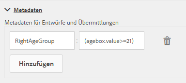

# Hinzufügen von Informationen von Benutzerdaten zu Formularübermittlungsmetadaten {#adding-information-from-user-data-to-form-submission-metadata}

Sie können in ein Element eingegebene Werte des Formulars verwenden, um Metadaten-Felder einer Entwurfs- oder einer Formularübermittlung zu berechnen. Mithilfe von Metadaten können Sie inhaltsbasierte Benutzerdaten filtern. Beispiel: Ein Benutzer gibt Bernd Schneider im Feld „Name“ des Formulars ein. Sie können diese Informationen nutzen, um Metadaten zu berechnen, die diesen Beitrag unter den Initialen JD kategorisieren.

Um die Metadatenfelder mit den vom Benutzer eingegebenen Werte zu berechnen, müssen Sie Elemente Ihres Formulars in den Metadaten hinzufügen. Wenn ein Benutzer einen Wert in dieses Element eingibt, verwendet ein Skript diesen Wert zur Berechnung von Informationen. Diese Informationen werden zu den Metadaten hinzugefügt. Wenn Sie ein Element als ein Metadatenfeld hinzufügen möchten, müssen Sie einen Schlüssel für ihn bereitstellen. Der Schlüssel wird als Feld in den Metadaten hinzugefügt und die berechneten Informationen werden anhand dieser Datei protokolliert.

Wenn beispielsweise eine Krankenversicherung ein Formular veröffentlicht. In diesem Formular wird in einem Feld das Alter des Endbenutzers festgehalten. Der Kunde möchte alle Angaben in einem bestimmten Altersbereich überprüfen, nachdem alle Benutzer das Formular eingereicht haben. Statt alle Daten einzeln zu überprüfen, was mit zunehmender Anzahl an Formularen schwieriger wird, helfen zusätzliche Metadaten mit dem Kunden. Der Formularverfasser kann konfigurieren, welche Eigenschaften/Daten, die vom Benutzer ausgefüllt wurden, auf der obersten Ebene gespeichert werden, sodass die Suche einfacher ist. Zusätzliche Metadaten sind vom Benutzer ausgefüllte Informationen, die auf der obersten Ebene des Metadatenknotens gespeichert werden, wie der Verfasser es konfiguriert hat.

Ein weiteres Beispiel eines Formulars, das E-Mail-IDs und Telefonnummern erfasst. Wenn ein Benutzer das Formular anonym besucht und das Formular verlässt, kann der Verfasser das Formular so konfigurieren, dass die E-Mail-ID und Telefonnummer automatisch gespeichert werden. Dieses Formular wird automatisch gespeichert und die Telefonnummer und E-Mail-ID werden im Metadatenknoten des Entwurfs gespeichert. Ein Anwendungsfall dieser Konfiguration ist das Lead-Management-Dashboard.

## Hinzufügen von Formularelementen zu Metadaten  {#adding-form-elements-to-metadata}

Führen Sie die folgenden Schritte aus, um ein Element zu den Metadaten hinzuzufügen:

1. Öffnen Sie Ihr adaptives Formular im Bearbeitungsmodus.

   Um das Formular im Bearbeitungsmodus zu öffnen, wählen Sie es im Forms Manager aus und tippen Sie auf **Öffnen**.

1. Wählen Sie im Bearbeitungsmodus eine Komponente aus, tippen Sie auf  > **Container des adaptiven Formulars** und dann auf .
1. Klicken Sie in der Randleiste auf **Metadaten**.
1. Klicken Sie im Abschnitt „Metadaten“ auf **Hinzufügen**.
1. Verwenden Sie das Feld „Wert“ auf der Registerkarte „Metadaten“, um Skripte hinzuzufügen. Die von Ihnen hinzugefügten Skripte erfassen Daten aus den Elementen im Formular und berechnen Werte, die den Metadaten zugeführt werden.

   Beispiel: **true** wird in den Metadaten protokolliert, wenn das eingegebene Alter größer als 21 ist, und **false** wird protokolliert, wenn es kleiner als 21 ist. Sie können das folgende Skript auf der Registerkarte „Metadaten“ eingeben:

   `(agebox.value >= 21) ? true : false`

   
   **Abbildung:** *Skript in der Registerkarte &quot;Metadaten&quot;*

1. Klicken Sie auf **OK**.

Nachdem ein Benutzer Daten in das Element, das als Metadatenfeld ausgewählt wurde, eingegeben hat, werden die berechneten Informationen in den Metadaten protokolliert. Sie können die Metadaten im Repository anzeigen, das Sie konfiguriert haben, um Metadaten zu speichern.

## Aktualisierte Formularübermittlungsmetadaten: {#seeing-updated-form-nbsp-submission-metadata}

Für das oben genannte Beispiel werden die Metadaten im CRX-Repository gespeichert. Die Metadaten sehen wie folgt aus:

Wenn Sie ein Kontrollkästchenelement in die Metadaten hinzufügen, werden die ausgewählten Werte als kommagetrennter String gespeichert. Fügen Sie beispielsweise Ihrem Formular ein Kontrollkästchenelement hinzu, und legen Sie seinen Namen als `checkbox1` fest. Fügen Sie in den Eigenschaften „Kontrollkästchenkomponente“ die Elemente Führerschein, Sozialversicherungsnummer und Reisepass für Werte 0, 1 und 2.

Wählen Sie einen Container für das adaptive Formular und in den Formulareigenschaften fügen Sie einen Metadatenschlüssel `cb1`   hinzu, der `checkbox1.value`   speichert und dann veröffentlichen Sie das Formular. Wenn ein Kunde das Formular ausfüllt, wählt er Reisepass und Sozialversicherungsnummer im Kontrollkästchenfeld. Die Werte 1 und 2 werden als 1, 2 im Feld „cb1“ der Übermittlungsmetadaten gepsichert.

>[!NOTE]
>
>Das obige Beispiel ist lediglich für Schulungszwecke gedacht. Stellen Sie sicher, dass Sie nach den Metadaten im richtigen Ordner suchen, wie in der AEM Forms-Implementierung konfiguriert.

