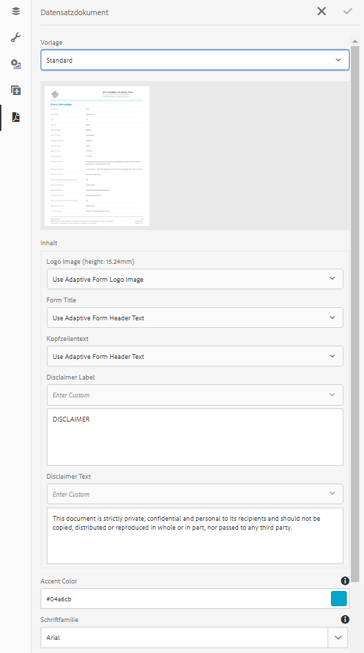

# Generierung eines Datensatzdokuments für adaptive Formulare {#generate-document-of-record-for-adaptive-forms}

>[!CAUTION]
>
>AEM 6.4 hat das Ende der erweiterten Unterstützung erreicht und diese Dokumentation wird nicht mehr aktualisiert. Weitere Informationen finden Sie in unserer [technische Unterstützung](https://helpx.adobe.com/de/support/programs/eol-matrix.html). Unterstützte Versionen suchen [here](https://experienceleague.adobe.com/docs/?lang=de).

## Überblick {#overview}

Nachdem Ihre Kunden ein Formular gesendet haben, möchten sie im Allgemeinen einen Beleg (in gedruckter Form oder im Dokumentformat) über die eingegebenen Informationen behalten, um später darauf Bezug nehmen zu können. Dies wird als Datensatzdokument bezeichnet.

In diesem Artikel wird erläutert, wie Sie ein Datensatzdokument für adaptive Formulare generieren können.

>[!NOTE]
>
>Die automatische Generierung von Datensatzdokumenten wird für XFA-basierte adaptive Formulare nicht unterstützt. Sie können jedoch die XDP verwenden, die zum Erstellen des adaptiven Formulars als Datensatzdokument verwendet wird.

## Adaptive Formulartypen und ihre Datensatzdokumente {#adaptive-form-types-and-their-documents-of-record}

Wenn Sie ein adaptives Formular erstellen, können Sie ein Formularmodell auswählen. Ihre Optionen sind:

* [Formularvorlagen](/help/forms/using/creating-adaptive-form.md#p-create-an-adaptive-form-based-on-an-xfa-form-template-p)

   Hier können Sie eine XFA-Vorlage für Ihr adaptives Formular auswählen. Wenn Sie eine XFA-Vorlage auswählen, können Sie die dazugehörige XDP-Datei als Datensatzdokument verwenden (siehe oben). 

* [XML-Schema](/help/forms/using/creating-adaptive-form.md#p-create-an-adaptive-form-based-on-xml-or-json-schema-p)

   Ermöglicht die Auswahl einer XML-Schemadefinition für das adaptive Formular. Wenn Sie ein XML-Schema für Ihr adaptives Formular auswählen, können Sie:

   * Verknüpfen Sie eine XFA-Vorlage für das Datensatzdokument. Stellen Sie sicher, dass die zugeordnete XFA-Vorlage dasselbe XML-Schema wie Ihr adaptives Formular verwendet
   * Datensatzdokument automatisch generieren

* Ohne

   Ermöglicht die Erstellung eines adaptiven Formulars ohne Formularmodell. Das Datensatzdokument für Ihr adaptives Formular wird automatisch generiert.

Wenn Sie ein Formularmodell auswählen, konfigurieren Sie das Datensatzdokument mithilfe der Optionen, die unter „Konfiguration von Dokument aus Datensatzvorlage“ verfügbar sind. Weitere Informationen dazu finden Sie unter [Konfiguration der Datensatzdokument-Vorlage](#document-of-record-template-configuration).

## Automatisch generiertes Datensatzdokument {#automatically-generated-document-of-record}

Mit einem Datensatzdokument können Ihre Kunden eine Kopie des übermittelten Formulars zum Drucken aufbewahren. Wenn Sie automatisch ein Datensatzdokument generieren, wird jedes Mal das Datensatzdokument sofort aktualisiert, wenn Sie das Formular ändern. Beispiel: Sie entfernen für Kunden, die als ihr Land die USA angeben, das Feld „Alter“. Wenn diese Kunden ein Datensatzdokument generieren, ist das Feld &quot;age&quot;für sie im Datensatzdokument nicht sichtbar.

 Ein automatisch generiertes Datensatzdokument bietet folgende Vorteile:

* Es kümmert sich um die Datenbindung.
* Dadurch werden automatisch Felder ausgeblendet, die im Datensatzdokument zum Zeitpunkt des Sendens entsprechend markiert sind. Zusätzlicher Aufwand ist nicht erforderlich.
* Dies spart Zeit für die Entwicklung der Datensatzdokument-Vorlage.
* Außerdem können Sie auch verschiedene Formatierungsstile und Erscheinungsbilder ausprobieren, indem Sie unterschiedliche Basisvorlagen verwenden und dann das beste Design für Ihr Datensatzdokument auswählen. Stil und Erscheinungsbild sind optional. Wenn Sie sich auf keinen Stil festlegen, werden Systemstile als Standard festgelegt.
* Dadurch wird sichergestellt, dass jede Änderung im Formular sofort im Datensatzdokument angezeigt wird.

## Komponenten zum automatischen Generieren eines Datensatzdokuments {#components-to-automatically-generate-a-document-of-record}

Sie benötigen die folgenden Komponenten, um ein Datensatzdokument für adaptive Formulare zu generieren:

**Adaptives Formular** Das adaptive Formular, für das Sie ein Datensatzdokument generieren möchten.

**Basisvorlage (empfohlen)** Das ist eine in AEM Designer erstellte XFA-Vorlage (XDP-Datei). Eine Basisvorlage wird verwendet, um die Stile und Branding-Informationen für die Datensatzdokument-Vorlage festzulegen.

Siehe [Basisvorlage eines Datensatzdokuments](#base-template-of-a-dor)

>[!NOTE]
>
>Die Basisvorlage eines Datensatzdokuments wird auch als Metavorlage des Datensatzdokuments bezeichnet.

**Datensatzdokument-Vorlage** Eine aus einem adaptiven Formular generierte XFA-Vorlage (XDP-Datei).

Weitere Informationen dazu finden Sie unter [Konfiguration der Datensatzdokument-Vorlage](#document-of-record-template-configuration).

**Formulardaten** Informationen, die von einem Benutzer in das adaptive Formular eingetragen werden. Sie werden mit der Datensatzdokument-Vorlage zusammengeführt, um das Datensatzdokument zu generieren.

## Zuordnung von adaptiven Formularelementen {#mapping-of-adaptive-form-elements}

In den folgenden Abschnitten wird beschrieben, wie adaptive Formularelemente im Datensatzdokument angezeigt werden.

### Felder {#fields}

<table> 
 <tbody> 
  <tr> 
   <th>Komponente des adaptiven Formulars</th> 
   <th>Zugehörige XFA-Komponente</th> 
   <th>Standardmäßig in der Datensatzdokument-Vorlage enthalten?</th> 
   <th>Anmerkungen</th> 
  </tr> 
  <tr> 
   <td>Schaltfläche</td> 
   <td>Schaltfläche</td> 
   <td>Nein</td> 
   <td> </td> 
  </tr> 
  <tr> 
   <td>Kontrollkästchen</td> 
   <td>Kontrollkästchen</td> 
   <td>Ja</td> 
   <td> </td> 
  </tr> 
  <tr> 
   <td>Datumsauswahl</td> 
   <td>Datum-/Uhrzeitfeld</td> 
   <td>Ja</td> 
   <td> </td> 
  </tr> 
  <tr> 
   <td>Dropdown-Liste</td> 
   <td>Dropdown-Liste</td> 
   <td>Ja</td> 
   <td> </td> 
  </tr> 
  <tr> 
   <td>Freihändige Unterschrift</td> 
   <td>Freihändige Unterschrift</td> 
   <td>Ja</td> 
   <td> </td> 
  </tr> 
  <tr> 
   <td>Numerisches Feld</td> 
   <td>Numerisches Feld</td> 
   <td>Ja</td> 
   <td> </td> 
  </tr> 
  <tr> 
   <td>Kennwortfeld</td> 
   <td>Kennwortfeld</td> 
   <td>Nein</td> 
   <td> </td> 
  </tr> 
  <tr> 
   <td>Optionsfeld</td> 
   <td>Optionsfeld</td> 
   <td>Ja</td> 
   <td> </td> 
  </tr> 
  <tr> 
   <td>Textfeld</td> 
   <td>Textfeld</td> 
   <td>Ja</td> 
   <td> </td> 
  </tr> 
  <tr> 
   <td>Schaltfläche „Zurücksetzen“</td> 
   <td>Schaltfläche „Zurücksetzen“</td> 
   <td>Nein</td> 
   <td> </td> 
  </tr> 
  <tr> 
   <td>Schaltfläche „Senden“</td> 
   <td><p>Schaltfläche „E-Mail senden“</p> <p>Schaltfläche „HTTP senden“</p> </td> 
   <td>Nein</td> 
   <td> </td> 
  </tr> 
  <tr> 
   <td>Allgemeine Geschäftsbedingungen</td> 
   <td> </td> 
   <td>Ja</td> 
   <td> </td> 
  </tr> 
  <tr> 
   <td>Dateianhang</td> 
   <td> </td> 
   <td>Nein</td> 
   <td>In Datensatzdokument-Vorlage nicht verfügbar. In Datensatzdokument-Vorlage nur über Anlagen verfügbar.</td> 
  </tr> 
 </tbody> 
</table>

### Container {#containers}

<table> 
 <tbody> 
  <tr> 
   <th>Komponente des adaptiven Formulars</th> 
   <th>Zugehörige XFA-Komponente</th> 
   <th>Anmerkungen</th> 
  </tr> 
  <tr> 
   <td>Bereich<br /> </td> 
   <td>Teilformular<br /> </td> 
   <td>Wiederholbare Bedienfelder werden wiederholbaren Teilformularen zugeordnet.</td> 
  </tr> 
 </tbody> 
</table>

### Statische Komponenten {#static-components}

| Komponente des adaptiven Formulars | Zugehörige XFA-Komponente | Anmerkungen |
|---|---|---|
| Bild | Bild | Die Komponenten TextDraw und Image (egal ob gebunden oder nicht) werden immer im Datensatzdokument eines XSD-basierten adaptiven Formulars angezeigt, es sei denn, sie werden mithilfe der Datensatzdokument-Einstellungen ausgeschlossen. |
| Text | Text |

>[!NOTE]
>
>In der klassischen Benutzeroberfläche sind verschiedene Registerkarten zum Bearbeiten der Feldeigenschaften vorhanden.

### Tabellen {#tables}

Die Tabellenkomponenten für adaptive Formulare wie Kopf- und Fußzeile sowie Zeilen werden den entsprechenden XFA-Komponenten zugeordnet. Sie können wiederholbare Bereiche Tabellen im Datensatzdokument zuordnen.

## Basisvorlage eines Datensatzdokuments {#base-template-of-a-document-of-record}

Die Basisvorlage stellt Formatierungs- und Darstellungsinformationen für das Datensatzdokument bereit. Damit können Sie das standardmäßige Erscheinungsbild des automatisch generierten Datensatzdokuments anpassen. Beispiel: Sie möchten Ihr Firmenlogo in der Kopfzeile und Copyright-Informationen in der Fußzeile des Datensatzdokuments hinzufügen. Die Übergeordnete Seite aus der Basisvorlage wird als Übergeordnete Seite für die Datensatzdokumentvorlage verwendet. Die Übergeordnete Seite kann Informationen wie Seitenkopf, Seitenfußzeile und Seitenzahl enthalten, die Sie auf das Datensatzdokument anwenden können. Sie können solche Informationen mithilfe der Basisvorlage für die automatische Erstellung des Datensatzdokuments auf das Datensatzdokument anwenden. Die Verwendung der Basisvorlage ermöglicht es Ihnen, die Standardeinstellungen von Feldern zu ändern.

Bitte folgen Sie bei der Entwicklung Ihrer Basisvorlage den [Konventionen für Basisvorlagen](#base-template-conventions).

## Konventionen für Basisvorlagen {#base-template-conventions}

Eine Basisvorlage wird verwendet, um Kopf- und Fußzeile, Stil und Erscheinungsbild eines Datensatzdokuments zu definieren. Die Kopf- und die Fußzeile können Informationen wie Firmenlogo und Copyright-Vermerk enthalten. Die erste Masterseite in der Basisvorlage wird als Masterseite für das Datensatzdokument kopiert und verwendet. Sie enthält Kopfzeile, Fußzeile und Seitenanzahl oder auch andere Informationen, die im Datensatzdokument auf allen Seiten angezeigt werden sollen. Wenn Sie eine Basisvorlage verwenden, die nicht den Konventionen für Basisvorlagen entspricht, wird die erste Masterseite aus der Basisvorlage dennoch in der Datensatzdokument-Vorlage verwendet. Es wird dringend empfohlen, Ihre Basisvorlage gemäß den Konventionen zu entwerfen und sie für die automatische Generierung des Datensatzdokuments zu verwenden.

**Konventionen für Musterseiten**

* In der Basisvorlage sollten Sie das Stamm-Unterformular mit `AF_METATEMPLATE` und die Musterseite mit `AF_MASTERPAGE` benennen.

* Die Musterseite mit dem Namen `AF_MASTERPAGE`, die sich unterhalb des Stamm-Unterformulars `AF_METATEMPLATE` befindet, hat beim Extrahieren von Kopfzeilen-, Fußzeilen- und Stilinformationen Vorrang.

* Wenn `AF_MASTERPAGE` fehlt, wird die erste Musterseite in der Basisvorlage verwendet.

**Stilkonventionen für Felder**

* Wenn Sie einen Stil auf die Felder im Datensatzdokument anwenden, stellt die Basisvorlage die Felder im Teilformular `AF_FIELDSSUBFORM` bereit, das sich unter dem Stammteilformular `AF_METATEMPLATE` befindet.

* Die Eigenschaften dieser Felder werden auf die Felder im Datensatzdokument angewendet. Benennungen für diese Felder sollten der Form `AF_<name of field in all caps>_XFO` folgen. So sollte beispielsweise der Feldname für ein Kontrollkästchen `AF_CHECKBOX_XFO` lauten.

Gehen Sie wie folgt vor, um eine Basisvorlage in AEM Designer zu erstellen:

1. Klicken Sie auf **Datei > Neu**.
1. Wählen Sie die Option **Auf Basis einer Vorlage** aus.

1. Wählen Sie die Kategorie **Formulare – Aufzuzeichnendes Dokument**.
1. Auswählen **DoR-Basisvorlage**.
1. Klicken Sie auf **Weiter** und geben Sie die erforderlichen Informationen ein.

1. (Optional) Ändern Sie die Formatierung und Darstellung von Feldern, die Sie auf die Felder im Datensatzdokument anwenden möchten.
1. Speichern Sie das Formular.

Sie können das gespeicherte Formular jetzt als Basisvorlage für das Datensatzdokument verwenden.\
Ändern oder entfernen Sie keine Skripte, die in der Basisvorlage vorhanden sind.

**Ändern der Basisvorlage**

* Wenn Sie keine Formatierung auf Felder in der Basisvorlage anwenden, ist es ratsam, diese Felder aus der Basisvorlage zu entfernen, damit alle Aktualisierungen auf die Basisvorlage automatisch abgerufen werden.
* Während des Änderns der Basisvorlage dürfen Sie keine Skripte entfernen, hinzufügen oder ändern.

>[!NOTE]
>
>Entwickeln Sie die Basisvorlage gemäß den Konventionen und folgen Sie dabei genau den oben beschriebenen Schritten.

## Konfiguration von Vorlagen für Datensatzdokumente {#document-of-record-template-configuration}

Konfigurieren Sie die Datensatzdokument-Vorlage Ihres Formulars, damit Ihre Kunden eine benutzerfreundliche Kopie des gesendeten Formulars zum Drucken herunterladen können. Als Datensatzdokument-Vorlage dient eine XDP-Datei. Das vom Kunden heruntergeladene Datensatzdokument ist entsprechend dem Layout formatiert, das in der XDP-Datei festgelegt ist.

Führen Sie die folgenden Schritte aus, um ein Datensatzdokument für adaptive Formulare zu konfigurieren:

1. Klicken Sie in der AEM-Autor-Instanz auf **Formulare > Formulare und Dokumente**.
1. Wählen Sie ein Formular aus und klicken Sie auf **Eigenschaften anzeigen**.
1. Tippen Sie im Fenster „Eigenschaften“ auf **Formularmodell**.

   Sie können ein Formularmodell auch bei der Erstellung eines Formulars auswählen.

   >[!NOTE]
   >
   >Achten Sie auf der Registerkarte „Formularmodell“ darauf, dass Sie **Schema** oder **Ohne** aus dem Dropdown-Menü **Auswählen** auswählen. **[!UICONTROL Das Datensatzdokument wird nicht für XFA-basierte oder adaptive Formulare mit einer Formularvorlage als Formularmodell unterstützt.]**

1. Wählen Sie auf der Registerkarte „Formularmodell“ im Abschnitt „Konfiguration der Datensatzdokument-Vorlage“ eine der folgenden Optionen aus.

   **Keine** Wählen Sie diese Option aus, wenn Sie kein Datensatzdokument für das Formular konfigurieren möchten.

   **Formularvorlage als Dokument einer Datensatzvorlage verknüpfen** Wählen Sie diese Option, wenn Sie eine XDP-Datei haben, die Sie als Vorlage für das Datensatzdokument verwenden möchten. Wenn Sie diese Option wählen, werden alle im AEM Forms-Repository verfügbaren XDP-Dateien angezeigt. Wählen Sie die entsprechende Datei aus.

   Die ausgewählte XDP-Datei wird mit dem adaptiven Formular verknüpft.

   **Datensatzdokument generieren** Wählen Sie diese Option aus, um eine XDP-Datei als Basisvorlage zum Definieren von Stil und Erscheinungsbild des Datensatzdokuments zu verwenden. Wenn Sie diese Option wählen, werden alle im AEM Forms-Repository verfügbaren XDP-Dateien angezeigt. Wählen Sie die entsprechende Datei aus.

   **[!UICONTROL Wählen Sie diese Option aus, um eine XDP-Datei als Basisvorlage zum Definieren von Stil und Erscheinungsbild des Datensatzdokuments zu verwenden. Wenn Sie diese Option wählen, werden alle im AEM Forms-Repository verfügbaren XDP-Dateien angezeigt. Wählen Sie die entsprechende Datei aus.]**

   **Forms-Vorlage als Basisvorlage auswählen, um Datensatzdokument zu generieren** Wählen Sie diese Option aus, um eine XDP-Datei als Basisvorlage zum Definieren von Stil und Erscheinungsbild des Datensatzdokuments zu verwenden. Wenn Sie diese Option wählen, werden alle im AEM Forms-Repository verfügbaren XDP-Dateien angezeigt. Wählen Sie die entsprechende Datei aus.

   >[!NOTE]
   >
   >Stellen Sie sicher, dass das zum Erstellen des adaptiven Formulars und Schemas (Datenschema) des XFA-Formulars verwendete Schema identisch ist, wenn:
   >
   >* Ihr adaptives Formular ist schemabasiert
   >* Sie verwenden die Datensatzdokument-Option „**Formularvorlage als Dokument aus Datensatzvorlage zuordnen**“.


1. Klicken Sie auf **Fertig**.

## Anpassen der Branding-Informationen im Datensatzdokument {#customize-the-branding-information-in-document-of-record}

Beim Generieren eines Datensatzdokuments können Sie Branding-Informationen für das Datensatzdokument auf der Registerkarte Datensatzdokument ändern. Die Registerkarte „Datensatzdokument“ enthält Optionen für Logos, Aussehen, Layout, Kopf- und Fußzeile, zum Anpassen des Haftungsausschlusses sowie eine Optionen zum Entscheiden, ob Sie deaktivierte Kontrollkästchen und Optionsfeldern berücksichtigen möchten.

Für die Lokalisierung der Branding-Informationen, die Sie auf der Registerkarte für das Datensatzdokument eingeben, müssen Sie sicherstellen, dass das Gebietsschema des Browsers richtig eingestellt ist. Führen Sie die folgenden Schritte aus, um die Branding-Informationen des Datensatzdokuments anzupassen:

1. Wählen Sie einen Bereich (Stammbereich) im Datensatzdokument aus und tippen Sie dann auf .
1. Tippen Sie auf . Die Registerkarte „Datensatzdokument“ wird angezeigt.
1. Wählen Sie entweder die Standardvorlage oder eine benutzerdefinierte Vorlage zum Rendern des Datensatzdokuments aus. Wenn Sie die Standardvorlage auswählen, wird unter der Dropdown-Liste Vorlage eine Miniaturansicht des Datensatzdokuments angezeigt.

   

   Wenn Sie eine benutzerdefinierte Vorlage auswählen, durchsuchen Sie eine XDP auf Ihrem AEM Forms-Server. Wenn Sie eine Vorlage verwenden möchten, die sich noch nicht auf Ihrem AEM Forms-Server befindet, müssen Sie zunächst die XDP auf Ihren AEM Forms-Server hochladen.

1. Je nachdem, ob Sie eine Standard- oder eine benutzerdefinierte Vorlage auswählen, werden einige oder alle der folgenden Eigenschaften auf der Registerkarte Datensatzdokument angezeigt. Legen Sie die folgenden entsprechend fest:

   * **Logo-Bild:** Sie können entweder das Logo-Bild des adaptiven Formulars verwenden, eines in DAM auswählen oder eines von Ihrem Computer hochladen.
   * **Formulartitel**
   * **Kopfzeilentext**
   * **Haftungsausschluss-Bezeichnung**
   * **Haftungsausschluss**
   * **Text des Haftungsausschlusses**
   * **Akzentfarbe:** Die Farbe, in der Kopfzeilentext und Trennlinien im PDF des aufzuzeichnenden Dokuments dargestellt werden.
   * **Schriftfamilie:** Schriftfamilie des Textes im Datensatzdokument-PDF. 
   * **Für Kontrollkästchen- und Optionsfeld-Komponenten nur die ausgewählten Werte anzeigen**
   * **Trennzeichen für mehrere ausgewählte Werte**
   * **Formularobjekte einschließen, die nicht an das Datenmodell gebunden sind**
   * **Ausgeblendete Felder aus dem Datensatzdokument ausschließen**
   * **Beschreibung von Bereichen ausblenden**

   >[!NOTE]
   >
   >Wenn Sie eine adaptive Formularvorlage verwenden, die mit einer Designer-Version vor 6.3 erstellt wurde, müssen Sie sicherstellen, dass in Ihrer adaptiven Formularvorlage unter dem Stammteilformular Folgendes vorhanden ist, damit die Eigenschaften für Accent Color und Font Family funktionieren:

   ```xml
   <proto>
   <font typeface="Arial"/>
   <fill>
   <color value="4,166,203"/>
   </fill>
   <edge>
   <color value="4,166,203"/>
   </edge>
   </proto>
   ```

1. Tippen Sie auf „Fertig“, um die Branding-Änderungen zu speichern.

## Tabellen- und Spalten-Layouts für Bereiche im Datensatzdokument {#table-and-column-layouts-for-panels-in-document-of-record}

Ihr adaptives Formular ist möglicherweise sehr lange und umfasst mehrere Formularfelder. Möglicherweise möchten Sie ein Datensatzdokument nicht als exakte Kopie des adaptiven Formulars speichern. Jetzt können Sie ein Tabellen- oder Spaltenlayout zum Speichern eines oder mehrerer adaptiver Formularbedienfelder im Datensatzdokument-PDF auswählen.

Wählen Sie vor dem Generieren eines Datensatzdokuments in den Einstellungen eines Bedienfelds die Option Layout für das Datensatzdokument für diesen Bereich als Tabelle oder Spalte. Die Felder im Bedienfeld werden entsprechend im Datensatzdokument organisiert.


Felder in einem Bedienfeld, im Datensatzdokument im Tabellenlayout angeordnet


Felder in einem Bedienfeld, im Datensatzdokument im Spalten-Layout angeordnet

## Einstellungen für Datensatzdokumente {#document-of-record-settings}

Über die Datensatzdokument-Einstellungen können Sie Optionen festlegen, die Sie in das Datensatzdokument aufnehmen möchten. Beispielsweise akzeptiert eine Bank in einem Formular Name, Alter, Sozialversicherungsnummer und Telefonnummer. Das Formular generiert eine Bankkontonummer und Details zur Zweigstelle. Sie können festlegen, dass nur der Name, die Sozialversicherungsnummer, das Bankkonto und die Details der Zweigstellen im Datensatzdokument angezeigt werden.

Die Datensatzdokument-Einstellungen einer Komponente sind unter den Eigenschaften verfügbar. Um auf die Eigenschaften einer Komponente zuzugreifen, wählen Sie die Komponente aus und klicken Sie auf  in der Überlagerung. Die Eigenschaften werden in der Seitenleiste mit den folgenden Einstellungen angezeigt.

**Einstellungen auf Feldebene**

* **Aus Datensatzdokument ausschließen**: Wenn Sie die Eigenschaft true festlegen, wird das Feld aus dem Datensatzdokument ausgeschlossen. Dies ist eine skriptfähige Eigenschaft namens `excludeFromDoR`. Ihr Verhalten ist von der auf Formularebene befindlichen Eigenschaft **Felder aus DoR ausschließen, wenn sie ausgeblendet sind** abhängig.

* **Bereich als Tabelle anzeigen:** Durch die Aktivierung dieser Eigenschaft wird der Bereich im Datensatzdokument als Tabelle angezeigt, wenn er weniger als 6 Felder enthält. Gilt nur für den Bereich.
* **Titel aus Datensatzdokument ausschließen:** Wird diese Eigenschaft aktiviert, erscheint der Titel des Bereichs bzw. der Tabelle im Datensatzdokument nicht. Gilt nur für Bereiche und Tabellen.
* **Beschreibung aus Datensatzdokument ausschließen:** Wird diese Eigenschaft aktiviert, erscheint die Beschreibung des Bereichs bzw. der Tabelle im Datensatzdokument nicht. Gilt nur für Bereiche und Tabellen.

**Einstellungen auf Formularebene**

* **Ungebundene Felder in DoR einbeziehen:** Durch Festlegen dieser Eigenschaft werden ungebundenen Felder aus dem Schema-basierten adaptiven Formular im Datensatzdokument berücksichtigt. Diese Option ist standardmäßig aktiviert.
* **Felder aus Datensatzdokument ausschließen, wenn sie ausgeblendet sind**: Wenn aktiviert, wird das Verhalten der auf Feldebene befindlichen Eigenschaft „Aus Datensatzdokument ausschließen“ überschrieben, wenn sie nicht den Wert „true“ hat. Wenn Felder zum Zeitpunkt der Formularübermittlung ausgeblendet sind, werden sie vom Datensatzdokument ausgeschlossen, wenn die Eigenschaft den Wert „true“ hat, vorausgesetzt, die Eigenschaft „Aus Datensatzdokument ausschließen“ ist nicht festgelegt.

## Wichtige Aspekte beim Arbeiten mit einem Datensatzdokument {#key-considerations-when-working-with-document-of-record}

Beachten Sie die folgenden Hinweise und Einschränkungen beim Arbeiten mit einem Datensatzdokument für adaptive Formulare.

* Datensatzdokument-Vorlagen unterstützen keinen Rich-Text. Rich-Text im statischen adaptiven Formular oder in den vom Endbenutzer eingegebenen Informationen wird daher als Nur-Text im Datensatzdokument angezeigt.
* Dokumentfragmente in einem adaptiven Formular werden nicht im Datensatzdokument angezeigt. Adaptive Formularfragmente werden jedoch unterstützt.
* Das Datensatzdokument wird nur zum Drucken verwendet.
* Die Inhaltsbindung in Datensatzdokumenten, die für XML-Schema-Basierte adaptive Formulare generiert werden, wird nicht unterstützt.
* Die Inhaltsbindung in Datensatzdokumenten, die für XML-Schema-Basierte adaptive Formulare generiert werden, wird nicht unterstützt.
* Die lokalisierte Version des Datensatzdokuments wird bei Bedarf für ein Gebietsschema erstellt, wenn der Benutzer die Wiedergabe des Datensatzdokuments anfordert. Die Lokalisierung des Datensatzdokuments erfolgt zusammen mit der Lokalisierung des adaptiven Formulars. Siehe [Verwenden von AEM-Übersetzungs-Arbeitsablauf zum Lokalisieren von adaptiven Formularen und Datensatzdokumenten](/help/forms/using/using-aem-translation-workflow-to-localize-adaptive-forms.md).
