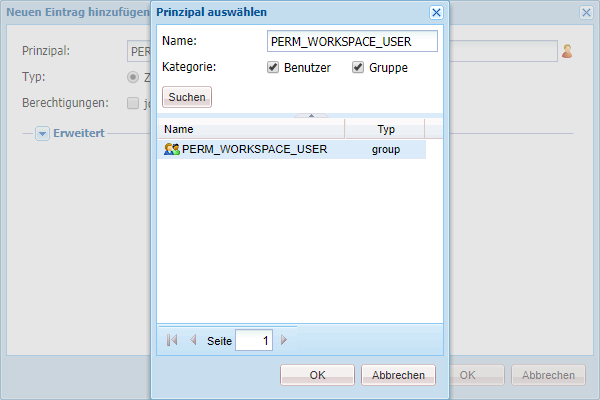

# Generische Schritte zur Anpassung von AEM Forms Workspace {#generic-steps-for-aem-forms-workspace-customization}

Für jede Anpassung gelten die folgenden generischen Schritte:

1. Bei CRXDE Lite anmelden über `https://[server]:[port]/lc/crx/de/index.jsp`.
1. Erstellen Sie einen Ordner mit dem Namen `ws`at `/apps`, wenn sie nicht vorhanden ist. Klicken Sie auf **[!UICONTROL Alle speichern]**.
1. Navigieren Sie zu `/apps/ws`und navigieren Sie zum **[!UICONTROL Zugriffssteuerung]** Registerkarte.
1. Im **[!UICONTROL Zugriffssteuerung]** Liste, klicken Sie auf **[!UICONTROL +]** , um einen neuen Eintrag hinzuzufügen. Klicken Sie erneut auf **[!UICONTROL +]**.
1. Suchen und wählen Sie die **[!UICONTROL PERM_WORKSPACE_USER]** Prinzipal.

   

1. geben `jcr:read` Berechtigung für den Prinzipal.
1. Klicken Sie auf **[!UICONTROL Alle speichern]**.
1. Kopieren Sie die `GET.jsp` und `html.jsp`-Dateien aus `/libs/ws`Ordner in `/apps/ws` Ordner.
1. Kopieren Sie die `/libs/ws/locales` im Ordner `/apps/ws` Ordner. Klicken Sie auf **[!UICONTROL Alle speichern]**.
1. Aktualisieren Sie die Verweise und relativen Pfade im `GET.jsp` wie unten gezeigt, und klicken Sie auf **[!UICONTROL Alle speichern]**.

   ```
   <meta http-equiv="refresh" content="0;URL='/lc/apps/ws/index.html'" />
   ```

1. Führen Sie die folgenden Schritte für CSS-Anpassungen aus:

   1. Navigieren Sie zum `/apps/ws` und erstellen Sie einen neuen Ordner mit dem Namen `css`.
   1. Erstellen Sie im Ordner `css` eine neue Datei mit dem Namen `newStyle.css`.
   1. Öffnen `/apps/ws/html`.jsp und ändern Sie von

   ```css
   <link lang="en" rel="stylesheet" type="text/css" href="css/style.css" />
   <link lang="en" rel="stylesheet" type="text/css" href="css/jquery-ui.css"/>
   ```

   in

   ```css
   <link lang="en" rel="stylesheet" type="text/css" href="../../libs/ws/css/style.css" />
   <link lang="en" rel="stylesheet" type="text/css" href="css/newStyle.css" />
   <link lang="en" rel="stylesheet" type="text/css" href="../../libs/ws/css/jquery-ui.css"/>
   ```

   >[!NOTE]
   >
   >Platzieren Sie den Eintrag für die benutzerdefinierte CSS-Datei hinter demjenigen für die Datei newStyle.css, wie oben gezeigt.

1. Ändern Sie in der Datei „apps/ws/html.jsp“ von

   ```css
   <script data-main="js/main" src="js/libs/require/require.js"></script>
   ```

   in

   ```css
   <script data-main="js/main" src="../../libs/ws/js/libs/require/require.js"></script>
   ```

1. Gehen Sie folgendermaßen vor:

   1. Erstellen Sie einen Ordner mit dem Namen `js`at `/apps/ws`. Klicken Sie auf **[!UICONTROL Alle speichern]**.
   1. Erstellen Sie einen Ordner mit dem Namen `libs`at `/apps/ws/js`. Klicken Sie auf **[!UICONTROL Alle speichern]**.
   1. Erstellen Sie einen Ordner mit dem Namen `jqueryui`at `/apps/ws/js/libs`. Klicken Sie auf **[!UICONTROL Alle speichern]**.
   1. Kopieren Sie `/libs/ws/js/libs/jqueryui/jquery.ui.datepicker-ja.js` nach `/apps/ws/js/libs/jqueryui`. Klicken Sie auf **[!UICONTROL Alle speichern]**.

1. Führen Sie die folgenden Schritte für HTML-Anpassungen aus:

   1. under `/apps/ws/js`erstellen Sie einen Ordner mit dem Namen `runtime`. Klicken Sie auf **[!UICONTROL Alle speichern]**.
   1. under `/apps/ws/js/runtime`erstellen Sie einen Ordner mit dem Namen `templates`. Klicken Sie auf **[!UICONTROL Alle speichern]**.
   1. Kopieren Sie `/libs/ws/js/main.js` nach `/apps/ws/js/main.js`.
   1. Kopieren Sie /libs/ws/js/registry.js in `/apps/ws/js/registry.js`.

1. Klicken Sie auf **[!UICONTROL Alle speichern]**, löschen Sie den Cache und aktualisieren Sie AEM Forms Workspace.

   Zugriff auf die URL `https://[server]:[port]/lc/ws` und melden Sie sich mit Administrator-/Passwortdaten an. Der Browser leitet zu `https://[server]:[port]/lc/apps/ws/index.html`.
