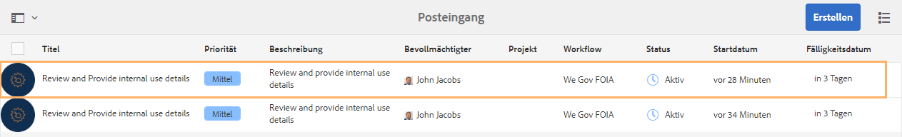
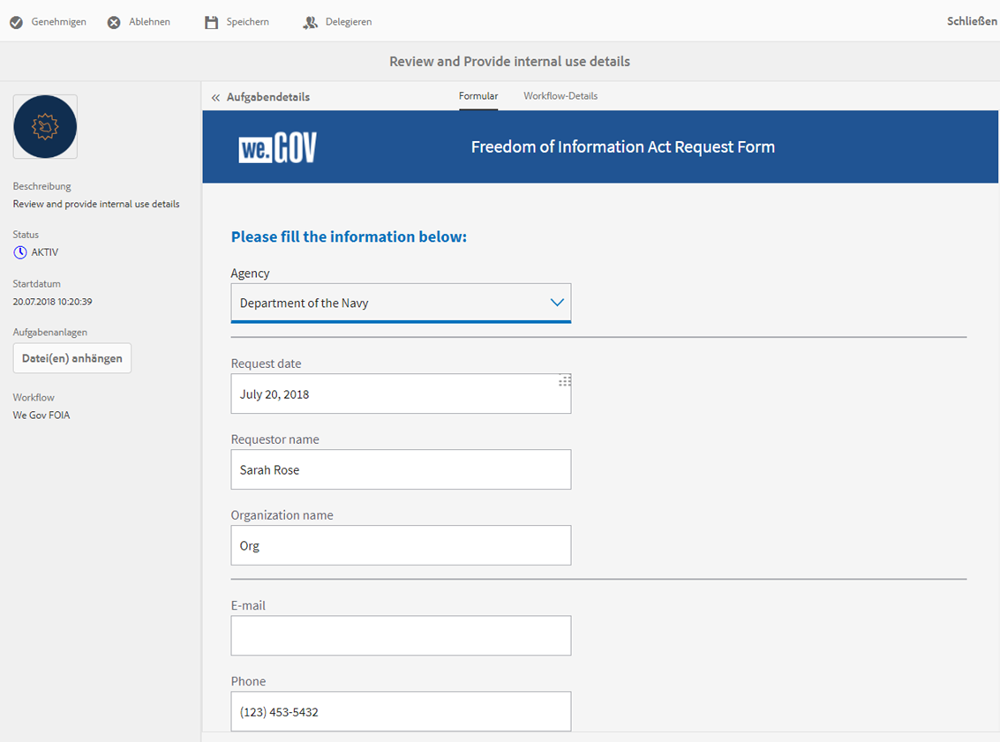
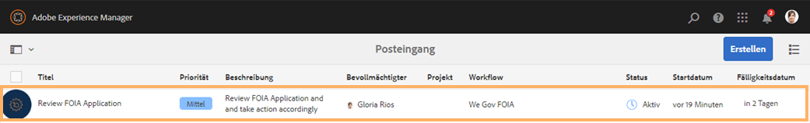
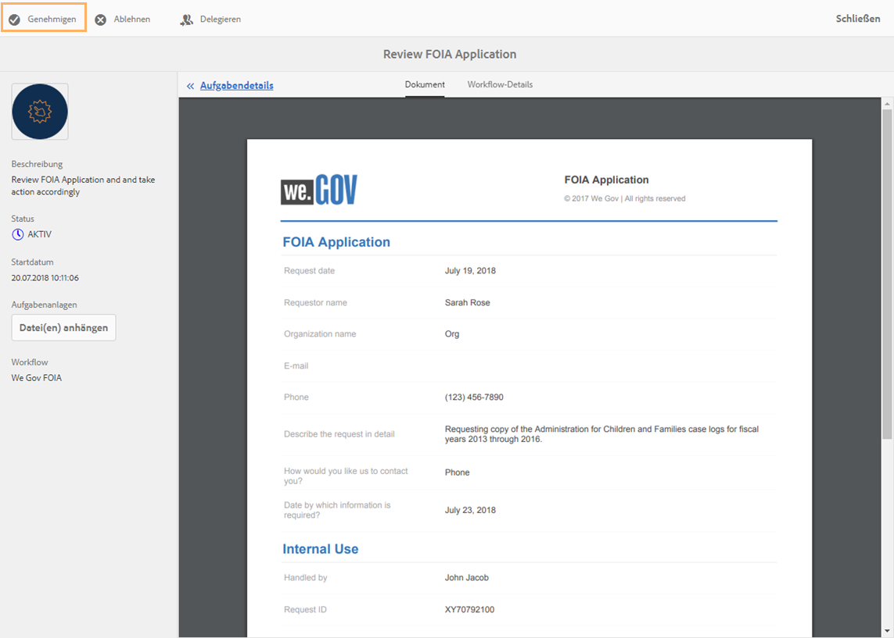

# FOIA-Anleitung zur We.Gov-Referenzwebsite {#we-gov-reference-site-foia-walkthrough}

>[!CAUTION]
>
>AEM 6.4 hat das Ende der erweiterten Unterstützung erreicht und diese Dokumentation wird nicht mehr aktualisiert. Weitere Informationen finden Sie in unserer [technische Unterstützung](https://helpx.adobe.com/de/support/programs/eol-matrix.html). Unterstützte Versionen suchen [here](https://experienceleague.adobe.com/docs/?lang=de).

## Voraussetzung {#pre-requisite}

Richten Sie Ihre We.Gov-Referenz-Website ein, wie im Abschnitt [Einrichten und Konfigurieren von AEM Forms-Referenz-Sites](/help/forms/using/setup-reference-sites.md).

## Szenario mit dem Freedom of Information Act {#reference-site-freedom-of-information-act-scenario}

We.Gov ist ein vom Staat geleitetes Unternehmen, bei dem sich Adoptiveltern für Kindergeld registrieren können, wenn sie ein Kind adoptiert haben. We.Gov ermöglicht es Eltern auch, Informationen von den folgenden Regierungsstellen im Rahmen des Gesetzes über die Informationsfreiheit anzufordern:

* Defense Logistics Agency
* Department of Defense Office of Inspector General
* Justizministerium - Amt für Informationspolitik
* Department of the Navy
* Umweltschutzbehörde

Weitere Informationen zum Freedom of Information Act (Gesetz zur Informationsfreiheit) finden Sie unter [www.foia.gov](https://www.foia.gov).

Das Szenario schließt folgende Personen ein:

* Sarah Rose, die Person, die die Herausgabe von Informationen beantragt
* John Jacobs, die Person, die den Antrag bearbeitet, leitet ihn an die entsprechende Abteilung weiter
* Gloria Rios, der Regierungsangestellte, der die Informationen gemäß dem Ersuchen übermittelt

## Sarah leitet ein Auskunftsersuchen gemäß FOIA ein {#sarah-initiates-request-for-information-under-foia}

Unter dem Freedom of Information Act fordert Sarah eine Kopie der Fallprotokolle von der Behörde Administration for Children and Families für die Jahre (GJ) 2013 bis 2016 an. Sarah sendet diesen Antrag an das Departent of Justice - Office of Information Policy und gibt außerdem an, dass sie bereit ist, bis zu 100 USD für die Druck- und Portokosten zu bezahlen.

### Funktionsweise {#how-it-works}

### Sehen Sie selbst {#see-it-yourself}

Öffnen Sie in Ihrem Browser `https://<hostname>:<PublishPort>/wegov`. Klicken Sie auf der We.Gov-Website auf „Applications“ > „All Applications“ (Anträge > Alle Anträge). Tippen Sie auf der Seite „All Applications“ unter „Application for FOIA Request“ (Antrag für FOIA-Anfrage) auf „Apply“ (Beantragen).

## Sarah stellt ihren Antrag auf Informationen gemäß FOIA. {#sarah-starts-her-application-for-information-under-foia}

Sarah klickt auf **Apply** (Beantragen) und gibt auf der Seite für das Freedom of Information Act-Antragsformular Informationen ein, darunter:

* **Agency** (Behörde): Sarah gibt die Behörde an, an die der Antrag gerichtet werden soll: Department of Justice – Office of Information Policy (Justizministerium – Büro für Informationspolitik).

* **Will Pay Up To** (Zahle bis zu): Sarah gibt an, dass sie bereit ist, bis zu 100 USD für Druck- und Portoausgaben zu zahlen.
* **Describe the request in detail** (Beschreiben Sie den Antrag im Detail): Sarah gibt an: „Anforderung einer Kopie der Fallprotokolle von Administration for Children and Families für die Geschäftsjahre 2013 bis 2016“.

Anfordern einer Kopie der Fallprotokolle von Administration for Children and Families für die Geschäftsjahre 2013 bis 2016

Sarah kann jederzeit auf Speichern tippen, um den Formularentwurf zu speichern, und später zurückkehren, um das Formular auszufüllen und zu senden. Sarah sendet das Formular.

>[!NOTE]
>
>Der Workflow &quot;Von E-Mail fortsetzen&quot;funktioniert nur bei angemeldeten Benutzern. Stellen Sie im Referenzsite-Szenario sicher, dass der Benutzer Sarah Rose hinzugefügt wird. Sarahs Anmeldedaten lauten `srose/password`.

## John Jacobs erhält und genehmigt den Antrag {#john-jacobs-receives-and-approves-the-application}

John Jacobs erhält die Anfragen und leitet sie an die richtige Person weiter. AEM Posteingang ermöglicht ihr die Anzeige aller eingereichten Anträge an einem Ort.

### Funktionsweise {#how-it-works-1}

Wenn Sarah den FOIA-Antrag ausfüllt und sendet, wird ein Datensatz des Antrags an den Posteingang von John Jacobs gesendet. John Jacobs kann den eingereichten Antrag ansehen und akzeptieren oder ablehnen.

### Sehen Sie selbst {#see-it-yourself-1}

Sie können auf den AEM-Posteingang unter https://&lt;***Hostname***>:&lt;***PublishPort***>/content/we-finance/global/en/login.html?resource=/aem/inbox.html zugreifen. Melden Sie sich beim AEM-Posteingang mit jjacobs/Kennwort (Benutzernamen/Kennwort von John Jacobs) an und zeigen Sie den FOIA-Antrag an. Weitere Informationen zur Verwendung des AEM-Posteingangs für formularzentrierte Workflow-Aufgaben finden Sie unter [Verwalten von Formularanwendungen und Aufgaben im AEM-Posteingang](/help/forms/using/manage-applications-inbox.md).

John Jacobs kann den Antrag im Antrags-Dashboard anzeigen, genehmigen oder ablehnen. John Jacobs wählt und öffnet die Anfragedetails und genehmigt sie nach Überprüfung der Anfrage.

### <strong>Sarah erhält eine Bestätigungs-E-Mail</strong> {#strong-sarah-receives-an-acknowledgement-email-strong}

Nachdem John Jacobs den Antrag genehmigt hat, erhält Sarah eine Bestätigungs-E-Mail von der We.Gov-Site. Sarah wird über die Gebühren und die Zeit informiert, die für die Bearbeitung ihres Antrags erforderlich sind. Die E-Mail enthält auch E-Mail- und Telefondaten, die Sarah für Aktualisierungen ihrer Anwendung kontaktieren kann.

## Gloria erhält den FOIA-Antrag auf Genehmigung der zweiten Ebene {#gloria-receives-the-foia-request-for-second-level-approval}

Nachdem John Jacobs die erforderlichen Informationen ausgefüllt und Sarahs Antrag genehmigt hat, werden die Anfragen zur endgültigen Genehmigung an Gloria Rios weitergeleitet. Gloria überprüft das beigefügte Datensatzdokument und genehmigt die Anfrage.

### Funktionsweise {#how-it-works-2}

Wenn John Jacobs die FOIA-Anfrage genehmigt, wird eine PDF oder ein Datensatzdokument des Antrags erstellt und an den Posteingang von Gloria Rios gesendet. Gloria kann den eingereichten Antrag anzeigen und akzeptieren oder ablehnen.

### Sehen Sie selbst {#see-for-yourself}

Sie können auf den AEM-Posteingang unter „https://&lt;***hostname***>:&lt;***PublishPort***>/content/we-finance/global/en/login.html?resource=/aem/inbox.html“ zugreifen. Melden Sie sich beim AEM-Posteingang mit grios/password (Benutzername/Kennwort von Gloria Rios) an und sehen Sie sich den FOIA-Antrag an.

Gloria öffnet den Antrag und prüft die Details des FOIA-Antrags. Nach Prüfung der Details des Antrags und Prüfung der Durchführbarkeit der Vorlage der erforderlichen Unterlagen genehmigt Gloria den Antrag.

## Sarah erhält die Benachrichtigung, dass ihr Antrag genehmigt wurde {#sarah-receives-notification-that-her-request-is-approved}

Nachdem Gloria den FOIA-Antrag genehmigt hat, erhält Sarah eine E-Mail, in der sie darüber informiert wird, dass ihr Antrag genehmigt wurde. Die E-Mail enthält auch Informationen zum vorläufigen Zeitplan für die Bereitstellung des Dokuments und Kontaktinformationen für die Weiterverfolgung der Anfrage.

