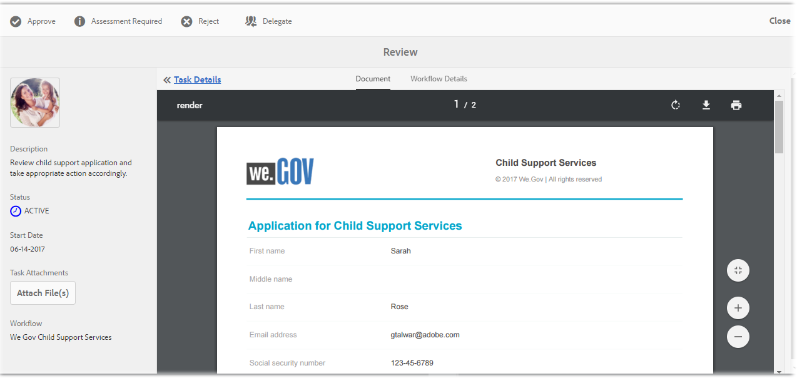

# Schrittweise Anleitung zur We.Gov-Referenz-Site {#we-gov-reference-site-walkthrough}

## Voraussetzung{#pre-requisite} 

Richten Sie Ihre Referenz-Website zu We.Gov ein wie in [Einrichten und Konfigurieren von AEM Forms-Referenzseiten](/help/forms/using/setup-reference-sites.md) beschrieben.

## Referenz-Website-Szenario{#reference-site-scenario} 

We.Gov ist ein vom Staat geleitetes Unternehmen, bei dem sich Adoptiveltern für Kindergeld registrieren können, wenn sie ein Kind adoptiert haben. Die Website verwaltet Folgendes:

* Berechtigung des Antragstellers, der Adoptiveltern
* Details zur Person und zum Beruf des Antragstellers (wenn der Antragsteller für Kindergeld berechtigt ist)
* Persönliche Angaben zum adoptierten Kind

   Der Antragsteller kann Details für mehr als ein Kind angeben
* Informationen zum Bankkonto des Antragstellers, auf dem der Antragsteller Kindergeld erhalten kann.
* Einhebung der Anmeldegebühr
* Überprüfung des Antrags
* Genehmigung des Antrags
* Automatisierte Kommunikation mit dem Antragsteller

Sobald der Antrag gesendet und die Gebühren bezahlt wurden, erhält der Antragsteller eine E-Mail vom Unternehmen mit der Bestätigung des gesendeten Antrags.

We.Gov-Organisation erhält die Anmeldung. Das Unternehmen prüft den Antrag und genehmigt die Anträge, die authentisch sind.

Nachdem der Antrag genehmigt wurde, erhält der Antragsteller eine E-Mail von der We.Gov-Website. Die Option **Dokument anzeigen** in der E-Mail verlinkt zu einem Dokument mit den Registrierungsdetails des Antragstellers.

Die nachfolgende Infografik zeigt den Schritt-für-Schritt-Arbeitsablauf der We.Gov-Referenzwebsite.

Das Szenario schließt folgende Personen ein:

* Sarah Rose, Adoptivmutter, die Kindergeld beantragt
* Joe, das adoptierte Kind
* Gloria Rios, Leiter der Genehmigungsabteilung, We.Gov
* Conard Simms, Mitarbeiter, der den Antrag prüft

## Sarah beginnt mit der Berechtigungsüberprüfung  {#sarah-initiates-her-eligibility-check}

Ein Antragsteller kann die Berechtigung auf Kindergeld prüfen. Auf der We.Gov-Website können Benutzer Fragen beantworten, um festzustellen, ob Ihr Antrag für Kindergeld bewilligt werden kann. Sarah, eine Adoptivmutter ist eine künftige Antragstellerin. Das Berechtigungsformular ist Teil des Antrags für Kindergeld auf der We.Gov-Website. Um ihre Berechtigung zu überprüfen, klickt Sarah auf der We.Gov-Website auf **[!UICONTROL Kindergeld]**. Auf dieser Seite klickt Sarah dann auf **[!UICONTROL Berechtigung überprüfen]**.

Zusätzlich zur oben beschriebenen Vorgehensweise kann Sarah auf der Startseite auf **[!UICONTROL Erste Schritte]** klicken. Sarah wird auf die Seite „Alle Anträge“ geleitet, wo sie unter **[!UICONTROL Antrag für Kindergeldservices]** auf „Beantragen“ klicken kann. Sarah wird dann zur Berechtigungsprüfung geleitet.

Auf der Seite „Berechtigung für Kindergeld überprüfen“ werden Sarah einige Fragen gestellt, um ihre Berechtigung für Kindergeld festzustellen. Sie wird beispielsweise Folgendes gefragt:

* Ob sie ein Elternteil mit Sorgerecht für ein Kind ist
* Ob sie und das Kind im Staat GX leben
* Die Altersgruppe des Kindes und die Ausbildung des Kindes.

Sarah beantwortet diese Fragen und ihre Berechtigung wird bestätigt. Ihre Berechtigung für Kindergeld hängt von ihren Antworten ab.

Sarah wird informiert, dass sie für Kindergeld berechtigt ist. Die Anmeldegebühr beträgt $25.

### Funktionsweise {#how-it-works}

Sarahs Berechtigung wird durch eine Berechtigungsüberprüfung, die mit dem Regeleditor erstellt wurde, bestätigt. Mit dem Regeleditor können Sie Bedingungen definieren, die erfüllt werden, bevor ein Antragsteller das Antragsformular ausfüllen kann. Wenn Sarah, die Antragstellerin, alle Berechtigungsbedingungen erfüllt, wird sie zum Antragsformular weitergeleitet.

Die Berechtigungsüberprüfung ist Teil des adaptiven Antragsformulars für Kindergeld. Die Regel validiert die Berechtigung, wenn

* der Antragsteller ein Elternteil mit Sorgerecht ist
* der Antragsteller und das Kind sich im Staat GX leben
* der Antragsteller die Hauptperson für die tägliche Betreuung des Kindes ist
* das Kindes, das Unterstützung erhält, unter 16 ist. 

### Sehen Sie selbst{#see-it-yourself} 

Öffnen Sie in Ihrem Browser `https://<hostname>:<PublishPort>/content/we-gov/en.html`. Klicken Sie auf der We.Gov-Website auf „Kindergeld“. Auf der Seite zum Kindergeld klicken Sie dann auf Berechtigung überprüfen.

Regeln ansehen:

1. Öffnen Sie das Formular im Bearbeitungsmodus im Autorenmodus. URL: `https://<hostname>:<AuthorPort>/editor.html/content/forms/af/we-gov/child-support/css.html`.
1. Wählen Sie eine Komponente aus und klicken Sie auf .

   Der Regeleditor öffnet die Auflistung aller Regeln, die im Formular angewendet werden.

1. Wählen Sie im linken Seitenbereich die Regeln`passMsg`   und`failMsg` , , um zu verstehen, wie die Überprüfung der Berechtigung funktioniert.

## Sarah beginnt mit ihrem Antrag auf Kindergeld.{#sarah-starts-her-application-for-child-support}

Sarah klickt auf **[!UICONTROL Antrag beginnen]** nachdem sie darüber informiert wurde, dass sie für Kindergeld berechtigt ist.\
Auf der Seite „Antrag auf Kindergeld“ gibt Sarah Informationen zu folgenden Bereichen ein:

* **[!UICONTROL Über Antragsteller:]** Ermöglicht Sarah ihre Details in diesem Abschnitt anzugeben. 

* **[!UICONTROL Untergeordnete Informationen]**: Ermöglicht Sarah die Angabe von Kinderinformationen, die unter die Unterstützungsdienste fallen.

* **[!UICONTROL Zahlung:]** Ermöglicht Sarah ihr Bankkonto anzugeben, auf das We.Gov jeden Monat das Kindergeld überweisen kann.

* **[!UICONTROL Gebührenzahlung:]** Ermöglicht Sarah ihre Kreditkartenangaben einzugeben, um die Antragsgebühr zu zahlen.

Standardmäßig wird Sarah zum Bereich **[!UICONTROL Informationen zum Antragsteller]** geleitet.

Sarah kann jederzeit auf **[!UICONTROL Später zurückkehren]** klicken und mit ihrem Antrag fortfahren. Wenn sie auf **[!UICONTROL Später zurückkehren]** klickt, wird ihr Fortschritt als Entwurf gespeichert und sie erhält eine Option, den Entwurf per E-Mail zu versenden.

Wenn sie auf **[!UICONTROL E-Mail senden]** klickt, erhält sie eine E-Mail mit einer Verknüpfung zum Formularentwurf.

Das Formular für Kindergeld auf der We.Gov-Website verwendet adaptive Formulare. Sie kann den Link zur E-Mail verwenden und das Formular auf einem mobilen Gerät ausfüllen.

>[!NOTE]
>
>Der Von-E-Mail-Arbeitsablauf funktioniert nur mit angemeldeten Benutzern. Im Referenzwebsite-Szenario stellen Sie sicher, dass der Benutzer Sarah Rose hinzugefügt wird. Sarahs Anmeldedaten sind `srose/password`.

Sarah kann in beliebigen Abschnitten Informationen eingeben. Die Anmeldegebühr wird jedoch nur akzeptiert, nachdem sie die erforderlichen Informationen in allen Bereichen ausgefüllt hat. Ein Antrag ist ohne Gebührenzahlung unvollständig und mit einem Sternchen (*) gekennzeichnete Felder müssen ausgefüllt werden.

### <strong>Sarah stellt die Informationen bereit</strong>   {#strong-sarah-provides-her-information-strong}

Nachdem Sarah auf **[!UICONTROL Anwendung starten]** geklickt hat, wird sie auf der Seite „Antrag auf Kindergeld“ zum Bereich „Informationen zum Antragsteller“ geleitet. In diesem Bereich navigiert Sarah durch die Registerkarten und gibt ihre persönlichen Informationen ein. Sie klickt auf **[!UICONTROL Weiter]**, um durch die Registerkarten zu navigieren.

Im Bereich „Informationen zum Antragsteller“ muss sie Angaben auf folgenden Registerkarten bereitstellen:

* **[!UICONTROL Grundlegende Informationen]**

Unter &quot;Grundlegende Informationen&quot;stellt Sarah ihren ID-Nachweis und ihre personenbezogenen Daten bereit. Sarahs persönliche Informationen umfassen ihren Namen, ihre E-Mail-Adresse und ihre Sozialversicherungsnummer.

* **[!UICONTROL Beziehung]**

   Unter &quot;Beziehung&quot;gibt Sarah Informationen über ihren Familienstand ein.

* **[!UICONTROL Zusätzliche Informationen]**

   Unter &quot;Zusätzliche Informationen&quot;gibt Sarah eine ID-Nummer, ihr Geburtsdatum sowie die aktuelle Adresse und Telefonnummer ein.

### Sarah stellt Informationen zum Kind bereit {#sarah-provides-child-information}

Nachdem Sarah ihre persönlichen Informationen eingegeben hat klickt sie auf **[!UICONTROL Weiter]** und sie wird zum Bereich „Informationen zum Kind“ geleitet.

Im Bereich „Informationen zum Kind“ gibt sie folgende Informationen ein:

* Anzahl der Kinder, für die Kindergeld beantragt werden soll.
* Name, Sozialversicherungsnummer, Geburtsdatum und Geburtsort des Kindes

Wenn Sarah mehr als ein Kind hat, erhält sie extra Formulare, in denen dieselben Details ausgefüllt werden müssen.\
Sarah wählt ihr einziges Kind, Joe, aus und gibt seinen Namen ein.

### Sarah gibt Zahlungsinformationen an {#sarah-provides-payment-information}

Nachdem Sarah Informationen zum adoptierten Kind (oder zu den adoptierten Kindern) angegeben hat, und auf **[!UICONTROL Weiter]** klickt, wird sie zum Bereich „Zahlungsinformationen“ geleitet.****

In diesem Bereich gibt sie Informationen zum Bankkonto ein, auf dem sie das Kindergeld erhalten kann.\
Sie gibt ihre zehnstellige Kontonummer ein.

## Sarah entrichtet die Anmeldegebühr und signiert das Formular.{#sarah-pays-the-application-fee-and-signs-the-form}

Nachdem Sarah den Nutzungsbedingungen des Antrags zugestimmt hat, bezahlt sie die Anmeldegebühr von $25. Die Anmeldegebühr ist erforderlich, um die Bearbeitung ihres Antrags fortzusetzen.\
Sarah gibt ihre Kreditkarteninformationen ein und klickt auf **[!UICONTROL Jetzt bezahlen]**. Nachdem Sie die Gebühr bezahlt hat, wird eine PDF-Version des Antrags mit einem Signaturfeld eingeblendet.

Sarah kann wählen, ob sie ihre Unterschrift über die Tastatur oder mit der Zeichnenfunktion eingibt, ein Bild der Unterschrift einfügt oder den Touchscreen ihres Handys verwendet, um ihre Unterschrift zu zeichnen. Sarah gibt ihren Namen über die Tastatur ein und klickt auf „Click To Sign“ (Zum Unterschreiben klicken).

Ihr Antrag wird an die We.Gov-Website gesendet.

### <strong>Sarah erhält eine Bestätigungs-E-Mail</strong> {#strong-sarah-receives-an-acknowledgement-email-strong}

Nachdem Sarah die Anmeldegebühr bezahlt hat, erhält sie eine Bestätigungs-E-Mail von der We.Gov-Website.\
We.Gov bearbeitet den Antrag. Nachdem ihr Antrag genehmigt wurde wird Sarah informiert, dass sie eine monatliche Unterstützung erhält.

### Funktionsweise {#how-it-works-1}

Der Antrag auf Kindergeld verwendet eine Kombination von Bedienfeld-Layouts wie obere Registerkarte, Assistent und Akkordeon. Es wird eine Formularvorlage verwendet, die We.Gov-Kind-Vorlage heißt.

Der Antragsteller kann zwischen Bereichen wechseln, um verschiedene Komponenten des Formulars auszufüllen. Wenn der Antragsteller das Formular ausgefüllt und eingesendet hat, den Bedingungen zugestimmt und die Gebühren bezahlt hat, wir ein benutzerdefinierter Arbeitsablauf initiiert. Der benutzerdefinierte Arbeitsablauf sendet eine automatisierte E-Mail an den Antragsteller, in der die Antragseinsendung bestätigt wird. Der Antrag wird an die entsprechende Abteilung des Unternehmen zur Überprüfung und Genehmigung weitergeleitet.

Das Layout des Formulars wird im Gov Kindergeld-Service-Thema angegeben. Styling beinhaltet Komponentenstil, Seitenhintergrund, Fehlerstatusformatierung der Komponenten und Schriftarten.

Die Überprüfung der Anspruchsberechtigung verwendet die Regeln, die in dem Formular angegeben werden. Es verwendet Gültigkeitschecks, die unten angegeben werden:

`SHOW passMsgWHEN (Does the child live in the state of GX? is equal to Yes) AND (Do you live in the state of GX? is equal to Yes) AND ( (Who has the main day-to-day care of the child? is equal to You) AND (Are you: is equal to The custodial parent) ) AND (Is the child you are applying for: is equal to Under 16 years) ELSE Hide`

`HIDE failMsg WHEN (Does the child lives in the state of GX? is equal to Yes) AND ( (Do you live in the state of GX? is equal to Yes) AND (Who has the main day-to-day care of the child? is equal to You) ) AND (Is the child you are applying for: is equal to Under 16 years) AND (Are you: is equal to The custodial parent) ELSE Show`

### Sehen Sie selbst{#see-it-yourself-1} 

Öffnen Sie in Ihrem Browser `https://<hostname>:<PublishPort>/content/forms/af/we-gov/child-support/css.html` und füllen Sie die erforderlichen Informationen aus. Wenn Sie nach dem Ausfüllen der erforderlichen Informationen, dem Bezahlen der Gebühr und dem Signieren das Dokument senden, erhalten Sie eine Bestätigungs-E-Mail.

Die We.Gov-untergeordnete Vorlage finden Sie hier: `https://<hostname>:<AuthorPort>/editor.html/conf/we-gov/settings/wcm/templates/we-gov-child-template/structure.html`

Das Thema finden Sie hier: `https://<hostname>:<AuthorPort>/editor.html/content/dam/formsanddocuments-themes/we-gov/we-gov-theme-A/jcr:content`

Um alle Regeln anzuzeigen, führen Sie die folgenden Schritte aus:

1. Öffnen Sie das Formular im Bearbeitungsmodus.

   URL: `https://<hostname>:<AuthorPort>/editor.html/content/forms/af/we-gov/child-support/css.html`

1. Wählen Sie eine Komponente aus und tippen Sie auf . Alle Regeln werden im Regeleditor angezeigt, einschließlich der oben aufgelisteten Regeln.

## Gloria erhält den Antrag {#gloria-receives-the-application}

Gloria, Leiter der Genehmigungsabteilung bei We.Gov, kann eingereichte Anträge anzeigen und genehmigen oder ablehnen. Im AEM-Posteingang können alle eingereichten Anträge an einem Ort angezeigt werden.

### Funktionsweise {#how-it-works-2}

Wenn Sarah den Kindergeldantrag einreicht, wird ein PDF-Dokument oder ein Datensatzdokument des Antrags erstellt und an Gloria Rios Posteingang gesendet. Gloria kann den eingereichten Antrag anzeigen und akzeptieren oder ablehnen.

### Sehen Sie selbst{#see-it-yourself-2} 

Seite öffnen `https://<hostname***>:<PublishPort>/content/we-gov/en.html`. Tippen Sie auf der Seite auf **[!UICONTROL Anmelden]**, aktivieren Sie das Kontrollkästchen **[!UICONTROL Als Vertreter anmelden]** und melden Sie sich beim AEM-Posteingang mit grios/password als Benutzernamen/Kennwort für Gloria Rios an. Die Kindergeld-Anwendung wird angezeigt. Informationen zur Verwendung AEM Posteingangs für formularzentrierte Workflow-Aufgaben finden Sie unter [Verwalten von Forms-Anwendungen und -Aufgaben in AEM Posteingang](/help/forms/using/manage-applications-inbox.md).

Gloria kann den Antrag vom Antrags-Dashboard aus anzeigen, genehmigen oder ablehnen.

### Funktionsweise {#how-it-works-3}

Gloria, Leiterin für Genehmigungen bei We.Gov, öffnet den AEM-Posteingang. Es wird eine Überprüfungsaufgabe in der Aufgabenliste angezeigt. Sie öffnet und sieht sich die Prüfungsaufgabe an.

Sie sieht eine PDF-Datei des Formulars mit allen von Sarah eingegebenen Details sowie die Dokumente, die Sarah hochgeladen hat.\
Gloria kann den Antrag genehmigen oder ablehnen. Gloria klickt jedoch auf **[!UICONTROL Überprüfung erforderlich]** , um den Antrag zu prüfen.

Sarahs Antrag ist ein Startpunkt im AEM-Arbeitsablauf. Er initiiert den AEM-Arbeitsablauf, wenn der Formularantrag für das Kindergeld eingereicht wird. Der AEM-Arbeitsablauf erstellt eine Aufgabe für Gloria, die in ihrem AEM-Posteingang angezeigt wird. Wenn Gloria eine Vorort-Beurteilung anfordert, wird eine neue Aufgabe für einen Mitarbeiter erstellt.

### Sehen Sie selbst  {#see-it-yourself-3}

Wenn die Konfiguration abgeschlossen ist, beginnt der AEM-Arbeitsablauf sofort, nachdem das Formular gesendet wurde. Melden Sie sich mit Glorias Anmeldedaten an.

Greifen Sie auf den Posteingang unter https://&lt;***Hostname***:&lt;***PublishPort***>/content/we-gov/en.html zu. Tippen Sie auf der Seite auf **[!UICONTROL Anmelden]**, aktivieren Sie das Kontrollkästchen **[!UICONTROL Als Vertreter anmelden]** und verwenden Sie Glorias Standardanmeldeinformationen:

* Benutzername: grios
* Kennwort: password

In ihrem AEM-Posteingang wurde Sarahs Antrag als Reviewaufgabe hinzugefügt. Die Aufgabe muss ausgewählt werden und dann muss **Überprüfung erforderlich** ausgewählt werden, um mit dem nächsten Schritt fortzufahren.

### Conard erhält die Überprüfungs-Aufgabe  {#conard-assessment-task}

Wenn Gloria auf **[!UICONTROL Überprüfung erforderlich]** klickt, erhält Conard die Überprüfungsaufgabe in seinem AEM-Posteingang. Die Aufgabe ist der nächste im AEM-Arbeitsablauf definierte Schritt. Er sieht die Überprüfungsaufgabe und öffnet sie.

Conard erhält die Antragsteller-Überprüfungsaufgabe wie unten dargestellt.

Die Überprüfung für das Kindergeld ist ein Formular, das mit der Aufgabe verknüpft ist. Er ruft Sarahs Details zusammen mit den verknüpften unterstützenden Dokumenten, die unter „Aufgabendetails angehängt sind, auf. Conard füllt das Überprüfungsformular vor Ort auf einem Gerät aus und sendet es zur erneuten Bewertung.

Conard überprüft und bestätigt alle Details, die Sarah bereitgestellt hat, und Sarah unterschreibt die Überprüfung. AEM Forms kann den Ort und den Zeitstempel erfassen und diese der Signatur hinzufügen.

Conard klickt auf **[!UICONTROL Zur erneuten Bewertung senden]** und der AEM-Arbeitsablauf sendet die Überprüfung an We.Gov.

### Funktionsweise {#how-it-works-4}

Wenn Gloria eine Überprüfung anfordert, wird der nächste Schritt im AEM-Arbeitsablauf initiiert und die Überprüfungsaufgabe in Conards Posteingang hinzugefügt. Conard ist der Mitarbeiter im Außendienst

Conard besucht Sarahs Standort, vergewissert sich, dass die von Sarah bereitgestellten Informationen der Wahrheit entsprechen und füllt das Überprüfungsformular aus. Conard kann auf eine PDF-Datei des abgeschlossenen Formulars, das Sarah ausgefüllt hat, zugreifen.

### Sehen Sie selbst{#see-it-yourself-4} 

Öffnen Sie den EM-Posteingang auf Ihrem Tablet und verwenden Sie Conards Anmeldedaten, um sich anzumelden.

Conards Standardanmeldedaten lauten:

* Benutzername: csimms
* Kennwort: password

Sie sehen, dass dem Posteingang eine neue Überprüfungsaufgabe hinzugefügt wurde. Senden Sie die vollständige Überprüfung und fahren Sie mit dem nächsten Schritt fort.

### Gloria prüft das Dokument und genehmigt den Antrag  {#gloria-reviews-the-assessment-and-approves-the-application}

Nachdem Conard die Überprüfung gesendet hat, wird die Überprüfungsaufgabe in Glorias Posteingang angezeigt. Sie wählt **[!UICONTROL Review]** aus und öffnet diese.

Unter &quot;Aufgabendetails&quot;sieht Gloria die letzte Aktion, die als &quot;Senden zur Neubewertung&quot;durchgeführt wurde (von Conard). Gloria sieht, dass der Antrag von Conard Simms überprüft wurde.

### Funktionsweise {#how-it-works-5}

Nachdem Conard die Überprüfung gesendet hat, wird die Überprüfungsaufgabe in Glorias Posteingang angezeigt. Sie wählt Review aus und öffnet ihn. Bei den Aufgabendetails sieht Gloria den von Conard hinzugefügten Überprüfungskommentar, nämlich „Alles in Ordnung“.

Gloria genehmigt den Antrag.

### Sehen Sie selbst  {#see-it-yourself-5}

Öffnen Sie den Posteingang und melden Sie sich mit den Anmeldedaten von Gloria an. Eine neue Aufgabe namens Überprüfung befindet sich im Posteingang.

Öffnen Sie die Aufgabe, um den Status der letzten Aktion zu sehen. Genehmigen Sie den Antrag anhand der Beurteilung.

## Sarah erhält eine Genehmigungs-E-Mail {#sarah-receives-an-approval-email}

Nachdem Gloria den Antrag genehmigt hat, erhält Sarah eine E-Mail von We.Gov, dass ihr Antrag genehmigt wurde.

Die Schaltfläche **[!UICONTROL Dokument anzeigen]** in der E-Mail verlinkt zu ihren Registrierungsdetails. Sarah klickt auf **[!UICONTROL Dokument anzeigen.]**

Das Registrierungsdokument enthält Details, z. B. die Referenz-ID, unterstütztes Kind, Datum der Initiierung, Kontonummer, Zahlungshäufigkeit und Zahlungsbetrag.

Sarah kann die Dokumente, die sie auf derselben Seite hochgeladen hat, sehen.

### Funktionsweise {#how-it-works-6}

Wenn Gloria den Antrag genehmigt, erhält Sarah eine automatische E-Mail mit einem Link zum Registrierungsdokument.

Das Registrierungsdokument ist eine interaktive Kommunikation, die auf jedem Gerät angezeigt werden kann. Es enthält die Details zum Kindergeld und die von Sarah bereitgestellten Informationen.

### Sehen Sie selbst{#see-it-yourself-6} 

Überprüfen Sie den E-Mail-Client, den Sie für die automatische E-Mail mit einem Link zum Registrierungsdokument konfiguriert haben.

Alternativ können Sie das Dokument in Ihrem Browser öffnen: `https://<hostname>:<PublishPort>/content/aemforms-refsite/doclink.html?document=/content/forms/af/we-gov/child-support/enrollment-document&referenceId=[reference-id]&channel=web`

## We.Gov analysiert die Leistung der Anwendung {#we-gov-analyzes-the-performance-of-the-application}

We.Gov überprüft von Zeit zu Zeit die Leistung ihrer Kindergeld-Service-Anwendung, um nach Problemen zu suchen, mit denen Kunden konfrontiert sein könnten. Sie verwenden diese Analyse, um fundierte Entscheidungen über die Änderungen zu treffen, die in der Anwendung für Kindergeld-Services erforderlich sind, um das Benutzererlebnis zu verbessern, die Abbruchrate von Formularen zu reduzieren und damit die Konvertierung zu verbessern. Zur Analyse nutzt das Unternehmen die Integration von AEM Forms mit Adobe Analytics. Die folgende Abbildung zeigt das Analyse-Dashboard des Unternehmens.

### Funktionsweise {#how-it-works-7}

Die Leistungsmetriken für das Antragsformular für Kindergeld werden mit Adobe Analytics verfolgt. Weitere Informationen zur Konfiguration von Adobe Analytics und zum Anzeigen der Berichte finden Sie unter [Konfigurieren der Analyse für Formulare und Dokumente](/help/forms/using/configure-analytics-forms-documents.md).

### Sehen Sie selbst{#see-it-yourself-7} 

Damit Sie den Analysebericht anzeigen und untersuchen können, stellen wir Seed-Daten für die Anwendung der Kindergeld-Services auf der Referenz-Website bereit. Bevor Sie Seed-Daten verwenden, lesen Sie[ Konfigurieren von Analytics](/help/forms/using/setup-reference-sites.md#configureanalytics). Führen Sie folgende Schritte im Autorenmodus aus, um den Bericht mit den Seed-Daten anzuzeigen: 

1. Navigieren Sie zur Benutzeroberfläche **[!UICONTROL Forms &amp; Documents]** unter https://&lt;*Hostname*:&lt;*AuthorPort*>/aem/forms.html/content/dam/formsanddocuments.

1. Klicken Sie auf , um den Ordner **We.Gov** zu öffnen.
1. Wählen Sie das adaptive Formular **[!UICONTROL Anwendung für Kindergeld]** und klicken Sie dann in der Symbolleiste auf **[!UICONTROL Analytics]** aktivieren .

1. Wählen Sie das Formular erneut aus und klicken Sie in der Symbolleiste auf **[!UICONTROL Analytics-Bericht]** , um den Bericht zu generieren. Zunächst wird ein leerer Bericht angezeigt.

So generieren Sie einen Analysebericht mit Seed-Daten:

1. Geben Sie im Adressbrowser von CRXDE Lite Folgendes ein: **/apps/we-gov/demo-artifacts/analyticsTestData/Child support service Analytics Test Data**
1. Die Seed-Daten werden in der linken Ordnerstruktur ausgewählt.
1. Doppelklicken Sie auf die ausgewählte Datei, um ihren Inhalt im rechten Seitenbereich zu öffnen.
1. Kopieren Sie den gesamten Inhalt in die Testdatendatei.
1. Navigieren Sie in CRXDE zu: **/content/dam/formsanddocuments/we-gov/child-support/css/jcr:content/analyticsdatanode/lastsevendays**
1. Geben Sie im Feld „Analyticsdata“ unter „Eigenschaften“ den kopierten Inhalt der Testdatendatei ein.
1. Erstellen Sie nun erneut einen Analysebericht für **[!UICONTROL Anwendung für Kindergeld]**. Die Seed-Daten werden im erstellten Bericht angezeigt.
