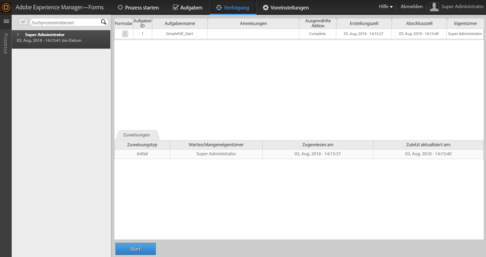

# Starten eines neuen Prozesses mit vorhandenen Prozessdaten in AEM Forms Workspace {#initiating-a-new-process-with-existing-process-data-in-aem-forms-workspace}

>[!CAUTION]
>
>AEM 6.4 hat das Ende der erweiterten Unterstützung erreicht und diese Dokumentation wird nicht mehr aktualisiert. Weitere Informationen finden Sie in unserer [technische Unterstützung](https://helpx.adobe.com/de/support/programs/eol-matrix.html). Unterstützte Versionen suchen [here](https://experienceleague.adobe.com/docs/?lang=de).

Sie können einen neuen Prozess mithilfe der Daten vorhandener Prozessdaten starten. Die Notwendigkeit, einen neuen Prozess aus vorhandenen Prozessdaten zu initiieren, entsteht, wenn wir dasselbe Formular häufig mit wenigen Inhaltsänderungen wie bei Paid-Time-off-Formularen verwenden müssen. Diese Funktion spart Zeit und Mühe für Benutzer, insbesondere wenn für den Prozess lange Formulare ausgefüllt werden müssen.

Im Folgenden werden die Schritte zum Initiieren eines neuen Prozesses aus vorhandenen Prozessdaten beschrieben:-

1. Führen Sie einen der folgenden Schritte aus:

   * Klicken Sie in Tracking auf die Prozessinstanz, deren Daten Sie verwenden möchten. Klicken Sie in der Ansicht &quot;Process History&quot;im rechten Bereich auf die Aufgabenzeile, die dem Startpunkt entspricht.
   * Wählen Sie unter Tracking eine Suchvorlage aus, um eine Liste der Prozessinstanzen anzuzeigen. Wählen Sie die Instanz aus, deren Daten Sie verwenden möchten.
   * Im **[!UICONTROL Aufgabenbereich]** Registerkarte die Aufgabe aus. Klicken Sie auf **[!UICONTROL Geschichte]** und wählen Sie die Aufgabe aus, die die Prozessinstanz initiiert hat.

    

1. In der Aufgabenaktionssymbolleiste klicken Sie auf **[!UICONTROL Start]**. Ein adaptives Formular für die neue Prozessinstanz wird mit automatischer Vorbefüllung angezeigt.

1. Aktualisieren Sie die Daten wie erforderlich und klicken Sie auf **[!UICONTROL Abschließen]** oder die entsprechende Schaltfläche im Formular.
