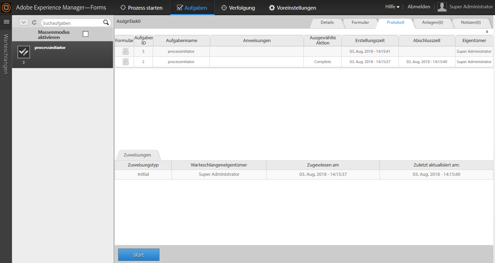

# Starten eines neuen Prozesses mit vorhandenen Prozessdaten in AEM Forms Workspace {#initiating-a-new-process-with-existing-process-data-in-aem-forms-workspace}

Sie können einen neuen Prozess mit den Daten eines vorhandenen Prozesses initiieren. Neue Prozesse aus vorhandenen Prozessdaten zu starten, wird erforderlich, wenn dasselbe Formular häufig verwendet werden muss, wobei sich der Inhalt geringfügig ändert, etwa bei Formularen für bezahlten Urlaub. Mithilfe dieser Funktion sparen Benutzer Zeit und Mühe, insbesondere, wenn ein umfangreiches Formular für den Prozess ausgefüllt werden muss.

Zum Starten eines neuen Prozesses aus bestehenden Prozessdaten sind die folgenden Schritte erforderlich:

1. Führen Sie einen der folgenden Schritte aus:

   * Klicken Sie unter „Verfolgung“ auf die Prozessinstanz, deren Daten Sie verwenden möchten. Klicken Sie in der Ansicht des Prozessverlaufs im rechten Bereich auf die Zeile der Aufgabe, die dem Startpunkt entspricht.
   * Wählen Sie in der Verfolgung eine Suchvorlage aus, um eine Liste von Prozessinstanzen anzuzeigen. Wählen Sie die Instanz aus, deren Daten Sie verwenden möchten.
   * Wählen Sie auf der Registerkarte **[!UICONTROL Aufgabenliste]** die Aufgabe aus. Klicken Sie auf die Registerkarte **[!UICONTROL Verlauf]** und wählen Sie die Aufgabe aus, die die Prozessinstanz initiiert hat.
    

1. In der Aufgabenaktionssymbolleiste klicken Sie auf **[!UICONTROL Start]**. Ein adaptives Formular für die neue Prozessinstanz wird mit automatischer Vorbefüllung angezeigt.

1. Aktualisieren Sie die Daten wie erforderlich und klicken Sie auf **[!UICONTROL Abschließen]** oder die entsprechende Schaltfläche im Formular.

