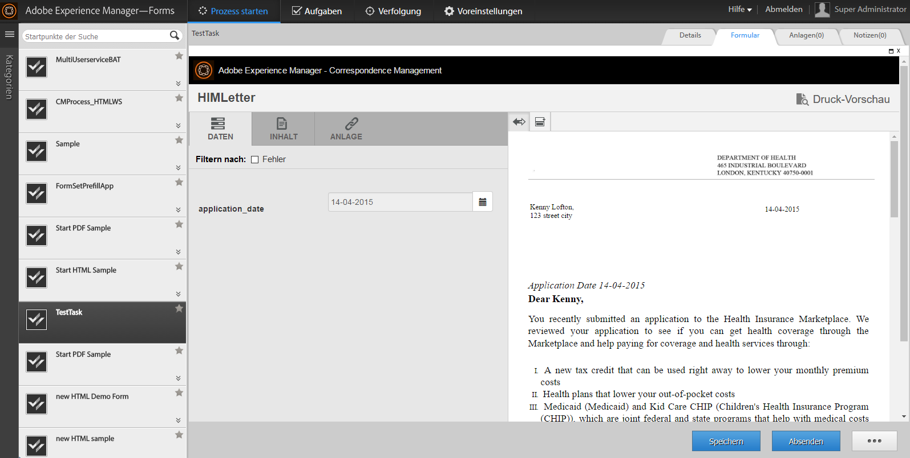

# Integrieren von Anwendungen von Drittanbietern in AEM Forms Workspace {#integrating-third-party-applications-in-aem-forms-workspace}

>[!CAUTION]
>
>AEM 6.4 hat das Ende der erweiterten Unterstützung erreicht und diese Dokumentation wird nicht mehr aktualisiert. Weitere Informationen finden Sie in unserer [technische Unterstützung](https://helpx.adobe.com/de/support/programs/eol-matrix.html). Unterstützte Versionen suchen [here](https://experienceleague.adobe.com/docs/?lang=de).

AEM Forms Workspace unterstützt die Verwaltung von Aufgabenzuweisungen und Abschlussaktivitäten für Formulare und Dokumente. Diese Formulare und Dokumente können im XDP-Format (Forms, Flex® oder Guides), die im XDP-, PDF-, HTML- oder Flex-Format wiedergegeben wurden, vorliegen.

Diese Funktionen werden weiter verbessert. AEM Forms unterstützt jetzt die Zusammenarbeit mit Drittanbieteranwendungen, die Funktionen ähnlich dem AEM Forms-Arbeitsbereich unterstützen. Ein gemeinsamer Teil dieser Funktion ist der Arbeitsablauf der Zuweisung und nachfolgenden Validierung einer Aufgabe. AEM Forms bietet AEM Forms-Unternehmensbenutzern ein einheitliches Erlebnis, sodass alle derartigen Aufgabenzuweisungen oder -genehmigungen für die unterstützten Anwendungen über AEM Forms Workspace verarbeitet werden können.

Beispiel: die Integration von Correspondence Management in AEM Forms Workspace. Correspondence Management umfasst das Konzept „Brief“, der abgerufen werden kann und Aktionen zulässt.

## Correspondence Management-Elemente erstellen {#create-correspondence-management-assets}

Erstellen Sie zuerst eine Beispielvorlage für Correspondence Management, die in AEM Forms Workspace wiedergegeben wird. Weitere Informationen finden Sie unter [Erstellen einer Briefvorlage](/help/forms/using/create-letter.md).

Greifen Sie auf die Correspondence Management-Vorlage über die URL zu, um zu überprüfen, ob die Correspondence Management-Vorlage abgerufen werden kann. Die URL weist ein Muster auf, das `https://[server]:[port]/lc/content/cm/createcorrespondence.html?cmLetterId=encodedLetterId&cmUseTestData=1&cmPreview=0;` ähnlich sieht.

Dabei ist `encodedLetterId` die URL-kodierte Brief-ID. Geben Sie dieselbe Brief-ID an, wenn Sie den Wiedergabeprozess für Workspace-Aufgaben in Workbench definieren.

## Erstellen einer Aufgabe zum Rendern und Senden eines Briefs in AEM Workspace {#create-a-task-to-render-and-submit-a-letter-in-aem-workspace}

Stellen Sie vor dem Ausführen dieser Schritte sicher, dass Sie Mitglied der folgenden Gruppen sind:

* cm-agent-users
* Workspace-Benutzer

Weitere Informationen finden Sie unter [Benutzer hinzufügen und konfigurieren](/help/forms/using/admin-help/adding-configuring-users.md).

Führen Sie die folgenden Schritte aus, um eine Aufgabe zum Rendern und Senden eines Briefs in AEM Workspace zu erstellen:

1. Starten Sie Workbench. Melden Sie sich bei localhost als Administrator an.
1. Klicken Sie auf Datei > Neu > Anwendung. Geben Sie in das Feld „Anwendungsname“ `CMDemoSample` ein und klicken Sie dann auf „Fertig stellen“.
1. Wählen Sie `CMDemoSample/1.0` und klicken Sie mit der rechten Maustaste auf `NewProcess`. Geben Sie in das Namensfeld `CMRenderer` ein und klicken Sie dann auf „Fertig stellen“.
1. Ziehen Sie die Aktivitätenauswahl für den Startpunkt und konfigurieren Sie sie:

   1. Wählen Sie unter Präsentationsdaten die Option CRX-Asset verwenden aus.

      

   1. Suchen Sie nach einem Asset. Im Dialogfeld &quot;Formular-Asset auswählen&quot;werden auf der Registerkarte &quot;Briefe&quot;alle Briefe auf dem Server aufgelistet.

      

   1. Wählen Sie den entsprechende Brief und klicken Sie auf **OK**.

1. Klicken Sie auf „Aktionsprofile verwalten“. Das Dialogfeld Aktionsprofil verwalten wird angezeigt. Stellen Sie sicher, dass die Optionen &quot;Render Process&quot;und &quot;Submit Process&quot;entsprechend ausgewählt sind.
1. Um den Brief mit einer Daten-XML-Datei zu öffnen, suchen Sie die entsprechende Datendatei und wählen Sie sie im Bereich &quot;Prepare Data Process&quot;aus.
1. Klicken Sie auf OK.
1. Definieren Sie die Variablen für &quot;Start Point Output&quot;und &quot;Task Attachments&quot;. Die definierten Variablen enthalten Daten zur Startpunktausgabe und zu Aufgabenanlagen.
1. (Optional) Um einen weiteren Benutzer zum Workflow hinzuzufügen, ziehen Sie eine Aktivitätsauswahl, konfigurieren Sie sie und weisen Sie sie einem Benutzer zu. Schreiben Sie einen benutzerdefinierten Wrapper (Beispiel unten) oder laden Sie den DSC herunter und installieren Sie ihn (siehe unten), um die Briefvorlage, die Startpunktausgabe und die Aufgabenanlage zu extrahieren.

   Ein benutzerdefinierter Beispielwrapper ist wie folgt:

   ```java
   public LetterInstanceInfo getLetterInstanceInfo(Document dataXML) throws Exception {
   try {
   if(dataXML == null)
   throw new Exception("dataXML is missing");
   
   CoreService coreService = getRemoteCoreService();
   if (coreService == null)
   throw new Exception("Unable to retrive service. Please verify connection details.");
   Map<String, Object> result = coreService.getLetterInstanceInfo(IOUtils.toString(dataXML.getInputStream(), "UTF-8"));
   LetterInstanceInfo letterInstanceInfo = new LetterInstanceInfo();
   
   List<Document> attachmentDocs = new ArrayList<Document>();
   List<byte[]> attachments = (List<byte[]>)result.get(CoreService.ATTACHMENT_KEY);
   if (attachments != null){
   for (byte[] attachment : attachments)
   { attachmentDocs.add(new Document(attachment)); }
   
   }
   letterInstanceInfo.setLetterAttachments(attachmentDocs);
   
   byte[] updateLayout = (byte[])result.get(CoreService.LAYOUT_TEMPLATE_KEY);
   if (updateLayout != null)
   { letterInstanceInfo.setLetterTemplate(new Document(updateLayout)); }
   
   else
   { throw new Exception("template bytes missing while getting Letter instance Info."); }
   
   return letterInstanceInfo;
   } catch (Exception e)
   { throw new Exception(e); }
   
   }
   ```

   [Datei laden](assets/dscsample.zip)`DSCSample.zip`
DSC herunterladen: Ein Beispiel-DSC ist in der Datei „“ verfügbar, die oben angehängt ist. Laden Sie die `DSCSample.zip` -Datei. Bevor Sie den DSC-Dienst verwenden, müssen Sie ihn konfigurieren. Weitere Informationen finden Sie unter[ Konfigurieren des DSC-Service](/help/forms/using/add-action-button-in-create-correspondence-ui.md#p-configure-the-dsc-service-p).

   Wählen Sie im Dialogfeld Aktivität definieren die entsprechende Aktivität wie getLetterInstanceInfo aus und klicken Sie auf **OK**.

1. Stellen Sie die Anwendung bereit. Wenn Sie dazu aufgefordert werden, checken Sie die Assets ein und speichern Sie sie.
1. Melden Sie sich bei AEM forms Workspace unter an. `https://[server]:[port]/lc/content/ws`.
1. Öffnen Sie die Aufgabe, die Sie hinzugefügt haben, CMRenderer. Der Correspondence Management-Brief wird angezeigt.

   

1. Geben Sie die erforderlichen Daten ein und senden Sie den Brief ab. Das Fenster schließt sich. In diesem Prozess wird die Aufgabe dem Benutzer zugewiesen, der in Schritt 9 im Workflow angegeben wurde.

   >[!NOTE]
   >
   >Die Schaltfläche Senden ist erst dann aktiviert, wenn alle erforderlichen Variablen im Brief ausgefüllt sind.
