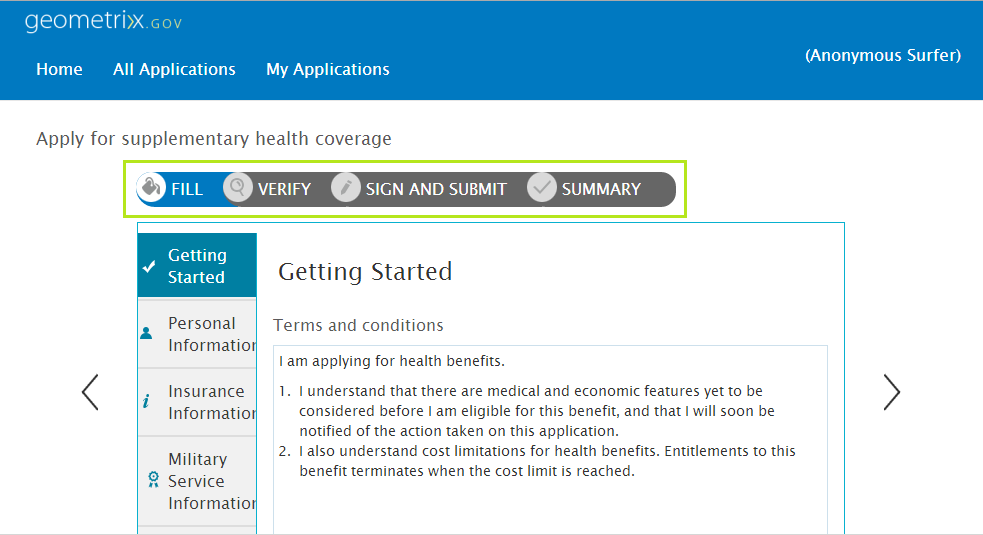

# Einführung in die mehrteilige Formularsequenz {#introduction-to-multi-step-form-sequence}

Mit adaptiven Formularen können Formularersteller eine mühelose mehrstufige Datenerfassung bereitstellen. Sie verfügen über integrierten Support, sodass mehrere Bedienfelder erstellt und alle Bedienfelder mit verschiedenen Navigationsmustern verknüpft werden können. Formularersteller können Formularfelder in logische Abschnitte gruppieren und jede Gruppe als Bedienfeld darstellen. Die gesamte Navigation zwischen den Bedienfeldern wird mithilfe des Bedienfeldlayouts gesteuert. Autoren können die Bedienfelder in unterschiedlichen Layouts anordnen, beispielsweise nacheinander mithilfe des Assistentenlayouts, oder ad hoc mithilfe des Registerkartenlayouts. Informationen zu Bereichslayouts finden Sie unter [Layout-Möglichkeiten für adaptive Formulare](/help/forms/using/layout-capabilities-adaptive-forms.md).

Normalerweise umfasst das Ausfüllen von Formularen mehr Schritte als die reine Datenerfassung. Die Übermittlung eines vollständigen Formulars kann andere Schritte enthalten, z. B. das digitale Signieren des Formulars, das Überprüfen der eingetragenen Informationen, das Verarbeiten von Zahlungen usw. Dies unterscheidet sich von Fall zu Fall.

Wenn in Ihrem Fall bestimmte Schritte für die Datenerfassung ausgeführt werden müssen oder aufgrund von Regelungen gefordert werden, bietet AEM Forms eine Möglichkeit, diese allgemeine Struktur bei allen Formularen durchzusetzen. Mit der Implementierung der vorher festgelegten Formularstruktur wird die Sequenz für ein Formular definiert. 

Nehmen wir ein Fallbeispiel, bei dem Sie für ein Formular eine Sequenz der Schritte „Ausfüllen“, „Überprüfen“, „Signieren“ und „Bestätigen“ erstellen müssen. Die Schritte zum Erstellen einer solchen Sequenz lauten wie folgt:

1. Definieren Sie eine Formularvorlage und fügen Sie ihr das erforderliche Bedienfeld hinzu. Beachten Sie, dass für jeden Schritt der Sequenz ein Bedienfeld vorhanden sein sollte. Sie können jedoch in ein Bedienfeld untergeordnete Bedienfelder einbinden.

   In diesem Beispiel werden die folgenden Bedienfelder hinzugefügt:

   * **Fill**: Enthält Formularfelder zur Datenerfassung. Hier können Sie verschachtelte untergeordnete Bedienfelder einfügen, um Abschnitte für verschiedene Arten von Informationen zu erstellen, z. B. persönlicher, familiärer, finanzieller Art usw.
   * **Verify**: Enthält die Komponente **Verify**, die in einem XFA-basierten adaptiven Formular verwendet werden kann. Es werden die Informationen angezeigt, die im Bedienfeld „Fill“ im schreibgeschützten Modus zur Überprüfung erfasst werden.
   * **E-sign**: Enthält die Komponente **Sign**, die in einem XFA-basierten adaptiven Formular verwendet werden kann. Es werden die folgenden Dienste zum Signieren bereitgestellt:

      * Adobe Document Cloud eSignature-Services
      * Freihändige Unterschrift
   * **Bestätigung**: Enthält die Komponente **Zusammenfassung**, in der die Übermittlung in einer Meldung bestätigt wird, nachdem der Benutzer das Formular signiert hat und in der Sequenz den Bestätigungsschritt (Zusammenfassung) erreicht hat. Autoren können den Text der Komponente Zusammenfassung konfigurieren, eine Dankesmeldung oder einen Link zur erstellten PDF-Datei anzeigen usw.

1. Wählen Sie für das Layout des Stammbedienfelds **[!UICONTROL Assistent]** aus.
1. Führen Sie die restlichen Schritte aus, um die Formularvorlage zu erstellen. Weitere Informationen hierzu finden Sie unter [Erstellen einer benutzerdefinierten adaptiven Formularvorlage](/help/forms/using/custom-adaptive-forms-templates.md).

Nachdem Sie die Formularsequenz in der Formularvorlage definiert haben, können Sie sie zum Erstellen von Formularen verwenden, deren Grundstruktur der gegenwärtig definierten Sequenz entspricht. Sie haben jedoch immer die Möglichkeit, das Formular Ihren Bedürfnissen anzupassen.
