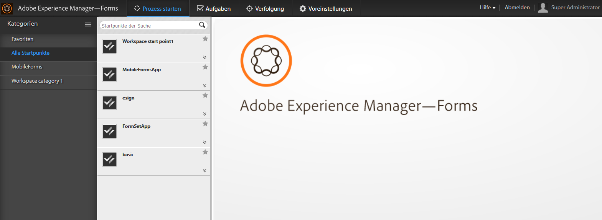

# Einführung in AEM Forms Workspace {#introduction-to-aem-forms-workspace}

>[!CAUTION]
>
>AEM 6.4 hat das Ende der erweiterten Unterstützung erreicht und diese Dokumentation wird nicht mehr aktualisiert. Weitere Informationen finden Sie in unserer [technische Unterstützung](https://helpx.adobe.com/de/support/programs/eol-matrix.html). Unterstützte Versionen suchen [here](https://experienceleague.adobe.com/docs/?lang=de).

Der Forms-Workflow erhöht die organisatorische Effizienz durch Automatisierung und Sichtbarkeit kritischer Dokument- und formularbezogener Geschäftsprozesse. Mit Process Management können Sie optimierte, durchgängige Workflows erstellen – einschließlich Personen, Systemen, Inhalt und Unternehmensregeln –, auf die online oder offline zugegriffen werden kann. Forms-Arbeitsablauf umfasst den AEM Forms Workspace. AEM Forms Workspace bietet neue Funktionen zur Erweiterung, Integration und benutzerfreundlicheren Gestaltung von Workspace.

AEM Forms Workspace ist mit einer breiteren Palette von Geräten und Formfaktoren kompatibel. Sie ermöglicht die Aufgabenverwaltung auf Clients ohne Flash® Player und Adobe® Reader®. Es erleichtert die Wiedergabe von HTML Forms zusätzlich zu PDF forms.

**Schlüsselfunktionen**:

* Interagieren Sie Prozessteilnehmer überall mit dynamischen PDF forms, mobilen Schnittstellen und Webanwendungen.
* Einfache Integration der Workspace-Komponenten in Ihre Webanwendungen. Da AEM Forms Workspace eine komponentenbasierte Software ist, lässt sie sich einfach anpassen und wiederverwenden.
* Erweitern Sie Geschäftsprozesse mit der AEM Forms Workspace-App auf mobile Online- und Offline-Mitarbeiter.
* Zeigen Sie Berichte an, um Rückstände, Warteschlangen und wichtige Leistungsindikatoren (KPIs) zu überwachen. Sie können APIs verwenden, um Daten für die weitere Analyse mithilfe von Reporting-Tools von Drittanbietern zu extrahieren.
