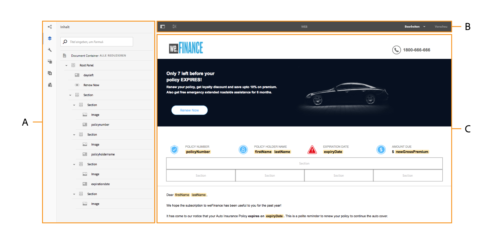

# Einführung in die Benutzeroberfläche für interaktive Kommunikationserstellung {#introduction-to-interactive-communication-authoring-ui}

Eine Einführung in die verschiedenen Elemente der Benutzeroberfläche, mit denen Sie interaktive Kommunikation erstellen können

Die Benutzeroberfläche für die Bearbeitung [Interaktive Kommunikation](/help/forms/using/interactive-communications-overview.md) ist intuitiv und bietet Folgendes für die Bearbeitung des Druck- und Webkanals der interaktiven Kommunikation:

* WYSIWYG Drag-and-Drop-Dokumenteditor
* Integriertes Repository für Assets - die auf den Server hochgeladenen und auf ihm erstellten Assets sind im Asset-Browser der Authoring-Oberfläche für interaktive Kommunikation verfügbar.

Wenn Sie eine [neue interaktive Kommunikation](/help/forms/using/create-interactive-communication.md) erstellen oder eine vorhandene bearbeiten, verwenden Sie die folgenden Elemente der Benutzeroberfläche:

* [Randleiste](#sidebar)
* [Seitensymbolleiste](#page-toolbar)

* [Komponenten-Symbolleiste](#component-toolbar)
* Inhaltsbereich

**A.** Seitenleiste **B.** Seitensymbolleiste **C.** Inhaltsbereich

## Randleiste {#sidebar}

[Zum Vergrößern hier klicken](assets/sidebar-comps-1.png)

**A.** Kanalbrowser **B.** Inhaltsbrowser **C.** Eigenschaftenbrowser **D.** Asset-Browser **E.** Komponenten-Browser **F.** Data Sources-Browser - Datenmodell **G.** Data Sources-Browser - Übergeordnete Inhalte

Die Seitenleiste beinhaltet Folgendes:

* **Kanalbrowser**

   Mit dem Kanalbrowser können Sie zwischen den Druck- und Internetkanälen der interaktiven Kommunikation wechseln. Je nach dem Kanal, den Sie im Kanalbrowser ausgewählt haben, zeigen die Browser, z. B. Inhalts- und Komponentenbrowser, die Optionen an.

* **Inhaltsbrowser**

   Im Inhaltsbrowser können Sie die Objekthierarchie des Dokuments für den ausgewählten Kanal sehen. Der Autor kann zu bestimmten Formularkomponenten navigieren, indem er auf das entsprechende Element in der Dokumentobjektstruktur tippt. Der Autor kann Objekte im Webkanal suchen und in dieser Struktur neu anordnen. 

* **Eigenschaften-Browser**

   Hier können Sie die Eigenschaften einer Komponente bearbeiten. Die Eigenschaften sind je nach Komponente verschieden. So zeigen Sie beispielsweise die Eigenschaften des Dokumentcontainers an:

   Wählen Sie eine Komponente aus und tippen Sie dann auf  > **Dokumentcontainer** und tippen Sie anschließend auf .

* **Assets-Browser**

   Trennt verschiedene Arten von Inhalten wie Layout-Fragmente, Bilder, Dokumente, Seiten, Videos. Der Autor kann Assets in die interaktive Kommunikation ziehen und ablegen.

* **Komponenten-Browser**

   Enthält Komponenten, mit denen Sie die Druck- und Webkanäle eines Dokuments erstellen können. Sie können Komponenten in die interaktive Kommunikation ziehen, um Elemente hinzuzufügen und hinzugefügte Elemente gemäß den Anforderungen zu konfigurieren. In der folgenden Tabelle werden die im Komponentenbrowser aufgelisteten Komponenten für Druck- und Webkanäle beschrieben. 

| **Komponente** | **Druckkanal** | **Webkanal** | **Funktion** |
|---|---|---|---|
| Diagramm | ✓ | ✓ | Fügt ein Diagramm hinzu, das Sie in interaktiver Kommunikation zur visuellen Darstellung von zweidimensionalen Daten verwenden können, die aus einem FDM-Sammlungselement abgerufen werden. |
| Dokumentfragment | ✓ | ✓ | Ermöglicht das Hinzufügen einer wiederverwendbaren Komponente, eines Texts, einer Liste oder einer Bedingung zu einer interaktiven Kommunikation. Die wiederverwendbare Komponente, die Sie einer interaktiven Kommunikation hinzufügen, kann entweder auf einem Formulardatenmodell oder ohne Formulardatenmodell basieren. |
| Bild | ✓ | ✓ | Ermöglicht es Ihnen, ein Bild einzufügen. |
| Bereich | - | ✓ | Die Bereichskomponente ist ein Platzhalter zum Gruppieren anderer Komponenten und steuert, wie eine Gruppe von Komponenten in einer interaktiven Kommunikation angeordnet wird. Mit einer Bereichskomponente können Sie auch eine Gruppe von Komponenten für den Endbenutzer wiederholbar machen, z. B. mehrere Einträge zum Ausfüllen von Bildungsnachweisen. Es empfiehlt sich außerdem, ein Bedienfeld für jede Registerkarte einer interaktiven Kommunikation mit mehreren Registerkarten zu verwenden. |
| Tabelle | &amp;ast; | ✓ | Fügt eine Tabelle hinzu, mit der Sie Daten in Zeilen und Spalten organisieren können. |
| Zielbereich | &amp;ast;&amp;ast; | ✓ | Fügt einen Zielbereich in einen Webkanal ein, um die webkanalspezifischen Komponenten zu organisieren. |
| Text | - | ✓ | Fügt dem Webkanal einer interaktiven Kommunikation Text hinzu. Text kann Formulardatenmodellobjekte verwenden, um den Inhalt dynamisch zu gestalten. |

&amp;ast; Verwenden Sie Layout-Fragmente im Druckkanal , um Tabellen hinzuzufügen.

&amp;ast;&amp;ast; Im Druckkanal sind Zielbereiche in der XDP-/Druckvorlage vordefiniert. Sie können keine neuen Zielbereiche mithilfe der Autorenoberfläche für die interaktive Kommunikation hinzufügen.

* **Data Sources-Browser**

   Der Data Sources-Browser zeigt die verfügbaren Datenquellen im Formulardatenmodell an, das Sie beim Erstellen der interaktiven Kommunikation ausgewählt haben.

### Wichtige Punkte für das Arbeiten mit Komponenten {#key-points-for-working-with-components}

Die wichtigsten Punkte beim Arbeiten mit interaktiven Kommunikationskomponenten sind:

* Jede Komponente verfügt über zugehörige Eigenschaften, die ihre Darstellung und Funktion steuern. Tippen Sie zum Konfigurieren der Eigenschaften einer Komponente auf die Komponente und tippen Sie auf  , um die Komponenteneigenschaften im Eigenschaftenbrowser zu öffnen.
* Eine Komponente wird mit ihrem Elementnamen gekennzeichnet. Wenn Sie auf können Sie den Namen der Komponente ändern, indem Sie den Wert des Felds Elementname im Eigenschaftenbrowser ändern. Das Feld „Elementname“ akzeptiert nur Buchstaben, Zahlen, Bindestriche (-) und Unterstriche (_). Andere Sonderzeichen sind nicht zulässig. Der Elementname muss mit einem Buchstaben beginnen.
* Sie können die Eigenschaft Titel einer Komponente der interaktiven Kommunikation inline im Editor ändern, ohne den Eigenschaftenbrowser zu öffnen, solange der Titel in der interaktiven Kommunikation sichtbar ist. Gehen Sie dazu wie folgt vor:

   1. Wählen Sie eine Komponente aus, in der die Eigenschaft Titel vorhanden und deren Eigenschaft Titel ausblenden deaktiviert ist, indem Sie darauf tippen.
   1. Tippen  um den Titel bearbeitbar zu machen.
   1. Ändern Sie den Titel und drücken Sie die Return-Taste oder tippen Sie auf eine beliebige Stelle außerhalb der Komponente, um die Änderungen zu speichern. Drücken Sie die Esc-Taste, um die Änderungen zu verwerfen.

## Komponenten-Symbolleiste {#component-toolbar}

Wenn Sie eine Komponente auswählen, sehen Sie eine Symbolleiste, die folgende Funktionen bietet. Sie erhalten Optionen zum Ausschneiden, Einfügen, Verschieben und Festlegen von Eigenschaften der Komponenten. Ihre Optionen sind:

A. **Konfigurieren**: Wenn Sie auf **Konfigurieren** tippen, werden in der Seitenleiste Komponenteneigenschaften sichtbar.

B. **Regeln bearbeiten**: Wenn Sie auf Regeln bearbeiten tippen, wird der Regeleditor angezeigt, in dem Sie Regeln für die ausgewählte Komponente bearbeiten und erstellen können. Im Regeleditor können Sie auch andere Formularobjekte (Komponenten) auswählen und Regeln für diese Formularobjekte bearbeiten/erstellen.

C. **Kopieren**: Sie können die Kopieroption verwenden, um eine Komponente zu kopieren und an andere Positionen im Formular einzufügen.

D. **Ausschneiden**: Sie können die Option zum Ausschneiden verwenden, um eine Komponente in der interaktiven Kommunikation von einer Position an eine andere zu verschieben.

E. **Löschen**: Hiermit können Sie die Komponente aus der interaktiven Kommunikation löschen.

F. **Komponente einfügen**: Ermöglicht das Einfügen einer Komponente über der ausgewählten Komponente.

G. **Einfügen**: Ermöglicht das Einfügen der Komponente, die Sie mit den oben beschriebenen Optionen ausgeschnitten oder kopiert haben.

H. **Gruppieren**: Mit dieser Funktion können Sie mehrere Komponenten auswählen, um sie zusammen auszuschneiden, zu kopieren oder einzufügen.

I. **Übergeordnet**: Hier können Sie das übergeordnete Element einer Komponente auswählen.

J. **Mehr**: Bietet weitere Optionen zum Arbeiten mit der ausgewählten Komponente.

* SOM-Ausdruck anzeigen (nur für Bereiche)
* Gruppenobjekte im Bereich (nur für Bereiche)
* Fragment bearbeiten (nur für Fragmente)
* Bereich als Fragment speichern (nur für Bereiche)
* Untergeordneten Bereich hinzufügen (nur für Bereiche)
* Bedienfeld-Symbolleiste hinzufügen (nur für Bereiche)
* Ersetzen (nicht für Bereiche)

## Seitensymbolleiste {#page-toolbar}

Die Seitensymbolleiste oben bietet Optionen, mit denen Sie eine Vorschau der interaktiven Kommunikation anzeigen und deren Eigenschaften ändern können. Sie können eine Vorschau der interaktiven Kommunikation anzeigen, wenn Sie sie erstellen, und entsprechend Änderungen vornehmen. In der Seitensymbolleiste wird Folgendes angezeigt:

* Seitliches Bedienfeld ein/aus: Hiermit können Sie die Seitenleiste ein- oder ausblenden.
* Seiteninformationen : Hiermit können Sie Seiteneigenschaften anzeigen.
* Emulator : Hiermit können Sie das Erscheinungsbild Ihrer interaktiven Kommunikation für verschiedene Displaygrößen (z. B. für Tablets und Smartphones) emulieren.
* Bearbeiten: Hiermit können Sie andere Modi auswählen, wie etwa: Bearbeiten, Stil, Entwickler und Design.

   * Bearbeiten: Ermöglicht die Bearbeitung der Eigenschaften der interaktiven Kommunikation und ihrer Komponenten. Dies tun Sie, indem Sie beispielsweise eine Komponente hinzufügen, ein Bild ablegen oder obligatorische Felder festlegen.
   * Stil: Hiermit können Sie das Erscheinungsbild von Komponenten der interaktiven Kommunikation stilistisch anpassen. Im Stilmodus können Sie beispielsweise einen Bereich auswählen und dessen Hintergrundfarbe festlegen.
   * Entwickler: Hier haben Entwickler folgende Möglichkeiten:

      * Erfahren Sie, woraus die interaktive Kommunikation besteht.
      * Debugging der am Formular durchgeführten Aktionen zur Behebung von Fehlern.
   * Target: Hiermit können Sie benutzerdefinierte Komponenten oder native Komponenten, die nicht in der Seitenleiste aufgeführt sind, aktivieren oder deaktivieren.

* Vorschau: Ermöglicht Ihnen eine Vorschau des Erscheinungsbilds der interaktiven Kommunikation, wenn Sie sie veröffentlichen.
