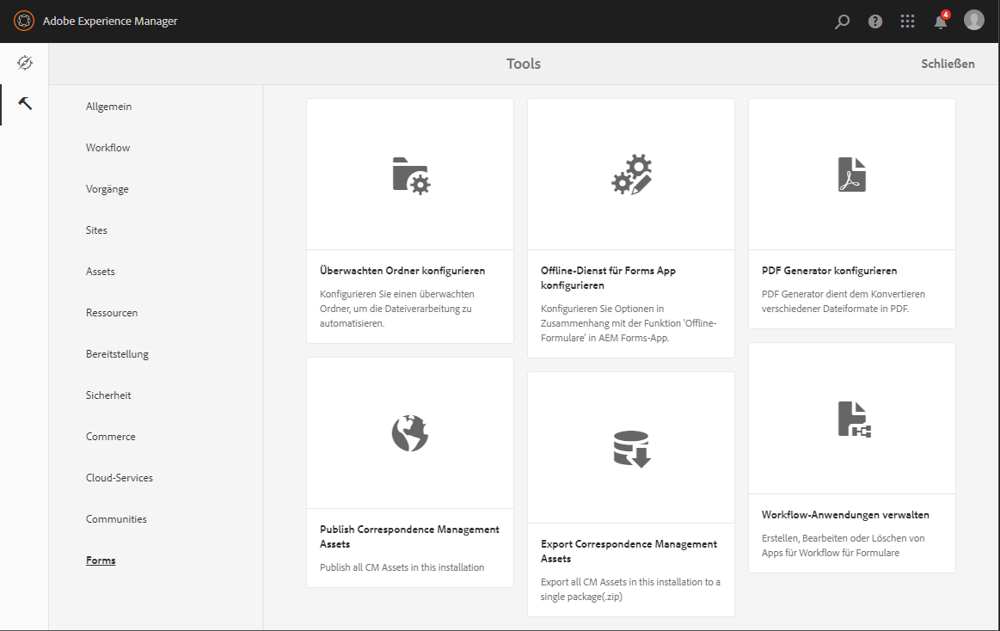

# Einführung in das Verwalten von Formularen {#introduction-to-managing-forms}

AEM Forms bietet eine vereinfachte und gleichzeitig leistungsstarke Benutzeroberfläche, in der Formular-Administratoren und -Entwickler Dokumente, Themen, Briefe Dokumentfragmente, Datenwörterbücher und damit zusammenhängende Assets erstellen und verwalten können. Sie hilft beim Verwalten des gesamten Lebenszyklus von Formularen, Dokumenten und zugehörigen Assets - vom Desktop eines Entwicklers bis zum Angebot\
es auf einem Portal-Server für Endbenutzer. Sie können die Benutzeroberfläche von AEM Forms für folgende Vorgänge verwenden:

* Auf AEM Forms-Komponenten zugreifen
* Auf AEM Forms-Konfigurationen zugreifen 

>[!NOTE]
>
>Ausführliche Informationen zu anderen AEM Tools und Optionen finden Sie unter [Arbeiten mit der Autorenumgebung](/help/sites-authoring/home.md).

## Auf AEM Forms-Komponenten zugreifen {#access-aem-forms-components}

Neben anderen Optionen zum Erstellen von Formularen, Dokumenten und verknüpften Asstes bietet AEM Optionen zum Erstellen von Sites, Asstes, zum Verwalten einer AEM-Instanz und mehr. Sie können auf die  Experience Manager-Logo, um zu allen verfügbaren Tools zu navigieren. Zusätzlich zu Konsolen von anderen Komponenten enthält es auch Links zu AEM Forms. Um zu AEM Forms zu navigieren, klicken Sie auf das **Logo des Experience Managers**  > **Navigation**  > **Forms**. Links der folgenden Konsolen werden angezeigt:

* Formulare und Dokumente
* Designs
* Briefe
* Dokumentfragmente
* Datenwörterbücher

### Formulare und Dokumente  {#forms-documents}

Formulare und Dokumente bietet Optionen zum Erstellen einer interaktiven Kommunikation, adaptiven Formularen, adaptiven Formularfragmenten und Formularsätzen. Nur für AEM Forms on JEE bietet Formulare &amp; Dokumente eine Option zum Importieren von Dateien von lokalen Speicherorten und synchronisiert AEM Forms-Assets mit Workbench.

Die Schaltfläche zum Erstellen ist der Startpunkt des Prozesses zur Erstellung oder zum Hochladen von AEM Forms-Assets. Sie bietet Ihnen Optionen zum Erstellen:

* **Interaktive Kommunikation**: Eine interaktive Kommunikation ist eine personalisierte, interaktive und gerätefreundliche HTML-basierte digitale Korrespondenz, Anweisung oder ein Dokument. Interaktive Kommunikationen sind responsiv, d. h., ihr Layout und Design passt sich automatisch an das Gerät und die Einstellungen des Benutzers an. Detaillierte Informationen finden Sie unter [Interaktive Kommunikation - Übersicht](/help/forms/using/interactive-communications-overview.md).

* **Adaptives Formular:** Ein adaptives Formular ist ein ansprechendes und interaktives Formular. Sie können adaptive Formulare erstellen, die sich dynamisch an Benutzereingaben anpassen, indem Felder oder Abschnitte je nach Antwort, Gerät oder Arbeitsumgebung des Benutzers hinzugefügt oder entfernt werden. Weitere Informationen zu adaptiven Formularen finden Sie unter [Einführung zum Erstellen adaptiver Formulare](/help/forms/using/introduction-forms-authoring.md).

* **Adaptive Formularfragmente:** Zwar wurde jedes Formular für einen bestimmten Zweck entwickelt, aber es gibt gängige Segmente in den meisten Formularen (z. B. für persönliche Angaben wie Name und Anschrift, Familienmitglieder, Einkommen usw.). Sie können ein individuelles Asset für derartige Abschnitte erstellen.  Diese wiederverwendbaren, eigenständigen Segmente werden als adaptive Formularfragmente bezeichnet. Weitere Informationen finden Sie unter [Adaptive Formularfragmente](/help/forms/using/adaptive-form-fragments.md).

* **Formularsatz**: Ein Formularsatz ist eine Sammlung von HTML5-Formularen, die zusammen gruppiert sind und als einzelner Formularsatz dem Endbenutzern präsentiert wird. Wenn der Benutzer ein Formularsatz ausfüllt, werden diese Informationen von einem Formular zu einem anderen übertragen. Am Ende kann ein Benutzer alle Formulare mit nur einem Klick als einzelne Entität senden. Weitere Informationen finden Sie unter[ Formularsatz in AEM Forms](/help/forms/using/formset-in-aem-forms.md).

* **Ordner:** Die Benutzeroberfläche von AEM Forms verwendet Ordner zum Anordnen von Assets. Sie unterstützt zwei Typen von Ordnern:

   * **Allgemeine Ordner:** Diese Ordner werden für Elemente verwendet, die in der Benutzeroberfläche von AEM Forms erstellt werden. Diese Ordner haben keine feste Ordnerstruktur. Sie können sie umbenennen, Unterordner erstellen und adaptive Formulare, interaktive Kommunikation adaptive Formularfragmente, Formularvorlagen (XDPs), PDF-Formulare, Dokumente und verwandte Assets in diesen Ordnern erstellen.
   * **Workflow-Ordner von Forms**: Diese Ordner werden erstellt, wenn Workbench-Prozesse (LiveCycle-Archieve) mit der Benutzeroberfläche von AEM Forms migriert und synchronisiert werden. Sie dürfen sie nicht umbenennen, einen Unterordner erstellen, eine interaktive Kommunikation erstellen, ein adaptives Formularfragment oder eine interaktive Kommunikation erstellen. Es ist auch nicht zulässig, einen Versionsordner zu löschen oder ein adaptives Formular, ein adaptives Formularfragment oder eine interaktive Kommunikation parallel zum Versionsordner zu erstellen und hochzuladen.

**A.** Allgemeiner Ordner **B.** Ordner &quot;Forms Workflow&quot;

Der Formular &amp; Dokumente-Bereich bietet auch Optionen für Folgendes:

* **Importieren von Dateien vom lokalen Speicherort:** Sie können PDF Formulare &amp; Dokumente importieren, Formularvorlagen (XFA-Formulare) und andere Ressourcen (Bild und XML-Schema für XSDs) importieren. Eine schrittweise Anleitung finden Sie unter [Importieren und Exportieren von Assets in AEM Forms](/help/forms/using/import-export-forms-templates.md).

* **Syncchronisieren von AEM Forms-Assets mitWorkbench:** Sie können die Option „Dateien von Workbench“ verwenden, um Assets zwischen der Benutzeroberfläche von AEM Forms und Workbench zu synchronisieren. Das gewährleistet, dass alle Assets in der Benutzeroberfläche von AEM Forms und der CRX-Repository-Assetauswahl von Workbench vorhandne sind.

### Designs  {#themes}

Zu einem Design gehört die Formatierung von Details für Komponenten und Bereiche. Design haben eine unabhängige Identität. Daher können Sie ein Design für mehrere adaptive Formulare wierverwenden. Sie können die Stile für eine Komponente festlegen oder CSS-Eigenschaften für die verschiedenen Komponenten in Ihrem Formular ändern. Die Stile umfassen Eigenschaften wie Hintergrundfarben, Statusfarben, Transparenz und Größe. Sie können Anpassungen in einem Design speichern und diese als Voreinstellung auf Komponenten des Formulars übertragen. Wenn Sie das Design zu einem Formular hinzufügen, bestimmt der festgelegte Stil die entsprechenden Komponenten des Formulars. Mit AEM Forms 6.2 können Sie Designs erstellen und sie dann auf Ihre Formulare anwenden.

Weitere Informationen finden Sie unter [Designs in AEM Forms](/help/forms/using/themes.md).

### Briefe  {#letters}

Ein AEM Forms-Brief ist ein sicheres, personalisiertes und interaktives Schriftstück. Sie können AEM Forms verwenden, um Briefe (auch als Schriftstück bekannt) von zuvor genehmigten und benutzerdefinierten Inhalten in einem vereinfachten Prozess zusammenzustellen.

Weitere Informationen finden Sie unter [Erstellen von Briefen](/help/forms/using/create-letter.md).

### Dokumentfragmente {#document-fragments}

Dokumentfragmente sind wiederverwendbare Teile/Komponenten einer Korrespondenz, mit der Sie Briefe/Korrespondenz erstellen können. Die Dokumentfragmente sind Texte, Listen, Bedingungen und Layoutfragmente. Detaillierte Informationen zu Dokumentfragmenten finden Sie unter [Erstellen von Fragmenten](/help/forms/using/document-fragments.md).

### Datenwörterbücher {#data-dictionaries}

In der Regel müssen Geschäftsbenutzer keine Kenntnisse über Metadatendarstellungen wie XSD (XML-Schema) und Java-Klassen haben. Sie müssen allerdings in der Regel Zugriff auf diese Datenstrukturen und Attribute haben, um Lösungen erstellen zu können. Mit Datenwörterbücher sind die Benutzer in der Lage, Informationen aus Back-End-Datenquellen zu verwenden, ohne technische Details der zugrunde liegenden Datenmodelle zu kennen.

Detaillierte Informationen zum Erstellen und Verwenden von Datenwörterbüchern finden Sie unter [Erstellen von Datenwörterbüchern](/help/forms/using/data-dictionary.md).

## Zugriff auf AEM Forms-Konfigurationen {#accessing-aem-forms-configurations}

AEM Tools-Bereich enthält Tools für verschiedene Komponenten. Um zu AEM Forms-spezifischen Tools zu navigieren, klicken Sie auf die Schaltfläche **Logo des Experience Managers**  > **tools**  > **Forms**. Tools zum Durchführen folgender Funktionen werden angezeigt:

* **Konfigurieren eines überwachten Ordners:** Ein Administrator kann einen Netzwerkordner konfigurieren, der als überwachter Ordner bezeichnet wird, sodass ein vorkonfigurierter Dienstvorgang zur Verarbeitung einer Datei gestartet wird, wenn ein Benutzer eine Datei (z. B. eine PDF-Datei) in diesem überwachten Ordner ablegt. <!-- Fix broken link For detailed information, see Create and Configure a watched folder. -->

* **Konfigurieren des Forms App Offline-Dienstes:** Der Offlinedienst für die AEM Forms-App speichert die Pfade oder URLs der in einem Formular verwendeten Ressourcen zwischen. Durch das Zwischenspeichern der Pfa oder URLs der in einem Formular verwendeten Ressourcen wird die serverseitige Leistung verbessert. Informationen zum Konfigurieren der serverseitigen Offlinekomponente der AEM Forms-App finden Sie unter [Arbeiten im Offline-Modus](/help/forms/using/work-offline-mode.md).

* **Konfigurieren von PDF Generator:** Ein Administrator kann AEM Forms PDF Generator-Einstellungen konfigurieren, Benutzerkonten hinzufügen und Konfiguration in PDF Generator importieren oder exportieren. 
* **Correspondence Management-Assets veröffentlichen:** Mit AEM Forms können Sie sofort alle Briefe, Dokumentfragmente, und Datenwörterbücher und verknüpfte Abhängigkeiten von einer Autorinstanz veröffentlichen. Die veröffentlichten Assets umfassen sämtliche Correspondence Management-Assets und ihre zugehörigen Abhängigkeiten. Detaillierte Informationen finden Sie unter [Veröffentlichen und Rückgängigmachen der Veröffentlichung von Formularen und Dokumenten](/help/forms/using/publishing-unpublishing-forms.md#publishallthecorrespondencemanagementassets).
* **Exportieren von Correspondence Management-Assets:** Verwenden Sie diese Option, um alle Correspondence Management-Assets und die zugehörigen Abhängigkeiten als Paket aus einer AEM Forms-Instanz herunterzuladen. Detaillierte Informationen finden Sie unter [Importieren und Exportieren von Assets in AEM Forms](/help/forms/using/import-export-forms-templates.md#importandexportassetsincorrespondencemanagement)

## Häufige Elemente der Benutzeroberfläche {#commonelements}

* **Linke Leiste:** Sie können auf das Symbol in der linken Leiste klicken  , um die Funktionen Timeline und Verweise von AEM Forms anzuzeigen.

   * **Zeitleiste:** Sie können Kommentare zu einem Asset hinzufügen, das für Review in der Zeitleiste verfügbar ist. Detaillierte Anweisungen finden Sie unter [Erstellen und Verwalten von Überprüfungen von Assets in Formularen](/help/forms/using/create-reviews-forms.md).
   * **Referenzen:** Ein AEM Forms-Asset kann in mehreren AEM Forms-Assets verwendet werden. Ein Dokumentfragment kann beispielsweise in mehreren Briefen verwendet werden. Referenzen sind eine Liste von Assets (andere Formulare oder Ressourcen), in denen das ausgewählte Asset verwendet wird, sowie die Liste anderer Assets, die das ausgewählte Asset verwendet.

* **Breadcrumbs:** Ein Breadcrumb gibt den Titel der aktuellen Konsole oder des Ordners an. Sie können auf die Breadcrumb-Option klicken, um zwischen den Ordnerebenen, die höher in der Hierarchie sind, zu navigieren.
* **Ansichtsschalter:** Sie können auf das Symbol Umschalter anzeigen klicken  oder  um schnell zwischen Listen- und Kartenansicht zu wechseln. Weitere Informationen zu häufigen Benutzeroberflächenkomponenten finden Sie unter [Arbeiten mit der Autorenumgebung](/help/sites-authoring/basic-handling.md).
* **Suchen:** Die Suchoption  bietet die Möglichkeit, schnell die benötigten Inhalte und Tools zu finden und zu ihnen zu springen. Geben Sie den Namen des Inhalts oder Produkts ein und wählen Sie aus den Vorschlägen, geben Sie z. B. „Dokumente“ ein, um Formulare und Dokumente oder Dokumentfragmente schnell zu suchen. Weitere Informationen zu  finden Sie im AEM 6.2-Artikel [Suche](/help/sites-authoring/search.md)
* **Aktionssymbolleiste**: Bei der Auswahl eines Assets wird die Aktionssymbolleiste über der Liste von Assets angezeigt. Sie enthält alle Management-Tools für das ausgewählte Asset. Sie können die Maus über ein Symbol bewegen, um die QuickInfo anzuzeigen, die die zugehörige Funktion beschreibt

>[!NOTE]
>
>Wenn ein Benutzer eine Suche auf einer beliebigen Konsole von Fomulare und Dokumente durchführt, dann enthält die Leiste nur **Filters &amp; Optionen**. Sie können Filter &amp; Optionen verwenden, um eine erweiterte Suche durchzuführen.

* **Aktionssymbolleiste**: Bei der Auswahl eines Assets wird die Aktionssymbolleiste über der Liste von Assets angezeigt. Sie enthält alle Management-Tools für das ausgewählte Asset. Sie können die Maus über ein Symbol bewegen, um die QuickInfo anzuzeigen, die die zugehörige Funktion beschreibt

