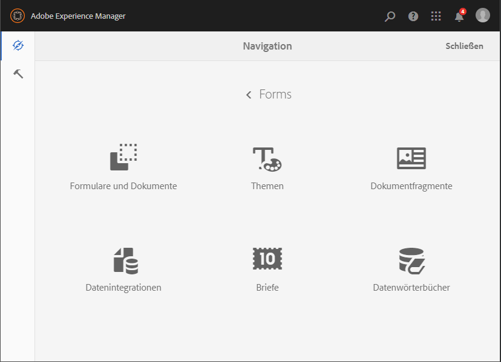

# Einführung in das Verwalten von Formularen {#introduction-to-managing-forms}

>[!CAUTION]
>
>AEM 6.4 hat das Ende der erweiterten Unterstützung erreicht und diese Dokumentation wird nicht mehr aktualisiert. Weitere Informationen finden Sie in unserer [technische Unterstützung](https://helpx.adobe.com/de/support/programs/eol-matrix.html). Unterstützte Versionen suchen [here](https://experienceleague.adobe.com/docs/?lang=de).

AEM Forms bietet eine vereinfachte und gleichzeitig leistungsstarke Benutzeroberfläche zum Erstellen und Verwalten von Formularen, Dokumenten, Designs, Briefen, Dokumentfragmenten, Datenwörterbüchern und zugehörigen Assets. Sie hilft beim Verwalten des gesamten Lebenszyklus von Formularen, Dokumenten und zugehörigen Assets - vom Desktop eines Entwicklers bis zum Angebot\
es auf einem Portal-Server für Endbenutzer. Sie können die AEM Forms-Benutzeroberfläche für folgende Aufgaben verwenden:

* Zugriff auf AEM Forms-Komponenten
* Zugriff auf AEM Forms-Konfigurationen

>[!NOTE]
>
>Ausführliche Informationen zu anderen AEM Tools und Optionen finden Sie unter [Arbeiten mit der Autorenumgebung](/help/sites-authoring/home.md).

## Zugriff auf AEM Forms-Komponenten {#access-aem-forms-components}

Neben Optionen zum Erstellen von Formularen, Dokumenten und zugehörigen Assets bietet AEM Optionen zum Erstellen von Sites, Assets, Verwalten einer AEM-Instanz und mehr. Sie können auf das Experience Manager-Logo  klicken, um zu allen verfügbaren Tools zu navigieren. Neben Links zu den Konsolen anderer Komponenten enthält es auch Links zu AEM Forms . Um zu AEM Forms zu navigieren, klicken Sie auf das **Logo des Experience Managers**  > **Navigation**  > **Forms**. Links der folgenden Konsolen werden angezeigt:

* Formulare und Dokumente
* Designs
* Briefe
* Dokumentfragmente
* Datenwörterbücher

### Formulare und Dokumente  {#forms-documents}

Forms und Dokumente bieten Optionen zum Erstellen einer interaktiven Kommunikation, eines adaptiven Formulars, adaptiven Formularfragments und eines Formularsatzes. Nur für AEM Forms on JEE bietet Forms &amp; Documents eine Option zum Importieren von Dateien aus dem lokalen Speicher und Synchronisieren von AEM Forms-Assets mit Workbench.

Die Schaltfläche &quot;Erstellen&quot;ist der Ausgangspunkt für das Erstellen oder Hochladen von AEM Forms-Assets. Sie bietet Ihnen Optionen zum Erstellen:

* **Interaktive Kommunikation**: Eine interaktive Kommunikation ist ein personalisiertes, interaktives und gerätefreundliches HTML-basiertes digitales Schriftstück, ein Bericht oder ein Dokument. Interaktive Kommunikationen sind responsiv, d. h., ihr Layout und Design passt sich automatisch an das Gerät und die Einstellungen des Benutzers an. Detaillierte Informationen finden Sie unter [Interaktive Kommunikation - Übersicht](/help/forms/using/interactive-communications-overview.md).

* **Adaptives Formular:** Ein adaptives Formular ist ein ansprechendes und interaktives Formular. Sie können adaptive Formulare erstellen, die sich dynamisch an Benutzereingaben anpassen, indem Felder oder Abschnitte je nach Antwort, Gerät oder Arbeitsumgebung des Benutzers hinzugefügt oder entfernt werden. Weitere Informationen zu adaptiven Formularen finden Sie unter [Einführung zum Erstellen adaptiver Formulare](/help/forms/using/introduction-forms-authoring.md).

* **Adaptive Formularfragmente:** Zwar wurde jedes Formular für einen bestimmten Zweck entwickelt, aber es gibt gängige Segmente in den meisten Formularen (z. B. für persönliche Angaben wie Name und Anschrift, Familienmitglieder, Einkommen usw.). Sie können ein individuelles Asset für derartige Abschnitte erstellen. Diese wiederverwendbaren, eigenständigen Segmente werden als „adaptive Formularfragmente“ bezeichnet. Weitere Informationen finden Sie unter [Adaptive Formularfragmente](/help/forms/using/adaptive-form-fragments.md).

* **Formularsatz:** Ein Formularsatz ist eine Sammlung von HTML5 Formularen, die gruppiert sind und Endbenutzern als ein Formularsatz präsentiert werden. Wenn der Benutzer ein Formularsatz ausfüllt, werden diese Informationen von einem Formular zu einem anderen übertragen. Am Ende kann ein Benutzer alle Formulare mit nur einem Mausklick als eine Einheit absenden. Weitere Informationen finden Sie unter[ Formularsatz in AEM Forms](/help/forms/using/formset-in-aem-forms.md).

* **Ordner:** Die Benutzeroberfläche von AEM Forms verwendet Ordner zum Anordnen von Assets. Sie unterstützt zwei Typen von Ordnern:

   * **Allgemeiner Ordner:** Diese Ordner werden für Assets verwendet, die in der Benutzeroberfläche von AEM Forms erstellt wurden. Diese Ordner haben keine feste Ordnerstruktur. Sie können sie umbenennen, Unterordner erstellen und adaptive Formulare, interaktive Kommunikation adaptive Formularfragmente, Formularvorlagen (XDPs), PDF-Formulare, Dokumente und verwandte Assets in diesen Ordnern erstellen.
   * **Forms Workflow-Ordner:** Forms-Workflow-Ordner werden erstellt, wenn Workbench-Prozesse (LiveCycle-Archive) migriert und mit der AEM Forms-Benutzeroberfläche synchronisiert werden. Sie dürfen sie nicht umbenennen, einen Unterordner erstellen, eine interaktive Kommunikation erstellen, ein adaptives Formularfragment oder eine interaktive Kommunikation erstellen. Sie dürfen auch keinen Versionsordner löschen oder parallel zum Versionsordner ein adaptives Formular, ein adaptives Formularfragment oder eine interaktive Kommunikation erstellen und hochladen.

**A.** Allgemeiner Ordner **B.** Ordner „Forms Workflow“

Das Bedienfeld &quot;Forms&quot;und &quot;Dokument&quot;bietet außerdem Optionen für Folgendes:

* **Importieren Sie Dateien aus dem lokalen Speicher:** Sie können PDF forms und Dokumente, Formularvorlagen (XFA-Formulare) und andere Ressourcen (Bild- und XML-Schema für XSDs) importieren. Eine schrittweise Anleitung finden Sie unter [Importieren und Exportieren von Assets in AEM Forms](/help/forms/using/import-export-forms-templates.md).

* **Syncchronisieren von AEM Forms-Assets mit Workbench:** Sie können die Option „Dateien von Workbench“ verwenden, um Assets zwischen der Benutzeroberfläche von AEM Forms und Workbench zu synchronisieren. Dadurch wird sichergestellt, dass alle Assets in der AEM Forms-Benutzeroberfläche und in der CRX-Repository-Asset-Auswahl von Workbench verfügbar sind.

### Designs  {#themes}

Ein Design enthält Stildetails für Komponenten und Bereiche. Themen haben eine unabhängige Identität. Sie können also ein Design für mehrere adaptive Formulare wiederverwenden. Sie können Stile für eine Komponente angeben oder CSS-Eigenschaften für verschiedene Komponenten ändern, die in Ihren Formularen verwendet werden. Stile umfassen Eigenschaften wie Hintergrundfarben, Statusfarben, Transparenz und Größe. Sie können Anpassungen in einem Design speichern und sie als Vorgabe auf Komponenten Ihres Formulars portieren. Wenn Sie das Design zum Formular hinzufügen, spiegelt der angegebene Stil die entsprechenden Komponenten des Formulars wider. Mit AEM 6.2 Forms können Sie Designs erstellen und auf Ihre Formulare anwenden.

Informationen zum Erstellen und Verwenden von Designs finden Sie unter [Designs in AEM Forms](/help/forms/using/themes.md).

### Briefe  {#letters}

Ein AEM Formular-Brief ist eine sichere, personalisierte und interaktive Korrespondenz. Sie können AEM Forms verwenden, um Briefe (auch als Korrespondenzen bezeichnet) aus vorab genehmigten wie aus benutzerdefinierten Inhalten in einem optimierten Prozess zusammenzustellen.

Informationen zur Erstellung und Verwendung von Briefen finden Sie unter [Brief erstellen](/help/forms/using/create-letter.md).

### Dokumentfragmente {#document-fragments}

Dokumentfragmente sind wiederverwendbare Teile/Komponenten einer Korrespondenz, mit der Sie Briefe/Korrespondenz erstellen können. Die Dokumentfragmente weisen den Typ Text, Liste, Bedingung und Layout-Fragment auf. Informationen zum Erstellen und Verwenden von Dokumentfragmenten finden Sie unter [Erstellen von Dokumentfragmenten](/help/forms/using/document-fragments.md).

### Datenwörterbücher {#data-dictionaries}

In der Regel müssen Geschäftsbenutzer keine Kenntnisse über Metadatendarstellungen wie XSD (XML-Schema) und Java-Klassen haben. Sie müssen allerdings in der Regel Zugriff auf diese Datenstrukturen und Attribute haben, um Lösungen erstellen zu können. AEM Forms verwendet Datenwörterbücher, mit denen Unternehmensbenutzer Informationen aus Back-End-Datenquellen verwenden können, ohne technische Details zu den zugrunde liegenden Datenmodellen zu kennen.

Detaillierte Informationen zum Erstellen und Verwenden von Datenwörterbüchern finden Sie unter [Erstellen von Datenwörterbüchern](/help/forms/using/data-dictionary.md).

## Zugriff auf AEM Forms-Konfigurationen {#accessing-aem-forms-configurations}

AEM Tools-Bereich enthält Tools für verschiedene Komponenten. Um zu AEM Forms-spezifischen Tools zu navigieren, klicken Sie auf die Schaltfläche **Logo des Experience Managers**  > **tools**  > **Forms**. Es werden Tools zur Ausführung der folgenden Funktionen angezeigt:

* **Überwachten Ordner konfigurieren:** Ein Administrator kann einen Netzwerkordner konfigurieren, der als überwachter Ordner bezeichnet wird, sodass ein vorkonfigurierter Vorgang gestartet wird, wenn ein Benutzer eine PDF-Datei (z. B. eine Datei) in den überwachten Ordner legt, und die Datei bearbeitet wird. <!-- Fix broken link For detailed information, see Create and Configure a watched folder. -->

* **Konfigurieren des Forms App Offline-Dienstes:** Der Offlinedienst für die AEM Forms-App speichert die Pfade oder URLs der in einem Formular verwendeten Ressourcen zwischen. Durch das Zwischenspeichern der Pfa oder URLs der in einem Formular verwendeten Ressourcen wird die serverseitige Leistung verbessert. Um die Server-seitige Offline-Komponente der AEM Forms-App zu konfigurieren, siehe [Arbeiten im Offlinemodus](/help/forms/using/work-offline-mode.md).

* **PDF Generator konfigurieren:** Administratoren können AEM Forms PDF Generator-Einstellungen konfigurieren, Benutzerkonten hinzufügen und Konfigurationen in den PDF Generator importieren oder exportieren.
* **Correspondence Management-Assets veröffentlichen:** Mit AEM Forms können Sie alle Briefe, Dokumentfragmente, Datenwörterbücher und zugehörigen Abhängigkeiten von einer Autoreninstanz gleichzeitig veröffentlichen. Die veröffentlichten Assets umfassen sämtliche Correspondence Management-Assets und ihre zugehörigen Abhängigkeiten. Ausführliche Informationen finden Sie unter [Veröffentlichen und Aufheben des Veröffentlichens von Formularen und Dokumenten](/help/forms/using/publishing-unpublishing-forms.md#publishallthecorrespondencemanagementassets).
* **Correspondence Management-Assets exportieren:** Sie können alle Correspondence Management-Assets und die zugehörigen Abhängigkeiten als Paket von einer AEM Formularinstanz herunterladen. Detaillierte Informationen finden Sie unter [Importieren und Exportieren von Assets in AEM Forms](/help/forms/using/import-export-forms-templates.md#importandexportassetsincorrespondencemanagement)

## Häufige Elemente der Benutzeroberfläche {#commonelements}

* **Linke Leiste:** Sie können auf das Symbol in der linken Leiste klicken  , um die Funktionen Timeline und Verweise von AEM Forms anzuzeigen.

   * **Zeitleiste:** Sie können Kommentare zu einem Asset hinzufügen, das für Review in der Zeitleiste verfügbar ist. Detaillierte Anweisungen finden Sie unter [Erstellen und Verwalten von Überprüfungen von Assets in Formularen](/help/forms/using/create-reviews-forms.md).
   * **Verweise:** Ein AEM Forms-Asset kann in mehreren AEM Forms-Assets verwendet werden. Ein Dokumentfragment kann beispielsweise in mehreren Briefen verwendet werden. „Referenzen“ besteht aus einer Liste von Assets (andere Formulare oder Ressourcen), in denen das ausgewählte Asset verwendet wird, und einer Liste anderer Assets, die das ausgewählte Asset seinerseits verwendet. 

* **Breadcrumbs:** Eine Breadcrumb-Leiste stellt den Titel der aktuellen Konsole oder des aktuellen Ordners dar. Sie können auf die Option Breadcrumb klicken, um zwischen den Ebenen der Ordner zu navigieren, die in der Hierarchie höher sind.
* **Umschalter anzeigen**: Sie können auf das Symbol „Umschalter anzeigen“  oder  klicken, um schnell zwischen Listen- und Kartenansicht zu wechseln. Weitere Informationen zu allgemeinen Komponenten der Benutzeroberfläche finden Sie unter [Arbeiten mit der Autorenumgebung](/help/sites-authoring/basic-handling.md).
* **Suche**: Die Suchoption  bietet Funktionen zum schnellen Suchen und Springen zu benötigten Inhalten und Tools. Geben Sie den Namen des Inhalts oder der Produktfunktion ein und wählen Sie aus den Vorschlägen. Geben Sie z. B. „Dokumente“ ein, um schnell die Konsole der Formulare und Dokumente oder der Dokumentfragmente zu finden und dorthin zu navigieren. Weitere Informationen zu finden Sie im AEM 6.2-Artikel [Suche](/help/sites-authoring/search.md)
* **Aktionssymbolleiste**: Beim Auswählen eines Assets wird die Aktionssymbolleiste über der Liste der Assets angezeigt. Es enthält alle Verwaltungstools für das ausgewählte Asset. Sie können die Maus über ein Symbol bewegen, um die QuickInfo anzuzeigen, die die zugehörige Funktion beschreibt

>[!NOTE]
>
>Wenn ein Benutzer eine Suche in einer beliebigen Konsole von Forms und Dokumenten durchführt, enthält die Leiste nur **Filter und Optionen**. Sie können Filter und Optionen verwenden, um eine erweiterte Suche durchzuführen.

* **Aktionssymbolleiste**: Beim Auswählen eines Assets wird die Aktionssymbolleiste über der Liste der Assets angezeigt. Es enthält alle Verwaltungstools für das ausgewählte Asset. Sie können die Maus über ein Symbol bewegen, um die QuickInfo anzuzeigen, die die zugehörige Funktion beschreibt

