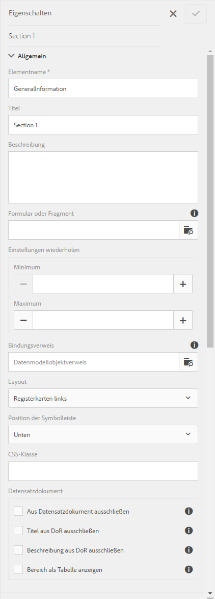
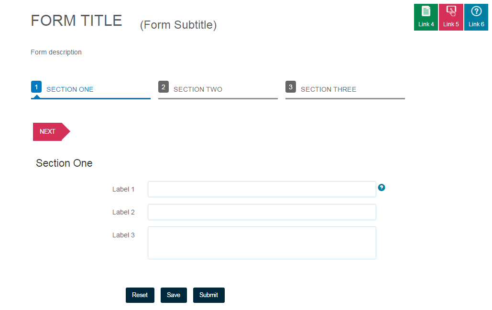

# Layout-Möglichkeiten für adaptive Formulare {#layout-capabilities-of-adaptive-forms}

Mit Adobe Experience Manager (AEM) können Sie benutzerfreundliche adaptive Formulare erstellen, den Endbenutzern eine dynamische Erfahrung bietet. Mit dem Formular-Layout wird gesteuert, wie Elemente bzw. Komponenten auf einem adaptiven Formular angezeigt werden.

## Vorausgesetztes Wissen {#prerequisite-knowledge}

Bevor Sie die verschiedenen Layoutfunktionen adaptiver Formulare kennenlernen, lesen Sie die folgenden Artikel, um mehr über adaptive Formulare zu erfahren.

[Einführung in AEM Forms](/help/forms/using/introduction-aem-forms.md)

[Einführung in die Erstellung von Formularen](/help/forms/using/introduction-forms-authoring.md)

## Layouttypen {#types-of-layouts}

In adaptiven Formularen stehen Ihnen die folgenden Layouttypen zur Verfügung:

**Bedienfeldlayout** Steuert, wie Elemente oder Komponenten in einem Bedienfeld auf einem Gerät angezeigt werden.

**Mobile** LayoutSteuert die Navigation eines Formulars auf einem Mobilgerät. Wenn das Gerät eine Breite von mindestens 768 Pixel aufweist, wird das Layout als Layout für Mobilgeräte betrachtet und für Mobilgeräte optimiert.

**Symbolleiste** LayoutSteuert die Platzierung der Aktionsschaltflächen in der Symbolleiste oder Bereichssymbolleiste eines Formulars.

Alle diese Bedienfeldlayouts werden in den folgenden Verzeichnissen definiert:

`/libs/fd/af/layouts`.

>[!NOTE]
>
>Um das Layout eines adaptiven Formulars zu ändern, verwenden Sie den Bearbeitungsmodus in AEM.


## Bereichslayout {#panel-layout}

Formularersteller können jedem Bedienfeld eines adaptiven Formulars ein Layout zuordnen, einschließlich des Stammbedienfelds.

Die Bedienfeldlayouts stehen unter `/libs/fd/af/layouts/panel` zur Verfügung.


**FormularsAbbildung:** *Liste der Bereichslayouts in adaptiven Formularen*

### Reaktionsschnell – alles auf einer Seite ohne Navigation {#responsive-everything-on-one-page-without-navigation-br}

Verwenden Sie dieses Bedienfeldlayout, um ein reaktionsfähiges Layout zu erstellen, das sich ohne spezielle Navigation an die Bildschirmgröße Ihres Geräts anpasst.

Mithilfe dieses Layouts können Sie mehrere Komponenten des adaptiven Bedienfelds **[!UICONTROL Bedienfeld]** nacheinander platzieren.


**Abbildung:** *Formular mit reaktionsfähigem Layout, wie auf einem kleinen Bildschirm dargestellt*


**Abbildung:** *Formular mit reaktionsfähigem Layout, wie auf einem großen Bildschirm dargestellt*

### Assistent – ein Mehrstufenformular, bei dem jeder einzelne Schritt genau angezeigt wird {#wizard-a-multi-step-form-showing-one-step-at-a-time}

Verwenden Sie dieses Bedienfeldlayout, um in einem Formular eine geführte Navigation anzubieten. Beispielsweise können Sie dieses Layout verwenden, wenn Sie in einem Formular obligatorische Informationen erfassen und dabei die Benutzer Schritt für Schritt anleiten möchten.

Verwenden Sie die Komponente `Panel adaptive form`, um eine schrittweise Navigation innerhalb eines Bereichs bereitzustellen. Wenn Sie dieses Layout verwenden, gehen Benutzer erst dann zum nächsten Schritt über, wenn der aktuelle Schritt abgeschlossen ist.

```
window.guideBridge.validate([], this.panel.navigationContext.currentItem.somExpression)
```



**Abbildung: Ausdruck** *zum Abschluss von Schritten im Assistenten-Layout für ein mehrstufiges Formular*



**Abbildung:** *Ein Formular mit dem Assistenten*

### Layout für Akkordeon-Design {#layout-for-accordion-design}

Mithilfe dieses Layouts können Sie die Komponente `Panel adaptive form` in einem Bedienfeld mit Akkordeonnavigation platzieren. Mit diesem Layout können Sie außerdem wiederholbare Bedienfelder erstellen. Mit wiederholbaren Bedienfeldern können Sie Bedienfelder nach Bedarf hinzuzufügen oder entfernen. Sie können dabei die minimale und maximale Anzahl der Wiederholungen eines Bedienfelds festlegen. Außerdem kann auf Basis der in den Bedienfeldelementen bereitgestellten Informationen der Titel des Bedienfelds dynamisch festgelegt werden.

Der Zusammenfassungsausdruck kann verwendet werden, um im Titel des minimierten Bedienfelds die vom Endbenutzer eingegebenen Werte anzuzeigen.


**Abbildung:** *Wiederholbare Bedienfelder mit dem Akkordeon-Layout*

### Layout mit Registerkarten – Registerkarten werden auf der linken Seite angezeigt {#tabbed-layout-tabs-appear-on-the-left}

Mithilfe dieses Layouts können Sie die Komponente `Panel adaptive form` in einem Bedienfeld mit Registerkartennavigation platzieren. Die Registerkarten befinden sich auf der linken Seite der Bedienfeldinhalte.


**Abbildung:** *Registerkarten links neben einem Bedienfeld*

### Layout mit Registerkarten – Registerkarten werden oben angezeigt {#tabbed-layout-tabs-appear-on-the-top}

Mithilfe dieses Layouts können Sie die Komponente `Panel adaptive form` in einem Bedienfeld mit Registerkartennavigation platzieren. Die Registerkarten befinden sich oberhalb der Bedienfeldinhalte.


**Abbildung:** *Registerkarten oben im Bedienfeld*

## Layout für Mobilgeräte {#mobile-layouts}

Layouts für Mobilgeräte ermöglichen eine benutzerfreundliche Navigation auf mobilen Geräten mit relativ kleinen Bildschirmen. Bei Layouts für Mobilgeräte werden für die Formularnavigation entweder Registerkarten oder Assistenten verwendet. Durch die Anwendung eines Layouts für Mobilgeräte wird für das gesamte Formular ein einziges Layout zur Verfügung gestellt.

Dieses Layout steuert die Navigation mit einer Navigationsleiste und einem Hauptnavigationsmenü. Die Navigationsleiste zeigt das Symbol **&lt;** und **** an, um die Navigationsschritte **next** und **previous** im Formular anzuzeigen.

Die Layouts für Mobilgeräte stehen unter `/libs/fd/af/layouts/mobile/` zur Verfügung. Die folgenden Layouts für Mobilgeräte stehen in adaptiven Formularen standardmäßig zur Verfügung.


**Abbildung:** *Liste von Layouts für Mobilgeräte in adaptiven Formularen*

Wenn Sie ein Layout für Mobilgeräte verwenden, ist das Formularmenü für den Zugriff auf verschiedene Formularbedienfelder verfügbar, indem Sie auf das Symbol  tippen.

### Layout mit Bedienfeldtiteln in der Formularkopfzeile {#layout-with-panel-titles-in-the-form-header}

Wie der Name schon sagt, werden bei diesem Layout neben dem Navigationsmenü und der Navigationsleiste Bedienfeldtitel angezeigt. Außerdem enthält dieses Layout Symbole für „Nächste“ und „Vorherige“ zur Navigation.


**Abbildung:** *Mobile Layouts mit Bedienfeldtiteln in den Formularkopfzeilen*

### Layout ohne Bedienfeldtitel in der Formularkopfzeile {#layout-without-panel-titles-in-the-form-header}

Wie der Name schon sagt, werden bei diesem Layout nur das Navigationsmenü und die Navigationsleiste ohne Bedienfeldtitel angezeigt. Außerdem enthält dieses Layout Symbole für „Nächste“ und „Vorherige“ zur Navigation.


**Abbildung:** *Mobile Layouts ohne Bedienfeldtitel in den Formularkopfzeilen*

## Symbolleistenlayouts {#toolbar-layouts}

Ein Symbolleistenlayout steuert die Positionierung und Anzeige von Aktionsschaltflächen, die Sie Ihren adaptiven Formularen hinzufügen. Das Layout kann auf Formular- oder Bedienfeldebene hinzugefügt werden.


**Abbildung:** *Liste der Symbolleistenlayouts in adaptiven Formularen*

Symbolleistenlayouts stehen unter `/libs/fd/af/layouts/toolbar` zur Verfügung. Adaptive Formulare stehen in den folgenden Symbolleistenlayouts standardmäßig zur Verfügung.

### Standardlayout für Symbolleiste {#default-layout-for-toolbar}

Dieses Layout wird als Standardlayout ausgewählt, wenn Sie einem adaptiven Formular Aktionsschaltflächen hinzufügen. Bei Auswahl dieses Layouts wird sowohl bei Desktop- als auch bei Mobilgeräten dasselbe Layout angezeigt.

Außerdem können Sie mehrere Symbolleisten mit Aktionsschaltflächen hinzufügen, die mit diesem Layout konfiguriert wurden. Eine Aktionsschaltfläche ist mit einem Formularsteuerelement verknüpft. Sie können die Werkzeugleisten so konfigurieren, dass sie sich vor oder nach einem Bedienfeld befinden.


**Abbildung:** *Standardmäßige Ansicht für die Symbolleiste*

### Mobiles festes Layout für Symbolleiste {#mobile-fixed-layout-for-toolbar}

Wählen Sie dieses Layout aus, um für Desktop- und Mobilgeräte alternative Layouts zur Verfügung zu stellen.

Für das Desktoplayout können Sie mithilfe bestimmter Beschriftungen Aktionsschaltflächen hinzufügen. Mit diesem Layout kann nur eine Symbolleiste konfiguriert werden. Wenn mit diesem Layout mehr als eine Symbolleiste konfiguriert wird, gibt es bei mobilen Geräten Überlagerungen und es ist nur eine Symbolleiste sichtbar. Sie können beispielsweise eine Symbolleiste am oberen oder unteren Rand des Formulars oder vor oder nach den Bedienfeldern im Formular einfügen.

Beim Layout für Mobilgeräte können Sie mithilfe von Symbolen Aktionsschaltflächen hinzufügen.


**Abbildung: Festes Layout** *für Mobilgeräte für die Symbolleiste*

