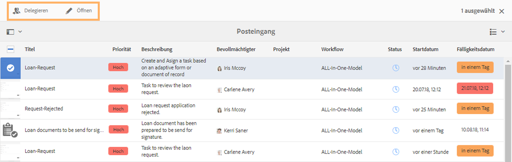
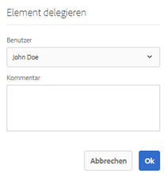
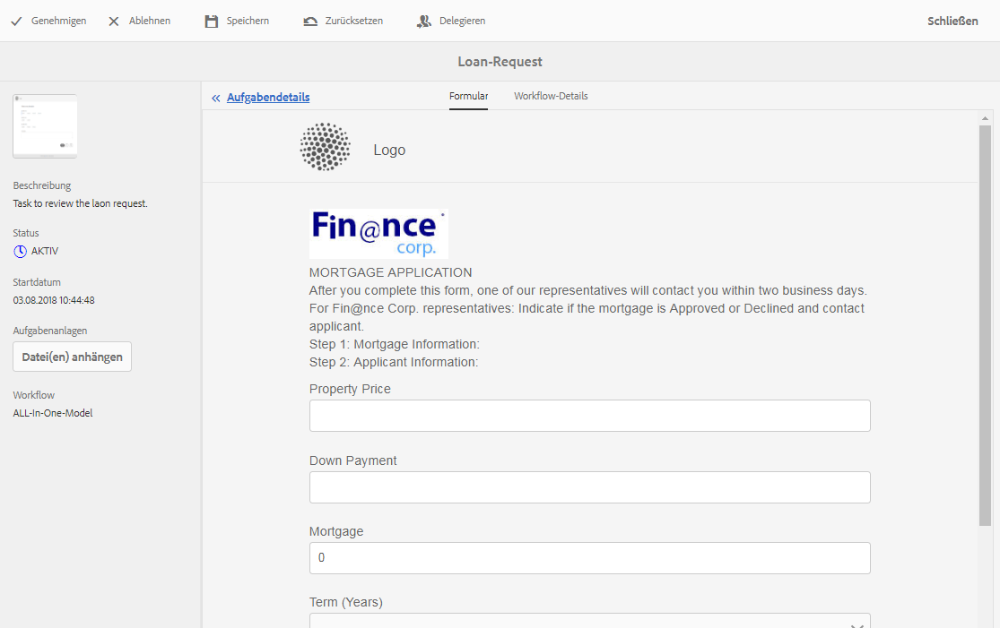
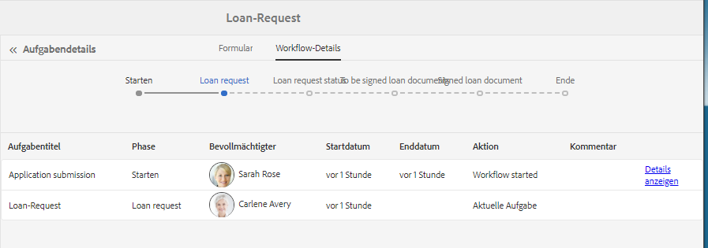
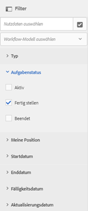
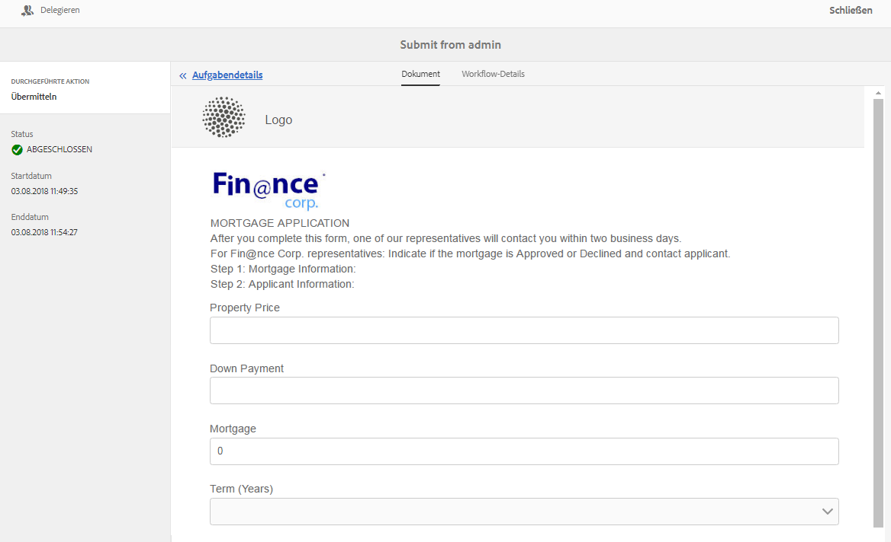
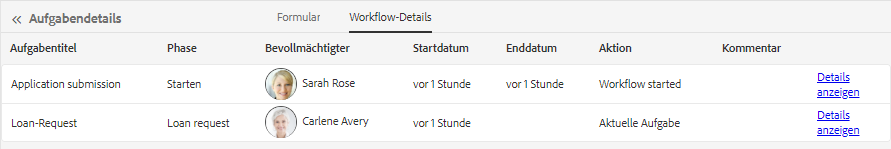

# Verwalten von Formularanwendungen und Aufgaben im AEM-Posteingang  {#manage-forms-applications-and-tasks-in-aem-inbox}

Zu den vielen Möglichkeiten, einen formularzentrierten Workflow zu starten oder auszulösen, gehören Anwendungen im AEM-Posteingang. Sie müssen eine Workflow-Anwendung erstellen, um einen Forms-Workflow als Anwendung im Posteingang verfügbar zu machen. Weitere Informationen zu Workflow-Anwendungen und anderen Möglichkeiten zum Starten von Forms-Workflows finden Sie unter [Starten eines formularzentrierten Workflow auf OSGi](/help/forms/using/aem-forms-workflow.md#launch).

Darüber hinaus führt der AEM-Posteingang Benachrichtigungen und Aufgaben aus verschiedenen AEM-Komponenten einschließlich Forms-Workflows zusammen. Wenn ein Forms-Workflow ausgelöst wird, der einen Schritt zur Zuweisung einer Aufgabe enthält, wird die dazugehörige Anwendung als Aufgabe im Posteingang der zugewiesenen Person angezeigt. Wenn der Empfänger eine Gruppe ist, wird die Aufgabe im Posteingang aller Gruppenmitglieder angezeigt, bis eine Person die Aufgabe beansprucht oder delegiert.

In der Benutzeroberfläche des Posteingangs können die Aufgaben in einer Listen- oder einer Kalenderansicht angezeigt werden. Sie können außerdem die Einstellungen für die Anzeige konfigurieren. Sie können die Aufgaben nach verschiedenen Parametern filtern. Weitere Informationen zum Anzeigen und Filtern finden Sie unter [Ihr Posteingang](/help/sites-authoring/inbox.md).

Kurz zusammengefasst: Mit dem Posteingang können Sie neue Anwendungen erstellen und zugewiesene Aufgaben verwalten.

>[!NOTE]
>
>Damit Sie den AEM-Posteingang verwenden können, müssen Sie der Gruppe „workflow-users“ angehören.

## Anwendung erstellen {#create-application}

1. Rufen Sie AEM Posteingang auf unter `https://[server]:[port]/aem/inbox`.
1. Tippen Sie in der Benutzeroberfläche des Posteingangs auf **[!UICONTROL Erstellen > Programm]**. Die Seite „Programm auswählen“ wird angezeigt.
1. Wählen Sie ein Programm aus und klicken Sie auf **[!UICONTROL Erstellen]**. Das zu der Anwendung gehörige adaptive Formular wird geöffnet. Füllen Sie die Formulare aus und tippen Sie auf **[!UICONTROL Einsenden]**. Der dazugehörige Workflow wird gestartet und erstellt eine Aufgabe im Posteingang des Empfängers.

## Aufgaben verwalten {#manage-tasks}

Wenn ein Forms-Workflow ausgelöst wird und Sie der Empfänger sind oder einer Empfängergruppe angehören, wird eine Aufgabe in Ihrem Posteingang angezeigt. Sie können im Posteingang Aufgabendetails anzeigen und verfügbare Aktionen für die Aufgabe ausführen.

### Aufgaben annehmen oder delegieren {#claim-or-delegate-tasks}

Aufgaben, die einer Gruppe zugewiesen sind, werden im Posteingang aller Gruppenmitglieder angezeigt. Jedes Gruppenmitglied kann diese Aufgabe annehmen oder an ein anderes Gruppenmitglied delegieren. Gehen Sie dazu wie folgt vor:

1. Tippen Sie auf die Miniaturansicht der Aufgabe, um sie auszuwählen. Optionen zum Öffnen oder Delegieren der Aufgabe werden oben angezeigt.

   

1. Führen Sie einen der folgenden Schritte aus:

   * Um die Aufgabe delegieren, tippen Sie auf **[!UICONTROL Delegieren]**. Das Dialogfeld „Element delegieren“ wird geöffnet. Wählen Sie einen Benutzer aus, fügen Sie optional einen Kommentar ein und tippen Sie auf **[!UICONTROL OK]**.

   

   * Um die Aufgabe anzunehmen, tippen Sie auf **[!UICONTROL Öffnen]**. Das Dialogfeld „Selbst zuweisen“ wird geöffnet. Tippen Sie auf **[!UICONTROL Weiter]**, um die Aufgabe anzunehmen. Die angenommene Aufgabe wird mit Ihnen als Empfänger in Ihrem Posteingang angezeigt.

   

### Aufgabendetails anzeigen und Aktionen für Aufgaben durchführen {#view-details-and-perform-actions-on-tasks}

Wenn Sie eine Aufgabe öffnen, können Sie Aufgabendetails anzeigen und verfügbare Aktionen durchführen. Die für eine Aufgabe verfügbaren Aktionen werden im Schritt „Aufgabe zuweisen“ des dazugehörigen Forms-Workflows definiert.

1. Tippen Sie auf die Miniaturansicht der Aufgabe, um sie auszuwählen. Optionen zum Öffnen oder Delegieren der ausgewählten Aufgabe werden oben angezeigt.
1. Tippen Sie auf **[!UICONTROL Öffnen]**, um die Aufgabendetails anzuzeigen und Aktionen auszuführen. Die detaillierte Aufgabenansicht wird geöffnet. In dieser Ansicht können Sie Aufgabendetails anzeigen und verfügbare Aktionen für die Aufgabe ausführen.

   >[!NOTE]
   >
   >Wenn eine Aufgabe einer Gruppe zugewiesen ist, müssen Sie sie annehmen, damit Sie sie in der detaillierten Ansicht anzeigen können.

Die detaillierte Aufgabenansicht umfasst die folgenden Abschnitte:

* Aufgabendetails
* Formular
* Workflow-Details
* Aktionssymbolleiste

#### Aufgabendetails {#task-details}

Der Abschnitt „Aufgabendetails“ zeigt Informationen zur Aufgabe an. Welche Informationen angezeigt werden, hängt von den Konfigurationseinstellungen aus dem Schritt [Aufgabe zuweisen](/help/sites-developing/workflows-step-ref.md) im Workflow ab.. Das Beispiel oben zeigt die Beschreibung, den Status, das Startdatum und den verwendeten Workflow für die Aufgabe an. Es ist außerdem möglich, Dateien an Aufgaben anzuhängen.

#### Formular {#form}

Auf der Registerkarte „Formular“ im Hauptinhaltsbereich werden das übermittelte Formular und gegebenenfalls Anhänge für einzelne Felder angezeigt.

#### Workflow-Details {#workflow-details}

Die Registerkarte „Workflow-Details“ oben zeigt den Fortschritt der Aufgabe in verschiedenen Phasen des Workflows an. Sie zeigt abgeschlossene, aktuelle und ausstehende Phasen der Aufgabe. Die Phasen für einen Workflow werden im Schritt [Aufgabe zuweisen](/help/sites-developing/workflows-step-ref.md) des dazugehörigen Workflows definiert.

Darüber hinaus wird auf der Registerkarte der Aufgabenverlauf für jede abgeschlossene Phase im Workflow angezeigt. Sie können auf **[!UICONTROL Details anzeigen]** für eine abgeschlossene Phase tippen, um Details zu dieser Phase anzuzeigen. Dies zeigt Kommentare, Formular- und Aufgabenanhänge, Status, Start- und Enddatum usw. für die Aufgabe an.

#### Aktionssymbolleiste {#actions-toolbar}

Die Aktionssymbolleiste zeigt alle verfügbaren Optionen für die Aufgabe. Speichern, Zurücksetzen und Delegieren sind Standardaktionen, andere verfügbare Aktionen werden dagegen im Schritt [Aufgabe zuweisen](/help/sites-developing/workflows-step-ref.md) konfiguriert. Im obigen Beispiel sind „Genehmigen“ und „Ablehnen“ im Workflow konfiguriert.

Wenn Sie eine Aktion für die Aufgabe ausführen, wird diese im Workflow weitergeleitet.

### Abgeschlossene Aufgaben anzeigen {#view-completed-tasks}

Im AEM-Posteingang werden nur aktive Aufgaben angezeigt. Abgeschlossene Aufgaben werden nicht in der Liste aufgeführt. Sie können jedoch mithilfe von Posteingangsfiltern Aufgaben basierend auf verschiedenen Parametern filtern, z. B. Aufgabentyp, Status, Start- und Enddatum usw. Abgeschlossene Aufgaben anzeigen:

1. Tippen Sie im AEM-Posteingang auf , um die Filterauswahl zu öffnen.
1. Tippen Sie auf das Akkordeon **[!UICONTROL Aufgabenstatus]** und wählen Sie **[!UICONTROL Fertig stellen]**. Alle Ihre abgeschlossenen Aufgaben werden angezeigt.

   

1. Wählen Sie eine Aufgabe durch Tippen aus und klicken Sie auf **[!UICONTROL Öffnen]**.

Die Aufgabe wird geöffnet und das dazugehörige Dokument oder adaptive Formular wird angezeigt. Für adaptive Formulare zeigt es das schreibgeschützte adaptive Formular oder das PDF-Datensatzdokument an, wie auf der Registerkarte Formular/Dokument der [Workflow-Schritt &quot;Aufgabe zuweisen&quot;](/help/sites-developing/workflows-step-ref.md).

Im Abschnitt mit den Aufgabendetails werden Informationen wie die durchgeführte Aktion, der Aufgabenstatus, das Startdatum und das Enddatum angezeigt.

Auf der Registerkarte **[!UICONTROL Workflow-Details]** werden alle Schritte des Workflows angezeigt. Tippen Sie bei einem Schritt auf **[!UICONTROL Details anzeigen]**, um detaillierte Informationen zu erhalten.

