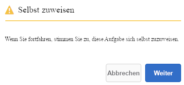

# Verwalten von Formularanwendungen und Aufgaben im AEM-Posteingang  {#manage-forms-applications-and-tasks-in-aem-inbox}

>[!CAUTION]
>
>AEM 6.4 hat das Ende der erweiterten Unterstützung erreicht und diese Dokumentation wird nicht mehr aktualisiert. Weitere Informationen finden Sie in unserer [technische Unterstützung](https://helpx.adobe.com/de/support/programs/eol-matrix.html). Unterstützte Versionen suchen [here](https://experienceleague.adobe.com/docs/?lang=de).

Eine der vielen Möglichkeiten, einen Forms-orientierten Workflow zu starten oder Trigger, besteht darin, Anwendungen in AEM Posteingang zu verwenden. Sie müssen eine Workflow-Anwendung erstellen, um einen Forms-Workflow als Anwendung im Posteingang verfügbar zu machen. Weitere Informationen zu Workflow-Anwendungen und anderen Möglichkeiten zum Starten von Forms-Workflows finden Sie unter [Starten eines formularzentrierten Workflow auf OSGi](/help/forms/using/aem-forms-workflow.md#launch).

Darüber hinaus konsolidiert AEM Posteingang Benachrichtigungen und Aufgaben aus verschiedenen AEM Komponenten, einschließlich Forms-Workflows. Wenn ein Arbeitsablauf für Formulare ausgelöst wird, der einen Schritt &quot;Aufgabe zuweisen&quot;enthält, wird die zugehörige Anwendung als Aufgabe im Posteingang des Empfängers aufgeführt. Wenn der Bevollmächtigte eine Gruppe ist, wird die Aufgabe im Posteingang aller Gruppenmitglieder angezeigt, bis eine Person die Aufgabe beansprucht oder delegiert.

Die Benutzeroberfläche des Posteingangs bietet Listen- und Kalenderansichten zum Anzeigen von Aufgaben. Sie können auch die Anzeigeeinstellungen konfigurieren. Sie können Aufgaben anhand verschiedener Parameter filtern. Weitere Informationen zum Anzeigen und Filtern finden Sie unter [Ihr Posteingang](/help/sites-authoring/inbox.md).

Kurz zusammengefasst: Mit dem Posteingang können Sie neue Anwendungen erstellen und zugewiesene Aufgaben verwalten.

>[!NOTE]
>
>Sie müssen Mitglied der Gruppe &quot;workflow-users&quot;sein, um AEM Posteingang verwenden zu können.

## Anwendung erstellen {#create-application}

1. Rufen Sie AEM Posteingang auf unter `https://[server]:[port]/aem/inbox`.
1. Tippen Sie in der Benutzeroberfläche des Posteingangs auf **[!UICONTROL Erstellen > Programm]**. Die Seite „Programm auswählen“ wird angezeigt.
1. Wählen Sie ein Programm aus und klicken Sie auf **[!UICONTROL Erstellen]**. Das mit der Anwendung verknüpfte adaptive Formular wird geöffnet. Füllen Sie die Formulare aus und tippen Sie auf **[!UICONTROL Einsenden]**. Der dazugehörige Workflow wird gestartet und erstellt eine Aufgabe im Posteingang des Empfängers.

## Aufgaben verwalten {#manage-tasks}

Wenn ein Forms-Workflow-Trigger und Sie ein Bevollmächtigter oder eine Gruppe von Bevollmächtigten sind, wird eine Aufgabe in Ihrem Posteingang angezeigt. Sie können Aufgabendetails anzeigen und verfügbare Aktionen für die Aufgabe im Posteingang durchführen.

### Aufgaben annehmen oder delegieren {#claim-or-delegate-tasks}

Aufgaben, die einer Gruppe zugewiesen sind, werden im Posteingang aller Gruppenmitglieder angezeigt. Jedes Gruppenmitglied kann diese Aufgabe anfordern oder an ein anderes Gruppenmitglied delegieren. Gehen Sie dazu wie folgt vor:

1. Tippen Sie, um die Miniaturansicht der Aufgabe auszuwählen. Optionen zum Öffnen oder Delegieren der Aufgabe werden oben angezeigt.

   

1. Führen Sie einen der folgenden Schritte aus:

   * Um die Aufgabe zuzuweisen, tippen Sie auf **[!UICONTROL Delegieren]**. Das Dialogfeld Element delegieren wird geöffnet. Wählen Sie einen Benutzer aus, fügen Sie optional einen Kommentar ein und tippen Sie auf **[!UICONTROL OK]**.

   

   * Um die Aufgabe anzufordern, tippen Sie auf **[!UICONTROL Öffnen]**. Das Dialogfeld &quot;Assign to Self&quot;wird geöffnet. Tippen Sie auf **[!UICONTROL Weiter]**, um die Aufgabe anzunehmen. Die angeforderte Aufgabe wird mit Ihnen als Verantwortlicher in Ihrem Posteingang angezeigt.

   

### Aufgabendetails anzeigen und Aktionen für Aufgaben durchführen {#view-details-and-perform-actions-on-tasks}

Wenn Sie eine Aufgabe öffnen, können Sie Aufgabendetails anzeigen und verfügbare Aktionen ausführen. Die für eine Aufgabe verfügbaren Aktionen werden im Schritt Aufgabe zuweisen des zugehörigen Forms-Workflows definiert.

1. Tippen Sie, um die Miniaturansicht der Aufgabe auszuwählen. Die Optionen zum Öffnen oder Delegieren der ausgewählten Aufgabe werden oben angezeigt.
1. Tippen **[!UICONTROL Öffnen]** , um Aufgabendetails anzuzeigen und Aktionen auszuführen. Die detaillierte Aufgabenansicht wird geöffnet. In dieser Ansicht können Sie Aufgabendetails anzeigen und Aktionen für die Aufgabe ausführen.

   >[!NOTE]
   >
   >Wenn eine Aufgabe einer Gruppe zugewiesen ist, müssen Sie sie anfordern, um sie in der Detailansicht öffnen zu können.

Die detaillierte Aufgabenansicht umfasst die folgenden Abschnitte:

* Aufgabendetails
* Formular
* Workflow-Details
* Aktionssymbolleiste

#### Aufgabendetails {#task-details}

Der Abschnitt „Aufgabendetails“ zeigt Informationen zur Aufgabe an. Welche Informationen angezeigt werden, hängt von den Konfigurationseinstellungen aus dem Schritt [Aufgabe zuweisen](/help/sites-developing/workflows-step-ref.md) im Workflow ab.. Im obigen Beispiel werden die Beschreibung, der Status, das Startdatum und der Workflow angezeigt, die für die Aufgabe verwendet werden. Sie können auch eine Datei an die Aufgabe anhängen.

#### Formular {#form}

Auf der Registerkarte „Formular“ im Hauptinhaltsbereich werden das übermittelte Formular und gegebenenfalls Anhänge für einzelne Felder angezeigt.

#### Workflow-Details {#workflow-details}

Die Registerkarte Workflow-Details oben zeigt den Fortschritt der Aufgabe in verschiedenen Phasen des Workflows an. Es werden die abgeschlossenen, aktuellen und ausstehenden Phasen der Aufgabe angezeigt. Die Phasen für einen Workflow werden im Schritt [Aufgabe zuweisen](/help/sites-developing/workflows-step-ref.md) des dazugehörigen Workflows definiert.

Darüber hinaus zeigt die Registerkarte den Aufgabenverlauf für jede abgeschlossene Phase im Workflow an. Sie können auf **[!UICONTROL Details anzeigen]** für eine abgeschlossene Phase, um Details zu dieser Phase zu erfahren. Es werden Kommentare, Formular- und Aufgabenanlagen, Status, Start- und Enddaten usw. zu der Aufgabe angezeigt.

#### Aktionssymbolleiste {#actions-toolbar}

In der Aktionssymbolleiste werden alle verfügbaren Optionen für die Aufgabe angezeigt. Während &quot;Speichern&quot;, &quot;Zurücksetzen&quot;und &quot;Delegieren&quot;Standardaktionen sind, werden andere verfügbare Aktionen in [Schritt &quot;Aufgabe zuweisen&quot;](/help/sites-developing/workflows-step-ref.md). Im obigen Beispiel werden Genehmigen und Ablehnen im Workflow konfiguriert.

Wenn Sie die Aufgabe bearbeiten, wird sie im Workflow weiter ausgeführt.

### Abgeschlossene Aufgaben anzeigen {#view-completed-tasks}

AEM Posteingang zeigt nur aktive Aufgaben an. Abgeschlossene Aufgaben werden nicht in der Liste angezeigt. Sie können jedoch Posteingangsfilter verwenden, um Aufgaben anhand verschiedener Parameter zu filtern, z. B. Aufgabentyp, Status, Start- und Enddatum usw. Abgeschlossene Aufgaben anzeigen:

1. Tippen Sie im AEM-Posteingang auf , um die Filterauswahl zu öffnen.
1. Tippen Sie auf das Akkordeon **[!UICONTROL Aufgabenstatus]** und wählen Sie **[!UICONTROL Fertig stellen]**. Alle abgeschlossenen Aufgaben werden angezeigt.

   

1. Wählen Sie eine Aufgabe durch Tippen aus und klicken Sie auf **[!UICONTROL Öffnen]**.

Die Aufgabe wird geöffnet und das dazugehörige Dokument oder adaptive Formular wird angezeigt. Für adaptive Formulare zeigt es das schreibgeschützte adaptive Formular oder das PDF-Datensatzdokument an, wie auf der Registerkarte Formular/Dokument der [Workflow-Schritt &quot;Aufgabe zuweisen&quot;](/help/sites-developing/workflows-step-ref.md).

Im Abschnitt mit den Aufgabendetails werden Informationen wie die durchgeführte Aktion, der Aufgabenstatus, das Startdatum und das Enddatum angezeigt.

Auf der Registerkarte **[!UICONTROL Workflow-Details]** werden alle Schritte des Workflows angezeigt. Tippen Sie bei einem Schritt auf **[!UICONTROL Details anzeigen]**, um detaillierte Informationen zu erhalten.

