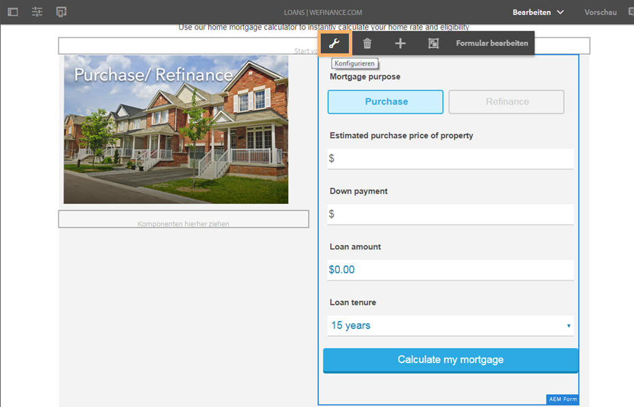

# Konfigurieren von Microsoft Dynamics 365 für den Hypotheken-Workflow der We.Finance-Referenz-Website {#configure-microsoft-dynamics-for-the-home-mortgage-workflow-of-the-we-finance-reference-site}

>[!CAUTION]
>
>AEM 6.4 hat das Ende der erweiterten Unterstützung erreicht und diese Dokumentation wird nicht mehr aktualisiert. Weitere Informationen finden Sie in unserer [technische Unterstützung](https://helpx.adobe.com/de/support/programs/eol-matrix.html). Unterstützte Versionen suchen [here](https://experienceleague.adobe.com/docs/?lang=de).

Erfahren Sie, wie Sie die Microsoft® Dynamics 365-Dienste über adaptive Formulare für den Hypotheken-Workflow der We.Finance-Referenz-Website nutzen können.

## Übersicht {#overview}

Microsoft® Dynamics 365 ist eine Customer Relationship Management(CRM)- und Enterprise Resource Planning(ERP)-Software, die Enterprise-Lösungen zum Erstellen und Verwalten von Kundenkonten, Kontakten, Leads, Chancen und Fällen bereitstellt.

AEM Forms bietet einen Cloud-Service zur Integration von Dynamics 365 mit dem Modul [Datenintegration für AEM Forms](/help/forms/using/data-integration.md) an. Das Szenario [Anleitung zur Hypothekenanwendung mit Microsoft® Dynamics](/help/forms/using/finance-reference-site-walkthrough.md#home-mortgage-application-walkthrough-with-microsoft-dynamics) zeigt, wie ein Kunde die We.Finance-Referenz-Website verwendet, um einen Kredit zu beantragen, wenn die Site Microsoft® Dynamics für die Forms-Datenintegration verwendet. Bevor Sie die schrittweise Anleitung zum Hypothekantrag mit Microsoft® Dynamics verwenden können, müssen Sie Microsoft® Dynamics 365 konfigurieren, damit es mit der We.Finance-Referenzwebsite verwendet werden kann.

## Voraussetzungen {#prerequisites}

Bevor Sie Dynamics 365 einrichten und konfigurieren, stellen Sie Folgendes sicher:

* [Einrichten und Konfigurieren von AEM Forms-Referenz-Sites](/help/forms/using/setup-reference-sites.md).

* AEM 6.3 Forms Service Pack 1 und höher
* Microsoft® Dynamics 365-Konto
* Registrierte Anwendung für den Dynamics 365-Dienst mit Microsoft® Azure Active Directory
* Client-ID und Client-Geheimnis für die registrierte Anwendung

## Verknüpfen Sie den Hypothekenrechner mit Ihrer Startseite. {#link-the-home-mortgage-calculator-with-your-site-home-page}

1. Wechseln Sie in der Autoreninstanz zur folgenden Seite:

   https://[Server]:[port]/editor.html/content/we-finance/global/en/loan-landing-page.html

1. Scrollen Sie nach unten zum Hypothekrechner.
1. Markieren Sie das Bedienfeld der rechten Spalte (Taschenrechner) und tippen Sie auf , um das Popup-Menü anzuzeigen. Tippen Sie im Popup-Menü auf Konfigurieren. Das Dialogfeld &quot;AEM Forms-Container bearbeiten&quot;wird angezeigt.

   

1. Navigieren Sie im Dialogfeld „AEM Forms-Container bearbeiten“ zum Asset-Pfad, wählen Sie den Hypothekrechner unter dem folgenden Pfad aus und tippen Sie auf **Bestätigen**:

   formsanddocuments/We.Finance/MS Dynamics/

   

1. Tippen Sie auf **Fertig**.
1. Veröffentlichen Sie die bearbeitete Seite.

   >[!NOTE]
   >
   >Die Bindung der Rechenfelder mit dem FDM wird über das We.Finance-Referenz-Website-Paket vorkonfiguriert. Um die Bindung anzuzeigen, können Sie das Formular im Authoring-Modus öffnen und die Feldbindeverweise anzeigen.

1. Um eine benutzerdefinierte Entität zum Speichern des Antragstellerdatensatzes für die Hypothekenanwendung zu erstellen, importieren Sie das Lösungspaket AEMFormsFSIRefsite_1_0.zip in Ihre Microsoft® Dynamics-Instanz:

   1. Laden Sie das Paket herunter von:

      `https://[server]:[port]/content/aemforms-refsite-collaterals/we-finance/home-mortgage/ms-dynamics/AEMFormsFSIRefsite_1_0.zip`

   1. Importieren Sie das Lösungspaket in Ihre Microsoft® Dynamics-Instanz. Navigieren Sie in Ihrer Microsoft® Dynamics-Instanz zu **Einstellungen** > **Lösungen** und tippen Sie auf **Importieren**.

1. Um die auf der refsite verwendeten Benutzerkontaktdetails einzurichten, importieren Sie das Paket Sarah Rose Contact.CSV in Ihre Microsoft® Dynamics-Instanz:

   1. Laden Sie das Paket herunter von:

      `https://[server]:[port]/content/aemforms-refsite-collaterals/we-finance/home-mortgage/ms-dynamics/Sarah%20Rose%20Contact.csv`

   1. Importieren Sie das Paket in Ihre Microsoft® Dynamics-Instanz. Wechseln Sie in Ihrer Microsoft® Dynamics-Instanz zu **Verkauf** > **Kontakte** und tippen Sie dann auf **Daten importieren**.
