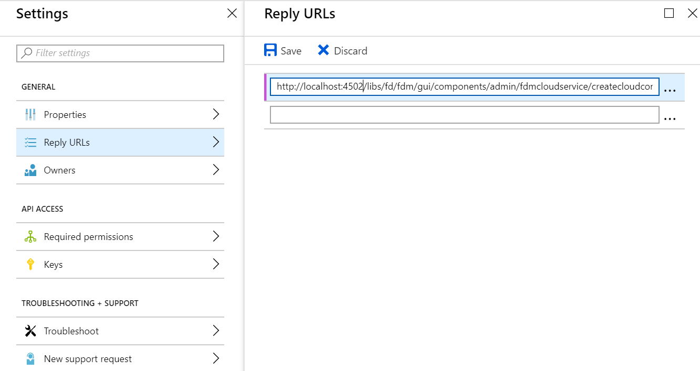
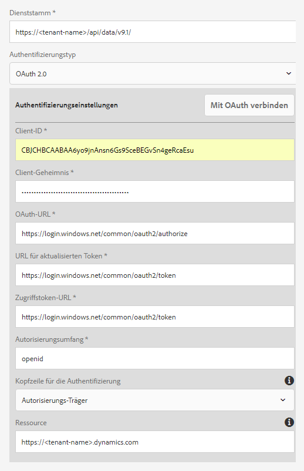
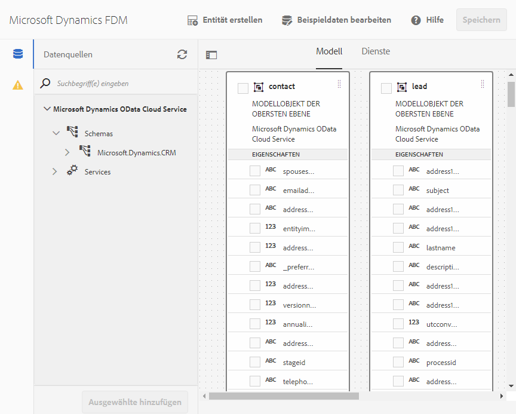

# Microsoft Dynamics OData-Konfiguration {#microsoft-dynamics-odata-configuration}

Erfahren Sie, wie Sie mithilfe des Formulardatenmodells die Integration und die Arbeit mit Online- und lokalen Microsoft Dynamics-Services nutzen können.


Microsoft Dynamics ist eine Customer Relationship Management(CRM)- und Enterprise Resource Planning(ERP)-Software, die Enterprise-Lösungen zum Erstellen und Verwalten von Kundenkonten, Kontakten, Leads, Chancen und Fällen bereitstellt. [AEM Forms Data Integration](/help/forms/using/data-integration.md) bietet eine OData-Cloud-Service-Konfiguration für die Integration von Formularen mit Online- und lokalen Microsoft Dynamics-Servern. Mit dieser Funktion können Sie ein Formulardatenmodell basierend auf den im Microsoft Dynamics-Dienst definierten Entitäten, Attributen und Diensten erstellen. Das Formulardatenmodell kann verwendet werden, um adaptive Formulare zu erstellen, die mit dem Microsoft Dynamics-Server interagieren, um Geschäftsabläufe zu ermöglichen. Beispiel:

* Abfragen des Microsoft Dynamics-Servers für Daten und Vorausfüllen adaptiver Formulare
* Daten in Microsoft Dynamics bei der Übermittlung adaptiver Formulare schreiben
* Schreiben von Daten in Microsoft Dynamics durch benutzerdefinierte Entitäten, die im Formulardatenmodell definiert sind, und umgekehrt

Das AEM Forms Add-On-Paket enthält auch eine Referenz-OData-Konfiguration, die Sie nutzen können, um Microsoft Dynamics schnell in AEM Forms zu integrieren.

Wenn das Paket installiert ist, werden die folgenden Entitäten und Dienste in Ihrer AEM Forms-Instanz bereitgestellt:

* MS Dynamics OData Cloud-Dienst (OData Service)
* Formulardatenmodell mit vorkonfigurierten Microsoft Dynamics-Entitäten und -Diensten.

Der OData-Cloud Service und das Formulardatenmodell mit vorkonfigurierten Microsoft Dynamics-Entitäten und -Diensten sind nur dann in Ihrer AEM Forms-Instanz verfügbar, wenn der Ausführungsmodus für die AEM Instanz auf `samplecontent` (Standard) festgelegt ist. Weitere Informationen zum Konfigurieren von Ausführungsmodi für eine AEM-Instanz finden Sie unter [Ausführungsmodi](https://helpx.adobe.com/in/experience-manager/6-4/sites-deploying/configure-runmodes.html).

## Voraussetzungen {#prerequisites}

Bevor Sie mit dem Einrichten und Konfigurieren von Microsoft Dynamics beginnen, stellen Sie sicher, dass folgende Bedingungen erfüllt sind:

* Das [AEM 6.4 Forms Add-On-Paket](https://helpx.adobe.com//experience-manager/6-4/forms/using/installing-configuring-aem-forms-osgi.html) wurde installiert.
* Microsoft Dynamics 365 online wurde konfiguriert oder eine Instanz einer der folgenden Microsoft Dynamics-Versionen wurde installiert:

   * Microsoft Dynamics 365 lokal
   * Microsoft Dynamics 2016 lokal

* [Registrierte Anwendung für Microsoft Dynamics Online-Dienst mit Microsoft Azure Active Directory](https://docs.microsoft.com/de-de/dynamics365/customer-engagement/developer/walkthrough-register-dynamics-365-app-azure-active-directory). Notieren Sie sich die Werte für die Client-ID (auch als Anwendungs-ID bezeichnet) und das Client-Geheimnis für den registrierten Dienst. Diese Werte werden während dem [Konfigurieren des Cloud-Diensts für Ihren Microsoft Dynamics-Dienst](/help/forms/using/ms-dynamics-odata-configuration.md#configure-cloud-service-for-your-microsoft-dynamics-service) verwendet.

## Legen Sie die Antwort-URL für eine registrierte Microsoft Dynamics-Anwendung fest  {#set-reply-url-for-registered-microsoft-dynamics-application}

Gehen Sie folgendermaßen vor, um die Antwort-URL für eine registrierte Microsoft Dynamics-Anwendung festzulegen:

>[!NOTE]
>
>Verwenden Sie dieses Verfahren nur, wenn Sie AEM Forms in einen Microsoft Dynamics-Online-Server integrieren.

1. Gehen Sie zum Microsoft Azure Active Directory-Konto und fügen Sie die folgende Cloud Service-Konfigurations-URL in den Einstellungen **[!UICONTROL Antwort-URLs]** für Ihre registrierte Anwendung hinzu:

   `https://[server]:[port]/libs/fd/fdm/gui/components/admin/fdmcloudservice/createcloudconfigwizard/cloudservices.html`

   

1. Speichern Sie die Konfiguration.

## Konfigurieren Sie Microsoft Dynamics für IFD  {#configure-microsoft-dynamics-for-ifd}

Microsoft Dynamics verwendet die anspruchsbasierte Authentifizierung, um externen Benutzern den Zugriff auf Daten auf dem Microsoft Dynamics CRM-Server zu ermöglichen. Führen Sie die folgenden Schritte aus, um Microsoft Dynamics für Bereitstellung mit Internetzugriff (IFD) zu konfigurieren und Schadenseinstellungen zu konfigurieren.

>[!NOTE]
>
>Verwenden Sie dieses Verfahren nur, wenn Sie AEM Forms in einen Microsoft Dynamics-Server vor Ort integrieren.

1. Konfigurieren Sie die lokale Microsoft Dynamics-Instanz für IFD, wie unter [IFD für Microsoft Dynamics konfigurieren](https://technet.microsoft.com/en-us/library/dn609803.aspx) beschrieben.
1. Führen Sie die folgenden Befehle mit Windows PowerShell aus, um die Anspruchseinstellungen für IFD-aktiviertes Microsoft Dynamics zu konfigurieren:

   ```
   Add-PSSnapin Microsoft.Crm.PowerShell 
    $ClaimsSettings = Get-CrmSetting -SettingType OAuthClaimsSettings 
    $ClaimsSettings.Enabled = $true 
    Set-CrmSetting -Setting $ClaimsSettings
   ```

   Weitere Informationen finden Sie unter [App-Registrierung für CRM On-Premise (IFD)](https://msdn.microsoft.com/sl-si/library/dn531010(v=crm.7).aspx#bkmk_ifd) .

## Konfigurieren des OAuth-Clients auf dem AD FS-Computer {#configure-oauth-client-on-ad-fs-machine}

Führen Sie die folgenden Schritte aus, um einen OAuth-Client auf einem Active Directory Federation Services(AD FS)-Computer zu registrieren und Zugriff auf den AD FS-Computer zu gewähren:

>[!NOTE]
>
>Verwenden Sie dieses Verfahren nur, wenn Sie AEM Forms in einen Microsoft Dynamics-Server vor Ort integrieren.

1. Führen Sie folgenden Befehl aus:

   `Add-AdfsClient -ClientId “<Client-ID>” -Name "<name>" -RedirectUri "<redirect-uri>" -GenerateClientSecret`

   wobei:

   * `Client-ID` ist eine Client-ID, die Sie mit einem beliebigen GUID-Generator generieren können.
   * `redirect-uri` ist die URL zum Microsoft Dynamics OData Cloud-Dienst auf AEM Forms. Der mit dem AEM Forms-Paket installierte Standard-Cloud-Service wird unter der folgenden URL bereitgestellt:

      ```
      http://[server]:[port]/libs/fd/fdm/gui/components/admin/fdmcloudservice/createcloudconfigwizard/cloudservices.html
      ```

1. Führen Sie den folgenden Befehl aus, um Zugriff auf den AD FS-Computer zu gewähren:

   `Grant-AdfsApplicationPermission -ClientRoleIdentifier “<Client-ID>” -ServerRoleIdentifier <resource> -ScopeNames openid`

   wobei:

   * `resource` ist die Microsoft Dynamics-Organisations-URL.

1. Microsoft Dynamics verwendet das HTTPS-Protokoll. Um AD FS-Endpunkte über den Forms-Server aufzurufen, installieren Sie das Microsoft Dynamics-Websitezertifikat mithilfe des Befehls `keytool` auf dem Computer, auf dem AEM Forms ausgeführt wird, im Java-Zertifikatspeicher.

## Konfigurieren Sie den Cloud-Dienst für Ihren Microsoft Dynamics-Dienst {#configure-cloud-service-for-your-microsoft-dynamics-service}

Die Konfiguration **MS Dynamics OData Cloud Service (OData Service)** ist mit einer standardmäßigen OData-Konfiguration ausgestattet. Gehen Sie wie folgt vor, um ihn für die Verbindung mit Ihrem Microsoft Dynamics -Dienst zu konfigurieren.

1. Navigieren Sie zu **[!UICONTROL Tools > Cloud Services > Data Sources]** und tippen Sie auf den Konfigurationsordner `global`.
1. Wählen Sie die **[!UICONTROL MS Dynamics OData Cloud-Dienst (OData Service)]**-Konfiguration und tippen Sie auf **[!UICONTROL Eigenschaften]**. Das Dialogfeld „Eigenschaften der Cloud-Dienstkonfiguration“ wird geöffnet.

   Auf der Registerkarte **[!UICONTROL Authentifizierungseinstellungen]**:

   1. Geben Sie den Wert für das Feld **[!UICONTROL Dienststamm]** ein. Wechseln Sie zur Dynamics-Instanz und navigieren Sie zu **[!UICONTROL Entwicklerressourcen]** , um den Wert für das Feld Dienststamm anzuzeigen. Beispiel: https://&lt;tenant-name>/api/data/v9.1/
   1. Ersetzen Sie die Standardwerte in der **[!UICONTROL Client ID]** (auch als **[!UICONTROL Application ID]** bezeichnet), die Felder **[!UICONTROL Client Secret]**, **[!UICONTROL OAuth URL]**, **[!UICONTROL Refresh Token URL]**, **[!UICONTROL Access Token URL]** und **[!UICONTROL Resource]** mit Werten aus Ihrer Microsoft Dynamics-Dienstkonfiguration. Die URL der dynamischen Instanz muss im Feld **[!UICONTROL Resource]** angegeben werden, um Microsoft Dynamics mit einem Formulardatenmodell zu konfigurieren. Verwenden Sie die Dienststamm-URL, um die URL der dynamischen Instanz abzuleiten. Beispiel: [https://org.crm.dynamics.com](https://org.crm.dynamics.com/).
   1. Geben Sie **[!UICONTROL openid]** im Feld **[!UICONTROL Autorisierungsbereich]** für den Autorisierungsprozess in Microsoft Dynamics an.

   

1. Klicken Sie auf **[!UICONTROL Verbindung zu OAuth herstellen]**. Sie werden zur Anmeldungsseite von Microsoft Dynamics umgeleitet.
1. Melden Sie sich mit Ihren Microsoft Dynamics-Anmeldeinformationen an und akzeptieren Sie, dass die Cloud-Dienstkonfiguration eine Verbindung zum Microsoft Dynamics-Dienst herstellen kann. Es ist eine einmalige Aufgabe, die Verbindung zwischen dem Cloud-Dienst und dem Dienst herzustellen.

   Sie werden dann auf die Cloud-Dienstkonfigurationsseite weitergeleitet, auf der eine Meldung angezeigt wird, dass die OData-Konfiguration erfolgreich gespeichert wurde.

Der MS Dynamics OData Cloud-Dienst (OData Service) ist konfiguriert und mit Ihrem Dynamics-Dienst verbunden.

## Formulardatenmodell erstellen {#create-form-data-model}

Wenn Sie das AEM Forms-Paket installieren, wird ein Formulardatenmodell,**Microsoft Dynamics FDM**, auf Ihrer AEM-Instanz bereitgestellt. Standardmäßig verwendet das Formulardatenmodell den im MS Dynamics OData Cloud Service (OData Service) konfigurierten Microsoft Dynamics-Dienst als Datenquelle.

Beim ersten Öffnen des Formulardatenmodells verbindet es sich mit dem konfigurierten Microsoft Dynamics-Dienst und ruft Entitäten von Ihrer Microsoft Dynamics-Instanz auf. Die Entitäten „contact“ und „lead“ von Microsoft Dynamics sind bereits im Datenmodell des Formulars enthalten.

Um das Formulardatenmodell zu überprüfen, navigieren Sie zu **[!UICONTROL Formulare > Datenintegrationen]**. Wählen Sie **[!UICONTROL MS Dynamics FDM]** und klicken Sie auf **[!UICONTROL Bearbeiten]**, um das Formulardatenmodell im Bearbeitungsmodus zu öffnen. Alternativ können Sie das Formulardatenmodell direkt über die folgende URL öffnen:

`https://[*server*]:[*port*]/aem/fdm/editor.html/content/dam/formsanddocuments-fdm/ms-dynamics-fdm`



Als Nächstes können Sie ein adaptives Formular erstellen, das auf dem Formulardatenmodell basiert, und es in verschiedenen Anwendungsfällen für adaptive Formulare verwenden, z. B.:

* Adaptives Formulars durch Abfrage von Informationen aus Microsoft Dynamics-Entitäten und Dienste befüllen
* Aufrufen von Microsoft Dynamics-Servervorgängen, die in einem Formulardatenmodell mithilfe von Regeln für adaptive Formulare definiert wurden
* Gesendete Formulardaten in Microsoft Dynamics-Entitäten schreiben

Es wird empfohlen, eine Kopie des mit dem AEM Forms-Paket mitgelieferten Formulardatenmodells zu erstellen und Datenmodelle und Dienste entsprechend Ihren Anforderungen zu konfigurieren. Das stellt sicher, dass zukünftige Aktualisierungen des Pakets Ihr Formulardatenmodell nicht überschreiben.

Weitere Informationen zur Erstellung und Verwendung des Formulardatenmodells in Business Workflows finden Sie unter [ Datenintegration](/help/forms/using/data-integration.md).
