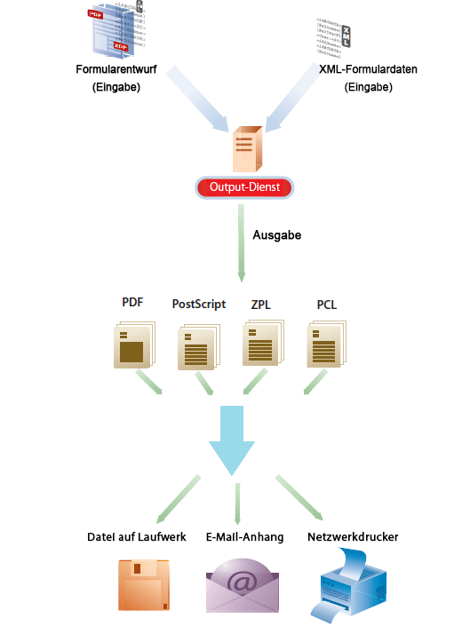

# Ausgabe-Service {#output-service}

>[!CAUTION]
>
>AEM 6.4 hat das Ende der erweiterten Unterstützung erreicht und diese Dokumentation wird nicht mehr aktualisiert. Weitere Informationen finden Sie in unserer [technische Unterstützung](https://helpx.adobe.com/de/support/programs/eol-matrix.html). Unterstützte Versionen suchen [here](https://experienceleague.adobe.com/docs/?lang=de).

## Übersicht {#overview}

Der Output-Dienst ist ein OSGi-Dienst, der Teil von AEM Document Services ist. Der Ausgabedienst unterstützt verschiedene Ausgabeformate und Ausgabedesignfunktionen von AEM Forms Designer. Der Output-Dienst kann XFA-Vorlagen und XML-Daten konvertieren, um Druckdokumente in verschiedenen Formaten zu generieren.

Dabei können Sie mit dem Output-Service Programme mit folgenden Funktionen erstellen:

* Erzeugen fertiger Formulardokumente durch Füllen von Vorlagendateien mit XML-Daten
* Generieren Sie Ausgabeformulare in verschiedenen Formaten, einschließlich nicht interaktiver PDF-, PostScript-, PCL- und ZPL-Druckstreams.
* Generieren von druckbaren PDFs aus XFA-Formular-PDFs
* Generieren von PDF-, PostScript-, PCL- und ZPL-Dokumenten in großen Mengen durch Zusammenführen mehrerer Datensätze mit den bereitgestellten Vorlagen

>[!NOTE]
>
>Der Output-Dienst ist eine 32-Bit-Anwendung. Unter Microsoft Windows darf eine 32-Bit-Anwendung maximal 2 GB Arbeitsspeicher verwenden. Die Begrenzung gilt auch für den Output-Dienst.

## Erstellen nicht interaktiver Formulardokumente {#creating-non-interactive-form-documents}

Normalerweise erstellen Sie Vorlagen mit AEM Forms Designer. Mit den APIs `generatePDFOutput` und `generatePrintedOutput` des Output-Dienstes können Sie diese Vorlagen direkt in verschiedene Formate wie PDF, PostScript, ZPL und PCL konvertieren.

Mit `generatePDFOutput` generieren Sie PDF-Dokumente, während `generatePrintedOutput` Dokumente in den Formaten PostScript, ZPL und PCL generiert. Der erste Parameter beider Vorgänge akzeptiert entweder den Namen der Vorlagendatei (z. B. `ExpenseClaim.xdp`) oder ein Dokumentobjekt, das die Vorlage enthält. Wenn Sie den Namen der Vorlagendatei angeben, vergessen Sie nicht, auch den Inhaltsstamm als Pfad zum Vorlagenordner anzugeben. Sie können den Inhaltsstamm entweder mit dem Parameter `PDFOutputOptions` oder dem Parameter `PrintedOutputOptions` angeben. Weitere Informationen zu anderen Optionen, die Sie mit diesen Parametern festlegen können, finden Sie unter Javadoc .

Der zweite Parameter akzeptiert ein XML-Dokument, das bei der Generierung des Ausgabedokuments mit der Vorlage zusammengeführt wird.

Der Vorgang `generatePDFOutput` kann als Eingabe auch ein XFA-basiertes PDF-Formular akzeptieren und als Ausgabe eine nicht interaktive Version des PDF-Formulars zurückgeben.

## Nicht interaktive Formulardokumente erstellen {#generating-non-interactive-form-documents}

Angenommen, Sie haben eine oder mehrere Vorlagen und für jede Vorlage mehrere Datensätze mit XML-Daten.

In diesem Fall können Sie mit den Vorgängen `generatePDFOutputBatch` und `generatePrintedOutputBatch` des Output-Dienstes für jeden Datensatz ein Druckdokument erstellen.

Sie können die Datensätze auch zu einem Dokument zusammenfassen. Beide Vorgänge benötigen vier Parameter.

Der erste Parameter ist eine Zuordnung , die eine beliebige Zeichenfolge als Schlüssel und den Namen der Vorlagendatei als Wert enthält.

Der zweite Parameter ist eine andere Zuordnung, deren Wert ein Dokumentobjekt ist, das XML-Daten enthält. Der Schlüssel ist derselbe wie für den ersten Parameter.

Der dritte Parameter für `generatePDFOutputBatch` oder `generatePrintedOutputBatch` ist vom Typ `PDFOutputOptions` bzw. `PrintedOutputOptions`.

Die Parametertypen sind die gleichen wie die Typen der Parameter für die Vorgänge `generatePDFOutput` und `generatePrintedOutput` und haben die gleiche Auswirkung.

Der vierte Parameter ist vom Typ `BatchOptions`, mit dem Sie angeben, ob für jeden Datensatz eine eigene Datei erzeugt werden kann. Der Standardwert dieses Parameters ist „false“.

Sowohl `generatePrintedOutputBatch` als auch `generatePDFOutputBatch` geben einen Wert vom Typ `BatchResult` zurück. Der Wert enthält eine Liste der erstellten Dokumente. Es enthält auch ein Metadatendokument im XML-Format, das Informationen zu jedem generierten Dokument enthält.
