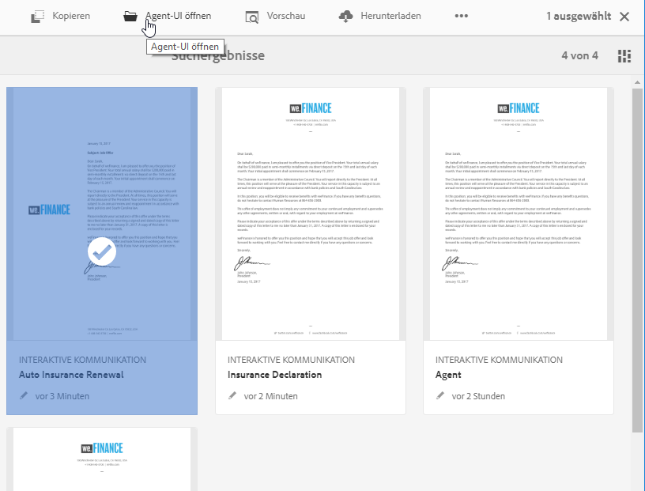
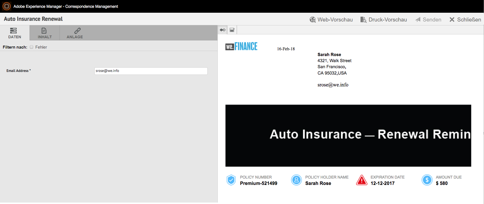
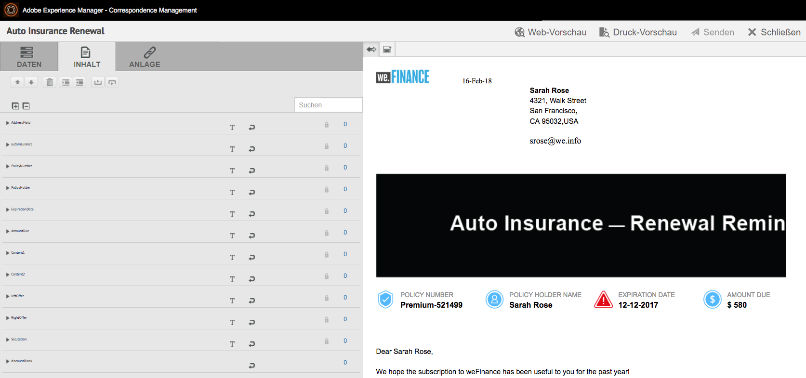
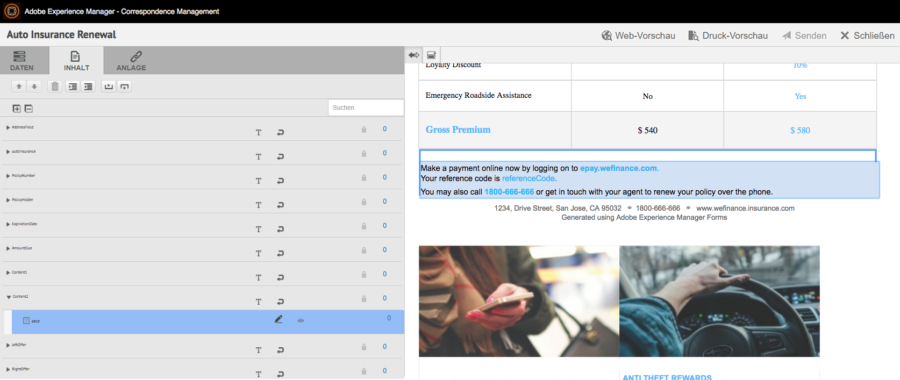
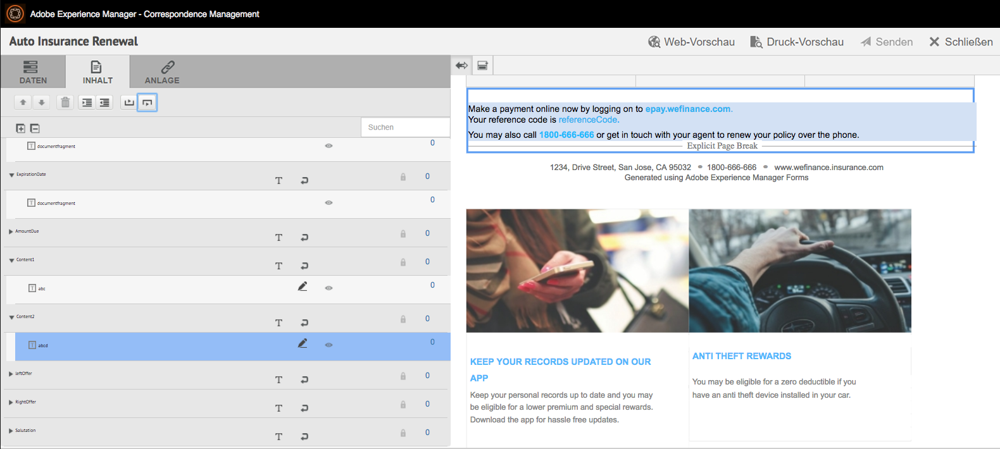
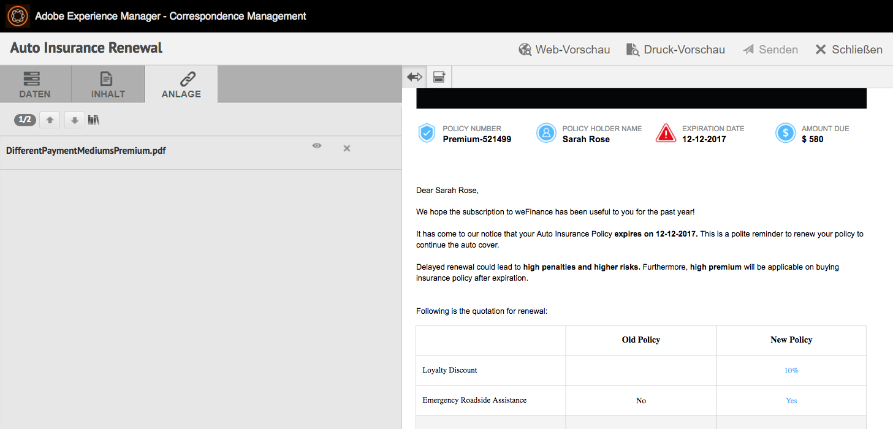
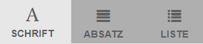
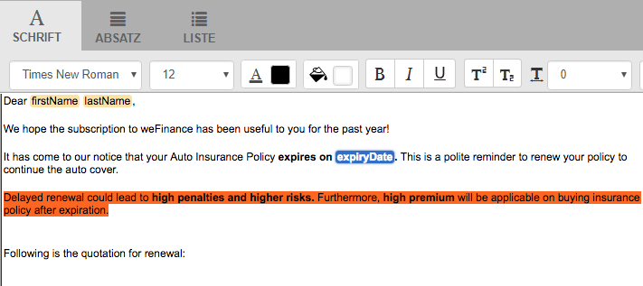
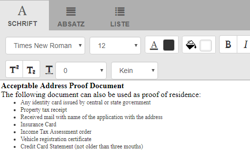

# Vorbereiten und Senden der interaktiven Kommunikation mithilfe der Agent-Benutzeroberfläche {#prepare-and-send-interactive-communication-using-the-agent-ui}

>[!CAUTION]
>
>AEM 6.4 hat das Ende der erweiterten Unterstützung erreicht und diese Dokumentation wird nicht mehr aktualisiert. Weitere Informationen finden Sie in unserer [technische Unterstützung](https://helpx.adobe.com/de/support/programs/eol-matrix.html). Unterstützte Versionen suchen [here](https://experienceleague.adobe.com/docs/?lang=de).

Die Benutzeroberfläche für Agenten ermöglicht es den Agenten, interaktive Kommunikation vorzubereiten und an den Nachbearbeitungsprozess zu senden. Der Agent nimmt die erforderlichen Änderungen wie erlaubt vor und sendet die interaktive Kommunikation an einen Nachbearbeitungsprozess, z. B. E-Mail oder Druck.

## Übersicht {#overview}

Nachdem eine interaktive Kommunikation erstellt wurde, kann der Agent die interaktive Kommunikation in der Benutzeroberfläche für Agenten öffnen und eine empfängerspezifische Kopie vorbereiten, indem er Daten eingibt und Inhalte und Anhänge verwaltet. Schließlich kann der Agent die interaktive Kommunikation an einen Nachbearbeitungsprozess senden.

Beim Vorbereiten der interaktiven Kommunikation über die Agent-Benutzeroberfläche verwaltet der Agent die folgenden Aspekte der interaktiven Kommunikation in der Agent-Benutzeroberfläche, bevor er sie an einen Nachbearbeitungsprozess sendet:

* **Daten**: Auf der Registerkarte &quot;Daten&quot;der Benutzeroberfläche für Agenten werden alle vom Agenten bearbeitbaren Variablen und entsperrten Formulardatenmodelleigenschaften in der interaktiven Kommunikation angezeigt. Diese Variablen/Eigenschaften werden beim Bearbeiten oder Erstellen von Dokumentfragmenten erstellt, die in der interaktiven Kommunikation enthalten sind. Die Registerkarte &quot;Daten&quot;enthält auch alle Felder, die in der XDP-/Druckkanalvorlage erstellt wurden. Die Registerkarte „Daten“ wird nur angezeigt, wenn Variablen, Formulardatenmodelleigenschaften oder Felder in der interaktiven Kommunikation vorhanden sind, die vom Agenten bearbeitet werden können.
* **Inhalt**: Auf der Registerkarte „Inhalt“ verwalten Sie den Inhalt, z. B. Dokumentfragmente und die Inhaltsvariablen in der interaktiven Kommunikation. Der Agent kann die Änderungen im Dokumentfragment so vornehmen, wie dies beim Erstellen der interaktiven Kommunikation in den Eigenschaften dieser Dokumentfragmente zulässig ist. Der Agent kann auch ein Dokumentfragment neu anordnen, hinzufügen/entfernen und Seitenumbrüche hinzufügen, sofern dies zulässig ist.
* **Anlagen**: Die Registerkarte „Anlagen“ wird nur dann in der Agent-Benutzeroberfläche angezeigt, wenn die interaktive Kommunikation Anlagen hat oder der Agent über Bibliothekszugriff verfügt. Der Agent darf die Anlagen ändern oder bearbeiten.

## Vorbereiten der interaktiven Kommunikation mithilfe der Agent-Benutzeroberfläche {#prepare-interactive-communication-using-the-agent-ui}

1. Wählen Sie **[!UICONTROL Formulare]** > **[!UICONTROL Formulare &amp; Dokumente]**.
1. Wählen Sie die entsprechende interaktive Kommunikation aus und tippen Sie auf **[!UICONTROL Agent-Benutzeroberfläche öffnen]**.

   >[!NOTE]
   >
   >Die Agent-Benutzeroberfläche funktioniert nur, wenn die ausgewählte interaktive Kommunikation über einen Druckkanal verfügt.

   

   Basierend auf dem Inhalt und den Eigenschaften der interaktiven Kommunikation wird die Benutzeroberfläche für Agenten mit den folgenden drei Registerkarten angezeigt: Daten, Inhalt und Anlage.

   

   Fahren Sie mit der Dateneingabe, der Verwaltung des Inhalts und der Verwaltung der Anlagen fort.

### Daten eingeben {#enter-data}

1. Geben Sie auf der Registerkarte &quot;Daten&quot;die Daten für Variablen, Formulardatenmodelleigenschaften und XDP-Felder (Druckvorlage) ein. Füllen Sie alle erforderlichen Felder (mit einem Sternchen (*) gekennzeichnet) aus, um die Schaltfläche **Senden** zu aktivieren.

   Tippen Sie auf einen Datenfeldwert in der Vorschau der interaktiven Kommunikation, um das entsprechende Datenfeld auf der Registerkarte „Daten“ hervorzuheben.

### Inhalt verwalten {#manage-content}

Verwalten Sie auf der Registerkarte &quot;Inhalt&quot;den Inhalt wie Dokumentfragmente und Inhaltsvariablen in der interaktiven Kommunikation.

1. Wählen Sie **[!UICONTROL Inhalt]**. Die Registerkarte „Inhalt“ der interaktiven Kommunikation wird angezeigt.

   

1. Bearbeiten Sie auf der Registerkarte „Inhalt“ ggf. die Dokumentfragmente. Um den Fokus auf das relevante Fragment in der Inhaltshierarchie zu verschieben, können Sie entweder auf die betreffende Zeile oder den betreffenden Absatz in der Vorschau der interaktiven Kommunikation tippen oder direkt auf das Fragment in der Inhaltshierarchie tippen.

   Beispielsweise wird das Dokumentfragment mit der Zeile „Jetzt online bezahlen ...“ in der Vorschau in der untenstehenden Grafik ausgewählt und das gleiche Dokumentfragment wurde auf der Registerkarte „Inhalt“ ausgewählt.

   

   Auf der Registerkarte „Inhalt“ oder „Daten“ können Sie durch Tippen auf „Ausgewählte Module im Inhalt markieren“ () links oben in der Vorschau eine Funktion aktivieren oder deaktivieren, die bewirkt, dass beim Klicken auf den relevanten Text oder Absatz bzw. das Datenfeld in der Vorschau das dazugehörige Inhalts-/Datenmodul aufgerufen wird.

   Die Fragmente, die vom Agenten beim Erstellen der interaktiven Kommunikation bearbeitet werden dürfen, haben das Symbol „Ausgewählten Inhalt bearbeiten“ (). Tippen Sie auf das Symbol Ausgewählten Inhalt bearbeiten , um das Fragment im Bearbeitungsmodus zu starten und Änderungen daran vorzunehmen. Verwenden Sie die folgenden Optionen zum Formatieren und Verwalten von Text:

   * [Formatierungsoptionen](#formattingtext)

      * [Formatierten Text aus anderen Anwendungen kopieren/einfügen](#pasteformattedtext)
      * [Teile des Textes markieren](#highlightemphasize)
   * [Sonderzeichen](#specialcharacters)
   * [Tastaturbefehle](/help/forms/using/keyboard-shortcuts.md)

   Weitere Informationen zu Aktionen, die für verschiedene Dokumentfragmente in der Benutzeroberfläche für Agenten verfügbar sind, finden Sie unter [Aktionen und Informationen, die in der Benutzeroberfläche für Agenten verfügbar sind](#actionsagentui).

1. Um der Druckausgabe der interaktiven Kommunikation einen Seitenumbruch hinzuzufügen, tippen Sie auf die Stelle, an der Sie den Seitenumbruch einfügen möchten, und wählen Sie „Seitenumbruch vor“ oder „Seitenumbruch nach“ ( ).

   Ein Platzhalter für einen expliziten Seitenumbruch wird in die interaktive Kommunikation eingefügt. Informationen dazu, wie sich ein expliziter Seitenumbruch auf die interaktive Kommunikation auswirkt, finden Sie in der Druckvorschau.

   

   Fahren Sie mit der Verwaltung der Anlagen der interaktiven Kommunikation fort.

### Anlagen verwalten {#manage-attachments}

1. Wählen Sie **[!UICONTROL Anlage]**. Die Benutzeroberfläche für Agenten zeigt die verfügbaren Anlagen so an, wie sie beim Erstellen der interaktiven Kommunikation eingerichtet wurden.

   Sie können festlegen, dass keine Anhänge mit der interaktiven Kommunikation versendet werden sollen, indem Sie auf das Symbol „Anzeigen“ tippen, und auf das Kreuz im Anhang tippen, um ihn aus der interaktiven Kommunikation zu entfernen (wenn es zulässig ist, dass der Agent Anhänge löschen oder ausblenden kann). Für die Anhänge, die beim Erstellen der interaktiven Kommunikation als obligatorisch festgelegt wurden, sind die Symbole „Anzeigen“ und „Löschen“ deaktiviert.

   

1. Tippen Sie auf das Symbol „Bibliothekszugriff“ (), um auf die Inhaltsbibliothek zuzugreifen und DAM-Assets als Anhänge einzufügen.

   >[!NOTE]
   >
   >Das Symbol „Bibliothekszugriff“ ist nur verfügbar, wenn der Bibliothekszugriff beim Erstellen der interaktiven Kommunikation aktiviert wurde (in den Eigenschaften des Dokumentcontainers des Druckkanals).

1. Wenn die Reihenfolge der Anhänge beim Erstellen der interaktiven Kommunikation nicht gesperrt war, können Sie die Reihenfolge der Anhänge neu anordnen, indem Sie einen Anhang auswählen und auf die Pfeile nach unten oder nach oben tippen.
1. Verwenden Sie Webvorschau und Druckvorschau, um zu sehen, ob die beiden Ausgaben Ihren Anforderungen entsprechen.

   Wenn die Vorschaubilder zufriedenstellend sind, tippen Sie auf **[!UICONTROL Senden]**, um die interaktive Kommunikation an einen Nachbearbeitungsprozess zu übermitteln / zusenden. Um Änderungen vorzunehmen, beenden Sie die Vorschau, um zu den Änderungen zurückzukehren.

## Text formatieren {#formattingtext}

Beim Bearbeiten eines Textfragments in der Benutzeroberfläche des Agenten ändert sich die Symbolleiste je nach dem Typ der Änderungen, die Sie vornehmen: Schrift, Absatz oder Liste:

 

Schriftart-Symbolleiste

Absatz-Symbolleiste

Listen-Symbolleiste

### Teile von Text hervorheben/hervorheben {#highlightemphasize}

Um Textteile in einem bearbeitbaren Fragment hervorzuheben bzw. hervorzuheben, wählen Sie den Text aus und tippen Sie auf Farbe hervorheben.

### Formatierten Text einfügen {#pasteformattedtext}

### Sonderzeichen in Text einfügen {#specialcharacters}

Die Benutzeroberfläche für Agenten bietet integrierte Unterstützung für 210 Sonderzeichen. Der Administrator kann [Unterstützung für mehr/benutzerdefinierte Sonderzeichen durch Anpassung hinzufügen](/help/forms/using/custom-special-characters.md).

#### Anlagenübermittlung {#attachmentdelivery}

* Wenn die interaktive Kommunikation mit serverseitigen APIs als interaktive oder nicht interaktive PDF gerendert wird, enthält die gerenderte PDF-Datei Anlagen im PDF-Format.
* Wenn ein mit einer interaktiven Kommunikation verknüpfter Nachbearbeitungsprozess als Teil der Option „Senden mit Benutzeroberfläche für Agenten“ geladen wird, werden Anlagen als List&lt;com.adobe.idp.Document> im AttachmentDocs-Parameter weitergeleitet.
* Bereitstellungsmechanismus-Workflows, wie E-Mail und Druck, übermitteln Anhänge zusammen mit der PDF-Version der interaktiven Kommunikation.

## Auf der Benutzeroberfläche &quot;Agent&quot;verfügbare Aktionen und Informationen {#actionsagentui}

### Dokumentfragmente {#document-fragments}

* **Nach-oben-/Nach-unten-Pfeile**: Pfeile zum Verschieben von Dokumentfragmenten in der interaktiven Kommunikation nach oben oder unten.
* **Löschen**: Wenn zulässig, löschen Sie das Dokumentfragment aus der interaktiven Kommunikation.
* **Seitenumbruch vor** (anwendbar für untergeordnete Fragmente des Zielbereichs): Fügt Seitenumbruch vor dem Dokumentfragment ein.
* **Einzug:** Einzug eines Dokumentenfragments vergrößern oder verkleinern.
* **Seitenumbruch nach** (anwendbar für untergeordnete Fragmente des Zielbereichs): Fügt Seitenumbruch nach dem Dokumentfragment ein.

* Bearbeiten (nur Textfragmente): Öffnen Sie den Rich-Text-Editor zum Bearbeiten des Textdokumentfragments. Weitere Informationen finden Sie unter [Text formatieren](#formattingtext).

* Auswahl (Augensymbol): Schließt Dokumentfragmente in die interaktive Kommunikation ein bzw. schließt sie daraus aus.
* Nicht ausgefüllte Werte (Info): Gibt die Anzahl der nicht ausgefüllten Variablen im Dokumentfragment an.

### Dokumentfragmente auflisten {#list-document-fragments}

* Leere Linie einfügen: Fügt eine neue leere Linie ein.
* Auswahl (Augensymbol): Schließt Dokumentfragmente in die interaktive Kommunikation ein/schließt sie daraus aus.
* Aufzählungszeichen/Nummerierungen überspringen: Aktivieren Sie „Aufzählungszeichen/Nummerierungen überspringen“ im Listendokumentfragment.
* Nicht ausgefüllte Werte (Info): Gibt die Anzahl der nicht ausgefüllten Variablen im Dokumentfragment an.
