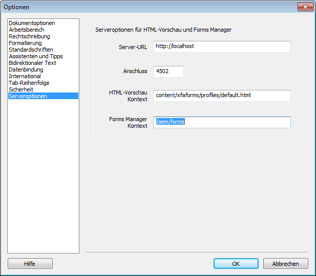

# Generieren einer HTML5-Vorschau eines XDP-Formulars {#generate-html-preview-of-an-xdp-form}

>[!CAUTION]
>
>AEM 6.4 hat das Ende der erweiterten Unterstützung erreicht und diese Dokumentation wird nicht mehr aktualisiert. Weitere Informationen finden Sie in unserer [technische Unterstützung](https://helpx.adobe.com/de/support/programs/eol-matrix.html). Unterstützte Versionen suchen [here](https://experienceleague.adobe.com/docs/?lang=de).

Beim Entwerfen eines Formulars in AEM Forms Designer können Sie neben der Vorschau der PDF-Wiedergabe eines Formulars auch eine HTML5-Ausgabe davon in der Vorschau anzeigen. Sie können die **Vorschau von HTML** um ein Formular so in der Vorschau anzuzeigen, wie es in einem Browser angezeigt wird.

## Aktivieren der HTML-Vorschau für XDP-Formulare in Designer {#html-preview-of-forms-in-forms-designer}

Um Designer zu aktivieren, um eine HTML-Vorschau von XDP-Formularen zu generieren, führen Sie die folgenden Konfigurationen durch:

* Konfigurieren des Apache Sling-Authentifizierungsdienstes 
* Abgesicherten Modus deaktivieren
* Details zum AEM Forms-Server bereitstellen

### Apache Sling Authentifizierungsdienst konfigurieren  {#configure-apache-sling-authentication-service}

1. Navigieren Sie zu `https://[server]:[port]/system/console/configMgr` in AEM Forms, wenn es unter OSGi ausgeführt wird oder

   `https://[server]:[port]/lc/system/console/configMgr` in AEM Forms, wenn es unter JEE ausgeführt wird.

1. Wählen Sie die Konfiguration **Apache Sling-Authentifizierungsdienst**, um ihn im Modus „Bearbeiten“ zu öffnen.

1. Je nachdem, ob Sie AEM Forms unter OSGi oder JEE ausführen, müssen Sie Folgendes im Feld **Authentifizierungsanforderungen** hinzufügen: 

   *  von AEM Forms für JEE

      * -/content/xfaforms
      * -/etc/clientlibs
   * AEM Forms on OSGi

      * -/content/xfaforms
      * -/etc/clientlibs/fd/xfaforms

   >[!NOTE]
   >
   >Kopieren Sie den angegebenen Wert nicht in das Feld Authentifizierungsanforderungen , da dies die Sonderzeichen im Wert beschädigen kann. Geben Sie stattdessen den angegebenen Wert in das Feld ein.

1. Geben Sie einen Benutzernamen und ein Kennwort in **[!UICONTROL Anonymer Benutzername]** und **[!UICONTROL Anonym-Benutzerkennwort]** angegeben. Die angegebenen Anmeldeinformationen werden verwendet, um die anonyme Authentifizierung zu handhaben und den Zugriff auf anonyme Benutzer zu ermöglichen.
1. Klicken Sie auf **Speichern**, um die Konfiguration zu speichern.

### Deaktivieren des abgesicherten Modus {#disable-protected-mode}

Die [geschützter Modus](/help/forms/using/get-xdp-pdf-documents-aem.md) ist standardmäßig aktiviert. Lassen Sie sie für die Produktionsumgebungen aktiviert. Sie können es für eine Entwicklungsumgebung deaktivieren, um eine Vorschau von HTML5 Forms in Designer anzuzeigen. Gehen Sie wie folgt vor, um ihn zu deaktivieren:

1. Melden Sie sich bei der AEM-Web-Konsole als Administrator an.

   * URL für AEM Forms unter OSGi: `https://[server]:[port]/system/console/configMgr`
   * URL für AEM Forms unter JEE: `https://[server]:[port]/lc/system/console/configMgr`

1. Öffnen **[!UICONTROL Mobile Forms-Konfigurationen]** zur Bearbeitung.
1. Deaktivieren Sie die **[!UICONTROL Geschützter Modus]** und klicken Sie auf **[!UICONTROL Speichern]**.

### Angeben von Details zum AEM Forms-Server {#provide-details-of-aem-forms-server}

1. Navigieren Sie in Designer zu **Werkzeuge** > **Optionen**.
1. Wählen Sie im Fenster „Optionen“ die Seite **Serveroptionen**, stellen Sie die folgenden Details bereit und klicken Sie auf **OK**.

   * **Server URL**: AEM Forms-Server URL.
   * **HTTP-Anschlussnummer**: AEM Server-Port. Der Standardwert ist 4502.
   * **HTML-Vorschaukontext:** Pfad des Profils, der für die Wiedergabe der XFA-Formulare verwendet wird. Die folgenden Standardprofile werden verwendet, um das Formular in Designer in der Vorschau anzuzeigen. Sie können außerdem den Pfad zu einem benutzerdefinierten Profil angeben.

      * `/content/xfaforms/profiles/default.html` (AEM Forms on OSGi)
      * `/lc/content/xfaforms/profiles/default.html` (AEM Forms on JEE)
   * **Forms Manager-Kontext:** Kontextpfad, unter dem die Forms Manager-Benutzeroberfläche bereitgestellt wird. Die Standardwerte sind:

      * `/aem/forms` (AEM Forms on OSGi)
      * `/lc/forms` (AEM Forms on JEE)

   **Hinweis:** *Stellen Sie sicher, dass der AEM Forms-Server aktiv ist. Die HTML-Vorschau stellt eine Verbindung zum CRX-Server her, um eine Vorschau zu* erzeugen *.*

   

   AEM Forms Designer-Optionen

1. Um ein Formular in HTML in der Vorschau anzuzeigen, klicken Sie auf die Registerkarte **HTML-Vorschau**.

   >[!NOTE]
   >
   >Wenn die Registerkarte HTML-Vorschau geschlossen ist, drücken Sie F4, um die Registerkarte Vorschau-HTML zu öffnen. Sie können auch im Menü &quot;Ansicht&quot;die Option Vorschau-HTML auswählen, um die Registerkarte Vorschau-HTML zu öffnen.

   >[!NOTE]
   >
   >Die HTML-Vorschau unterstützt keine PDF-Dokumente. Die HTML-Vorschau ist nur für XDP-Dokumente vorgesehen.

## So zeigen Sie eine Vorschau eines Formulars mit Musterdaten an {#to-preview-a-form-using-sample-data}

In Designer können Sie das Formular mithilfe von XML-Musterdaten in der Vorschau anzeigen und testen. Es wird empfohlen, das Formular häufig mit Musterdaten zu testen, um sicherzustellen, dass es korrekt wiedergegeben wird.

Wenn Sie keine Beispieldaten haben, können Sie diese von Designer erstellen oder selbst erstellen. (Siehe [So generieren Sie automatisch Musterdaten für die Vorschau eines Formulars](https://help.adobe.com/en_US/AEMForms/6.1/DesignerHelp/WS107c29ade9134a2c136ae6f212a1f379c94-8000.2.html#WS92d06802c76abadb-728f46ac129b395660c-7efe.2) und [So erstellen Sie Musterdaten für die Vorschau eines Formulars](https://help.adobe.com/en_US/AEMForms/6.1/DesignerHelp/WS107c29ade9134a2c136ae6f212a1f379c94-8000.2.html#WS92d06802c76abadb-728f46ac129b395660c-7eff.2).

Durch das Testen Ihres Formulars mit einer Beispieldatenquelle wird sichergestellt, dass die Daten und Felder zugeordnet werden und sich wiederholende Teilformulare erwartungsgemäß wiederholt werden. Sie können ein ausgeglichenes Formularlayout erstellen, das für jedes Objekt den geeigneten Platz zur Anzeige der zusammengeführten Daten bietet.

1. Wählen Sie **Datei > Formulareigenschaften**.

1. Klicken Sie auf die Registerkarte **Vorschau** und geben Sie im Feld „Datendatei“ den vollständigen Pfad zu einer Testdatendatei ein. Sie können auch auf die Schaltfläche „Durchsuchen“ klicken, um zur gewünschten Datei zu gelangen.

1. Klicken Sie auf **OK**. Wenn Sie das nächste Mal eine Vorschau des Formulars auf der Registerkarte **HTML-Vorschau** anzeigen, werden die Datenwerte der XML-Musterdatei in den entsprechenden Objekten dargestellt.

## Formulare in einem Repository in der Vorschau anzeigen {#html-preview-of-forms-in-forms-manager}

In AEM Forms können Sie eine Vorschau von Formularen und Dokumenten in einem Repository anzeigen. Die Vorschau zeigt genau, wie die Formulare aussehen und sich wie sie von Endbenutzern verwendet werden.

[**Support kontaktieren**](https://www.adobe.com/account/sign-in.supportportal.html)
