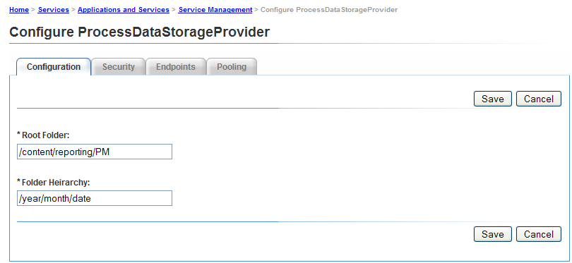
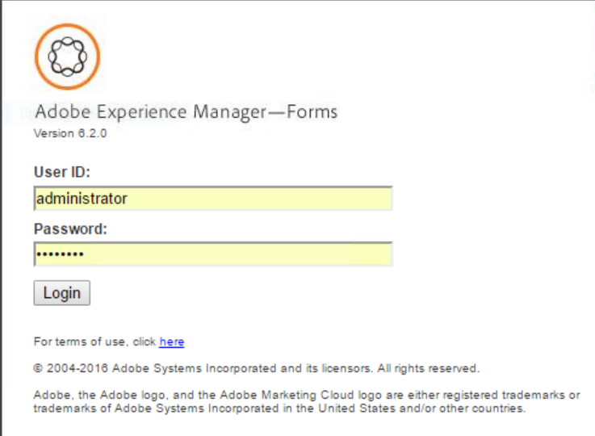

# Erste Schritte mit Prozessberichten {#getting-started-with-process-reporting}

Mit der Prozessberichterstellung können AEM Forms-Benutzer Informationen zu AEM Forms-Prozessen abfragen, die derzeit in der AEM Forms-Implementierung definiert sind. Die Prozessberichterstellung greift jedoch nicht direkt aus dem AEM Forms-Repository auf Daten zu. Die Daten werden zunächst auf geplanter Basis im Process Reporting-Repository veröffentlicht (*vom ProcessDataPublisher &amp; ProcessDataStorage-Dienst* s). Die Berichte und Abfragen in Process Reporting werden dann aus den im Repository veröffentlichten Process Reporting-Daten generiert. Process Reporting wird als Bestandteil des Forms Workflow-Moduls installiert.

In diesem Artikel werden die Schritte zum Aktivieren der Veröffentlichung von AEM Forms-Daten in das Process Reporting-Repository beschrieben. Danach können Sie Process Reporting verwenden, um Berichte und Abfragen auszuführen. Der Artikel behandelt auch die verfügbaren Optionen zum Konfigurieren der Process Reporting-Dienste.

## Voraussetzungen für die Prozessberichterstellung {#process-reporting-pre-requisites}

### Bereinigen nicht wesentlicher Prozesse {#purge-non-essential-processes}

Wenn Sie derzeit Forms Workflow verwenden, kann die AEM Forms-Datenbank möglicherweise eine große Datenmenge enthalten

Die Process Reporting-Veröffentlichungsdienste veröffentlichen alle derzeit in der Datenbank verfügbaren AEM Forms-Daten. Dies bedeutet, dass, wenn die Datenbank ältere Daten enthält, für die Sie keine Berichte und Abfragen ausführen möchten, alle diese Daten auch im Repository veröffentlicht werden, auch wenn sie für die Berichterstellung nicht erforderlich sind. Es wird empfohlen, diese Daten zu bereinigen, bevor Sie die Dienste ausführen, um die Daten im Process Reporting-Repository zu veröffentlichen. Dadurch wird die Leistung sowohl des Herausgeberdienstes als auch des Dienstes, der die Daten zur Berichterstellung abfragt, verbessert.

Weitere Informationen zum Bereinigen von AEM Forms-Prozessdaten finden Sie unter [Bereinigen von Prozessdaten](https://help.adobe.com/en_US/livecycle/11.0/AdminHelp/WS92d06802c76abadb-5145d5d12905ce07e7-7cb2.2.html).

>[!NOTE]
>
>Die Tipps und Tricks von Purge Utility finden Sie im Adobe Developer Connection-Artikel zu [Bereinigen von Prozessen und Aufträgen](https://www.adobe.com/content/dam/Adobe/en/devnet/livecycle/pdfs/purging_processes_jobs.pdf).

## Konfigurieren von Process Reporting Services {#configuring-process-reporting-services}

### Veröffentlichung von Prozessdaten planen {#schedule-process-data-publishing}

Die Process Reporting Services veröffentlichen Daten aus der AEM Forms-Datenbank auf geplanter Basis in das Process Reporting-Repository.

Dieser Vorgang kann ressourcenintensiv sein und die Leistung der AEM Forms-Server beeinträchtigen. Es wird empfohlen, diese Zeitnischen außerhalb der Zeitfenster des AEM Forms-Servers zu planen.

Standardmäßig ist die Veröffentlichung von Daten so geplant, dass sie jeden Tag um 2:00 Uhr ausgeführt wird.

Führen Sie die folgenden Schritte aus, um den Veröffentlichungszeitplan zu ändern:

>[!NOTE]
>
>Wenn Sie Ihre AEM Forms-Implementierung auf einem Cluster ausführen, führen Sie die folgenden Schritte auf jedem Knoten des Clusters aus.

#### JBoss Application Server {#jboss-application-server}

1. Beenden Sie die AEM Forms-Serverinstanz.
   * (Für Windows) Öffnen Sie die `[*JBoss root*]/bin/run.conf.bat` in einem Editor.
   * (Für Linux, AIX und Solaris) `[*JBoss root*]/bin/run.conf.sh` in einem Editor.

1. JVM-Argument hinzufügen `-Dreporting.publisher.cron = <expression>.`

   Beispiel: Der folgende Cron-Ausdruck bewirkt, dass Process Reporting alle 5 Stunden AEM Forms-Daten im Process Reporting-Repository veröffentlicht:

   * `-Dreporting.publisher.cron = 0_0_0/5_*_*_?`

1. Speichern und schließen Sie die Datei `run.conf.bat`.

1. Starten Sie die AEM Forms-Serverinstanz neu.

#### WebSphere Application Server {#websphere-application-server}

1. Beenden Sie die AEM Forms-Serverinstanz.
1. Melden Sie sich bei WebSphere Administrative Console an. Klicken Sie in der Navigationsstruktur auf **Server** >  **Anwendungsserver** und klicken Sie dann im rechten Bereich auf den Servernamen.

1. Klicken Sie unter „Server Infrastructure“ auf **Java and Process Management** > **Process Definition**.

1. Klicken Sie unter „Additional Properties“ auf **Java Virtual Machine**.

   Fügen Sie im Feld Generic JVM arguments das -Argument hinzu. `-Dreporting.publisher.cron = <expression>.`

   **Beispiel**: Der folgende Cron-Ausdruck bewirkt, dass Process Reporting alle 5 Stunden AEM Forms-Daten im Process Reporting-Repository veröffentlicht:

   * `-Dreporting.publisher.cron = 0_0_0/5_*_*_?`

1. Klicken **Anwenden**, klicken Sie auf &quot;OK&quot;und dann auf **Direktes Speichern in der Übergeordneten Konfiguration**.

1. Starten Sie die AEM Forms-Serverinstanz neu.

#### WebLogic Application Server {#weblogic-application-server}

1. Beenden Sie die AEM Forms-Serverinstanz.
1. Melden Sie sich bei WebLogic Administration Console an. Die Standardadresse von WebLogic Administration Console lautet `https://[hostname]:[port]/console`.

1. Klicken Sie unter „Change Center“ auf **Lock &amp; Edit**.

1. Klicken Sie unter „Domain Structure“ auf **Environment**> **Servers** und anschließend im rechten Bereich auf den Namen des verwalteten Servers.

1. Klicken Sie im nächsten Bildschirm auf die Registerkarten **Configuration** > **Server Start**.

1. Fügen Sie im Feld Arguments das JVM-Argument hinzu `-Dreporting.publisher.cron = <expression>`.

   **Beispiel**: Der folgende Cron-Ausdruck bewirkt, dass Process Reporting alle 5 Stunden AEM Forms-Daten im Process Reporting-Repository veröffentlicht:

   `-Dreporting.publisher.cron = 0_0_0/5_*_*_?`

1. Klicken Sie auf **Save** und dann auf **Activate Changes**.

1. Starten Sie die AEM Forms-Serverinstanz neu.

### ProcessDataStorage-Dienst {#processdatastorage-service}

Der ProcessDataStorageProvider-Dienst empfängt Prozessdaten vom ProcessDataPublisher-Dienst und speichert die Daten im Process Reporting-Repository.

Bei jedem Veröffentlichungszyklus werden die Daten in Unterordnern eines vordefinierten Stammordners gespeichert.

Sie können die Administration Console verwenden, um den Stamm (**default**: `/content/reporting/pm`) Speicherort und Unterordner (**default**: `/yyyy/mm/dd/hh/mi/ss`) Hierarchieformat, in dem die Prozessdaten gespeichert werden.

#### So konfigurieren Sie die Repository-Speicherorte für Prozessberichte {#to-configure-the-process-reporting-repository-locations}

1. Anmelden bei **Administrationskonsole** mit Administratorberechtigungen. Die Standard-URL von Administration Console lautet `https://[server]:[port]/adminui`
1. Navigieren Sie zu **Startseite** >  **Dienste** >  **Anwendungen und Dienste** > **Dienstverwaltung** und öffnen Sie die **ProcessDataStorageProvider** Dienst.

   

   **RootFolder**

   Der CRX-Speicherort, in dem die Prozessdaten für die Berichterstellung gespeichert werden.

   `Default`: `/content/reporting/pm`

   **Ordnerhierarchie**

   Die Ordnerhierarchie, in der die Prozessdaten basierend auf der Erstellungszeit des Prozesses gespeichert werden.

   `Default`: `/yyyy/mm/dd/hh/mi/ss`

1. Klicken Sie auf **Speichern**.

### ReportConfiguration-Dienst {#reportconfiguration-service}

Der ReportConfiguration-Dienst wird von Process Reporting zum Konfigurieren des Prozessberichtsabfragedienstes verwendet.

#### So konfigurieren Sie den ReportingConfiguration-Dienst {#to-configure-the-reportingconfiguration-service}

1. Anmelden bei **Configuration Manager** mit CRX-Administratorberechtigungen. Die Standard-URL von Configuration Manager lautet `https://[*server*]:[*port*]/lc/system/console/configMgr`
1. Öffnen Sie die **ReportingConfiguration** Dienst.
1. **Anzahl Datensätze**

   Beim Ausführen einer Abfrage im Repository kann ein Ergebnis möglicherweise eine große Anzahl von Datensätzen enthalten. Wenn die Ergebnismenge groß ist, kann die Ausführung der Abfrage Serverressourcen beanspruchen.

   Um große Ergebnisse zu verarbeiten, teilt der ReportConfiguration-Dienst die Abfrageverarbeitung in Datensätze-Batches auf. Dadurch wird die Systemlast reduziert.

   `Default`: `1000`

   **CRX-Speicherpfad**

   Der CRX-Speicherort, in dem die Prozessdaten für die Berichterstellung gespeichert werden sollen.

   `Default`: `/content/reporting/pm`

   >[!NOTE]
   >
   >Dies ist der gleiche Speicherort, der in der Konfigurationsoption ProcessDataStorage angegeben ist. **Stammordner**.
   >
   >Wenn Sie die Option &quot;Stammordner&quot;in der ProcessDataStorage-Konfiguration aktualisieren, müssen Sie den Speicherort des CRX-Speicherpfads im ReportConfiguration-Dienst aktualisieren.

1. Klicken **Speichern** und schließen **CQ Configuration Manager**.

### ProcessDataPublisher-Dienst {#processdatapublisher-service}

Der ProcessDataPublisher-Dienst importiert Prozessdaten aus der AEM Forms-Datenbank und veröffentlicht sie zur Speicherung in den ProcessDataStorageProvider-Dienst.

#### Konfigurieren des ProcessDataPublisher-Dienstes   {#to-configure-processdatapublisher-service-nbsp}

1. Anmelden bei **Administrationskonsole** mit Administratorberechtigungen.

   Die Standardeinstellung ist `https://[server]:port]/adminui/`.

1. Navigieren Sie zu **Startseite** >  **Dienste** >  **Anwendungen und Dienste** > **Dienstverwaltung** und öffnen Sie die **ProcessDataPublisher** Dienst.

**Daten veröffentlichen**

Aktivieren Sie diese Option, um mit der Veröffentlichung von Prozessdaten zu beginnen. Standardmäßig ist die Option deaktiviert.

Aktivieren Sie die Prozessberichterstellung nur, wenn alle Konfigurationen im Zusammenhang mit Process Reporting-Komponenten ordnungsgemäß eingerichtet sind.

Alternativ können Sie diese Option verwenden, um die Veröffentlichung von Prozessdaten zu deaktivieren, wenn sie nicht mehr erforderlich ist.

`Default`: `Off`

**Batch-Intervall (Sek.)**

Bei jeder Ausführung des ProcessDataPublisher-Dienstes teilt der Dienst die Zeit seit der letzten Ausführung des Dienstes zunächst durch das Batch-Intervall auf. Der Dienst verarbeitet dann jedes Intervall von AEM Forms-Daten separat.

Dies hilft bei der Steuerung der Datengröße, die der Publisher während jeder Ausführung (Batch) innerhalb eines Zyklus durchführt.

Wenn der Herausgeber beispielsweise täglich ausgeführt wird, teilt er die Verarbeitung standardmäßig in 24 Batches mit jeweils einer Stunde auf, anstatt die gesamten Daten für einen Tag in einer einzigen Ausführung zu verarbeiten.

`Default`: `3600`

`Unit`: `Seconds`

**Zeitüberschreitung sperren (Sek.)**

Der Publisher-Dienst erwirbt eine Sperre, wenn er mit der Verarbeitung von Daten beginnt, sodass mehrere Instanzen des Herausgebers nicht gleichzeitig mit der Ausführung und Verarbeitung von Daten beginnen.

Wenn ein Publisher-Dienst, der eine Sperre erworben hat, für die vom Wert &quot;Timeout sperren&quot;definierte Anzahl von Sekunden inaktiv ist, wird die Sperre aufgehoben, damit andere Publisher-Dienstinstanzen die Verarbeitung fortsetzen können.

`Default`: `3600`

`Unit`: `Seconds`

**Veröffentlichen von Daten aus**

Die AEM Forms-Umgebung enthält Daten aus dem Zeitpunkt der Einrichtung der Umgebung.

Standardmäßig importiert der ProcessDataPublisher-Dienst alle Daten aus der AEM Forms-Datenbank.

Wenn Sie nach einem bestimmten Datum und zu einer bestimmten Uhrzeit Berichte und Abfragen zu Daten ausführen möchten, empfiehlt es sich, Datum und Uhrzeit anzugeben. Der Veröffentlichungsdienst veröffentlicht dann das Datum ab diesem Zeitpunkt.

`Default`: `01-01-1970 00:00:00`

`Format`: `dd-MM-yyyy HH:mm:ss`

## Zugriff auf die Benutzeroberfläche &quot;Process Reporting&quot; {#accessing-the-process-reporting-user-interface}

Die Benutzeroberfläche für Process Reporting ist browserbasiert.

Nachdem Sie die Prozessberichterstellung eingerichtet haben, können Sie mit der Arbeit mit Prozessberichten an folgendem Speicherort in Ihrer AEM Forms-Installation beginnen:

`https://<server>:<port>/lc/pr`

### Bei der Prozessberichterstellung anmelden {#log-in-to-process-reporting}

Wenn Sie zur Prozess-Berichterstellungs-URL navigieren (https://&lt;server>:&lt;port>/lc/pr), wird der Anmeldebildschirm angezeigt.

Geben Sie Ihre Anmeldedaten an, um sich beim Modul &quot;Process Reporting&quot;anzumelden.

>[!NOTE]
>
>Zum Anmelden bei der Benutzeroberfläche &quot;Process Reporting&quot;benötigen Sie die folgende AEM Forms-Berechtigung:
>
>`PERM_PROCESS_REPORTING_USER`

Wenn Sie sich bei der Prozessberichterstellung anmelden, wird die **[!UICONTROL Startseite]** angezeigt.

### Startbildschirm für Prozessberichte {#process-reporting-home-screen}

**Ansicht der Prozessberichterstellungsstruktur:** Die Baumansicht auf der linken Seite des Startbildschirms enthält die Elemente für die Process Reporting-Module.

Die Baumansicht besteht aus den folgenden Elementen der obersten Ebene:

**Berichte:** Dieses Element enthält die vordefinierten Berichte, die im Lieferumfang von Prozessberichten enthalten sind.

Einzelheiten zu den vordefinierten Berichten finden Sie unter [Vordefinierte Berichte in Prozessberichten](pre-defined-reports-in-process-reporting.md).

**Ad-hoc-Abfragen:** Dieses Element enthält Optionen zum Durchführen einer filterbasierten Suche nach Prozessen und Aufgaben.

Weitere Informationen zu Ad-hoc-Abfragen finden Sie unter [Ad-hoc-Abfragen in Prozessberichten](adhoc-queries-in-process-reporting.md).

**Benutzerdefiniert:** Der Knoten Benutzerdefiniert zeigt benutzerdefinierte Berichte an, die Sie erstellen.

Eine Anleitung zum Erstellen und Anzeigen benutzerdefinierter Berichte finden Sie unter [Benutzerdefinierte Berichte in Prozessberichten](/help/forms/using/process-reporting/process-reporting-custom-reports.md).

**Titelleiste für Prozessberichte:** Die Titelleiste &quot;Process Reporting&quot;enthält einige allgemeine Optionen, die Sie beim Arbeiten in der Benutzeroberfläche verwenden können.

**Process Reporting-Titel:** Der Titel Process Reporting wird in der linken Ecke der Titelleiste angezeigt.

Klicken Sie jederzeit auf den Titel, um zum Startbildschirm zurückzukehren.

**Letzte Aktualisierungszeit:** Die Prozessdaten werden auf geplanter Basis aus der AEM Forms-Datenbank in das Repository für Prozessberichte veröffentlicht.

Die Zeit der letzten Aktualisierung zeigt das letzte Datum und die letzte Uhrzeit an, zu der die Datenaktualisierungen an das Repository für Prozessberichte gesendet wurden.

Weitere Informationen zum Datenveröffentlichungsdienst und zur Planung dieses Dienstes finden Sie unter [Veröffentlichung von Prozessdaten planen](/help/forms/using/process-reporting/install-start-process-reporting.md#p-schedule-process-data-publishing-p) im Artikel Erste Schritte mit Prozessberichten.

**Process Reporting-Benutzer:** Der angemeldete Benutzername wird rechts neben der Zeit der letzten Aktualisierung angezeigt.

**Dropdown-Liste der Titel der Prozessberichtsleiste:** Die Dropdownliste rechts in der Titelleiste &quot;Process Reporting&quot;enthält die folgenden Optionen:

* **[!UICONTROL Synchronisieren]**: Synchronisieren Sie das eingebettete Process Reporting-Repository mit der AEM Forms-Datenbank.
* **[!UICONTROL Hilfe]**: Zeigen Sie die Hilfedokumentation zu Prozessberichten an.
* **[!UICONTROL Abmelden]**: Abmelden von Prozessberichten
