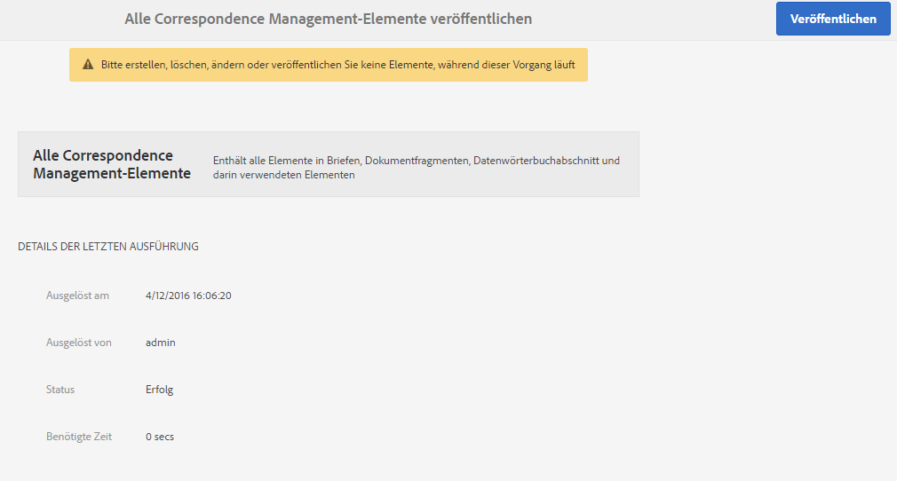

# Veröffentlichung von Formularen und Dokumenten und Rückgängigmachen von Veröffentlichungen {#publishing-and-unpublishing-forms-and-documents}

>[!CAUTION]
>
>AEM 6.4 hat das Ende der erweiterten Unterstützung erreicht und diese Dokumentation wird nicht mehr aktualisiert. Weitere Informationen finden Sie in unserer [technische Unterstützung](https://helpx.adobe.com/de/support/programs/eol-matrix.html). Unterstützte Versionen suchen [here](https://experienceleague.adobe.com/docs/?lang=de).

Mit AEM Forms können Sie Formulare mühelos erstellen, veröffentlichen und die Veröffentlichung rückgängig machen. Weitere Informationen zu AEM Forms finden Sie unter [Einführung in das Verwalten von Formularen](/help/forms/using/introduction-managing-forms.md).

Der AEM Forms-Server umfasst zwei Instanzen: die Autoren- und die Veröffentlichungsinstanz. Der Autoreninstanz dient dem Erstellen und Verwalten von Formular-Assets und -Ressourcen. Die Veröffentlichungsinstanz dient der Aufbewahrung von Assets und zugehörigen Ressourcen, die für Endbenutzer verfügbar sind. Sie können XDP und PDF forms im Autorenmodus importieren. Detaillierte Informationen finden Sie unter [XDP- und PDF-Dokumente in AEM Forms aufrufen](/help/forms/using/get-xdp-pdf-documents-aem.md).

## Unterstützte Assets  {#supported-assets-nbsp}

AEM Forms unterstützt die folgenden Assettypen:

* Adaptive Formulare
* Adaptive Dokumente
* Adaptive Formularfragmente
* Designs
* Formularvorlagen (XFA-Formulare)
* PDF forms
* Dokument (einfache PDF-Dokumente)
* Formularsätze
* Ressource (Bilder, Schemata und Stylesheets)

Zunächst sind alle Assets nur in der Autoreninstanz verfügbar. Administratoren oder Formularautoren können alle Assets mit Ausnahme von Ressourcen veröffentlichen.

Wenn Sie ein Formular auswählen und veröffentlichen, werden auch die zugehörigen Assets und Ressourcen veröffentlicht. Abhängige Assets werden jedoch nicht veröffentlicht. In diesem Kontext sind verwandte Assets und Ressourcen Assets, die ein veröffentlichtes Asset verwendet oder auf die es verweist. Abhängige Assets sind Assets, die auf ein veröffentlichtes Asset verweisen.

Ihr adaptiver Forms verwendet möglicherweise einige Konfigurationen, Einstellungen und Anpassungen, die nicht automatisch veröffentlicht werden. Es wird empfohlen, diese Ressourcen zu veröffentlichen oder zu aktivieren, bevor Sie ein adaptives Formular veröffentlichen.

* Bearbeitbare adaptive Formularvorlagen
* Cloud Service-Konfigurationen für Acrobat Sign-, Typekit-, reCAPTCHA- und Formulardatenmodelle
* Andere Cloud-Service-Konfigurationen sind nur aktiviert, wenn der Benutzer über Administratorberechtigungen verfügt.
* Anpassungen. Dazu gehören unter anderem:

   * Benutzerdefinierte Layouts
   * Benutzerdefiniertes Erscheinungsbild
   * CSS-Datei – als Eingabe im Dialogfeld „Container-Eigenschaften für adaptive Formulare“
   * Client-Bibliothekskategorie – als Eingabe im Dialogfeld „Container-Eigenschaften für adaptive Formulare“
   * Jede andere Client-Bibliothek, die als Teil der Vorlage für adaptive Formulare enthalten sein kann.
   * Designpfade

## Asset-Status {#asset-states}

Ein Asset kann über folgende Status verfügen:

* **Unveröffentlicht**: Ein Asset, das noch nie veröffentlicht wurde (dieser Status kann nur für Formular-Assets verwendet werden. Correspondence Management-Asset haben keine unveröffentlichten Status.)
* **Veröffentlicht**: Ein Asset, das veröffentlicht wurde und auf der Veröffentlichungsinstanz verfügbar ist
* **Geändert**: Ein Asset, das nach seiner Veröffentlichung geändert wird

## Asset veröffentlichen {#publish-an-asset}

1. Melden Sie sich beim AEM Forms-Server an.
1. Verwenden Sie eines der folgenden Verfahren, um ein Asset auszuwählen und zu veröffentlichen.

   1. Bewegen Sie den Mauszeiger über ein Asset und tippen Sie auf **[!UICONTROL Veröffentlichen]** .
   1. Führen Sie einen der folgenden Schritte aus und tippen Sie dann auf „Veröffentlichen“:

      * Wenn Sie sich in der Kartenansicht befinden, tippen Sie auf **[!UICONTROL Auswahl eingeben]**  und dann auf das Asset. Das Asset wird ausgewählt.
      * Wenn Sie sich in der Listenansicht befinden, aktivieren Sie das Kontrollkästchen eines Assets. Das Asset wird ausgewählt.
      * Tippen Sie auf ein Asset, um dessen Details anzuzeigen.
      * Zeigen Sie die Eigenschaften eines Assets an, indem Sie auf „Eigenschaften anzeigen“  tippen.

      >[!NOTE]
      >
      >Wählen Sie nicht mehrere Assets aus. Das gleichzeitige Veröffentlichen mehrerer Assets wird nicht unterstützt.

1. Wenn der Veröffentlichungsprozess beginnt, wird ein Bestätigungsdialogfeld angezeigt, in dem alle zugehörigen Assets und Ressourcen aufgelistet sind. Tippen Sie im Dialogfeld, das das zugehörige Asset enthält, auf **[!UICONTROL Veröffentlichen]**. Das Asset wird veröffentlicht, und das Dialogfeld über das erfolgreiche Veröffentlichen des Assets wird angezeigt.

   >[!NOTE]
   >
   >Bei adaptiven Formularen wird neben den zugehörigen Assets auch der Seitenname des adaptiven Formulars angezeigt.

   

   Bestätigungsdialogfeld mit allen zugehörigen Elementen und Ressourcen

   >[!NOTE]
   >
   >Forms Manager: Wenn der Benutzer nicht berechtigt ist, die aufgelisteten Assets zu veröffentlichen, ist die Veröffentlichungsaktion deaktiviert. Ein Asset, für das zusätzliche Berechtigungen erforderlich sind, wird rot angezeigt.

   Nachdem ein Asset veröffentlicht wurde, werden die Metadateneigenschaften des Assets in die Veröffentlichungsinstanz kopiert und der Status des Assets wird in Veröffentlicht geändert. Der Status von abhängigen Assets, die veröffentlicht werden, wird ebenfalls in &quot;Veröffentlicht&quot;geändert.

   Nach dem Veröffentlichen eines Assets können Sie das Forms-Portal verwenden, um alle Assets auf einer Web-Seite anzuzeigen. Weitere Informationen finden Sie unter [Einführung in das Veröffentlichen von Formularen in einem Portal](/help/forms/using/introduction-publishing-forms.md).

## Alle Correspondence Management-Assets veröffentlichen {#publish-all-the-correspondence-management-assets}

Mit AEM Forms können Sie alle Correspondence Management-Assets auf einem Server in einem Schritt veröffentlichen. Die veröffentlichten Assets umfassen sämtliche Correspondence Management-Assets und ihre zugehörigen Abhängigkeiten.

Führen Sie nun die folgenden Schritte aus, um sämtliche Correspondence Management-Assets auf dem Server zu veröffentlichen:

1. Melden Sie sich beim AEM Forms-Server an.
1. Tippen Sie auf **Adobe Experience Manager** in der Menüleiste für globale Navigation.
1. Tippen und tippen Sie anschließend auf **Forms**.
1. Tippen Sie auf **Correspondence Management Assets veröffentlichen**.

   

   Die Seite „Alle Correspondence Management Assets veröffentlichen“ erscheint und zeigt Informationen zur letzten Ausführung des Prozesses „Correspondence Management Assets veröffentlichen“ an.

   

1. Tippen Sie auf **Veröffentlichen** und anschließend in der Bestätigungsmeldung auf **OK**.

   Nach Abschluss eines Batch-Prozesses können Sie die Details der letzten Ausführung anzeigen. Dazu gehören Informationen wie die Administrator-Anmeldung und ob der Batch erfolgreich ausgeführt wurde oder fehlgeschlagen ist.

   >[!NOTE]
   >
   >Der Veröffentlichungsprozess kann nicht abgebrochen werden, nachdem er initiiert wurde. Zudem sollten Sie darauf achten, während der Ausführung des Vorgangs „Veröffentlichen“ keine Assets zu erstellen, zu löschen, zu modifizieren oder zu veröffentlichen und nicht den Vorgang „Alle Correspondence Management-Elemente exportieren“ zu starten.

## Formulare und Dokumente veröffentlichen und die Veröffentlichung rückgängig machen {#automate-publishing-and-unpublishing-for-forms-amp-documents}

Mit AEM Forms können Sie die Veröffentlichung von Assets und das Rückgängigmachen der Veröffentlichung für Forms und Dokumente planen. Sie können den Zeitplan im Metadaten-Editor angeben. Weitere Informationen zum Verwalten von Formularmetadaten finden Sie unter [Verwalten von Formularmetadaten](/help/forms/using/manage-form-metadata.md).

Führen Sie folgende Schritte aus, um das Datum und die Uhrzeit für die Veröffentlichung bzw. das Rückgängigmachen der Veröffentlichung von Formular- und Dokument-Assets zu planen:

1. Wählen Sie ein Asset aus und tippen Sie auf **[!UICONTROL Eigenschaften anzeigen]**. Die Seite mit den Metadateneigenschaften wird geöffnet.
1. Tippen Sie auf der Seite „Metadateneigenschaften“ auf **[!UICONTROL Erweitert]** und dann auf **[!UICONTROL Bearbeiten]** .
1. Wählen Sie in den Feldern **[!UICONTROL Veröffentlichungszeit]** und **[!UICONTROL Zeit für Rückgängigmachen der Veröffentlichung]** das Datum und die Uhrzeit aus.

   Tippen Sie auf **[!UICONTROL Fertig]** .

## Die Veröffentlichung eines Assets rückgängig machen {#unpublish-an-asset}

1. Wählen Sie ein veröffentlichtes Asset aus und tippen Sie auf **[!UICONTROL Veröffentlichung rückgängig machen]** .
1. Verwenden Sie eines der folgenden Verfahren, um ein Asset auszuwählen und seine Veröffentlichung rückgängig zu machen.

   1. Bewegen Sie den Mauszeiger über ein Asset und klicken Sie auf **[!UICONTROL Veröffentlichung rückgängig machen]** .
   1. Führen Sie einen der folgenden Schritte aus und tippen Sie dann auf „Veröffentlichung rückgängig machen“:

      * Wenn Sie sich in der Kartenansicht befinden, tippen Sie auf **[!UICONTROL Auswahl eingeben]**  und dann auf das Asset. Das Asset wird ausgewählt.
      * Wenn Sie sich in der Listenansicht befinden, halten Sie den Mauszeiger über ein Asset und tippen Sie auf . Das Asset wird ausgewählt.
      * Tippen Sie auf ein Asset, um dessen Details anzuzeigen.
      * Zeigen Sie die Eigenschaften eines Assets an, indem Sie auf „Eigenschaften anzeigen“  tippen.

1. Wenn der Prozess zum Rückgängigmachen der Veröffentlichung startet, wird ein Bestätigungsdialogfeld angezeigt. Tippen Sie auf **[!UICONTROL Veröffentlichung rückgängig machen]**.

   >[!NOTE]
   >
   >Es wird nur die Veröffentlichung des ausgewählten Assets rückgängig gemacht, Assets, die ihm untergeordnet sind oder auf es verweisen, bleiben veröffentlicht.

## Die zuvor veröffentlichte Version eines Assets oder Briefes wiederherstellen {#revert-an-asset-or-letter-to-the-previously-published-version}

Jedes Mal, wenn Sie ein Asset oder einen Brief veröffentlichen, nachdem Sie es bearbeitet haben, wird eine Version des Assets oder Briefs erstellt. Sie können ein Asset oder einen Brief auf eine zuvor veröffentlichte Version zurücksetzen. Möglicherweise müssen Sie dies tun, wenn etwas mit der aktuellen Version des Assets oder Dokuments nicht funktioniert.

>[!NOTE]
>
>Setzen Sie einen Brief nicht wieder in den zuletzt veröffentlichten Status zurück, wenn ein abhängiges Asset, das in diesem veröffentlichten Brief verwendet wird, aus dem System gelöscht wird.

1. Wählen Sie ein Asset aus und tippen Sie auf **[!UICONTROL Wiederherstellen der zuvor veröffentlichten Version]** .
1. Bevor das Asset wiederhergestellt wird, wird ein Bestätigungsdialogfeld angezeigt. Tippen Sie auf **[!UICONTROL Wiederherstellen]**.

   Das Asset bzw. der Brief wird auf seine zuvor veröffentlichte Version zurückgesetzt.

## Löschen eines Assets {#delete-an-asset}

>[!NOTE]
>
>Wenn Sie ein Asset löschen, wird es aus der Veröffentlichungsinstanz entfernt. Beim Löschen von Assets wird auch der Versionsverlauf mit Ausnahme der Basisversion entfernt.

1. Wählen Sie ein Asset aus und tippen Sie auf **[!UICONTROL Löschen]** .

   >[!NOTE]
   >
   >Die Option „Löschen“ ist auch dann verfügbar, wenn Sie auf ein Asset tippen, um seine Details anzuzeigen, oder durch Tippen auf „Eigenschaften anzeigen“  seine Eigenschaften anzeigen.

1. Bevor das Asset gelöscht wird, wird ein Bestätigungsdialogfeld angezeigt. Tippen Sie auf **[!UICONTROL Löschen]**.

   >[!NOTE]
   >
   >Nur das ausgewählte Asset wird gelöscht, nicht jedoch die von ihm abhängigen Assets. Um die Verweise eines Assets zu prüfen, tippen Sie auf  und wählen Sie ein Asset aus.
   >
   >Wenn das Asset, das Sie löschen möchten, ein untergeordnetes Asset eines anderen Assets ist, wird es nicht gelöscht. Um ein solches Asset löschen, entfernen Sie seine Verweise aus anderen Assets und wiederholen Sie den Vorgang.

## Geschützte adaptive Formulare {#protected-adaptive-forms}

Sie können die Authentifizierung für Formulare aktivieren, auf die ausgewählte Benutzer zugreifen sollen. Wenn Sie die Authentifizierung für Ihre Formulare aktivieren, sehen Benutzer einen Anmeldebildschirm, bevor sie darauf zugreifen. Nur Benutzer mit autorisierten Anmeldeinformationen können auf die Formulare zugreifen.

So aktivieren Sie die Authentifizierung für Ihre Formulare:

1. Öffnen Sie in Ihrem Browser configMgr in der Veröffentlichungsinstanz.

   URL: `https://<hostname>:<PublishPort>/system/console/configMgr`

1. Klicken Sie auf der Seite „Adobe Experience Manager Web Console-Konfigurationen“ auf **Apache Sling-Authentifizierungs-Service**, um diesen Service zu konfigurieren.
1. Fügen Sie im daraufhin angezeigten Dialogfeld „Apache Sling-Authentifizierungs-Service“ mithilfe der Schaltfläche **+** die gewünschten Pfade hinzu.

   Wenn Sie einen Pfad hinzufügen, wird der Authentifizierungs-Service für Formulare unter diesem Pfad aktiviert.
