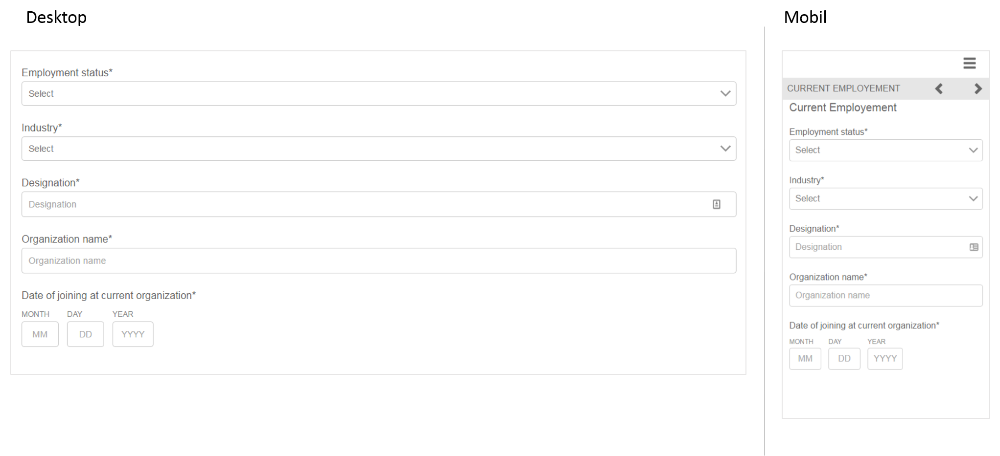
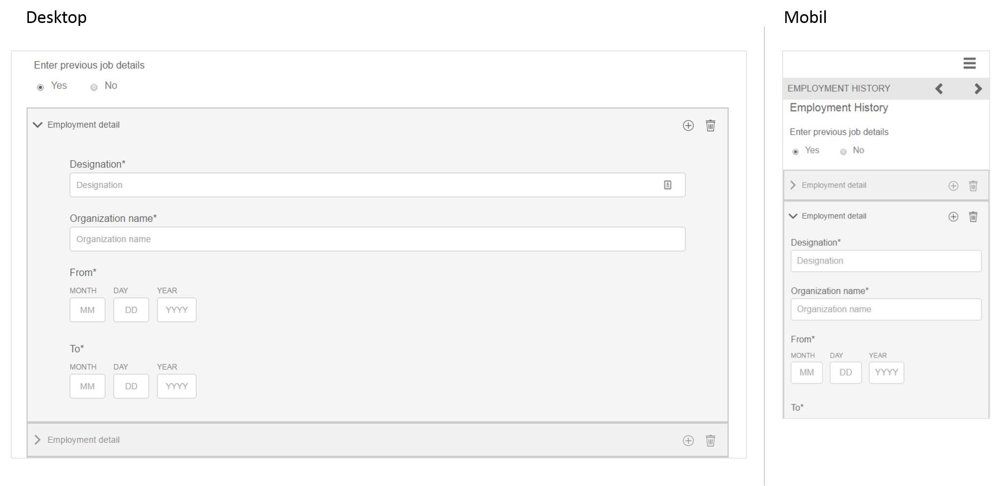

# Referenzieren Sie adaptive Formularfragmente {#reference-adaptive-form-fragments}

[Adaptives Formularfragment](/help/forms/using/adaptive-form-fragments.md) ist eine Gruppe von Feldern oder ein Fenster, das eine Gruppe von Feldern beinhaltet, die Sie verwenden können, wenn Sie ein Formular erstellen. Damit lassen sich Formulare mühelos und schnell erstellen. Sie können ein adaptives Formularfragment per Drag &amp; Drop in ein Formular mit dem Asset-Browser in der Seitenleiste einfügen und Sie können es im Formulareditor bearbeiten.

Für Autoren von adaptiven Formularen werden Referenzfragmente im [Add-on-Paket für AEM Forms](https://experienceleague.adobe.com/docs/experience-manager-release-information/aem-release-updates/forms-updates/aem-forms-releases.html?lang=de) bereitgestellt. Es beinhaltet folgende Fragmente:

* Adresse
* Kontaktangaben
* Kreditkartenangaben
* Aktuelle Beschäftigung
* Informationen zu abhängigen Familienmitgliedern
* Beschäftigungshistorie
* Einkommen und Ausgaben
* Name
* Nutzungsbedingungen
* Nutzungsbedingungen mit Scribble

Wenn Sie das Paket installieren, wird ein Referenzfragmentordner mit Referenzfragmenten unter „Formulare und Dokumente“ erstellt. Weitere Informationen zur Installation eines Pakets finden Sie unter [Arbeiten mit Paketen](/help/sites-administering/package-manager.md).

## Adresse {#address}

Enthält Felder, um die Adresse anzugeben. Die verfügbaren Felder sind Straße, Postleitzahl, Stadt, Staat und Land. Dazu gehören auch ein vorkonfigurierter Webservice, der Stadt und Staat für eine bestimmte US-Postleitzahl ausfüllt.

[Zum Vergrößern hier klicken](assets/address.png)

## Kontaktangaben {#contact-information}

Enthält Felder zum Erfassen von Telefonnummer und E-Mail-Adresse.

[Zum Vergrößern hier klicken](assets/contact-info-1.png)

## Kreditkartenangaben {#credit-card-information}

Beinhaltet Felder zur Erfassung von Kreditkartenangaben, die zur Verarbeitung von Zahlungen verwendet werden können.

## Aktuelle Beschäftigung {#current-employment}

Enthält Felder zur Erfassung aktueller Beschäftigungsdetails wie Beschäftigungsstatus, Bereich der Beschäftigung, Bezeichnung, Organisation und Anfangsdatum.

[Zum Vergrößern hier klicken](assets/current-emp-1.png)

## Informationen zu abhängigen Familienmitgliedern {#dependents-information}

Enthält Felder für Informationen über ein oder mehrere abhängige Familienmitglieder wie Name, Alter und Beziehung im Tabellenformat.

[Zum Vergrößern hier klicken](assets/dependents-info-1.png)

## Beschäftigungshintergrund {#employment-history}

Enthält Felder zur Erfassung des Beschäftigungshintergrunds. Es können mehrere Organisationen hinzugefügt werden.

[Zum Vergrößern hier klicken](assets/emp-history-1.png)

## Umsatz und Ausgaben {#income-expenditure}

Enthält Felder zur Erfassung von monatlichen Cashflows und Ausgaben. Formulare, in denen Benutzer finanzielle Details bereitstellen müssen, können dieses Fragment verwenden, um Einkommen und Ausgaben zu erfassen.

[Zum Vergrößern hier klicken](assets/income-1.png)

## Name {#name}

Enthält Felder zum Angeben von Titel, Vorname, zweitem Vornamen und Nachname.

[Zum Vergrößern hier klicken](assets/name-1.png)

## Nutzungsbedingungen {#terms-conditions}

Gibt Nutzungsbedingungen an, die vom Benutzer akzeptiert werden müssen, bevor ein Formular übermittelt wird.

[Zum Vergrößern hier klicken](assets/tnc-1.png)

## Nutzungsbedingungen mit Scribble {#terms-conditions-with-scribble}

Gibt Nutzungsbedingungen an, die vom Benutzer akzeptiert und abgezeichnet werden müssen, bevor ein Formular übermittelt wird.

[Zum Vergrößern hier klicken](assets/tnc-scribble-1.png)
