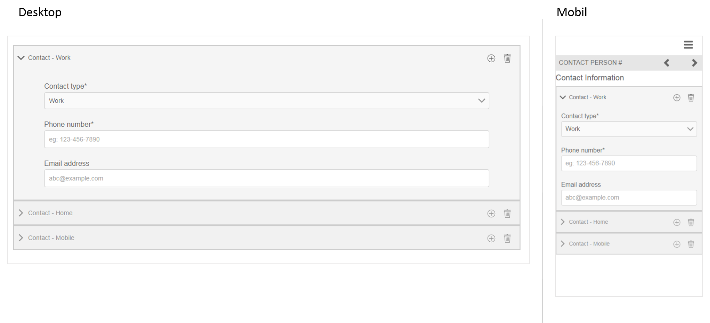

# Referenzieren Sie adaptive Formularfragmente {#reference-adaptive-form-fragments}

>[!CAUTION]
>
>AEM 6.4 hat das Ende der erweiterten Unterstützung erreicht und diese Dokumentation wird nicht mehr aktualisiert. Weitere Informationen finden Sie in unserer [technische Unterstützung](https://helpx.adobe.com/de/support/programs/eol-matrix.html). Unterstützte Versionen suchen [here](https://experienceleague.adobe.com/docs/?lang=de).

[Adaptives Formularfragment](/help/forms/using/adaptive-form-fragments.md) ist eine Gruppe von Feldern oder ein Bedienfeld, das eine Gruppe von Feldern enthält, die Sie beim Erstellen eines Formulars verwenden können. Damit lassen sich Formulare mühelos und schnell erstellen. Sie können ein adaptives Formularfragment per Drag &amp; Drop in ein Formular mit dem Asset-Browser in der Seitenleiste einfügen und Sie können es im Formulareditor bearbeiten.

Für Autoren von adaptiven Formularen werden Referenzfragmente im [Add-on-Paket für AEM Forms](https://experienceleague.adobe.com/docs/experience-manager-release-information/aem-release-updates/forms-updates/aem-forms-releases.html?lang=de) bereitgestellt. Es beinhaltet folgende Fragmente:

* Adresse
* Kontaktangaben
* Kreditkartenangaben
* Aktuelle Beschäftigung
* Informationen zu abhängigen Familienmitgliedern
* Beschäftigungshistorie
* Einkommen und Ausgaben
* Name
* Nutzungsbedingungen
* Nutzungsbedingungen mit Scribble

Wenn Sie das Paket installieren, wird unter Forms und Dokumente ein Ordner mit Referenzfragmenten erstellt. Weitere Informationen zur Installation eines Pakets finden Sie unter [Arbeiten mit Paketen](/help/sites-administering/package-manager.md).

## Adresse {#address}

Enthält Felder, um die Adresse anzugeben. Die verfügbaren Felder sind Straße, Postleitzahl, Stadt, Bundesland und Land. Dazu gehören auch ein vorkonfigurierter Webservice, der Stadt und Staat für eine bestimmte US-Postleitzahl ausfüllt.

[Klicken Sie zum Vergrößern auf](assets/address.png)

## Kontaktangaben {#contact-information}

Enthält Felder zum Erfassen von Telefonnummer und E-Mail-Adresse.

[Klicken Sie zum Vergrößern auf](assets/contact-info-1.png)

## Kreditkartenangaben {#credit-card-information}

Beinhaltet Felder zur Erfassung von Kreditkartenangaben, die zur Verarbeitung von Zahlungen verwendet werden können.

## Aktuelle Beschäftigung {#current-employment}

Enthält Felder zur Erfassung aktueller Beschäftigungsdetails wie Beschäftigungsstatus, Bereich der Beschäftigung, Bezeichnung, Organisation und Anfangsdatum.

[Klicken Sie zum Vergrößern auf](assets/current-emp-1.png)

## Informationen zu abhängigen Familienmitgliedern {#dependents-information}

Enthält Felder für Informationen über ein oder mehrere abhängige Familienmitglieder wie Name, Alter und Beziehung im Tabellenformat.

[Klicken Sie zum Vergrößern auf](assets/dependents-info-1.png)

## Beschäftigungshintergrund {#employment-history}

Enthält Felder zur Erfassung der Beschäftigungsgeschichte. Es ermöglicht das Hinzufügen mehrerer Organisationen.

[Klicken Sie zum Vergrößern auf](assets/emp-history-1.png)

## Umsatz und Ausgaben {#income-expenditure}

Enthält Felder zur Erfassung von monatlichen Cashflows und Ausgaben. Formulare, in denen Benutzer finanzielle Details bereitstellen müssen, können dieses Fragment verwenden, um Einkommen und Ausgaben zu erfassen.

[Klicken Sie zum Vergrößern auf](assets/income-1.png)

## Name {#name}

Enthält Felder zum Angeben von Titel, Vorname, zweitem Vornamen und Nachname.

[Klicken Sie zum Vergrößern auf](assets/name-1.png)

## Nutzungsbedingungen {#terms-conditions}

Gibt Nutzungsbedingungen an, die vom Benutzer akzeptiert werden müssen, bevor ein Formular übermittelt wird.

[Klicken Sie zum Vergrößern auf](assets/tnc-1.png)

## Nutzungsbedingungen mit Scribble {#terms-conditions-with-scribble}

Gibt Nutzungsbedingungen an, die vom Benutzer akzeptiert und abgezeichnet werden müssen, bevor ein Formular übermittelt wird.

[Klicken Sie zum Vergrößern auf](assets/tnc-scribble-1.png)
