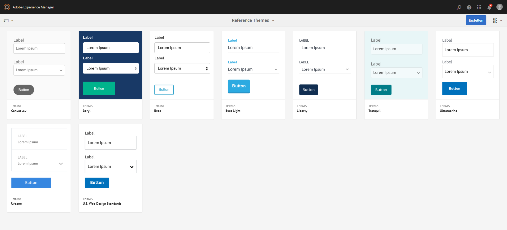

# Referenzthemen {#reference-themes}

[Designs](/help/forms/using/themes.md) ermöglichen Ihnen, Ihre Formulare ohne fundierte Kenntnisse im Umgang mit CSS zu formatieren. Zusätzlich zum Standarddesign können Sie die folgenden Designs abrufen, indem Sie das Paket [AEM-FORMS-6.3-REFERENCE-THEMES](https://www.adobeaemcloud.com/content/marketplace/marketplaceProxy.html?packagePath=/content/companies/public/adobe/packages/cq630/fd/AEM-FORMS-6.3-REFERENCE-THEMES) installieren:

* Beryl
* Exec
* Exec-Light
* Liberty
* Ultramarine
* Urbane
* U.S. Web Design Standards
* Tranquil

Jedes Design enthält einen eindeutigen und eleganten Stil, den Sie verwenden können, um fantastische adaptive Formulare für Benutzer zu erstellen. Es enthält die eindeutige Formatierung für Selektoren wie Bereich, Textfeld, numerisches Feld, Optionsfeld, Tabelle und Schalter. Formatierungen in diesen Designs basieren auf Anforderungen. Beispiel: In bestimmten Fällen benötigen Sie ein minimalistisches Design mit klaren Schriftarten. Mit dem Freiheitsdesign können Sie diesen Look erzielen.

Die Designs, die in diesem Paket enthalten sind, sind responsive und die Formatierung in diesen Themen ist definiert für Mobil- und Desktopanzeigen. Die meisten modernen Browser auf einer Vielzahl von Geräten können Formulare rendern, die mit einem dieser Designs mühelos angewendet werden.

Weitere Informationen zur Installation des Pakets finden Sie unter [Arbeiten mit Paketen](/help/sites-administering/package-manager.md).

## Beryl {#beryl}

Das Beryl-Design wird vom [adaptiven We.Gov-Formular](/help/forms/using/gov-reference-site-walkthrough.md) verwendet, und hebt die Verwendung von Hintergrundbildern, Transparenz und großen und flachen Symbolen hervor. Im Screenshot unten können Sie sehen, wie das Beryl-Design angezeigt wird und wie es das Formatieren des Formulars verbessern kann.

[themeClick zum Vergrößern](assets/beryl-1.png)

## Exec {#exec}

Exec-Design vermeidet einfarbige Hintergrundfüllungen, um die Formularkomponenten hervorzuheben. Das Auswählen vonund Klicken auf Komponenten ändert die Schriftfarben. Im Vergleich zum standardmäßigen Arbeitsflächendesign ändert sich die Schriftfarbe des Texts in der ausgewählten Registerkarte Dunkelblau. Beachten Sie, wie sich die Navigations- und Senden-Schaltflächen vom Beryl-Design unterscheiden.

[Zum Vergrößern hier klicken](assets/exec-1.png)

## Exec Light  {#exec-light}

Exec Light-Design verwendet Leerräume, um ein nahtloses Benutzererlebnis zu erstellen. Die Schaltflächen „Weiter“ und „Senden“ erhalten eine durchgehende Füllung und einen 3D-Schatten. Ausgewählte Registerkarten links erhalten einen Pfeil statt Doppelhäkchen.

[Zum Vergrößern hier klicken](assets/exec-light-1.png)

## Liberty {#liberty}

Das Liberty-Design verwendet eine minimalistische Herangehensweise, um das Wichtige hervorzuheben. Beispielsweise die Schriftfarbe der besuchten Registerkarte ändert sich in Grün. Sie können nur die untere Kontur des Textfelds sehen, was den Look eines papierbasierten Formulars mit Linien simuliert. Das aktive Textfeld hat eine schwarze untere Kontur, während andere eine hellgraue untere Kontur haben.

[Zum Vergrößern hier klicken](assets/liberty-1.png)

## Tranquil {#tranquil}

Das Tranquil-Design bietet helle und dunkle Schatten des Tranquil-Farbschemas, um verschiedene Komponenten eines Formulars hervorzuheben. Beispielsweise erhalten Optionsfelder, Bereiche und Registerkarten einen anderen Grünton.

[Zum Vergrößern hier klicken](assets/tranquil-1.png)

## Ultramarine {#ultramarine}

Das Ultramarine-Design verwendet dunkelblaue Töne, um Komponenten wie Registerkarten, Bereiche, Textfelder und Schaltflächen hervorzuheben.

## Urbane {#urbane}

Das Urbane-Design betont ein minimalistisches und funktionales Erscheinungsbild für Ihr Formular. Wenn Sie das Urbane-Design auf Ihr Formular anwenden, können Sie sehen, dass die Komponenten flach sind. Die Bedienfelder erhalten dünne Konturen, um einen modernen Look zu erzielen.

[Zum Vergrößern hier klicken](assets/urbane-1.png)

## U.S. Web Design Standards {#u-s-web-design-standards}

Wie der Name schon sagt, verwendet das Thema Web Design Standards in den USA Schriften und Stile, die auf der Website Draft U.S. Web Design Standards beschrieben sind. Der Webstandard wird von verschiedenen Bundesorganisationen verwendet, um konsistente Web-Erlebnisse für Bundesregierungswebsites zu erstellen.

[Zum Vergrößern hier klicken](assets/usgov.png)
