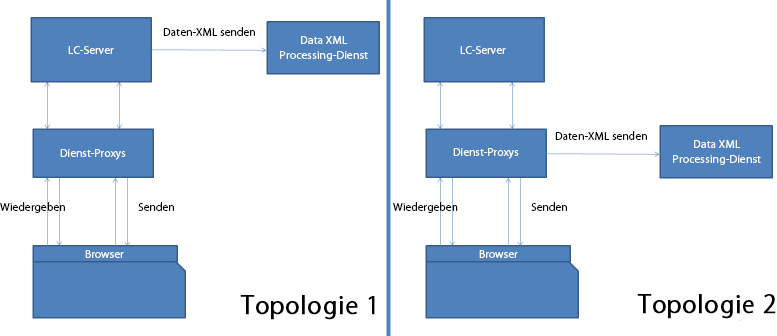

# HTML5 Forms-Service-Proxy {#html-forms-service-proxy}

>[!CAUTION]
>
>AEM 6.4 hat das Ende der erweiterten Unterstützung erreicht und diese Dokumentation wird nicht mehr aktualisiert. Weitere Informationen finden Sie in unserer [technische Unterstützung](https://helpx.adobe.com/de/support/programs/eol-matrix.html). Unterstützte Versionen suchen [here](https://experienceleague.adobe.com/docs/?lang=de).

HTML5 forms Service Proxy ist eine Konfiguration, um einen Proxy zum Sendedienst anzumelden. Um Service Proxy zu konfigurieren, geben Sie die URL des Sendedienstes über den Anforderungsparameter an *submissionServiceProxy*.

## Vorteile des Service Proxy {#benefits-of-service-proxy-br}

Der Service Proxy eliminiert Folgendes:

* Der Arbeitsablauf von HTML5-Formularen erfordert Öffnen des Sendedienstes „//content/xfaforms/submission/default“ für HTML5-Formularbenutzer. Er stellt AEM Server einer größeren unbeabsichtigten Zielgruppe zur Verfügung.
* Die Dienst-URL ist in das Laufzeitmodell des Formulars eingebettet. Es ist nicht möglich, den Pfad der Dienst-URL zu ändern.
* Die Übermittlung erfolgt in zwei Schritten. Zum Senden der Formulardaten sind für die Übermittlung mindestens zwei Journey an den Server erforderlich. Dadurch erhöht sich die Last auf dem Server.
* HTML5-Formulare senden Daten über eine POST-Anforderung statt über eine PDF-Anforderung. Für Arbeitsabläufe, die sowohl PDF- als auch HTML5-Formulare beinhalten, sind zwei unterschiedliche Methoden für die Sendeverarbeitung erforderlich.

## Topologien {#topologies-br}

HTML5-Formulare können die folgenden Topologien verwenden, um eine Verbindung zu den AEM-Servern herzustellen.

* Eine Topologie, bei der AEM Server- oder HTML5-Formulare Daten über die POST an den Server senden.
* Eine Topologie, bei der der Proxy-Server POST-Daten an den Server sendet.

HTML5 Forms-Service-Proxy-Topologien

HTML5-Formulare stellen eine Verbindung zu den AEM-Servern her, um serverseitige Skripte, Webdienste und Sendevorgänge auszuführen. Die XFA-Laufzeitumgebung der HTML5-Formulare verwendet Ajax-Aufrufe am Endpunkt „//bin/xfaforms/submitaction“ mit verschiedenen Parametern, um eine Verbindung zu den AEM-Servern herzustellen. HTML5 forms verbindet AEM Server mit folgenden Vorgängen:

### Ausführen von serverseitigen Skripten und Webdiensten {#execute-server-sided-scripts-and-web-services}

Die Skripte, die für die Ausführung auf dem Server markiert sind, werden als serverseitige Skripte bezeichnet. Die folgende Tabelle listet alle Parameter auf, die in serverseitigen Skripten und Web-Diensten verwendet werden.

<table> 
 <tbody> 
  <tr> 
   <td>
<strong>Parameter</strong>
 </td> 
   <td>
<strong>Beschreibung</strong>
 </td> 
  </tr> 
  <tr> 
   <td>
activity
 </td> 
   <td>
Die Aktivität enthält die Ereignisse, die auf die Anforderung Trigger sind. z. B. Klicken, Beenden oder Ändern
 </td> 
  </tr> 
  <tr> 
   <td>
contextSom
 </td> 
   <td>
contextSom enthält SOM-Ausdruck des Objekts, in dem Ereignisse ausgeführt werden.
 </td> 
  </tr> 
  <tr> 
   <td>
Vorlage
 </td> 
   <td>
"Template"enthält die Vorlage, die zum Rendern des Formulars verwendet wird.
 </td> 
  </tr> 
  <tr> 
   <td>
contentRoot
 </td> 
   <td>
contentRoot enthält den Stammordner der Vorlage, der zum Rendern des Formulars verwendet wird.
 </td> 
  </tr> 
  <tr> 
   <td>
Daten
 </td> 
   <td>
"Data"enthält Batch-Bytes, die zum Rendern des Formulars verwendet werden.
 </td> 
  </tr> 
  <tr> 
   <td>
formDom
 </td> 
   <td>
formDom enthält DOM des HTML5-Formulars im JSON-Format.
 </td> 
  </tr> 
  <tr> 
   <td>
packet
 </td> 
   <td>
packet wird als Formular angegeben.
 </td> 
  </tr> 
  <tr> 
   <td>
debugDir
 </td> 
   <td>
debugDir enthält den Debug-Ordner, der zum Rendern des Formulars verwendet wird.
 </td> 
  </tr> 
 </tbody> 
</table>

### Daten senden {#submit-data}

Wenn auf die Schaltfläche „Senden“ geklickt wird, senden HTML5-Formulare Daten zum Server. In der folgenden Tabelle sind alle Parameter aufgeführt, die von HTML5-Formularen an den Server gesendet werden.

<table> 
 <tbody> 
  <tr> 
   <td>
<strong>Parameter</strong>
 </td> 
   <td>
<strong>Beschreibung</strong>
 </td> 
  </tr> 
  <tr> 
   <td>
Vorlage
 </td> 
   <td>
Vorlage zum Rendern des Formulars.
 </td> 
  </tr> 
  <tr> 
   <td>
contentRoot
 </td> 
   <td>
Vorlagen-Stammordner, der zum Rendern des Formulars verwendet wird.
 </td> 
  </tr> 
  <tr> 
   <td>
Daten
 </td> 
   <td>
Datenbytes zum Rendern des Formulars.
 </td> 
  </tr> 
  <tr> 
   <td>
formDom
 </td> 
   <td>
DOM des HTML5-Formulars im JSON-Format.
 </td> 
  </tr> 
  <tr> 
   <td>
submiturl
 </td> 
   <td>
Die URL, an die Daten-XML gesendet wird.
 </td> 
  </tr> 
  <tr> 
   <td>
debugDir
 </td> 
   <td>
Das Debug-Verzeichnis, das zum Rendern des Formulars verwendet wird.
 </td> 
  </tr> 
 </tbody> 
</table>

### Wie funktioniert der Sende-Proxy? {#how-nbsp-the-nbsp-submit-proxy-works}

Der Sendedienst-Proxy dient als Pass Through, wenn die submitUrl nicht im Anforderungsparameter vorhanden ist. Es dient als Pass-Through. Er sendet die Anforderung zum Endpunkt „/bin/xfaforms/submitaction“ und die Antwort zur XFA-Laufzeitumgebung.

Der Sendedienst-Proxy wählt eine Topologie aus, wenn die submitUrl im Anforderungsparameter vorhanden ist.

* Wenn AEM-Server Daten senden, dient der Proxy-Dienst als Pass-Through. Er sendet die Anforderung zum Endpunkt „//bin/xfaforms/submitaction“ und die Antwort zur XFA-Laufzeitumgebung.
* Wenn der Proxy die Daten sendet, reicht der Proxy-Service alle Parameter außer submitUrl an den Endpunkt */bin/xfaforms/submitaction* weiter und empfängt XML-Bytes als Antwort-Stream. Dann sendet der Proxy-Dienst die XML-Datenbytes an die submitUrl zur Verarbeitung.

* Vor dem Versenden der Daten (POST-Anforderung) an einen Server prüfen HTML5-Formulare die Verbindung und Verfügbarkeit des Servers. Um die Verbindung und Verfügbarkeit zu prüfen, senden HTML-Formulare eine leere HEAD-Anforderung an den Server. Wenn der Server verfügbar ist, sendet das HTML5-Formular Daten (POST-Anforderung) an den Server. Wenn der Server nicht verfügbar ist, wird die Fehlermeldung *Keine Verbindung zum Server* angezeigt. Durch die erweiterte Erkennung müssen Benutzer das Formular nicht stets von Neuem ausfüllen. Das Proxy-Servlet verarbeitet HEAD-Anforderungen und löst keine Ausnahme aus.
