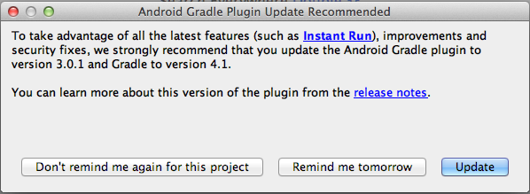

# Richten Sie das Android-Studioprojekt ein und erstellen Sie eine Android-App {#set-up-the-android-studio-project-and-build-the-android-app}

Dieser Artikel gilt für das Erstellen der AEM Forms App 6.3.1.1 und höheren Versionen. Informationen zum Erstellen einer App aus dem Quellcode des Quellcodes der AEM Forms App 6.3 finden Sie unter [Einrichten des Eclipse-Projekts und Erstellen der Android™-App](/help/forms/using/setup-eclipse-project-build-installer.md).

In AEM Forms wird der vollständige Quellcode der AEM Forms-App bereitgestellt. Die Quelle enthält alle Komponenten, die für eine benutzerdefinierte AEM Forms-App erforderlich sind. Quellcode-Archiv, `adobe-lc-mobileworkspace-src-<version>.zip` ist Teil der `adobe-aemfd-forms-app-src-pkg-<version>.zip` Paket auf Softwareverteilung.

Um die AEM Forms App-Quelle zu erhalten, führen Sie die folgenden Schritte aus:

1. Öffnen Sie [Software Distribution](https://experience.adobe.com/downloads). Zum Anmelden bei Software Distribution benötigen Sie eine Adobe ID.
1. Tippen Sie im Kopfzeilenmenü auf **[!UICONTROL Adobe Experience Manager]**.
1. Im Abschnitt **[!UICONTROL Filter]**:
   1. Wählen Sie **[!UICONTROL Formulare]** aus der Dropdown-Liste **[!UICONTROL Lösung]**.
   2. Wählen Sie die Version und den Typ für das Paket aus. Sie können auch die **[!UICONTROL Suchdownloads]** Option zum Filtern der Ergebnisse.
1. Tippen Sie auf den Paketnamen für Ihr Betriebssystem und wählen Sie **[!UICONTROL EULA-Bedingungen akzeptieren]** und tippen Sie auf **[!UICONTROL Download]**.
1. Öffnen Sie [Package Manager](https://docs.adobe.com/content/help/de-DE/experience-manager-65/administering/contentmanagement/package-manager.html) und klicken Sie auf **[!UICONTROL Paket hochladen]**, um das Paket hochzuladen.
1. Wählen Sie das Paket aus und klicken Sie auf **[!UICONTROL Installieren]**.

Die folgende Abbildung zeigt den extrahierten Inhalt der `adobe-lc-mobileworkspace-src-<version>.zip`.

Die folgende Abbildung zeigt die Verzeichnisstruktur der `android`im Ordner `src`Ordner.

## Standardmäßige AEM Forms-App erstellen {#set-up-the-xcode-project}

1. Führen Sie die folgenden Schritte aus, um ein Projekt in Android™ Studio einzurichten und eine Signing-Identität anzugeben:

   Melden Sie sich bei einem Computer an, auf dem Android™ Studio installiert und konfiguriert ist.

1. Kopieren Sie die heruntergeladenen `adobe-lc-mobileworkspace-src-<version>.zip` Archiv für:

   **Für MAC-Benutzer**: `[User_Home]/Projects`

   **Für Windows®-Benutzer**: `%HOMEPATH%\Projects`

   >[!NOTE]
   >
   >Für Windows® wird empfohlen, das Android-Projekt auf dem Systemlaufwerk zu belassen.

1. Extrahieren Sie das Archiv im folgenden Verzeichnis:

   **Für MAC-Benutzer**: `[User_Home]/Projects/[your-project]`

   **Für Windows®-Benutzer**: `%HOMEPATH%\Projects\[your-project]`

   >[!NOTE]
   >
   >Es wird empfohlen, das extrahierte Android-Projekt auf dem Systemlaufwerk zu belassen, bevor Sie das Projekt in Android Studio importieren.

1. Starten Sie Android™ Studio.

   **Für MAC-Benutzer**: Aktualisieren Sie die `local.properties` -Datei im `[User_Home]/Projects/[your-project]/android` und zeigen Sie auf `sdk.dir` zu `SDK` auf Ihrem Desktop.

   **Für Windows®-Benutzer**: Aktualisieren Sie die `local.properties` -Datei im `%HOMEPATH%\Projects\[your-project]\android` und zeigen Sie auf `sdk.dir` zu `SDK` auf Ihrem Desktop.

1. Klicken Sie auf **[!UICONTROL Beenden]**um das Projekt zu erstellen.

   Das Projekt ist im ADT Project Explorer verfügbar.

   

1. Wählen Sie in Android™ Studio **[!UICONTROL Projekt importieren (Eclipse ADT, Gradle, etc.)]**.
1. Wählen Sie im Projekt-Explorer das Stammverzeichnis des Projekts aus, das Sie im **Stammverzeichnis** Textfeld:

   **Für Benutzer von Mac:** [user_home]/Projects/MobileWorkspace/src/android

   **Für Windows®-Benutzer:** %HOMEPATH%\Projects\MobileWorkspace\src\android

1. Nachdem das Projekt importiert wurde, erscheint ein Popup mit der Option zum Aktualisieren des Android™ Plugin Gradle. Klicken Sie wie für Ihre Zwecke benötigt auf die entsprechende Schaltfläche.

   

1. Nach dem erfolgreichen Erstellen des Gradle erscheint der folgende Bildschirm. Verbinden Sie das entsprechende Gerät oder den Emulator mit dem System und klicken Sie auf **[!UICONTROL Android™ ausführen]**.

   

1. Android™ Studio zeigt die verbundenen Geräte und verfügbaren Emulatoren an. Wählen Sie das Gerät, auf dem Sie die Anwendung ausführen wollen, und klicken Sie dann auf **OK**.

   

Nachdem Sie das Projekt erstellt haben, haben Sie folgende Möglichkeiten zum Installieren der App mit Android™ Debug Bridge oder Android™ Studio:

### Mit Android™ Debug Bridge {#andriod-debug-bridge}

Sie können die Anwendung über [Android™ Debug Bridge](https://developer.android.com/tools/help/adb.html) mit folgendem Befehl auf einem Android™-Gerät installieren:

**Für MAC-Benutzer**: `adb install [User_Home]/Projects/[your-project]/adobe-lc-mobileworkspace-src-[version]/android/build/outputs/apk/android-debug.apk`

**Für Windows®-Benutzer**: `adb install %HOMEPATH%\Projects\[your-project]\adobe-lc-mobileworkspace-src-[version]\android\build\outputs\apk\android-debug.apk`
