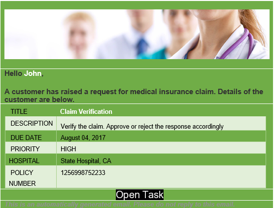

# Benutzerdefinierte E-Mail-Vorlagen im Schritt „Aufgabe zuweisen“ verwenden {#use-custom-email-templates-in-an-assign-task-step}

Benutzerdefinierte E-Mail-Vorlagen für E-Mail-Benachrichtigungen in Forms-Workflow

Mithilfe des Schritts „Aufgabe zuweisen“ können Sie einem Benutzer oder einer Gruppe Aufgaben zuweisen. Wenn eine Aufgabe einem Benutzer oder einer Gruppe zugewiesen wird, erhält der definierte Benutzer oder jedes Mitglied der definierten Gruppe eine E-Mail-Benachrichtigung. Eine typische E-Mail-Benachrichtigung enthält einen Link zur zugewiesenen Aufgabe und dazugehörige Informationen. Die folgende Abbildung zeigt ein Beispiel für eine E-Mail-Benachrichtigung:

Sie können die Darstellung von E-Mail-Benachrichtigungen anpassen und benutzerdefinierte Metadaten darin verwenden. In AEM Forms steht eine vorkonfigurierte Vorlage für E-Mail-Benachrichtigungen zur Verfügung. Sie können die vorkonfigurierte Vorlage verwenden oder eine neue Vorlage erstellen.

Vorlagen für E-Mail-Benachrichtigungen basieren auf [HTML-E-Mail](https://en.wikipedia.org/wiki/HTML_email). Diese E-Mail passen sich an unterschiedliche E-Mail-Clients und Bildschirmgrößen an. Darüber hinaus wird die Darstellung der E-Mail innerhalb der Vorlage definiert.

Die folgende Abbildung zeigt eine angepasste E-Mail-Benachrichtigung:

## Vorhandene Vorlage anpassen {#customize-the-existing-template}

In AEM Forms steht eine vorkonfigurierte Vorlage für E-Mail-Benachrichtigungen zur Verfügung. Die Vorlage enthält eine Titelbeschreibung, ein Fälligkeitsdatum, eine Priorität, einen Workflow-Namen und eine Verknüpfung zur zugewiesenen Aufgabe. Sie können die Vorlage anpassen, um die Darstellung zu ändern. Führen Sie die folgenden Schritte aus, um die Vorlage anzupassen:

1. Melden Sie sich mit einem Administratorkonto bei CRXDE an.

1. Navigieren Sie zu /libs/fd/dashboard/templates/email.

1. Öffnen Sie die Datei „htmlEmailTemplate.txt“. Sie enthält die Standardvorlage.

1. Ersetzen Sie den Inhalt der Datei „htmlEmailTemplate.txt“ durch benutzerdefinierten Inhalt.

   Eine E-Mail-Benachrichtigungsvorlage ist eine [HTML-E-Mail](https://en.wikipedia.org/wiki/HTML_email). Sie können den vorhandenen HTML-Code durch Ihren benutzerdefinierten Code ersetzen, um das Aussehen der Vorlage zu ändern.

1. Speichern Sie die Datei. Damit ist die benutzerdefinierte Vorlage einsatzbereit.

## Erstellen einer E-Mail-Vorlage {#create-an-email-template}

In AEM Forms steht eine vorkonfigurierte Vorlage für E-Mail-Benachrichtigungen zur Verfügung. Die Vorlage enthält eine Titelbeschreibung, ein Fälligkeitsdatum, eine Priorität, einen Workflow-Namen und eine Verknüpfung zur zugewiesenen Aufgabe. Sie können außerdem eine benutzerdefinierte E-Mail-Vorlage (Ihre eigene Vorlage) für den Schritt „Aufgabe zuweisen“ hinzufügen. Führen Sie die folgenden Schritte aus, um eine benutzerdefinierte E-Mail-Vorlage hinzuzufügen:

1. Melden Sie sich mit einem Administratorkonto bei CRXDE an.

1. Navigieren Sie zu /libs/fd/dashboard/templates/email.

1. Erstellen Sie eine TXT-Datei. Dies könnte beispielsweise „EmailOnTaskAssign.txt“ sein.

1. Fügen Sie der Datei benutzerdefinierten HTML-Code hinzu.

   Eine E-Mail-Benachrichtigungsvorlage ist eine [HTML-E-Mail](https://en.wikipedia.org/wiki/HTML_email). Sie können der Datei benutzerdefinierten HTML-Code hinzufügen, um eine neue Vorlage zu erstellen. 

1. Speichern Sie die Datei. Damit ist die Vorlage zur Verwendung im Schritt „Aufgabe zuweisen“ bereit.

## E-Mail-Vorlage im Schritt „Aufgabe zuweisen“ verwenden {#use-an-email-template-in-an-assign-task-step}

Der Schritt „Aufgabe zuweisen“ ist standardmäßig so konfiguriert, dass die Standardvorlage „htmlEmailTemplate.txt“ verwendet wird. Sie können stattdessen eine benutzerdefinierte Vorlage zu verwenden. Vorlage ändern

1. Öffnen Sie die **[!UICONTROL Aufgabe zuweisen]** Schritt.

1. Navigieren Sie zu **[!UICONTROL Assignee > HTML Email Template]**.

1. Wählen Sie die neu erstellte HTML-E-Mail-Vorlage aus. 

1. Klicken Sie auf **[!UICONTROL OK]**. Die Vorlage wird geändert.

In E-Mail-Benachrichtigungen werden außerdem [Metadaten](/help/forms/using/use-metadata-in-email-notifications.md) verwendet. Dies können beispielsweise Fälligkeitsdatum, Priorität, Workflow-Name und mehr sein. Sie können auch die zu verwendende Vorlage konfigurieren [benutzerdefinierte Metadaten](/help/forms/using/use-metadata-in-email-notifications.md#using-custom-metadata-in-an-email-notification).
