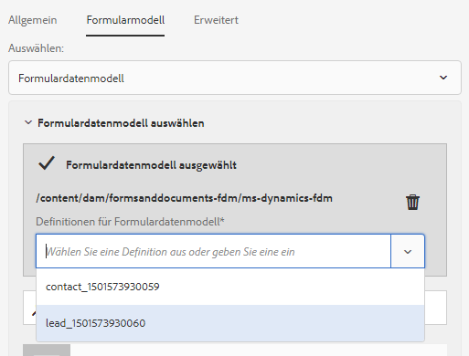
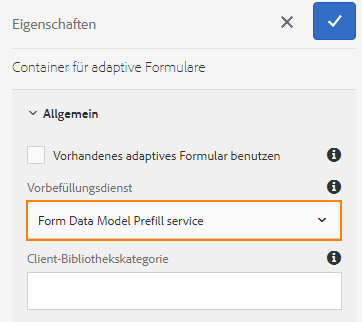

# Verwenden eines Formulardatenmodells {#use-form-data-model}

Mit der AEM Forms-Datenintegration können Sie unterschiedliche Back-End-Datenquellen verwenden, um ein Formulardatenmodell zu erstellen, das Sie als Schema in verschiedenen adaptiven Formularen und interaktiven Kommunikationsworkflows verwenden können. Dafür ist das Konfigurieren von Datenquellen und Erstellen von Formulardatenmodellen, basierend auf Datenmodellobjekten sowie Diensten, die in den Datenquellen verfügbar sind, erforderlich. Weitere Informationen finden Sie in den folgenden Themen:

* [Datenintegration für AEM Forms](/help/forms/using/data-integration.md)
* [Konfigurieren von Datenquellen](/help/forms/using/configure-data-sources.md)
* [Erstellen des Formulardatenmodells](/help/forms/using/create-form-data-models.md)
* [Arbeiten mit einem Formulardatenmodell](/help/forms/using/work-with-form-data-model.md)

Ein Formulardatenmodell ist eine Erweiterung des JSON-Schemas, die Sie wie folgt verwenden können:

* [Adaptive Formulare und Fragmente erstellen](#create-af)
* [Interaktive Kommunikation und Bausteine wie Text, Liste und Bedingungsfragmente erstellen](#create-ic)
* [Vorschau für interaktive Kommunikation mit Beispieldaten](#preview-ic)
* [Adaptive Formulare und interaktive Kommunikation ausfüllen](#prefill)
* [Gesendete adaptive Formulardaten zurück in Datenquellen schreiben](#write-af)
* [Dienste über Regeln für adaptive Formulare aufrufen](#invoke-services)

## Adaptive Formulare und Fragmente erstellen {#create-af}

Sie können [adaptive Formulare](/help/forms/using/creating-adaptive-form.md) und [adaptive Formularfragmente](/help/forms/using/adaptive-form-fragments.md) anhand des Formulardatenmodells erstellen. Gehen Sie wie folgt vor, um ein Formulardatenmodell beim Erstellen eines adaptiven Formulars oder eines adaptiven Formularfragments zu verwenden:

1. Wählen Sie auf der Registerkarte „Formularmodell“ im Bildschirm „Eigenschaften hinzufügen“ **[!UICONTROL Formulardatenmodell]** aus der Dropdown-Liste **[!UICONTROL Auswählen]**.

   

1. Tippen Sie auf **[!UICONTROL Formulardatenmodell auswählen]**, um es zu erweitern. Alle verfügbaren Formulardatenmodelle werden aufgelistet.

   Wählen Sie ein Formulardatenmodell aus.

   

1. (**Nur adaptive Formularfragmente**) Sie können ein adaptives Formularfragment nur auf Basis eines einzelnen Datenmodellobjekts in einem Formulardatenmodell erstellen. Erweitern Sie die Dropdownliste **[!UICONTROL Definitionen für Formulardatenmodell]**. Hier sind sämtliche Datenmodellobjekte im angegebenen Formulardatenmodell aufgelistet. Wählen Sie ein Datenmodellobjekt aus der Liste aus.

   

Sobald das auf einem Formulardatenmodell basierende adaptive Formular oder Formularfragment erstellt ist, werden Formulardatenobjekte auf der Registerkarte **[!UICONTROL Datenmodellobjekte]** des Inhaltsbrowsers im Editor für adaptive Formulare angezeigt.

>[!NOTE]
>
>Für ein adaptives Formularfragment werden nur das zum Zeitpunkt der Bearbeitung ausgewählte Datenmodellobjekt und die zugehörigen Datenmodellobjekte auf der Registerkarte Datenmodellobjekte angezeigt.

Indem Sie Datenmodellobjekte in das adaptive Formular oder Fragment ziehen und dort ablegen, können Sie Formularfelder hinzufügen. Für die hinzugefügten Formularfelder bleiben die Metadateneigenschaften und die Bindung der Datenmodellobjekteigenschaften erhalten. Die Bindung stellt sicher, dass die Feldwerte in den entsprechenden Datenquellen bei der Formularübermittlung aktualisiert und bei der Ausgabe des Formulars vorausgefüllt werden.

## Interaktive Kommunikation erstellen {#create-ic}

Sie können eine interaktive Kommunikation basierend auf einem Formulardatenmodell erstellen, mit dem Sie die interaktive Kommunikation mit Daten aus konfigurierten Datenquellen vorab füllen können. Darüber hinaus können die Bausteine &#x200B;&#x200B;einer interaktiven Kommunikation, wie etwa Text-, Listen- und Bedingungsdokumentfragmente, auf einem Formulardatenmodell basieren.

Sie können ein Formulardatenmodell beim Erstellen einer interaktiven Kommunikation oder eines Dokumentfragments auswählen. Das folgende Bild zeigt die Registerkarte „Allgemein“ des Dialogfelds „Interaktive Kommunikation erstellen“.

Registerkarte „Allgemein“ des Dialogfelds „Interaktive Kommunikation erstellen“

Weitere Informationen finden Sie unter:

[Interaktive Kommunikation erstellen](/help/forms/using/create-interactive-communication.md)

[Text in interaktiven Kommunikationen](/help/forms/using/texts-interactive-communications.md)

[Bedingungen in interaktiven Kommunikationen](/help/forms/using/conditions-interactive-communications.md)

[Fragmente aufführen](/help/forms/using/lists.md)

## Vorschau mit Beispieldaten {#preview-ic}

Mit dem Formulardatenmodelleditor können Sie Beispieldaten für Datenmodellobjekte im Formulardatenmodell generieren und bearbeiten. Sie können diese Daten verwenden, um interaktive Kommunikation und adaptive Formulare in der Vorschau anzuzeigen und zu testen. Sie müssen die Beispieldaten vor der Vorschau generieren, wie beschrieben unter [Arbeiten mit einem Formulardatenmodell](/help/forms/using/work-with-form-data-model.md#sample).

So zeigen Sie eine interaktive Kommunikation mit Stichprobendatenmodelldaten an:

1. Navigieren Sie auf dem AEM-Server zu **[!UICONTROL Formulare > Formulare und Dokumente]**.
1. Wählen Sie eine interaktive Kommunikation und tippen Sie auf **[!UICONTROL Vorschau]** in der Symbolleiste, um **[!UICONTROL Webkanal]**, **[!UICONTROL Druckkanal]** oder **[!UICONTROL Beide Kanäle]** auszuwählen und eine Vorschau der interaktiven Kommunikation anzuzeigen.
1. In der Vorschau [*channel*] Dialog **[!UICONTROL Testdaten des Formulardatenmodells]** ausgewählt ist und tippen **[!UICONTROL Vorschau]**.

Die interaktive Kommunikation öffnet sich mit vorbefüllten Beispieldaten.

Um ein adaptives Formular mit Beispieldaten in der Vorschau anzuzeigen, öffnen Sie das adaptive Formular im Autorenmodus und tippen Sie auf **[!UICONTROL Vorschau]**.

## Vorbefüllen mit dem Formulardatenmodelldienst {#prefill}

AEM Forms bietet einen standardmäßigen Vorbefüllungs-Dienst für Formulardatenmodelle, den Sie für adaptive Formulare und interaktive Kommunikation auf Basis eines Formulardatenmodells aktivieren können. Der Vorbefüllungs-Dienst fragt Datenquellen nach Datenmodellobjekte im adaptiven Formular und in der interaktiven Kommunikation ab und befüllt dementsprechend Daten, während das Formular oder die Kommunikation gerendert wird.

Um den Vorbefüllungs-Dienst für ein adaptives Formular zu aktivieren, öffnen Sie die Eigenschaften des Containers für ein adaptives Formular und wählen Sie **[!UICONTROL Vorbefüllungs-Dienst für Formulardatenmodell]** aus der Dropdownliste **[!UICONTROL Vorbefüllungs-Dienst]** im Accordion „Standard“. Speichern Sie anschließend die Eigenschaften.

Um den Vorbefüllungs-Dienst für Formulardatenmodelle in einer interaktiven Kommunikation zu konfigurieren, können Sie im Dropdown-Liste für den Vorbefüllungs-Dienst den Vorbefüllungs-Dienst für Formulardatenmodelle während der Erstellung auswählen, oder später, indem Sie die Eigenschaften ändern.

Dialogfeld „Eigenschaften bearbeiten“ für eine interaktive Kommunikation

## Gesendete adaptive Formulardaten in Datenquellen schreiben {#write-af}

Sie können ein auf einem Formulardatenmodell basierendes Formular so konfigurieren, dass die vom Benutzer im Formular übermittelten Daten für ein Datenmodellobjekt bei der Übermittlung in dessen Datenquellen geschrieben werden. Zu diesem Zweck steht in AEM Forms die [Übermittlungsaktion für Formulardatenmodelle](/help/forms/using/configuring-submit-actions.md) zur Verfügung. Standardmäßig ist sie nur für adaptive Formulare verfügbar, die auf einem Formulardatenmodell basieren. Durch diese Aktion werden übermittelte Daten für ein Datenmodellobjekt in dessen Datenquelle geschrieben.

Um die Übermittlungsaktion &quot;Formulardatenmodell&quot;zu konfigurieren, öffnen Sie die Eigenschaften des Containers für adaptive Formulare und wählen Sie **[!UICONTROL Senden mit Formulardatenmodell]** aus der Dropdown-Liste Übermittlungsaktion unter dem Akkordeon Übermittlung . Suchen Sie dann das gewünschte Datenmodellobjekt in der Dropdownliste **[!UICONTROL Name des zu übermittelnden Modellobjekts]** und wählen Sie es aus. Speichern Sie die Eigenschaften.

Bei Übermitteln des Formulars werden die Daten für das konfigurierte Datenmodellobjekt in die entsprechende Datenquelle geschrieben.

Mithilfe der Objekteigenschaft „Binärdatenmodell“ können Sie auch Formularanhänge an eine Datenquelle senden. Gehen Sie wie folgt vor, um Anhänge an eine JDBC-Datenquelle zu senden:

1. Fügen Sie dem Formulardatenmodell ein Datenmodellobjekt hinzu, das eine binäre Eigenschaft enthält.
1. Ziehen Sie die **[!UICONTROL Dateianhang]** -Komponente aus dem Komponenten-Browser in das adaptive Formular ein.
1. Tippen Sie auf die hinzugefügte Komponente, um sie auszuwählen, und tippen Sie dann auf , um den Eigenschaftenbrowser für die Komponente zu öffnen.
1. Tippen Sie im Feld „Bindungsverweis“ auf , navigieren Sie zur binären Eigenschaft, die Sie im Formulardatenmodell hinzugefügt haben, und wählen Sie sie aus. Konfigurieren Sie weitere Eigenschaften entsprechend.

   Tippen Sie auf , um die Eigenschaften zu speichern. Damit ist das Anhangsfeld an die binäre Eigenschaft des Formulardatenmodells gebunden.

1. Aktivieren Sie im Abschnitt „Übermittlung“ der Eigenschaften des Containers für das adaptive Formular die Option **[!UICONTROL Formularanhänge einreichen]**. Dadurch wird der Anhang im Feld der binären Eigenschaft bei der Sendung des Formulars an die Datenquelle gesendet.

## Dienste in adaptiven Formularen mithilfe von Regeln aufrufen {#invoke-services}

In einem auf einem Formulardatenmodell basierenden adaptiven Formular können Sie [Regeln erstellen](/help/forms/using/rule-editor.md) , um die im Formulardatenmodell konfigurierten Dienste aufzurufen. Die **[!UICONTROL Dienste aufrufen]** -Vorgang in einer Regel listet alle verfügbaren Dienste im Formulardatenmodell auf und ermöglicht es Ihnen, Eingabe- und Ausgabefelder für den Dienst auszuwählen. Sie können außerdem mit dem Regeltyp **Wert festlegen** einen Formulardatenmodelldienst aufrufen und die vom Dienst zurückgegebene Ausgabe als Wert eines Feldes einstellen.

Beispielsweise ruft folgende Regel einen Get-Service auf, für den die Mitarbeiter-ID als Eingabe angegeben werden muss und der die entsprechenden Werte in den Feldern für die Angehörigen-ID, den Nachnamen, den Vornamen und das Geschlecht zurückgibt.

Darüber hinaus können Sie mithilfe der `guidelib.dataIntegrationUtils.executeOperation`-API ein JavaScript im Codeeditor für den Regeleditor schreiben. Informationen zur API finden Sie unter [API zum Aufrufen des Formulardatenmodelldienstes](/help/forms/using/invoke-form-data-model-services.md).
