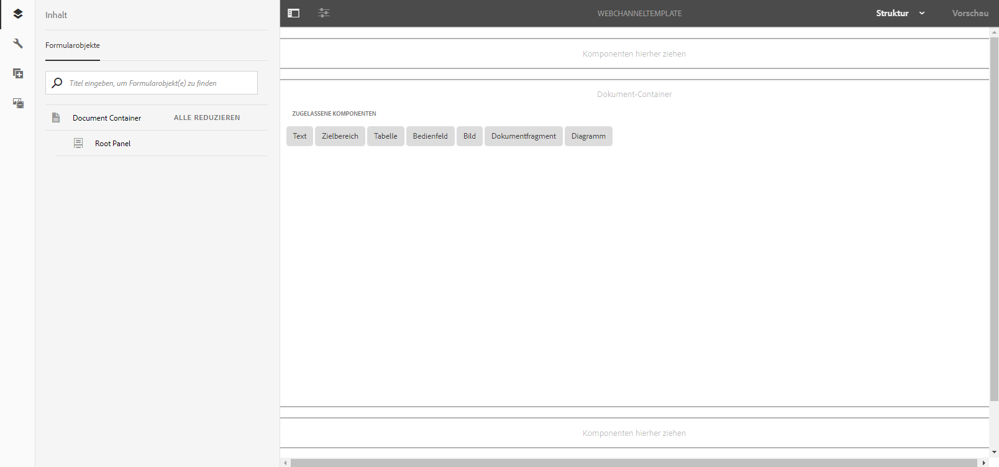
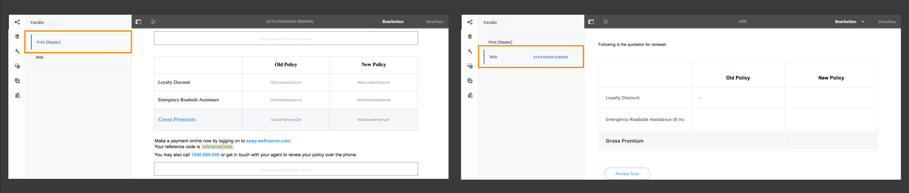

# Druckkanal und Webkanal {#print-channel-and-web-channel}

Importieren von Druckkanalvorlagen und Erstellen und Aktivieren von Webkanalvorlagen

Interaktive Kommunikation kann über zwei Kanäle erfolgen: Druck und Web. Der Druckkanal wird zum Erstellen von PDFs und Papierkommunikationen verwendet, z. B. ein gedruckter Brief zur Erinnerung an die Versicherungsprämienzahlung, während der Webkanal für Online-Projekte wie eine Kreditkartenabrechnung auf einer Website verwendet wird.

Autoren der interaktiven Kommunikation können Assets wie Dokumentfragmente und Bilder wiederverwenden, um sowohl Druck- als auch Webversionen der interaktiven Kommunikation zu erstellen.

Eine der Voraussetzungen für [Erstellen einer interaktiven Kommunikation](/help/forms/using/create-interactive-communication.md) besteht darin, die Vorlagen für Druck- und/oder Webkanäle auf dem Server verfügbar zu machen. Während Vorlagenautoren die Webkanalvorlage in AEM selbst erstellen, wird die Druckkanalvorlage XDP in Adobe Forms Designer erstellt und auf den Server hochgeladen.

## Druckkanal {#printchannel}

Der Druckkanal einer interaktiven Kommunikation verwendet die XFA-Formularvorlage XDP. Eine XDP wird mit Adobe Forms Designer entwickelt. Weitere Informationen zum Erstellen von Druckkanalvorlagen finden Sie unter [Layout-Design](/help/forms/using/layout-design-details.md). Um eine Druckkanalvorlage in Ihrer interaktiven Kommunikation zu verwenden, müssen Sie die Vorlage auf den AEM Forms-Server hochladen.

### Laden Sie die Druckkanalvorlage für die interaktive Kommunikation hoch {#upload-interactive-communication-print-channel-template}

Um die Vorlage hochladen zu können, müssen Sie Mitglied der Gruppe „forms-users“ sein. Führen Sie die folgenden Schritte aus, um die Druckkanalvorlage (XDP) in AEM Forms hochzuladen:

1. Wählen Sie **[!UICONTROL Formulare]** > **[!UICONTROL Formulare &amp; Dokumente]**.

1. Tippen Sie auf **[!UICONTROL Erstellen]** > **[!UICONTROL Datei hochladen]**.

   Navigieren Sie zur entsprechenden Druckkanalvorlage (XDP), wählen Sie diese aus und tippen Sie auf **[!UICONTROL Öffnen]**.

## Webkanal {#web-channel}

Vorlagenautoren und Administratoren können Webvorlagen erstellen, bearbeiten und aktivieren. Damit andere Benutzer Webvorlagen erstellen können, müssen Sie ihnen Rechte geben. Weitere Informationen finden Sie unter [Administration für Benutzer-, Gruppen- und Zugriffsberechtigungen](/help/sites-administering/user-group-ac-admin.md).

### Webkanalvorlage bearbeiten {#authoring-web-channel-template}

Um eine Webkanalvorlage zu erstellen, müssen Sie zuerst einen Vorlagenordner erstellen. Nachdem Sie eine Webvorlage in einem Vorlagenordner erstellt haben, müssen Sie die Vorlage aktivieren, damit die Formularbenutzer den Webkanal einer interaktiven Kommunikation basierend auf der Vorlage erstellen können.

Führen Sie die folgenden Schritte aus, um eine Webkanalvorlage zu erstellen:

1. Erstellen Sie einen Ordner &quot;Vorlage&quot;, um Ihre Webvorlagen für interaktive Kommunikation beizubehalten, falls noch keine vorhanden ist. Weitere Informationen finden Sie unter Vorlagenordner in [Seitenvorlagen - Bearbeitbar](/help/sites-developing/page-templates-editable.md).

   1. Tippen Sie auf **[!UICONTROL Tools]**  > **[!UICONTROL Konfigurations-Browser]**.
      * Weitere Informationen finden Sie in der [Dokumentation zum Konfigurationsbrowser](/help/sites-administering/configurations.md) .
   1. Tippen Sie auf der Seite &quot;Konfigurationsbrowser&quot;auf **[!UICONTROL Erstellen]**.
   1. Geben Sie im Dialogfeld &quot;Konfiguration erstellen&quot;einen Titel für den Ordner ein, aktivieren Sie die Option **[!UICONTROL Bearbeitbare Vorlagen]** und tippen Sie auf **[!UICONTROL Erstellen]**.

      Der Ordner wird erstellt und auf der Seite Konfigurationsbrowser aufgelistet.

1. Navigieren Sie zum entsprechenden Vorlagenordner und erstellen Sie eine Webvorlage.

   1. Navigieren Sie zum entsprechenden Vorlagenordner, indem Sie **[!UICONTROL Tools]** > **[!UICONTROL Vorlagen > Ordner]** auswählen.
   1. Tippen Sie auf **[!UICONTROL Erstellen]**.
   1. Wählen Sie **[!UICONTROL Interaktive Kommunikation - Webkanal]** und tippen Sie auf **[!UICONTROL Weiter]**.
   1. Geben Sie einen Vorlagentitel und eine Beschreibung ein und tippen Sie anschließend auf **[!UICONTROL Erstellen]**.

      Die Vorlage wird erstellt und ein Dialogfeld wird angezeigt.

   1. Tippen Sie auf **[!UICONTROL Öffnen]**, um die Vorlage zu öffnen, die Sie im Vorlageneditor erstellt haben.

      Der Vorlageneditor wird angezeigt.

      

      Beim Erstellen oder Bearbeiten einer Vorlage kann ein Vorlagenautor diverse Aspekte definieren. Das Erstellen oder Bearbeiten einer Vorlage ähnelt der Seitenerstellung. Weitere Informationen finden Sie unter Bearbeiten von Vorlagen - Vorlagenautoren in [Erstellen von Seitenvorlagen](/help/sites-authoring/templates.md).

1. Um die Verwendung dieser Vorlage für die Erstellung interaktiver Kommunikation zu ermöglichen, aktivieren Sie die Vorlage.

   1. Tippen Sie auf **[!UICONTROL Tools]**  > **[!UICONTROL Vorlagen]**.
   1. Navigieren Sie zur entsprechenden Vorlage, wählen Sie sie aus, tippen Sie auf **[!UICONTROL Aktivieren]** und tippen Sie in der Warnmeldung auf **[!UICONTROL Aktivieren]**.

      Die Vorlage ist aktiviert und ihr Status wird als „Aktiviert“ angezeigt. Jetzt können Sie mit dem Erstellen einer interaktiven Kommunikation fortfahren, in der Sie die neu erstellte Webkanalvorlage verwenden können.

### Druckkanal als Master für Webkanal {#print-channel-as-master-for-web-channel}

Beim Erstellen einer interaktiven Kommunikation können Autoren diese Option auswählen, um den Webkanal synchron mit dem Druckkanal zu erstellen. Die Verwendung des Druckkanals als Master für den Webkanal stellt sicher, dass der Inhalt, die Vererbung und die Datenbindung des Webkanals aus dem Druckkanal abgeleitet werden und dass die im Druckkanal vorgenommenen Änderungen im Webkanal widergespiegelt werden können. Die Autoren der interaktiven Kommunikation dürfen jedoch ggf. die Vererbung für bestimmte Komponenten im Webkanal aufheben.

