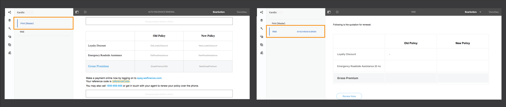

# Übersicht über die neuen Funktionen | AEM 6.4 Forms {#new-features-summary-aem-forms}

Übersicht über die neuen Funktionen und Verbesserungen in AEM 6.4 Forms.

AEM Forms beinhaltet verschiedene neue Funktionen und Verbesserungen, die die Erstellung, Verwaltung und die Benutzererfahrung von adaptiven Formularen und interaktiver Kommunikation weiter optimieren.

In diesem Abschnitt erhalten Sie eine kurze Einführung in die neuen Funktionen und Verbesserungen. Rufen Sie Dokumentation mit Ressourcen für Detailinformationen auf. Siehe auch die [Versionshinweise](/help/release-notes/forms.md) zu AEM 6.4 Forms. Die vollständige AEM 6.4 Forms-Dokumentation finden Sie unter [Handbuch zu AEM 6.4 Forms](/help/forms/home.md).

## Interaktive Kommunikation {#interactive-communications}

Interaktive Kommunikation zentralisiert und verwaltet die Erstellung, Zusammenstellung und Bereitstellung sicherer, personalisierter und interaktiver Schriftstücke, wie z. B. Geschäftskorrespondenz, Briefe, Dokumente, Aussagen, Sozialleistungen, Vermögensverwaltungsprospekte, Marketing-Mails, Rechnungen und Willkommenskits.

Interaktive Kommunikation verwendet dieselbe zugrunde liegende Technologie, Prozesse und Komponenten wie die von adaptiven Formularen, um Responsive-Mehrkanalkommunikationen ähnlich wie der adaptiver Responsive-Formulare zu erstellen.

Interaktive Kommunikation bietet wesentliche Vorteile:

* Bietet OOTB-Integration mit dem Formulardatenmodell, um einen einfachen und rationalisierten Zugriff auf Backend-Datenbanken und andere CRM-Systeme wie MS Dynamics zu ermöglichen
* Bietet eine integrierte Benutzeroberfläche zum Erstellen von Druck- und Webkanälen
* Bietet eine Drag-and-Drop-basierte Benutzeroberfläche, ähnlich dem Erstellen von adaptiven Formularen für Druck- und Webkanäle.

Interaktive Kommunikation ist der Standard und empfohlene Ansatz, um Kundenkommunikation zu erstellen. Um die Briefe in AEM 6.3 Forms und AEM 6.2 Forms weiterhin zu verwenden, müssen Sie ein Kompatibilitätspaket installieren.

### Interaktive Mehrkanal-Kommunikations-Erstellung {#multi-channel-interactive-communication-authoring}

Mithilfe der interaktiven Kommunikation können Sie Druck- und Webdokumente in einem einzigen Dokumenteditor erstellen und bearbeiten. Indem Sie dieselben Dokumentfragmente verwenden, um Darstellungen beider Kanäle zu erstellen, können Sie doppelten Aufwand vermeiden.

Weitere Informationen finden Sie unter [Interaktive Kommunikation - Überblick](/help/forms/using/interactive-communications-overview.md).

### WYSIWYG Dokumenteditor {#wysiwyg-document-editor}

Der WYSIWYG Drag-and-Drop-Dokumenteneditor ist geschäftsfreundlich. Die intuitive Benutzeroberfläche, Drag-&amp;-Drop-Funktionen, Standardkomponenten, Datenmodelle sowie ein integriertes Repository für Assets erleichtern das schnelle und einfache Erstellen von interaktiver Kommunikation.

Um eine interaktive Kommunikation zu erstellen oder eine vorhandene zu bearbeiten, können Geschäftsbenutzer die folgenden Bausteine verwenden: Kanäle, Inhalt, Eigenschaften, Assets, Komponenten und Datenquellen.

Weitere Informationen finden Sie unter [Einführung in die Bearbeitung der interaktiven Kommunikation](/help/forms/using/introduction-interactive-communication-authoring.md).

### Automatische Generierung der Webversion aus Druckinhalten in der interaktiven Kommunikation {#auto-generate-web-version-from-print-content-in-interactive-communication}

Autoren können Webdokumentinhalte automatisch aus Druckdokumenten generieren, um sowohl Druck- als auch Webdokumente im selben Editor zu erstellen, in der Vorschau anzuzeigen und zu bearbeiten. Autoren der interaktiven Kommunikation können nur einmal erstellen und in allen Kanälen veröffentlichen. Autoren der interaktiven Kommunikation können dieselben Dokumentfragmente im Druck- und Webkanal verwenden, um doppelten Aufwand zu vermeiden.

Weitere Informationen finden Sie unter [Druckkanal und Webkanal](/help/forms/using/web-channel-print-channel.md).

### Verwenden Sie Designs, um den Webkanal der interaktiven Kommunikation zu gestalten {#use-themes-to-style-web-channel-of-interactive-communication}

Interaktive Kommunikation unterstützt Designs. Mit AEM Forms können Sie Designs erstellen und sie dann auf Ihre interaktive Kommunikation anwenden. Zu einem Design gehört die Formatierung von Details für Komponenten und Bereiche. Sie können ein Design in verschiedenen interaktiven Kommunikationen wiederverwenden, um ihnen ein einheitliches und konsistentes Erscheinungsbild und Branding zu geben.

AEM Forms enthält ein vordefiniertes Design für interaktive Kommunikation. Mithilfe eines Designs können Sie außerdem anpassen, wie eine interaktive Kommunikation auf einem Gerät aussieht.

Weitere Informationen finden Sie unter [Designs in AEM Forms](/help/forms/using/themes.md).

### Erweiterte Benutzeroberfläche des Agenten {#enhanced-agent-interface}

Die Benutzeroberfläche des Agenten unterstützt nun die Druck- und Webvorschau der interaktiven Kommunikation. Über dieselbe Benutzeroberfläche für Agenten können Sie den Druckkanal bearbeiten und den Webkanal Ihrer interaktiven mehrkanaligen Kommunikation in der Vorschau anzeigen. Felder, Variablen, FDM-Elemente und Dokumentfragmente im Druckkanal können so konfiguriert werden, dass sie vom Agenten in der Benutzeroberfläche des Agenten geändert werden. Die Unterstützung von Formulardatenmodellen ermöglicht die Erstellung von Vorschaubildern mit vorgefüllten Beispieldaten.

Weitere Informationen finden Sie unter [Vorbereiten und Senden der interaktiven Kommunikation über die Benutzeroberfläche für Agenten](/help/forms/using/prepare-send-interactive-communication.md).

### Präsentieren von Informationen in Diagrammen {#present-information-in-charts}

Interaktive Kommunikation unterstützt Diagramme in Web- und Druckkanälen für eine bessere Kommunikation. Mithilfe von Diagrammen wie Torten-, Kreis-, Balken- und Spaltendiagrammen können Sie große Mengen an Informationen für eine einfache Interpretation und Analyse zusammenfassen und visuell präsentieren.

 

Weitere Informationen finden Sie unter [Verwenden von Diagrammen in interaktiver Kommunikation](/help/forms/using/chart-component-interactive-communications.md).

### Vorkonfigurierte Datenkonnektoren zum Vorbefüllen von Dokumenten {#out-of-the-box-data-connectors-to-prefill-documents}

Interaktive Kommunikation bietet Datenintegration mit Business-Tools, um eine Verbindung mit mehreren Geschäftssystemen, einschließlich CRM-Systemen, herzustellen und Daten in Dokumenten zu personalisieren.

Weitere Informationen finden Sie unter [Verwenden eines Formulardatenmodells](/help/forms/using/using-form-data-model.md).

### Verbesserter Dokumentfragmenteditor {#enhanced-document-fragment-editor}

Sie können FDM-Elemente und Regeln innerhalb der Dokumentfragmente der Vorlage für die interaktive Kommunikation nutzen.

* Unterstützung für Formulardatenmodellelemente
* Asset-/Textfragment mithilfe von Regeln ein- oder ausblenden
* Wert eines Elements/einer Variablen validieren
* Funktionen ausführen, um den Wert eines mathematischen Ausdrucks zu berechnen

Weitere Informationen finden Sie unter:

* [Texte in interaktiver Kommunikation](/help/forms/using/texts-interactive-communications.md)
* [Bedingungen in interaktiven Kommunikationen](/help/forms/using/conditions-interactive-communications.md)

### Kompatibilitätspaket für vorhandene Assets {#compatibility-package-for-existing-assets}

Standardmäßig werden Brief-Assets aus früheren Versionen von AEM Forms in dieser Version nicht unterstützt. Um die Briefe in AEM 6.3 Forms und AEM 6.2 Forms weiterhin zu verwenden, müssen Sie ein Kompatibilitätspaket installieren.

## -Datenintegration {#data-integration}

Mit der [AEM Forms-Datenintegration](/help/forms/using/data-integration.md) können Sie verschiedene Datenquellen konfigurieren, z. B. Datenbanken, RESTful- oder SOAP-basierte Web-Dienste und OData-Dienste, um ein Formulardatenmodell zu erstellen, mit denen Sie Daten in adaptiven Formularen und Dokumenten binden, vorbefüllen und aufrufen können.

In dieser Version gibt es einige neue Funktionen und Verbesserungen bei der Datenintegration.

### Erstellen von Formulardatenmodellen ohne Datenquelle {#create-form-data-model-without-data-source}

Geschäftsbenutzer und Formularautoren können jetzt ein Formulardatenmodell einschließlich ihrer Entitäten und Eigenschaften erstellen, ohne eine Datenquelle konfigurieren zu müssen, und sie können zum Erstellen von adaptiven Formularen und Dokumenten verwendet werden. Sie können das Formulardatenmodell später an Datenquellen binden. Sie beseitigt Abhängigkeiten von Datenquellen zum Erstellen von Formularen und Dokumenten mithilfe des Formulardatenmodells.

Ebenso können Sie Entitäten sowie die untergeordneten Eigenschaften in einem vorhandenen Formulardatenmodell erstellen und sie an entsprechende Entitäten und Eigenschaften in einer späteren Datenquelle binden.

Weitere Informationen finden Sie unter [Erstellen des Formulardatenmodells](/help/forms/using/create-form-data-models.md).

### Erstellen berechneter Eigenschaften {#create-computed-properties}

Formularautoren und -entwickler können berechnete Eigenschaften im Formulardatenmodell erstellen. Sie ermöglichen es Ihnen, einen Wert für die Eigenschaft zu berechnen, indem Sie Regeln oder Logik für Daten erstellen, die in konfigurierten Datenquellen verfügbar sind. Eine Regel ist ein Ausdruck, der ausgewertet wird, wenn sich die Daten im Formulardatenmodell laden oder die Werte der Eigenschaften im Ausdruck ändern. Eine berechnete Eigenschaft namens „Raten“ berechnet beispielsweise den monatlich zu zahlenden Betrag für ein Darlehen basierend auf dem in der Datenquelle angegebenen Zinssatz und dem vom Benutzer im Formular angegebenen Betrag und der Höhe des Darlehens.

Eine berechnete Eigenschaft befindet sich lokal in einem Formulardatenmodell und ist nicht in einer Datenquelle vorhanden. Sie können berechnete Eigenschaften in adaptiven Formularen und interaktiver Kommunikationen verwenden.

Weitere Informationen finden Sie unter [Arbeiten mit einem Formulardatenmodell](/help/forms/using/work-with-form-data-model.md).

### Vorschau von Formularen und Dokumenten mit Beispieldaten {#preview-forms-and-documents-with-sample-data}

Mit dem Formulardatenmodell können Sie Beispieldaten für Eigenschaften aller Entitäten in einem Formulardatenmodell generieren. Die generierten Daten entsprechen den für die Eigenschaften konfigurierten Datentypen. Wenn Sie eine Vorschau eines adaptiven Formulars oder Dokuments anzeigen, das dem Formulardatenmodell zugeordnet ist, wird es mit vorbefüllten Beispieldaten gerendert.

Bei den Beispieldaten handelt es sich um zufällige Werte, die sich bei jeder Generierung ändern. Sie können jedoch die Beispieldaten bearbeiten und speichern, die auch dann bestehen bleiben, wenn Sie sie neu generieren. Wenn Sie beispielsweise die Beispieldaten für die Eigenschaften „Vorname“ und „Nachname“ bearbeiten und speichern und später eine weitere Eigenschaft oder Entität im Formulardatenmodell hinzufügen und die Beispieldaten neu generieren, zeigen die Eigenschaften „Vorname“ und „Nachname“ die gespeicherten Werte an, während Werte für andere Eigenschaften neu generiert werden.

Weitere Informationen finden Sie unter [Formulardatenmodell verwenden](/help/forms/using/using-form-data-model.md).

### Datenquellendefinitionen aktualisieren {#refresh-data-source-definitions}

Aktualisierungen in Datenquellenentitäten oder Eigenschaften spiegeln sich nicht automatisch in zugeordneten Formulardatenmodellen wider. Der Editor für Formulardatenmodelle bietet jetzt Funktionen  (Datenquellendefinitionen aktualisieren), die den Server-Cache ungültig machen und aktualisiertes Schema aus der Datenquelle abrufen, um es sofort im Formulardatenmodell widerzuspiegeln.

### Konfigurieren von Datenquellen mit der Touch-Benutzeroberfläche {#configure-data-sources-using-touch-user-interface}

In dieser Version ist die Konfiguration der Cloud-Dienste für Datenquellen in der Touch-Benutzeroberfläche verfügbar. Außerdem wurde der Speicherort für die Konfiguration von Cloud-Services in **[!UICONTROL Tools > Cloud Services > Data Sources]**. Siehe [Datenquellen konfigurieren](/help/forms/using/configure-data-sources.md).

## Adaptive Formulare {#adaptive-forms}

### Leistung adaptiver Formulare mit verbesserter Lazy Loading-Funktion verbessern {#improve-performance-of-adaptive-forms-with-enhanced-lazy-loading}

Die Lazy Loading-Funktionalität in adaptiven Formularen verschiebt die Initialisierung von Formularfragmenten, bis sie benötigt werden. Es verbessert die Leistung von großen Formularen, indem die zum Rendern eines Formulars erforderliche Zeit minimiert wird, was zu einer besseren Benutzererfahrung führt.

Es gibt verschiedene Verbesserungen für die Lazy Loading-Funktion in dieser Version:

* Komponenten für Dateianhänge und Nutzungsbedingungen werden in Formularfragmenten mit aktiviertem Lazy Loading unterstützt.
* Adaptive Formularfragmente mit aktiviertem Lazy Loading werden in wiederholbaren Bereichen unterstützt.
* Adaptive Formulare mit Lazy Loading-aktivierten Fragmenten werden in der AEM Forms-App unterstützt.

## Formularzentrierte AEM-Workflows {#forms-centric-aem-workflows}

Mit formularzentrierten AEM-Workflows können Sie Workflows für verschiedene Aufgaben auf dem OSGi-Stapel schnell erstellen und bereitstellen. Sie müssen die auf dem JEE-Stapel verfügbaren Prozessverwaltungsfunktionen nicht mehr installieren, wodurch die Bereitstellung vereinfacht und die Kosten für den Anwendungsserver und die Infrastruktur eingespart werden. Weitere Informationen finden Sie unter [Formularzentrierte Workflows unter OSGi](/help/forms/using/aem-forms-workflow.md).

Im Folgenden werden die Verbesserungen bei Forms-zentrierten AEM-Workflows beschrieben: ・

* Der Workflow Modell-Editor ist in der Touch-Benutzeroberfläche verfügbar. Dadurch können Sie den Zeitaufwand für das Erstellen von formularzentrierten AEM-Workflows reduzieren.
* Workflow-Schritt zum Senden von E-Mails. Beispielsweise können Sie den Schritt „E-Mail“ verwenden, um nach Abschluss eines Workflows ein Datensatzdokument zu senden.
* Workflow-Schritt, um Formulardatenmodelldienste in einem Workflow-Modell zu verwenden. In diesem Schritt können Sie Datenintegrationsdienste aufrufen, ohne benutzerdefinierten Code zu schreiben. Sie können beispielsweise einen GET-Dienst aufrufen, um Mitarbeiterdetails aus einem Datenbankarchiv zu erhalten, ohne benutzerdefinierten Code zu schreiben.

## AEM Forms-App {#aem-forms-app}

Die AEM Forms-App ermöglicht es Außendienstmitarbeitern, ihre Mobilgeräte mit einem AEM Forms-Server zu synchronisieren und Formulare zu bearbeiten. Die Anwendung funktioniert nahtlos, wenn das Gerät offline ist, indem Daten lokal auf dem Gerät gespeichert und mit dem Server synchronisiert werden, wenn das Gerät wieder online ist. Weitere Informationen finden Sie unter [AEM Forms-App](/help/forms/using/aem-forms-app.md).

Die folgenden Verbesserungen wurden in der AEM Forms-App vorgenommen:

* Adaptive Formulare mit Lazy Loading-aktivierten Fragmenten werden in der AEM Forms-App unterstützt.
* Adaptive Formulare mit Formulardatenmodell werden in der AEM Forms-App unterstützt.

## Document Security {#document-security}

Mithilfe von Document Security können Sie Informationen sicher verteilen, die Sie in einem unterstützten Format gespeichert haben. Document Security stellt sicher, dass Ihre Dokumente nur von autorisierten Benutzern genutzt werden können. Im Folgenden finden Sie die wichtigsten Änderungen an Document Security:

* Document Security stellt eine [Portable Protection Library (PPL)](/help/forms/using/document-security-offerings.md) bereit, um ein Dokument lokal zu schützen, ohne das Dokument an den AEM Forms-Server zu senden. Nur die Sicherheitsberechtigungen und Details der Datenschutzrichtlinie werden über das Netzwerk an den AEM Forms-Server gesendet. AEM 6.4 Forms hat die Portable Protection Library (PPL) im OSGi-Bundle-Format eingeführt. Jetzt können Sie die PPL-Bibliothek direkt auf einem AEM Forms-Server installieren und die Funktionen von AEM und PPL gemeinsam nutzen.
* Document Security C++ SDK und C++ PPL-Bibliothek können mit Microsoft Visual Studio 2013 erstellt werden. Die zuvor unterstützte Version war Microsoft Visual Studio 2010.

## Unterstützte Plattformen {#supported-platforms}

AEM Forms kann mit einer beliebigen Kombination von unterstützten Betriebssystemen, Anwendungsservern, Datenbanken, Datenbanktreibern, JDK-, LDAP-Servern und E-Mail-Servern eingerichtet werden. Im Folgenden sind die wichtigsten Änderungen auf den unterstützten Plattformen aufgeführt:

<table> 
 <tbody> 
  <tr> 
   <td>Komponente</td> 
   <td>Unterstützung hinzugefügt</td> 
   <td>Unterstützung entfernt</td> 
  </tr> 
  <tr> 
   <td>Betriebssysteme</td> 
   <td> 
    <ul> 
     <li>Microsoft Windows Server 2016</li> 
     <li>Oracle Linux 7 Update 3</li> 
    </ul> </td> 
   <td> 
    <ul> 
     <li>IBM AIX 7.2 [1]  </li> 
     <li>Solaris 11 [1]</li> 
    </ul> </td> 
  </tr> 
  <tr> 
   <td>Anwendungsserver  </td> 
   <td> 
    <ul> 
     <li>Red Hat JBoss EAP 7</li> 
    </ul> </td> 
   <td> 
    <ul> 
     <li>IBM Weblogic 12.1.3</li> 
     <li>IBM WebSphere 8.5.5</li> 
     <li>Red Hat JBoss EAP 6</li> 
    </ul> </td> 
  </tr> 
  <tr> 
   <td>Datenbanken</td> 
   <td> 
    <ul> 
     <li>Microsoft SQL Server 2016</li> 
     <li>MySQL 5.7.19 und höher</li> 
     <li>IBM DB2 11.1</li> 
     <li>Oracle Multitenant-Architektur</li> 
    </ul> </td> 
   <td> 
    <ul> 
     <li>Microsoft SQL Server 2012  </li> 
     <li>Microsoft SQL Server 2014</li> 
     <li>MySQL 5.5</li> 
     <li>IBM DB2 10.5  </li> 
    </ul> </td> 
  </tr> 
  <tr> 
   <td>LDAP-Server</td> 
   <td> 
    <ul> 
     <li>Microsoft Active Directory 2016</li> 
     <li>IBM Tivoli Directory Server 6.4</li> 
    </ul> </td> 
   <td> 
    <ul> 
     <li>Microsoft Active Directory 2008</li> 
     <li>IBM Tivoli Directory Server 6.3</li> 
     <li>Oracle Directory Server Enterprise Edition 7.0</li> 
    </ul> </td> 
  </tr> 
  <tr> 
   <td>E-Mail-Server</td> 
   <td> 
    <ul> 
     <li>Microsoft Office 365</li> 
    </ul> </td> 
   <td> 
    <ul> 
     <li>Novell Groupwise 7</li> 
    </ul> </td> 
  </tr> 
  <tr> 
   <td>Connectoren</td> 
   <td> 
    <ul> 
     <li>Connector für Microsoft Sharepoint 2016</li> 
     <li>Connector für EMC Documentum 7.3</li> 
    </ul> </td> 
   <td> 
    <ul> 
     <li>Connector für Microsoft Sharepoint 2007</li> 
     <li>Connector für Microsoft Sharepoint 2010</li> 
     <li>Connector für IBM Filenet 5.0</li> 
     <li>Connector für EMC Documentum 6.7</li> 
    </ul> </td> 
  </tr> 
  <tr> 
   <td>Browser</td> 
   <td> 
    <ul> 
     <li>Apple Safari 11.x auf macOS</li> 
     <li>Apple Safari 11.x unter iOS</li> 
    </ul> </td> 
   <td> 
    <ul> 
     <li>Blackberry-Browser nur auf Blackberry Z30- und Q10-Geräten</li> 
    </ul> </td> 
  </tr> 
  <tr> 
   <td>AEM Forms-App  </td> 
   <td> 
    <ul> 
     <li>Android 4.4 oder höher</li> 
     <li>Apple iOS 10 oder höher</li> 
    </ul> </td> 
   <td> </td> 
  </tr> 
 </tbody> 
</table>

1. AIX- und Solaris-Betriebssysteme sind nur für Upgrade-Kunden verfügbar.
