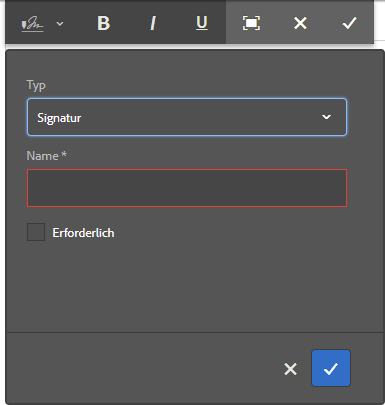
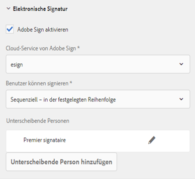
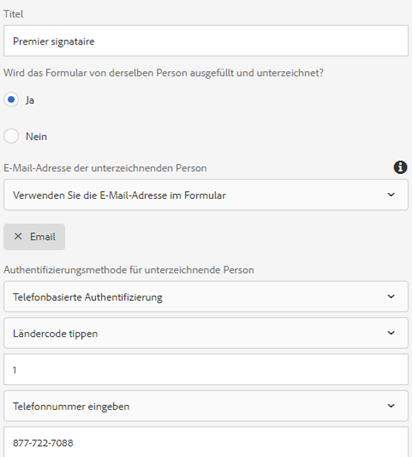
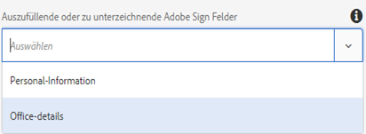
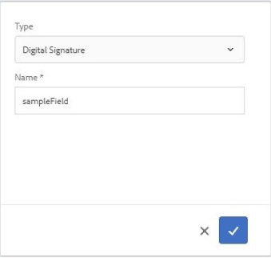
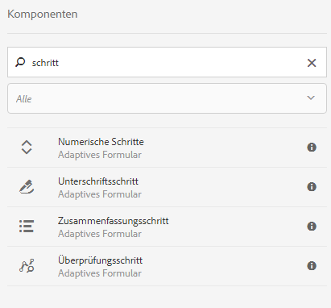
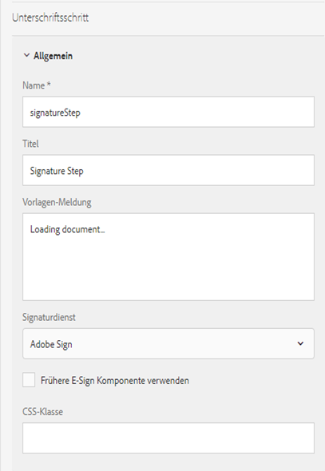

# Verwenden von Acrobat Sign in einem adaptiven Formular {#using-adobe-sign-in-an-adaptive-form}

Aktivieren Sie Workflows für die elektronische Signatur (Acrobat Sign) für adaptive Formulare, um Signatur-Workflows zu automatisieren, Prozesse mit einer und mehreren Signaturen zu vereinfachen und Formulare elektronisch von Mobilgeräten zu signieren.

Acrobat Sign ermöglicht Workflows für die elektronische Signatur für adaptive Formulare. E-Signaturen verbessern die Workflows bei der Verarbeitung von Dokumenten in den Bereichen Recht, Vertrieb, Gehaltsabrechnung, Personalverwaltung u. a.

In einem typischen Szenario mit Acrobat Sign und adaptiven Formularen füllt ein Benutzer ein adaptives Formular aus, um einen Dienst zu beantragen. Beispielsweise sind für einen Hypotheken- und Kreditkartenantrag rechtskräftige Signaturen von allen Kreditnehmern und Mitantragstellern erforderlich. Um Workflows für elektronische Signaturen für ähnliche Szenarien zu aktivieren, können Sie Acrobat Sign in AEM Forms integrieren. Einige weitere Beispiele sind die Verwendung von Acrobat Sign für:

* Geschäftsabschlüsse von jedem Gerät aus mit vollautomatischen Prozessen für Vorschlag, Angebot und Vertrag.
* Schnelleres Abschließen von Prozessen im Personalwesen und Zugang zu digitalen Abläufen für Ihre Mitarbeiter.
* Kürzere Vertragszyklen und schnelleres Onboarding Ihrer Lieferanten.
* Erstellen digitaler Workflows zur Automatisierung häufig verwendeter Prozesse.

Die Integration von Acrobat Sign mit AEM Forms unterstützt:

* Workflows für Signaturen eines einzelnen oder mehrerer Benutzer
* Workflows mit sequenzieller und simultaner Signatur
* Abläufe für Signaturen innerhalb und außerhalb des Formulars
* Signieren von Formularen als anonymer oder angemeldeter Benutzer
* Dynamische Signaturvorgänge (Integration mit AEM Forms-Workflow)
* Authentifizierung über Wissensdatenbank, Telefon und Social Media-Profile

Lernen Sie die [Best Practices für die Verwendung von Acrobat Sign mit adaptiven Formularen](https://medium.com/adobetech/using-adobe-sign-to-e-sign-an-adaptive-form-heres-the-best-way-to-do-it-dc3e15f9b684) , um bessere Signiererlebnisse zu erstellen.

## Voraussetzungen {#prerequisites}

Vor der Verwendung von Acrobat Sign in einem adaptiven Formular:

* Stellen Sie sicher, dass der AEM Forms-Cloud-Service für die Verwendung von Acrobat Sign konfiguriert ist. Weitere Informationen finden Sie unter [Integrieren von Acrobat Sign mit AEM Forms](/help/forms/using/adobe-sign-integration-adaptive-forms.md).
* Halten Sie die Liste der Unterzeichner bereit. Sie benötigen mindestens eine E-Mail-Adresse für jeden Unterzeichner.

## Konfigurieren von Acrobat Sign für ein adaptives Formular {#configure-adobe-sign-for-an-adaptive-form}

Führen Sie die folgenden Schritte aus, um Acrobat Sign für ein adaptives Formular zu konfigurieren:

1. [Bearbeiten von Eigenschaften adaptiver Formulare für Acrobat Sign](#enableadobesign)
1. [Hinzufügen von Acrobat Sign-Feldern zu einem adaptiven Formular](#addadobesignfieldstoanadaptiveform)
1. [Aktivieren von Acrobat Sign für ein adaptives Formular](#enableadobsignforanadaptiveform)
1. [Acrobat Sign-Cloud Service für ein adaptives Formular auswählen](#selectadobesigncloudserviceforanadaptiveform)

1. [Hinzufügen von Acrobat Sign-Unterzeichnern zu einem adaptiven Formular](#addsignerstoanadaptiveform)
1. [Senden-Aktion für adaptives Formular wählen](#selectsubmitactionforanadaptiveform)

### Bearbeiten von Eigenschaften adaptiver Formulare für Acrobat Sign {#enableadobesign}

Konfigurieren Sie die Eigenschaften des adaptiven Formulars für Acrobat Sign für ein vorhandenes oder ein neues adaptives Formular.

[Erstellen eines adaptiven Formulars für Acrobat Sign](/help/forms/using/working-with-adobe-sign.md#create-an-adaptive-form-for-adobe-sign) beschreibt die Schritte zum Erstellen eines einfachen adaptiven Formulars. Siehe [Erstellen eines adaptiven Formulars](/help/forms/using/creating-adaptive-form.md) für andere Optionen, die beim Erstellen eines adaptiven Formulars verfügbar sind.

#### Erstellen eines adaptiven Formulars für Acrobat Sign {#create-an-adaptive-form-for-adobe-sign}

Führen Sie die folgenden Schritte aus, um ein adaptives Formular für Acrobat Sign zu erstellen:

1. Gehen Sie zu **[!UICONTROL Adobe Experience Manager]** > **[!UICONTROL Forms]** > **[!UICONTROL Formulare und Dokumente]**.
1. Tippen Sie auf **[!UICONTROL Erstellen]** und wählen Sie **[!UICONTROL Adaptives Formular]**. Eine Liste von Vorlagen wird angezeigt. Wählen Sie eine Vorlage aus und tippen Sie auf **[!UICONTROL Weiter]**.
1. Auf der Registerkarte **[!UICONTROL Standard]**:

   1. Geben Sie den **Namen** und **Titel** für das adaptive Formular an.
   1. Wählen Sie die [Konfigurationscontainer](/help/forms/using/adobe-sign-integration-adaptive-forms.md#configure-adobe-sign-with-aem-forms) erstellt wurde, während Acrobat Sign mit AEM Forms konfiguriert wurde.

      >[!NOTE]
      >
      >Die **[!UICONTROL Acrobat Sign Cloud Service]** in der Dropdown-Liste werden die Cloud-Dienste angezeigt, die im Konfigurationscontainer konfiguriert sind, den Sie in diesem Feld auswählen. Die **[!UICONTROL Acrobat Sign Cloud Service]** die Dropdown-Liste im **[!UICONTROL Elektronische Signatur]** Abschnitt der Eigenschaften des adaptiven Formulars, wenn Sie die **[!UICONTROL Acrobat Sign aktivieren]** -Option.

1. Wählen Sie auf der Registerkarte **[!UICONTROL Formularmodell]** eine der folgenden Optionen:

   * Wählen Sie die Option **[!UICONTROL Formularvorlage als Dokument aus Datensatzvorlage zuordnen]** und wählen Sie ein Dokument aus Datensatzvorlage aus. Wenn Sie ein auf einer Formularvorlage basierendes adaptives Formular verwenden, werden in den zum Signieren gesendeten Dokumenten nur die Felder aus der dazugehörigen Formularvorlage angezeigt. Es werden nicht alle Felder des adaptiven Formulars angezeigt.
   * Wählen Sie die Option **[!UICONTROL Dokument aus Datensatz generieren]**. Wenn Sie ein adaptives Formular verwenden, für das die Option „Datensatzdokument“ aktiviert ist, zeigt das zum Signieren gesendete Dokument alle Felder des adaptiven Formulars an.

1. Tippen Sie auf **[!UICONTROL Erstellen.]** Es wird ein adaptives Formular erstellt, das für die Anmeldung aktiviert ist und das zum Hinzufügen von Acrobat Sign-Feldern verwendet werden kann.

#### Bearbeiten eines adaptiven Formulars für Acrobat Sign {#editafsign}

Führen Sie die folgenden Schritte aus, um Acrobat Sign in einem vorhandenen adaptiven Formular zu verwenden:

1. Gehen Sie zu **[!UICONTROL Adobe Experience Manager]** > **[!UICONTROL Forms]** > **[!UICONTROL Formulare und Dokumente]**.
1. Wählen Sie das adaptive Formular aus und tippen Sie auf **[!UICONTROL Eigenschaften]**.
1. Im **[!UICONTROL Allgemein]** auswählen, wählen Sie die [Konfigurationscontainer](/help/forms/using/adobe-sign-integration-adaptive-forms.md#configure-adobe-sign-with-aem-forms) erstellt wurde, während Acrobat Sign mit AEM Forms konfiguriert wurde.
1. Wählen Sie auf der Registerkarte **[!UICONTROL Formularmodell]** eine der folgenden Optionen:

   * Wählen Sie die Option **[!UICONTROL Formularvorlage als Dokument aus Datensatzvorlage zuordnen]** und wählen Sie ein Dokument aus Datensatzvorlage aus. Wenn Sie ein auf einer Formularvorlage basierendes adaptives Formular verwenden, werden in den zum Signieren gesendeten Dokumenten nur die Felder aus der dazugehörigen Formularvorlage angezeigt. Es werden nicht alle Felder des adaptiven Formulars angezeigt.
   * Wählen Sie die Option **[!UICONTROL Dokument aus Datensatz generieren]**. Wenn Sie ein adaptives Formular verwenden, für das die Option „Datensatzdokument“ aktiviert ist, zeigt das zum Signieren gesendete Dokument alle Felder des adaptiven Formulars an.

1. Tippen Sie auf **[!UICONTROL Speichern und schließen]**. Das adaptive Formular ist für Acrobat Sign aktiviert.

### Hinzufügen von Acrobat Sign-Feldern zu einem adaptiven Formular {#addadobesignfieldstoanadaptiveform}

Acrobat Sign verfügt über verschiedene Felder, die in einem adaptiven Formular platziert werden können. In diese Felder können verschiedene Datentypen wie Signaturen, Initialen, Firma oder Titel eingegeben werden. Sie helfen dabei, beim Signieren zusätzliche Informationen zusammen mit den Signaturen zu erfassen. Sie können die Acrobat Sign-Blockkomponente verwenden, um Acrobat Sign-Felder an verschiedenen Stellen in einem adaptiven Formular zu platzieren.

Gehen Sie wie folgt vor, um einem adaptiven Formular Felder hinzuzufügen und eine Reihe von Optionen für diese Felder anzupassen:

1. Drag &amp; Drop **Acrobat Sign Block** -Komponente vom Komponenten-Browser zum adaptiven Formular. Die Acrobat Sign-Blockkomponente verfügt über alle unterstützten Acrobat Sign-Felder. Standardmäßig fügt sie dem adaptiven Formular ein **Signatur**-Feld hinzu.

   

   Standardmäßig ist der Acrobat Sign-Block im veröffentlichten adaptiven Formular nicht sichtbar. Er wird nur in den Signaturdokumenten angezeigt. Sie können die Sichtbarkeit von Acrobat Sign Block in den Eigenschaften der Acrobat Sign-Blockkomponente ändern.

   >[!NOTE]
   >
   >* Die Verwendung von Acrobat Sign-Bausteinen ist für die Verwendung von Acrobat Sign in einem adaptiven Formular nicht erforderlich. Wenn Sie den Acrobat Sign-Block nicht verwenden und Felder für die Unterzeichner hinzufügen, wird das Standardsignaturfeld unten in den Signaturdokumenten angezeigt.
   >* Verwenden Sie den Acrobat Sign-Block nur für adaptive Formulare, die automatisch das Datensatzdokument generieren. Wenn Sie eine benutzerdefinierte XDP zum Generieren des Datensatzdokuments oder eines auf einer Formularvorlage basierenden adaptiven Formulars verwenden, ist kein Acrobat Sign-Block erforderlich.

1. Wählen Sie die **Acrobat Sign Block** und tippen Sie auf **Bearbeiten**  Symbol. Es werden Optionen zum Hinzufügen von Feldern und zum Formatieren der Darstellung von Feldern angezeigt.

   

   **A.** Wählen Sie Acrobat Sign-Felder aus und fügen Sie sie hinzu. **B.** Erweitern Sie den Acrobat Sign-Block in die Vollbildansicht.

1. Tippen Sie auf **Acrobat Sign Field**  Symbol. Es werden Optionen zum Auswählen und Hinzufügen von Acrobat Sign-Feldern angezeigt.

   Erweitern Sie die **Typ** Dropdown-Feld, um ein Acrobat Sign-Feld auszuwählen, und tippen Sie auf Fertig  -Symbol, um das ausgewählte Feld zum Acrobat Sign-Block hinzuzufügen. Die Dropdown-Liste **Typ** enthält die Feldtypen „Signatur“, „Unterzeichnerinformationen“ und „Daten“. Acrobat Sign-Integration mit AEM Forms-Supportfeldern, die nur im Dropdown-Feld Typ aufgeführt sind. Detaillierte Informationen zu Acrobat Sign-Feldern finden Sie unter [Acrobat Sign-Dokumentation](https://helpx.adobe.com/de/sign/help/field-types.html).

   

   Es ist zwingend erforderlich, einen eindeutigen Namen für ein Feld anzugeben. Sie können auch die Option „Erforderlich“ aktivieren, um ein Feld als Pflichtfeld zu markieren. Zusätzlich zu den **Name** und **Erforderlich** -Option, haben einige Acrobat Sign-Felder mehr Optionen. Dies kann z. B. „Maske“ oder „mit mehreren Zeilen“ sein. Geben Sie außerdem für jedes Acrobat Sign-Feld einen eindeutigen Namen an, unabhängig davon, ob sich die Felder in demselben oder in verschiedenen Acrobat Sign-Blöcken befinden.

### Aktivieren von Acrobat Sign für ein adaptives Formular {#enableadobsignforanadaptiveform}

Standardmäßig ist Acrobat Sign für ein adaptives Formular nicht aktiviert. Gehen Sie wie folgt vor, um es zu aktivieren:

1. Tippen Sie im Inhaltsbrowser auf **Formular-Container** und dann auf das Symbol **Konfigurieren** . Dadurch wird der Eigenschaftenbrowser geöffnet, der die Eigenschaften des Containers für adaptive Formulare anzeigt.
1. Erweitern Sie im Eigenschaftenbrowser die **Elektronische Signatur** Akkordeon aus und wählen Sie die **Acrobat Sign aktivieren** -Option. Dadurch wird Acrobat Sign für ein adaptives Formular aktiviert.

### Acrobat Sign-Cloud Service und Signaturreihenfolge auswählen {#selectadobesigncloudserviceforanadaptiveform}

Sie können mehrere Acrobat Sign-Dienste für eine Instanz von AEM Forms konfigurieren. Es empfiehlt sich, für jede Funktion (Personalwesen, Finanzen usw.) eine eigene Gruppe von Diensten zu verwenden. Dies erleichtert die Verfolgung und Berichterstellung für signierte Dokumente. So könnte beispielsweise eine Bank mehrere Abteilungen umfassen. In diesem Fall können Sie für jede Abteilung eine eigene Konfiguration einrichten, damit die Dokumente leichter zu verfolgen sind.

Ein Dokument kann auch mehrere Unterzeichner haben. Beispielsweise können bei einem Kreditkartenantrag mehrere Antragsteller vorhanden sein. Die Bank benötigt die Unterschriften aller Antragsteller, bevor sie mit der Bearbeitung beginnt. Bei Szenarien mit mehreren Unterzeichnern können Sie wählen, ob diese das Dokument nacheinander oder simultan unterschreiben sollen.

Führen Sie die folgenden Schritte aus, um einen Cloud-Service und die Reihenfolge für die Unterzeichnung zu wählen:

1. Tippen Sie im Inhaltsbrowser auf **Formular-Container** und dann auf das Symbol **Konfigurieren** . Dadurch wird der Eigenschaftenbrowser geöffnet, der die Eigenschaften des Containers für adaptive Formulare anzeigt.
1. Erweitern Sie im Eigenschaftenbrowser die **Elektronische Signatur** Akkordeon aus und wählen Sie die **Acrobat Sign aktivieren** -Option. Dadurch wird Acrobat Sign für ein adaptives Formular aktiviert.
1. Wählen Sie einen Cloud-Dienst aus der bereits konfigurierten Liste der Acrobat Sign-Cloud Services aus.

   Wenn die Variable **Acrobat Sign Cloud Service** list ist leer, folgen Sie dem [Konfigurieren von Acrobat Sign mit AEM Forms](/help/forms/using/adobe-sign-integration-adaptive-forms.md) Artikel zum Konfigurieren des Dienstes.

   In der Dropdown-Liste werden die Cloud-Dienste aufgelistet, die im `global` Ordner in Tools > **[!UICONTROL Cloud Services]** > **[!UICONTROL Acrobat Sign]**. Außerdem werden in der Dropdown-Liste die Cloud-Services aufgeführt, die in dem Ordner vorhanden sind, den Sie beim Erstellen eines adaptiven Formulars im Feld **[!UICONTROL Konfigurations-Container]** auswählen.

1. Wählen Sie die Signaturreihenfolge im Dialogfeld **Unterzeichner können signieren**. Acrobat Sign-Sänger können ein adaptives Formular signieren **Sequenziell** - einem nach einem anderen Unterzeichner oder **gleichzeitig** - in beliebiger Reihenfolge.

   In sequentieller Reihenfolge erhält jeweils nur ein Unterzeichner das Formular zum Signieren. Nachdem ein Unterzeichner das Dokument signiert hat, wird das Formular an den nächsten Unterzeichner gesendet und so weiter.

   Bei simultaner Reihenfolge können mehrere Unterzeichner ein Formular gleichzeitig signieren.

1. [Hinzufügen von Unterzeichnern zu einem adaptiven Formular](#addsignerstoanadaptiveform) und tippen Sie auf das Symbol Fertig , um die Änderungen zu speichern.

### Unterzeichner zu adaptivem Formular hinzufügen {#addsignerstoanadaptiveform}

Sie können für ein adaptives Formular nur einen oder mehrere Unterzeichner festlegen. Wenn Sie einen Unterzeichner hinzufügen, können Sie außerdem Authentifizierungsdetails für den Unterzeichner konfigurieren. Sie können auch wählen, ob die Person, die das Formular ausfüllt, zugleich der Unterzeichner sein muss. Führen Sie die folgenden Schritte durch, um einen Unterzeichner hinzuzufügen und seine Details anzugeben:

1. Tippen Sie im Inhaltsbrowser auf **Formular-Container** und dann auf das Symbol **Konfigurieren** . Dadurch wird der Eigenschaftenbrowser geöffnet, der Eigenschaften des Containers für adaptive Formulare anzeigt.
1. Erweitern Sie im Eigenschaftenbrowser die **Elektronische Signatur** Akkordeon aus und wählen Sie die **Acrobat Sign aktivieren** -Option. Dadurch wird Acrobat Sign für ein adaptives Formular aktiviert.
1. Tippen Sie auf **Unterzeichner hinzufügen** unter **Unterzeichnerkonfiguration.** Damit wird ein Signierer zu dem adaptiven Formular hinzugefügt. Sie können einem adaptiven Formular mehrere Acrobat Sign-Unterzeichner hinzufügen.
1. 

   Klicken Sie auf das Symbol **Bearbeiten**  und geben Sie folgende Informationen zum Signierer ein:

   * **Titel:** Geben Sie einen Titel an, um einen Unterzeichner eindeutig zu identifizieren.
   * **Sind der Unterzeichner und die Person, die das Formular ausfüllt, derselbe:** Auswählen **Ja**, wenn der Formularbenutzer und der erste Unterzeichner dieselbe Person sind. Wenn für die Option **Nein** eingestellt ist, können Sie die Komponente für den Signaturschritt nicht im adaptiven Formular verwenden. Wenn die Komponente für „Unterschriftsschritt“ im Formular enthalten ist, wird automatisch „Ja“ für das Feld festgelegt.
   * **E-Mail-Adresse der unterzeichnenden Person:** Geben Sie die E-Mail-Adresse des Unterzeichners an. Der Unterzeichner erhält die zu unterschreibenden Dokumente/das Formular unter der angegebenen E-Mail-Adresse. Sie können eine E-Mail-Adresse verwenden, die in einem Formularfeld im AEM-Benutzerprofil des angemeldeten Benutzers angegeben ist, oder manuell eine E-Mail-Adresse eingeben. Dieser Schritt ist obligatorisch. Wenn Sie nur einen Unterzeichner konfiguriert haben, stellen Sie außerdem sicher, dass die E-Mail-Adresse des Unterzeichners nicht mit dem Acrobat Sign-Konto übereinstimmt, das zum Konfigurieren von AEM Cloud Services verwendet wurde.
   * **Authentifizierungsmethode für unterzeichnende Person:** Geben Sie die Methode zum Authentifizieren eines Benutzers an, bevor Sie ein Formular zum Signieren öffnen. Sie können Authentifizierung per Telefon, Wissensdatenbank und Social Media-Profil wählen.

   >[!NOTE]
   >
   >* Bei der Authentifizierung über Social Media steht standardmäßig eine Option zum Authentifizieren über Facebook, Google und LinkedIn zur Verfügung. Sie können sich an den Acrobat Sign-Support wenden, um andere Anbieter sozialer Authentifizierung zu aktivieren.

   * **Acrobat Sign-Felder zum Ausfüllen oder Signieren:** Wählen Sie Acrobat Sign-Felder für den Unterzeichner aus. Ein adaptives Formular kann mehrere Acrobat Sign-Felder enthalten. Sie können bestimmte Felder für einen bestimmten Unterzeichner aktivieren. Im Feld werden alle verfügbaren Acrobat Sign-Blöcke angezeigt. Wenn Sie einen Block auswählen, werden alle Felder des Blocks ausgewählt. Über das X-Symbol können Sie die Auswahl eines Feldes aufheben.

   

   Das obige Bild enthält zwei Beispiele für Acrobat Sign-Blöcke: Persönliche Informationen und Bürodetails

   Tippen Sie auf das Symbol „Fertig“ . Der Unterzeichner wird hinzugefügt und konfiguriert.

### Senden-Aktion für adaptives Formular wählen {#selectsubmitactionforanadaptiveform}

Nachdem Sie Acrobat Sign-Felder zu einem adaptiven Formular hinzugefügt haben, aktivieren Sie Acrobat Sign aus dem Formularcontainer, wählen Sie Acrobat Sign-Cloud Service aus und fügen Sie Acrobat Sign-Unterzeichner hinzu und wählen Sie eine geeignete Übermittlungsaktion für das adaptive Formular aus. Ausführliche Informationen zu Übermittlungsaktionen für adaptive Formulare finden Sie unter [Konfigurieren der Übermittlungsaktion](/help/forms/using/configuring-submit-actions.md).

Außerdem wird ein für Acrobat Sign aktiviertes adaptives Formular erst gesendet, nachdem alle Unterzeichner das Formular signiert haben. Teilweise signierte Formulare finden Sie im Abschnitt „Ausstehende Signatur“ im Forms-Portal. Acrobat Sign Configuration Service fragt den Acrobat Sign-Server weiterhin unter [regelmäßige Intervalle](/help/forms/using/adobe-sign-integration-adaptive-forms.md) um den Status der Signaturen zu überprüfen. Wenn alle Unterzeichner das Formular signiert haben, wird der Dienst für die Übermittlungsaktion gestartet und das Formular übermittelt. Wenn Sie eine benutzerdefinierte Sendeaktion verwenden und das Formular Acrobat Sign verwendet, aktualisieren Sie Ihre benutzerdefinierte Sendeaktion, um den Sendeaktionsdienst zu verwenden.

>[!NOTE]
>
>Die Daten des adaptiven Formulars werden vorübergehend im Forms-Portal gespeichert. Es wird empfohlen, [Benutzerdefinierter Speicher für Forms Portal](/help/forms/using/configuring-draft-submission-storage.md). Dadurch wird sichergestellt, dass keine persönlichen Daten (PII) auf AEM-Servern gespeichert werden.

Damit ist der Ablauf zur Formularunterzeichnung vollständig. Sie können das Formular in der Vorschau anzeigen, um das Signiererlebnis zu überprüfen. Im veröffentlichten Formular werden Acrobat Sign-Blockfelder angezeigt, wenn ein Unterzeichner das Formular zum Signieren per E-Mail erhält. Diese Erfahrung wird auch als Signieren außerhalb des Formulars bezeichnet. Sie können auch einen Ablauf zum Signieren innerhalb des Formulars für den ersten Unterzeichner konfigurieren. Eine detaillierte Anleitung finden Sie unter [Formularinternen Signaturvorgang erstellen](/help/forms/using/working-with-adobe-sign.md#create-in-form-signing-experience).

## Konfigurieren von Cloud-Signaturen für ein adaptives Formular {#configure-cloud-signatures-for-an-adaptive-form}

Cloud-basierte digitale Signaturen oder Remote-Signaturen sind eine neue Generation digitaler Signaturen, die über Desktop, Mobilgeräte und das Web funktionieren – sowie höchste Compliance und Sicherheit für die Authentifizierung der Unterzeichner erfüllen. Sie können ein adaptives Formular mit Cloud-basierten digitalen Signaturen signieren.

Nachher [Bearbeiten von Eigenschaften adaptiver Formulare für Acrobat Sign](#enableadobesign)führen Sie die folgenden Schritte aus, um einem adaptiven Formular ein Cloud-Signaturfeld hinzuzufügen:

1. Drag &amp; Drop **Acrobat Sign Block** -Komponente vom Komponenten-Browser zum adaptiven Formular. Die Acrobat Sign-Blockkomponente verfügt über alle unterstützten Acrobat Sign-Felder. Standardmäßig fügt sie dem adaptiven Formular ein **Signatur**-Feld hinzu.

   

1. Wählen Sie die **Acrobat Sign Block** und tippen Sie auf **Bearbeiten**  Symbol. Es werden Optionen zum Hinzufügen von Feldern und zum Formatieren der Darstellung von Feldern angezeigt.

   

   **A.** Wählen Sie Acrobat Sign-Felder aus und fügen Sie sie hinzu. **B.** Erweitern Sie den Acrobat Sign-Block in die Vollbildansicht.

1. Tippen Sie auf **Acrobat Sign Field**  Symbol. Es werden Optionen zum Auswählen und Hinzufügen von Acrobat Sign-Feldern angezeigt.

   Erweitern Sie die **Typ** Dropdown-Feld zur Auswahl **Digitale Signatur** und tippen Sie auf Fertig .  -Symbol, um das ausgewählte Feld zum Acrobat Sign-Block hinzuzufügen.

   

   Es ist zwingend erforderlich, einen eindeutigen Namen für ein Feld anzugeben.

   Anwenden digitaler Signaturen auf das adaptive Formular mithilfe von:

   * Cloud-Signaturen: Signieren Sie mit einer [digitalen ID](https://helpx.adobe.com/de/sign/kb/digital-certificate-providers.html), die von einem Trust-Dienstleister gehostet wird.
   * Adobe Acrobat oder Reader: Laden Sie das Dokument herunter und öffnen Sie es mit Adobe Acrobat oder Reader, um es mit einer Smart Card, einem USB-Token oder einer dateibasierten digitalen ID zu signieren.

   Nachdem Sie das Feld „Cloud-Signatur“ zum adaptiven Formular hinzugefügt haben, führen Sie folgende Schritte aus, um den Konfigurationsprozess abzuschließen:

   * [Aktivieren von Acrobat Sign für ein adaptives Formular](#enableadobsignforanadaptiveform)
   * [Acrobat Sign-Cloud Service für ein adaptives Formular auswählen](#selectadobesigncloudserviceforanadaptiveform)
   * [Hinzufügen von Acrobat Sign-Unterzeichnern zu einem adaptiven Formular](#addsignerstoanadaptiveform)
   * [Senden-Aktion für adaptives Formular wählen](#selectsubmitactionforanadaptiveform)

## Formularinternen Signaturvorgang erstellen {#create-in-form-signing-experience}

Ein Benutzer kann ein adaptives Formular beim Ausfüllen auch signieren. Diese Erfahrung wird auch formularinternes Signieren bezeichnet. Dieser Ablauf steht nur für den ersten Unterzeichner in einer Umgebung mit mehreren Unterzeichnern zur Verfügung. Gehen Sie Führen Sie die folgenden Schritte aus, um einen Ablauf für formularinternes Signieren für ein adaptives Formular zu erstellen:

1. [Fügen Sie die Komponente für Signaturschritt hinzu und konfigurieren Sie sie](#add-and-configure-the-signature-step-component).
1. [Fügen Sie die Komponente für Übersichtsschritt hinzu](#configure-the-thank-you-page-or-summary-step-component).

### Komponente für Signaturschritt hinzufügen und konfigurieren {#add-and-configure-the-signature-step-component}

Mit der Komponente für Signaturschritt können Sie einen Bereich für die elektronische Unterschrift unter dem ausgefüllten Formular bereitstellen. Bei der Ausgabe des Abschnitts mit der Komponente für Signaturschritt wird eine signierbare PDF-Version des ausgefüllten Formulars angezeigt. Die Komponente „Signaturschritt“ nimmt die gesamte für das Formular verfügbare Breite ein. Wir empfehlen, keine anderen Komponenten in dem Abschnitt zu platzieren, der die Komponente „Signaturschritt“ enthält.

Führen Sie die folgenden Schritte aus, um die Signaturschritt-Komponente zu konfigurieren:

1. Ziehen Sie die Komponente **Unterschriftsschritt** aus dem Komponentenbrowser in das Formular.
1. Wählen Sie die neu hinzugefügte Komponente „Signaturschritt“ und tippen Sie auf das Symbol **Konfigurieren** . Dadurch wird der Eigenschaftenbrowser geöffnet, der die Eigenschaften des Signaturschritts anzeigt. Konfigurieren Sie die folgenden Eigenschaften:

   * **Elementname**: Geben Sie den Namen der Komponente an.
   * **Titel:** Geben Sie den eindeutigen Titel der Komponente an.
   * **Vorlagennachricht**: Geben Sie die Nachricht an, die angezeigt werden soll, während das PDF-Signaturdokument geladen wird. Acrobat Sign-Dienste benötigen einige Zeit, um Signatur-PDF vorzubereiten und zu laden.
   * **Signing Service:** Wählen Sie die **Acrobat Sign** -Option.
   * **Frühere E-Sign-Komponente verwenden:** Wenn Sie das entsprechende adaptive Formular in [AEM Forms Workspace](/help/forms/using/introduction-html-workspace.md) oder die AEM Forms-App verwenden oder das zugrunde liegende adaptive Formular eine ältere E-Sign-Komponente enthält, wählen Sie die Option **Legacy-E-Sign-Komponente verwenden**.
   * **Konfiguration**: Wählen Sie eine Konfiguration aus (Acrobat Sign-Cloud Service). Diese Dropdown-Liste ist nur verfügbar, wenn die Option **Frühere E-Sign Komponente verwenden** aktiviert ist.

   Tippen Sie auf das Symbol Fertig , um die Änderungen zu speichern.

   

   >[!NOTE]
   >
   >* Wenn Sie die Komponente **[!UICONTROL Unterschriftsschritt]** in das Formular ziehen und dort ablegen, wird für die Option **[!UICONTROL Wird das Formular von derselben Person ausgefüllt und unterzeichnet?]** automatisch **Ja** festgelegt. Dies ist für die Funktionsfähigkeit des Formulars erforderlich.
   >* Für Acrobat Sign aktivierte adaptive Formulare unterstützen die Verwendung der Schaltfläche &quot;Senden&quot;im Bereich oder Bedienfeld, in dem die Signaturschritt-Komponente verwendet wird, nicht. Sie können einen Übersichtsschritt nach dem Unterschriftsschritt für die manuelle Übermittlung hinzufügen oder eine automatische Übermittlung wird ausgelöst, nachdem das Intervall mithilfe der [Acrobat Sign Configuration Service](/help/forms/using/adobe-sign-integration-adaptive-forms.md#configure-adobe-sign-scheduler-to-sync-the-signing-status).

### Konfigurieren der Komponente für Danksagungsseite oder Zusammenfassungsschritt {#configure-the-thank-you-page-or-summary-step-component}

Die Komponente **Zusammenfassungsschritt** übermittelt automatisch das Formular, befüllt die Informationen auf der angepassten Zusammenfassungsseite und zeigt die Zusammenfassung des übermittelten Formulars an. Sie ruft darüber hinaus die erforderlichen Informationen in der Rückgabezuordnung ab. Die Komponente „Zusammenfassungsschritt“ nimmt die vollständige für das Formular verfügbare Breite ein. Wir empfehlen, keine anderen Komponenten in dem Abschnitt zu platzieren, der die Komponente „Zusammenfassungsschritt“ enthält.

Damit ist der Ablauf zur formularinternen Unterzeichnung vollständig. Sie können das Formular in der Vorschau anzeigen, um das Signiererlebnis zu überprüfen.

## Häufig gestellte Fragen  {#frequently-asked-questions}

**F: Es ist möglich, ein adaptives Formular in ein anderes adaptives Formular einzubetten. Kann das eingebettete adaptive Formular Acrobat Sign aktiviert werden?**

**Ans:** Nein, AEM Forms unterstützt nicht die Verwendung eines adaptiven Formulars, das ein für Acrobat Sign aktiviertes adaptives Formular zum Signieren einbettet.

**F: Wenn ich ein adaptives Formular mithilfe der erweiterten Vorlage erstellen und es zur Bearbeitung öffnen möchte, wird die Fehlermeldung &quot;Elektronische Signaturen oder Unterzeichner sind nicht korrekt konfiguriert&quot; angezeigt. angezeigt. Wie behebe ich den Fehler?**

**Ans:** Adaptive Formulare, die mit der erweiterten Vorlage erstellt wurden, sind für die Verwendung von Acrobat Sign konfiguriert. Um den Fehler zu beheben, erstellen und wählen Sie eine Acrobat Sign-Cloud-Konfiguration aus und konfigurieren Sie einen Acrobat Sign-Unterzeichner für das adaptive Formular.

**F: Kann ich Acrobat Sign-Text-Tags in einer statischen Textkomponente eines adaptiven Formulars verwenden?**

**Ans:** Ja, Sie können Text-Tags in einer Textkomponente verwenden, um Acrobat Sign-Felder zu einer [Datensatzdokument](/help/forms/using/generate-document-of-record-for-non-xfa-based-adaptive-forms.md) (Nur automatisch generierte Datensatzdokument-Option) aktiviertes adaptives Formular. Weitere Informationen zu den Verfahren und Regeln zum Erstellen eines Text-Tags finden Sie unter [Dokumentation zu Acrobat Sign](https://experienceleague.adobe.com/docs/document-cloud-learn/sign-learning-hub/admin-set-up/advanced-tasks-admins/adobe-sign-text-tagging.html). Beachten Sie außerdem, dass adaptive Formulare Text-Tags nur begrenzt unterstützen. Sie können die Text-Tags verwenden, um nur die Felder zu erstellen, die von Acrobat Sign Block unterstützt werden.

**F: AEM Forms bietet sowohl Komponenten für Acrobat Sign-Blöcke als auch für Unterschriftsschritte. Können beide zusammen in einem adaptiven Formular verwendet werden?**

**Antwort:** Sie können beide Komponenten gleichzeitig in einem Formular verwenden. Beachten Sie die folgenden Empfehlungen für die Verwendung dieser Komponenten:

**Acrobat Sign Block:** Sie können den Acrobat Sign-Block verwenden, um Acrobat Sign-Felder an einer beliebigen Stelle im adaptiven Formular hinzuzufügen. Dies ermöglicht es auch, den Unterzeichnern bestimmte Felder zuzuweisen. Wenn ein adaptives Formular in der Vorschau angezeigt oder veröffentlicht wird, ist der Acrobat Sign-Block standardmäßig nicht sichtbar. Diese Blöcke werden nur in den Signaturdokumenten angezeigt. Im Signaturdokument sind nur die einem Unterzeichner zugewiesenen Felder aktiviert. Acrobat Sign-Block kann mit ersten und nachfolgenden Unterzeichnern verwendet werden.

**Signaturschrittkomponente:** Sie können die Signaturschrittkomponente verwenden, um eine formularinterne Signaturfunktion zu erstellen. Damit kann nur der erste Unterzeichner unterschreiben, während das Formular ausgefüllt wird. Bei der Ausgabe des Abschnitts mit der Signaturschritt-Komponente wird eine signierbare PDF-Version des Formulars angezeigt. In der Regel ist dies der letzte oder der vorletzte Abschnitt, auf den die Übersichtskomponente eines Formulars folgt.
