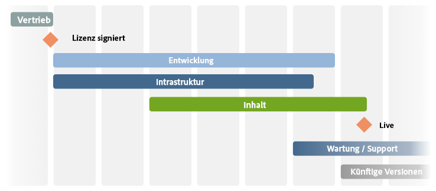

# Die Checkliste – Weitere Referenzen{#the-checklist-further-reference}

>[!CAUTION]
>
>AEM 6.4 hat das Ende der erweiterten Unterstützung erreicht und diese Dokumentation wird nicht mehr aktualisiert. Weitere Informationen finden Sie in unserer [technische Unterstützung](https://helpx.adobe.com/de/support/programs/eol-matrix.html). Unterstützte Versionen suchen [here](https://experienceleague.adobe.com/docs/?lang=de).

Auf dieser Seite finden Sie weitere Details, um die Dokumente und Grundsätze zu erarbeiten und/oder zu ergänzen, die unter das [Verwalten von Projekten - Checkliste mit Best Practices](/help/managing/best-practices.md).

## AEM - Was werden Sie verwenden? {#aem-what-will-you-be-using}

>[!CAUTION]
>
>Die Listen in diesem Unterabschnitt sind nicht vollständig, dienen aber als Einführung.

### Funktionen in AEM {#features-within-aem}

Bei der Implementierung von AEM (insbesondere zum ersten Mal) müssen Sie die [Funktionen und Workflows von AEM](https://www.adobe.com/de/marketing/experience-manager.html) überprüfen, um sicher zu sein, welche Bereiche Sie benötigen.

Beachten Sie die Funktionen von AEM, die Sie verwenden werden, und die Auswirkungen auf Ihr Design, zum Beispiel:

* [Commerce](/help/sites-administering/ecommerce.md)
* [Screens](https://experienceleague.adobe.com/docs/experience-manager-screens/user-guide/aem-screens-introduction.html?lang=de)
* [Assets](/help/assets/assets.md)
* [Tags](/help/sites-administering/tags.md)
* [Multi-Site-Management und Übersetzung](/help/sites-administering/msm-and-translation.md)
* [Formulare](/help/forms/home.md)
* [Communities](/help/communities/deploy-communities.md)
* [Livefyre](https://experienceleague.adobe.com/docs/livefyre/implementation/getting-started/c-getting-started.html)

Überprüfen Sie außerdem die [Versionshinweise](/help/release-notes/release-notes.md)für die verschiedenen Versionen von AEM, um zu sehen, wann neue Funktionen hinzugefügt wurden.

### Integrationen {#integrations}

AEM kann mit anderen Adobe-Produkten und/oder Dienstleistungen von Drittanbietern integriert werden. Diese können die Ihnen zur Verfügung stehende Leistung und Funktionalität steigern.

Siehe [Lösungsintegration](/help/sites-administering/integration.md) für vollständige Informationen.

## Migrieren oder aktualisieren? {#migrate-or-upgrade}

Eine wichtige Überlegung ist, ob Sie:

* Aktualisieren Sie die vorhandene Installation.
* Migrieren Sie den Inhalt aus dem aktuellen System in eine neue Installation.

Beim Wechsel von einer vorherigen Version zur aktuellen Version gibt es zwei Optionen:

* Verwenden Sie die [Package Manager](/help/sites-administering/package-manager.md) um den gesamten Inhalt und Anwendungscode aus dem alten System in das neue zu exportieren.
* [Upgrade](/help/sites-deploying/upgrade.md) das alte System. Dies ist in den meisten Fällen die empfohlene Wahl.

## Grundregeln {#basic-ground-rules}

Wie bei jedem Projekt ist es von entscheidender Bedeutung, so bald wie möglich Grundregeln festzulegen. Dazu gehören:

>[!NOTE]
>
>Diese Punkte sind allgemein gehalten, die [Checkliste mit Best Practices](/help/managing/best-practices.md) behandelt Besonderheiten in Bezug auf AEM.

* **Rollen**

   Diese sollten klar definiert und allen am Projekt beteiligten Personen bekannt gemacht werden. Außerdem ist es ratsam, Folgendes hervorzuheben:

   * Entscheidungsträger
   * Kontaktstellen

* **Zuständigkeiten**

   * Für jede Rolle hilft eine klare Definition der Verantwortlichkeiten für Ihr Projekt, Verwirrung zu vermeiden.

* **Beteiligung**

   Wenn Sie interessierte Kreise so bald wie möglich einbinden, können Sie sie ermutigen, *Interessengruppen* in das Projekt aufgenommen werden, wodurch ihr Engagement für seinen Erfolg erhöht wird.

   * Auf Kundenseite sind dies die Autoren, die täglich mit dem System arbeiten müssen.
   * In Ihrem eigenen Projektteam gehören dazu auch die Verantwortlichen für Qualitätssicherung. Je besser sie die Anforderungen des Kunden verstehen, desto besser können sie die Tests planen.

* **Kommunikationswege**

   * Diese sollten zwar nicht übermäßig formalisiert werden, doch sollten durch spezifische Definitionen sichergestellt werden, dass die Schlüsselpersonen stets auf dem Laufenden gehalten und informiert werden. Besonderes Augenmerk sollte auf die Kommunikation mit externen Parteien gelegt werden.

* **Prozesse**

   Die zu definierenden Prozesse hängen von Ihrem individuellen Projekt ab. Versuchen Sie erneut, diese einfach zu halten, unter Berücksichtigung von:

   * Definition von Prozessen (und Kommunikationswegen) für die Interaktion mit Dritten; z.B. Designagenturen und Drittanbieter von Software.
   * Häufig verfügt der Kunde über eigene Projektmanagement- und Reporting-Verfahren und -Tools.

* **Tracking-Tools**

   Es gibt viele Tools zum Tracking von Informationen zu Fehlern, Aufgaben und anderen Aspekten Ihres Projekts - siehe [Übersicht über potenzielle Tools](#overview-of-potential-tools) für weitere Details.

   * Wichtig ist hier, dass nur eine Kopie der Informationen gespeichert und die Informationen (und damit der Zugriff auf das verwendete Tool) weitergegeben werden. Dies erleichtert die Wartung und verhindert Diskrepanzen.

* **Umfang**

   Definieren Sie eindeutig, was auf verschiedenen Ebenen von dem Projekt abgedeckt werden soll:

   * die einzelnen Versionen (wenn ein iterativer Freigabeprozess verwendet wird und unabhängig davon, ob sie an Kunden oder Ihr internes Testteam bereitgestellt werden).
   * das AEM Projekt.
   * das gesamte Projekt; einschließlich Software von Drittanbietern, deren Auswirkungen auf Tests, organisatorische Probleme und viele andere.
   * Für bestimmte Aspekte kann es auch sinnvoll sein anzugeben, was *nicht* im Umfang des Projekts liegt. Dies kann dazu beitragen, Verwirrung und falsche Annahmen zu vermeiden, sollte sich jedoch auf wesentliche Fragen beschränken.

* **Reporting**

   Definieren Sie klar, welche Informationen Sie melden, in welcher Form, wie oft und wem.

* **Terminologie**

   * Definieren Sie die zu verwendenden Abkürzungen und/oder kundenspezifischen Begriffe.

* **Annahmen**

   * Definieren Sie die möglichen Annahmen.

Diese Informationen können in einem Projekthandbuch definiert werden; die Verwendung eines Wikis kann auch dazu beitragen, dass laufende Änderungen effizient behandelt werden. Wo immer diese definiert sind, sind die Schlüsselfaktoren:

* Informationen werden definiert und gepflegt
* Die Informationen werden allen beteiligten Personen klar mitgeteilt. Obwohl die Standard-Projektmanagementpraxis nicht oft genug wiederholt werden kann, um eine klare Rollendefinition und eine gute Kommunikation zu einem Projekt führen oder es unterbrechen zu können.
* Es wird nur eine Version der verfolgten Informationen aufbewahrt. z. B. Fehlerverfolgung, Problemverfolgung usw.

## Wichtige Leistungsindikatoren und Zielmetriken {#key-performance-indicators-and-target-metrics}

Unternehmen verwenden Key Performance Indicators (KPIs), um ihren Erfolg bei der Erreichung von Zielen zu bewerten. Diese Indikatoren sind messbare Werte, anhand derer nachgewiesen werden kann, wie effektiv bestimmte Ziele erreicht werden.

Diese Indikatoren können sein:

* Handel:

   * Dient zur Messung der wichtigsten Geschäftsziele.
   * Es ist wichtig, KPIs auszuwählen, die für Ihr Unternehmen/Szenario geeignet sind, mit klaren Definitionen dessen, was sie sind, wie sie gemessen werden, wie sie verwendet werden und von wem.

* Leistung:

   * Definieren Sie, wie Sie die Leistung des Systems messen.
   * Einige Beispiele sind die Seitenladezeit, die Antwortzeit des Servers und die Leistung der Datenbankabfrage.

Einige, aber nicht alle Indikatoren können auf den Zielmetriken basieren, die Sie identifizieren und definieren.

### Zielmetriken {#target-metrics}

Metriken werden verwendet, um quantitative Messungen für die Qualität Ihrer Website zu definieren - sie sind im Wesentlichen eine Definition der Leistungsziele, die Sie erreichen möchten, und können zur Definition Ihrer [KPIs (Key Performance Indicators)](#key-performance-indicators-and-target-metrics).

Sie können eine Vielzahl von Metriken definieren, die meisten decken jedoch die Ziele für Leistung und Gleichzeitigkeit ab. Insbesondere Faktoren, die schwer zu quantifizieren sind und häufig anfällig für *emotional* Bewertung:

* &quot;unsere Website ist *viel zu langsam* today&quot;- Wann passiert? *langsam* qualifizieren?

* &quot;alles *Einfrieren* wann sich mein Kollege anmeldet&quot;- wie viele gleichzeitige Benutzer kann das System unterstützen?
* &quot;Wenn ich suche, das System *Einfrieren* &quot; - Welche Art von Suchanfragen wirken sich auf das System aus?
* &quot;es dauert *ages* zum Herunterladen der Datei&quot; - welche Download-Zeiten sind akzeptabel (unter normalen Netzwerkbedingungen)?

Target-Metriken werden zu Beginn eines Projekts definiert, um:

* die erwarteten Dimensionen der Website angeben, die Sie anbieten werden
* die Mindestqualität angeben, die Sie erreichen möchten
* definieren, wie diese Faktoren tatsächlich gemessen werden
* als Grundlage für die [Key Performance Indicators](#key-performance-indicators-and-target-metrics)

Wie immer ist bei der Definition der Zielmetriken Vorsicht geboten:

* wenn sie zu hoch eingestellt sind, können sie völlig unerreichbar sein
* bei zu niedrigen Schwankungen nicht hervorgehoben werden
* um sicherzustellen, dass sie wiederholt und konsistent gemessen werden können
* einen Ausgleich über die verschiedenen zu messenden Faktoren
* bestimmte Metriken beziehen sich auf eine Testumgebung, aber einige sollten reale Szenarien widerspiegeln, da sie auf Ihrer Produktionswebsite messbar und reproduzierbar sein müssen
* die Metriken entsprechend ihrer Bedeutung für die Website priorisieren
* die Metriken auf einen Satz beschränken, der realistisch überwacht werden kann

Während der Entwicklung des Projekts können sie aktualisiert und nach Bedarf angepasst werden. Nachdem das Projekt erfolgreich implementiert wurde, können sie verwendet werden, um Sie bei der Kontrolle Ihrer Installation und der Überwachung/Aufrechterhaltung der erforderlichen Servicestufe für den laufenden Betrieb zu unterstützen.

Bei richtiger Anwendung können diese Metriken ein nützliches Werkzeug sein; bei unverantwortlicher Anwendung können sie eine zeitraubende Ablenkung darstellen. Wie immer müssen Sie verstehen, was Sie messen, wie Sie es messen und warum.

>[!NOTE]
>
>In diesem Abschnitt werden die Grundprinzipien und Fragen behandelt, die zu berücksichtigen sind. Jede Installation ist anders, sodass die tatsächlichen zu messenden Werte unterschiedlich sind.

### Alles hängt von Ihrem Projektdesign ab {#everything-rests-on-your-project-design}

Alle zu messenden Metriken werden in gewisser Weise durch das Design Ihres Projekts beeinflusst. Umgekehrt werden viele Probleme am besten durch Designänderungen gelöst.

Deshalb sollten Sie Ihre Zielmetriken definieren, *bevor*Sie sich für Ihr Design entscheiden. 
So können Sie Ihr Design auf Basis dieser Faktoren optimieren. Auf diese Weise können Sie Ihr Design anhand dieser Faktoren optimieren. Sobald Ihr Projekt entwickelt wurde, wird es schwierig sein, Änderungen an den grundlegenden Designgrundsätzen vorzunehmen.

Wenn Sie die Struktur für die Website erstellen, folgen Sie der empfohlenen Struktur für AEM Sites. Vergewissern Sie sich, dass Sie die folgenden Probleme und/oder Prinzipien verstehen:

* So strukturieren Sie Website-Inhalte.
* Funktionsweise von Vorlagen und Komponenten.
* Funktionsweise von Zwischenspeicherung.
* Die Auswirkungen personalisierter Inhalte.
* Funktionsweise der Suchfunktion.
* Wie Sie CSS und zugehörige Technologien verwenden können, um kompakten, nicht redundanten HTML-Code zu erstellen.

Wenn Sie der Meinung sind, dass Ihr Design nicht den Richtlinien entspricht, oder wenn Sie sich bezüglich einiger Auswirkungen nicht sicher sind, sollten Sie diese Fragen klären, bevor Sie mit der Programmierphase beginnen oder den Inhalt ausfüllen.

### Infrastruktur {#infrastructure}

Um die Infrastruktur zu definieren oder zu bewerten, hilft sie bei der Definition von Zielwerten wie:

* Besucher/Tag; sowohl Durchschnitt als auch Spitze
* Treffer/Tag; sowohl Durchschnitt als auch Spitze
* Anzahl der verfügbaren Webseiten
* Volumen des Webinhalts

Abhängig von Ihrer Situation und der strategischen Bedeutung der Website hilft Ihnen dies bei der Beurteilung und Auswahl Ihrer Infrastruktur:

* Anzahl der Server
* Anzahl AEM Instanzen (Autor und Veröffentlichung)

### Leistung {#performance}

Es gibt verschiedene Leistungsfaktoren, die ausgewertet werden können:

* Antwortzeiten für einzelne Seiten, unter Berücksichtigung:

   * Antwortzeiten in einer Autorenumgebung
   * Antwortzeiten in der Veröffentlichungsumgebung

* Antwortzeiten für Suchanfragen

Dieser Abschnitt kann in Verbindung mit dem Abschnitt [Leistungsoptimierung](/help/sites-deploying/configuring-performance.md) gelesen werden, in dem die technischen Details der eigentlichen Leistungsmessung näher erläutert werden.

#### Reaktionszeiten einzelner Seiten {#response-times-for-individual-pages}

Ein wichtiger Faktor ist die Zeit, die Ihre Website benötigt, um auf Anforderungen durch Besuchende zu reagieren.

Dieser Wert variiert zwar für jede Anforderung, es kann jedoch ein durchschnittlicher Zielwert definiert werden. Sobald sich gezeigt hat, dass dieser Wert sowohl erreichbar als auch wartbar ist, kann er verwendet werden, um die Leistung der Website zu überwachen und die Entwicklung potenzieller Probleme anzuzeigen.

Unterschiedliche Ziele in Autoren- und Veröffentlichungsumgebungen

Die Antwortzeiten, die Sie anstreben, unterscheiden sich in der Autoren- und Veröffentlichungsumgebung und spiegeln die Zielgruppe wider:

* **Autorenumgebung**

   Diese Umgebung wird von Autoren verwendet, die Inhalte eingeben und aktualisieren. Daher muss sie:

   * für eine kleine Anzahl von Benutzern, die beim Aktualisieren von Inhaltsseiten und einzelnen Elementen auf diesen Seiten eine hohe Anzahl von Anforderungen generieren
   * so schnell wie möglich sein, um die Produktivität zu maximieren, damit Ihre Inhalte auf Ihre Website gelangen

* **Veröffentlichungsumgebung**

   Diese Umgebung enthält Inhalte, die Sie Ihren Benutzern zur Verfügung stellen:

   * Die Geschwindigkeit ist weiterhin wichtig, ist aber oft langsamer als die Autorenumgebung
   * Häufig werden zusätzliche leistungssteigernde Mechanismen angewendet:

      * der Inhalt zwischengespeichert wird
      * Lastenausgleich wird angewendet

#### Festlegen der Target-Antwortzeiten {#setting-target-response-times}

Wie können Sie also über erreichbare (durchschnittliche) Antwortzeiten entscheiden? Dies ist häufig eine Frage der Erfahrung:

* Vergangene Erfahrungen auf Ihrer Website
* Erlebnis mit AEM
* Erkennung komplexer Seiten mit überdurchschnittlichen Antwortzeiten (diese sollten nach Möglichkeit einzeln optimiert werden)

Unter kontrollierten Umständen können jedoch die folgenden Leitlinien angewendet werden:

* 70 % der Seitenanfragen sollten in weniger als 100 ms beantwortet werden.
* 25 % der Seitenanfragen sollten in weniger als 100 ms bis 300 ms beantwortet werden.
* 4 % der Seitenanfragen sollten in weniger als 300 ms bis 500 ms beantwortet werden.
* 1 % der Seitenanfragen sollten in weniger als 500 ms bis 1000 ms beantwortet werden.
* Keine Seite sollte langsamer als 1 Sekunde reagieren.

Die obigen Zahlen gehen von folgenden Bedingungen aus:

* gemessen bei der Veröffentlichung (keine Authoring-Umgebung und/oder CFC-Overhead)
* gemessen auf dem Server (kein Netzwerkaufwand)
* nicht zwischengespeichert (kein AEM-Output-Cache, kein Dispatcher-Cache)
* nur für komplexe Elemente mit vielen Abhängigkeiten (HTML, JS, PDF, ...)
* keine andere Belastung des Systems

Es gibt mehrere Mechanismen, mit denen Sie die Antwortzeiten überwachen können:

* **Überwachen der Antwortzeiten mit AEM request.log**

   Ein guter Ausgangspunkt für Leistungsanalysen ist das Anforderungsprotokoll. Sie können dies unter anderem dazu verwenden, die Antwortzeiten einzelner Anfragen anzuzeigen. Siehe [Leistungsoptimierung](/help/sites-deploying/configuring-performance.md) für weitere Details.

* **Überwachen von Antwortzeiten mit HTML-Kommentaren**

   `*HTML comments* can be used to include response time information within the source of each page:`

   `</body> </html>v <-- Page took 58 milliseconds to be rendered by the server --> Response times for search requests`

#### Suchanfragen {#search-requests}

Suchanfragen können erhebliche Auswirkungen auf Ihre Website haben, sowohl im Hinblick auf Folgendes:

* Antwortzeit der tatsächlichen Suche

   * Eine schnelle Suchfunktion ist ein Qualitätsziel für Ihre Website.

* Auswirkungen auf die allgemeine Leistung

   * Da eine Suchfunktion (potenziell große) Abschnitte des Inhalts oder einen speziell extrahierten Index scannen muss, kann dies die Leistung des gesamten Systems beeinträchtigen, wenn sie nicht optimiert wird

Das Festlegen von Zielen für Suchanfragen ist wiederum eine Frage des Erlebnisses, abhängig von:

* AEM
* eine Bewertung, wie oft die Suche im Vergleich zu anderen Zielen verwendet wird
* Ihr Persistenzmanager
* Suchindex
* die Komplexität Ihrer Suchfunktion; Eine einfache Suchfunktion, bei der nur 1 Suchbegriff eingegeben werden kann, ist schneller als eine erweiterte Suche, mit der der Benutzer komplexe Suchanweisungen mit UND/ODER/NOT erstellen kann.

Diese sollten von Anfang an in Ihr Projekt integriert und geplant werden. Zu den für die Überwachung verfügbaren Mechanismen gehören:

* **Überwachen der Antwortzeiten der Suche mit AEM request.log**

   Auch hier kann request.log verwendet werden, um die Antwortzeiten für Suchanfragen zu überwachen. see [Leistungsoptimierung](/help/sites-deploying/configuring-performance.md) für weitere Details.

* **Programmierte Mechanismen zur Messung der Suchantwortzeiten**

   Um die von Ihnen erfassten Informationen zu Suchanfragen und deren Leistung anzupassen, wird empfohlen, die Datenerfassung in Ihren Projektquell-Code aufzunehmen. see [Leistungsoptimierung](/help/sites-deploying/configuring-performance.md) für weitere Details.

### Parallelität {#concurrency}

Ihre Website wird einer Reihe von Benutzern/Besuchern sowohl in der Autoren- als auch in der Veröffentlichungsumgebung zur Verfügung gestellt. Die Zahlen sind oft höher als beim Testen, aber auch schwankend und schwer vorhersehbar. Ihre Website muss für eine durchschnittliche Anzahl gleichzeitiger Benutzer/Besucher konzipiert sein, ohne dass sich dies auf die Leistung auswirkt. Auch hier kann `request.log` verwendet werden, um Parallelitätstests durchzuführen; siehe [Performanceoptimierung](/help/sites-deploying/configuring-performance.md) für weitere Details.

Ziele für die Anzahl gleichzeitiger Benutzer hängen vom Umgebungstyp ab:

* **Autorenumgebung**

   * Normalerweise kann die Anzahl der gleichzeitigen Benutzer genau geschätzt werden. Sie werden wissen, wie viele Autoren Sie insgesamt haben, obwohl (wahrscheinlich) nicht alle gleichzeitig aktiv sein werden.

* **Veröffentlichungsumgebung**

   * Dies ist schwieriger vorherzusagen, daher müssen Sie einen Zielwert auswählen. Auch dies sollte auf der Erfahrung Ihrer aktuellen Website basieren, zusammen mit realistischen Erwartungen Ihrer neuen Website.
   * Sonderveranstaltungen (z. B. bei der Veröffentlichung neuer, sehr beliebter Inhalte) können die Erwartungen - oder sogar die Fähigkeiten - übertreffen (wie manchmal in der Presse berichtet wird, wenn Tickets für bestimmte Veranstaltungen zum Verkauf angeboten werden).

### Kapazität und Volumen {#capacity-and-volume}

Bevor Sie die zugehörigen Metriken besprechen, sollten Sie eine schnelle Definition der Begriffe vornehmen:

* **Volumen**

   * Die Menge der Ausgabe, die vom System verarbeitet und bereitgestellt wird.

* **Kapazität**

   * Die Fähigkeit des Systems, das Volumen bereitzustellen.
   * Bei jedem Schritt werden Kapazität und Volumen unterschiedlich gemessen, wie in der folgenden Tabelle dargestellt. Um eine optimale Leistung zu erzielen, stellen Sie sicher, dass die Kapazität dem Volumen in jedem Schritt entspricht und dass sowohl Kapazität als auch Volumen in allen Schritten gemeinsam genutzt werden. Beispielsweise können Sie die Navigation auf dem Clientcomputer berechnen oder in den Cache legen, anstatt sie für jede Anfrage auf dem Server zu berechnen.

* **Kapazität und Volumen**

   | Was/Wo | Kapazität | Volumen |
   |---|---|---|
   | Client | Rechenleistung des Computers des Benutzers. | Komplexität des Seiten-Layouts. |
   | Netzwerk | Netzwerkbandbreite. | Größe der Seite (Code, Bilder usw.). |
   | Dispatcher-Cache | Server-Speicher des Webservers (Hauptspeicher und Festplatte). | Webserver (Hauptspeicher und Festplatte). Anzahl und Größe der zwischengespeicherten Seiten. |
   | Ausgabe-Cache | Server-Speicher des AEM-Servers (Hauptspeicher und Festplatte). | Anzahl und Größe der Seiten im Ausgabe-Cache, die Anzahl der Abhängigkeiten pro Seite. Der Dispatcher-Cache verringert dieses Volumen. |
   | Webserver | Rechenleistung des Webservers. | Anzahl der Anfragen. Der Cache verringert dieses Volumen. |
   | Vorlage | Rechenleistung des Webservers. | Komplexität der Vorlagen. |
   | Repository | Leistung des Repositorys. | Anzahl der aus dem Repository geladenen Seiten. |

### Andere Metriken {#other-metrics}

In den vorherigen Abschnitten werden die zu definierenden Hauptmetriken beschrieben.

Je nach Ihren spezifischen Anforderungen kann es nützlich sein, zusätzliche Metriken zu definieren, entweder isoliert oder unter Berücksichtigung der oben genannten Klassifizierungen.

Es empfiehlt sich jedoch, einen kleinen Satz genauer, zentraler Metriken zu verwenden, die einfach und zuverlässig funktionieren, anstatt jeden Aspekt Ihrer Website zu messen und zu definieren. Ihre Website wird sich von ihrer Natur her ändern und weiterentwickeln, sobald sie Ihren Benutzern zur Verfügung gestellt wird.

## Sicherheit {#security}

Sicherheit ist entscheidend und eine immer größere Herausforderung. Es ***must*** werden in den frühesten Phasen Ihres Projekts berücksichtigt und geplant.

Die [Sicherheits-Checkliste](/help/sites-administering/security-checklist.md) beschreibt die Schritte, die Sie unternehmen sollten, um sicherzustellen, dass Ihre AEM-Installation bei der Bereitstellung sicher ist. Weitere Sicherheitsaspekte werden unter [Sicherheit (bei der Entwicklung)](/help/sites-developing/security.md) und [Benutzerverwaltung und Sicherheit](/help/sites-administering/security.md) behandelt.

## Parallele und interaktive Aufgaben {#parallel-and-iterative-tasks}

>[!NOTE]
>
>Folgendes:
>
>* Bietet einen Überblick über die *erste* Implementierung eines AEM-Projekts.
>* dient als abstrakte Übersicht; sehen Sie die [Projektprüfliste](/help/managing/best-practices.md) für bestimmte Phasen/Meilensteine/Aufgaben.
>* Jede Zeitskala ist theoretisch.
>

Für eine neue Implementierung eines standardmäßigen AEM-Projekts müssen Sie beispielsweise folgende Aufgaben berücksichtigen:

* Übergabe aus dem Verkaufsprozess.
* Implementierung der Kundenanwendung (**Entwicklung**).
* Installation und Konfiguration der Infrastruktur (und der damit verbundenen Prozesse) auf der Site des Kunden (**Infrastruktur**).
* Erstellung (oder Migration) des Inhalts (**Inhalt**).
* Übergabe an Vorgänge (**Wartung/Support**).
* Folgeversionen.

Für alle Aspekte wird ein periodischer Ansatz empfohlen:

>[!NOTE]
>
>Aufteilen des Projekt-Launches nach **Soft Launch(s)** (reduzierte Verfügbarkeit, mehrere Iterationen) und **Hard Launch** (volle Verfügbarkeit - Live), um eine Optimierung, Optimierung und Benutzerschulung unter realistischen Bedingungen in der Produktionsumgebung zu ermöglichen.

>[!NOTE]
>
>Siehe [Projektprüfliste](/help/managing/best-practices.md) Beispiele für Aufgaben, die Sie während des Lebenszyklus Ihres Projekts ausführen (oder bewerten) sollten.

Zu beachten sind einige Punkte für jede Kategorie:

* **Entwicklung**

   * Definieren Sie zuerst die Basisarchitektur.
   * Verwenden Sie mehrere Iterationen (Sprints) für die Entwicklung:

      * Der erste Sprint entspricht dem ersten vollständigen Entwicklungszyklus.
      * Der erste Sprint führt zur ersten Bereitstellung in Ihrer Testumgebung.
      * Jeder Sprint hat ein durchlaufbares Ergebnis.
      * Jeder Sprint erhält einen Kunden-Signoff (Minimum an strukturierten Tests mit Feedback).
   * Planen Sie den Fall eines Updates der verfügbaren AEM-Version während des Projekts mit ein.
   * Planen Sie Tests und Optimierungen während des Sprints.
   * Planen Sie die Stabilisierungs- und Optimierungsphasen.
   * Erstellen Sie ein Protokoll mit Elementen, die für weitere Versionen geplant werden sollen.
   * Planung der Partnerbeteiligung und -übergabe.

* **Infrastruktur**

   * Definieren Sie zuerst die Basisarchitektur:

      * Definieren Sie die Leistungsanforderungen.
      * Definieren Sie Leistungsziele (d. h. klare Erwartungen).
      * Definition der Hardware- und Infrastrukturarchitektur; einschließlich der Größenanpassung.
      * Definieren Sie die Bereitstellung.
   * Verwendung mehrerer Iterationen; für den ersten Sprint und die Erstkonfiguration vorbereiten:

      * Bereitstellungsumgebung.
      * Entwicklungsprozess.
      * Testumgebung.
      * Bereitstellungsprozess (einschließlich Konfigurationsverwaltung).
   * Planen Sie mehrere Belastungstests.
   * Planen Sie Tests und Optimierungen während des Sprints.
   * Planen Sie eine Stabilisierungs- und Optimierungsphase.
   * Stellen Sie das System so früh wie möglich in der Produktionsumgebung bereit (lassen Sie es vom Betriebsteam einrichten, um Erlebnisse zu sammeln).
   * Verwenden Sie so früh wie möglich benannte Benutzer und definierte Rollen.
   * Planen Sie Schulungen (z. B. Administratorschulungen).
   * Planen Sie die Übergabe an den Betrieb.

* **Inhalt**

   * Die Basisarchitektur:
      * Verschiebt die Inhaltshierarchie.
      * Hilft bei der Definition des Inhaltskonzepts.
      * Definiert die MSM-Nutzung und das Layout.
      * Definiert Rollen, Gruppen, Workflows und Berechtigungen.
   * Überlegen Sie, ob die Offline-Seitenerstellung nützlich sein wird.
   * Planen Sie die frühzeitige Erstellung von ersten Seiten und Inhalten (zur Verwendung in Tests und Feedback).
   * Planen Sie die Migration vorhandener Inhalte.
   * Planen Sie die &quot;In-Sprint-Migration&quot;nach der Umgestaltung.
   * Planen Sie den &quot;Inhaltsabbruch&quot;(Sitemap für Live-Inhalte).

## Schätzung von Zeit und Aufwand {#estimating-time-and-effort}

Abhängig von Ihrer resultierenden Aufgabenliste können Sie dann erste Schätzungen der Zeit und des Aufwands für (allgemeine) Aufgabendefinitionen vornehmen. Diese sollten einen Hinweis darauf enthalten, wer (Kunde oder Partner) was und wann tun wird.

Die folgende Liste zeigt Standardschätzungen und Zusammenhänge von Aufwand und damit Kosten:

>[!CAUTION]
>
>Diese Zahlen können nur für erste Schätzungen verwendet werden. Ein erfahrener AEM-Entwickler muss die detaillierte Analyse durchführen.

| Phase | Aufwand |
|---|---|
| Entwicklung | Eine grobe Schätzung von 2 – 4 Stunden für jeden Komponentenknoten deckt alle Entwicklungsanforderungen ab. |
| Entwicklertests | 15 % der Entwicklung |
| Folgemaßnahmen | 10 % der Entwicklung |
| Dokumentation | 15 % der Entwicklung |
| JavaDoc-Dokumentation | 10 % der Entwicklung |
| Fehlerbehebung | 15 % der Entwicklung |
| Projekt-Management | 20 % der Projektkosten für laufende Projektverwaltung und Nutzerrechte |

Eine detaillierte Planung kann dann verfügbare oder erforderliche Ressourcen mit Terminen und Kosten verknüpfen.

## Referenzarchitektur {#reference-architecture}

Die Referenzarchitektur dient als Vorlage für die AEM-Architektur. Die Referenzarchitektur behandelt Probleme, die häufig bei Unternehmenssystemen auftreten, einschließlich Skalierung, Zuverlässigkeit und Sicherheit.

Die folgenden Site-Metriken sollten definiert werden:

| Klassifizierung | Definition |
|---|---|
| Anzahl der Websites |  |
| Anzahl der Intranet-Sites |  |
| Anzahl der Code-Basen (z. B. wenn Internet und Intranet unterschiedlich sind) |  |
| Anzahl der einzelnen Seiten |  |
| Anzahl der Site-Besuche/Tag |  |
| Anzahl der Seitenaufrufe/Tag |  |
| Umfang der Datenübertragung (in GB)/Tag |  |
| Anzahl gleichzeitiger Benutzer (geschlossene Benutzergruppe) |  |
| Anzahl gleichzeitiger Besucher (Veröffentlichung) |  |
| Anzahl gleichzeitiger Autoren |  |
| Anzahl registrierter Autoren |  |
| Anzahl der Seitenaktivierungen/Arbeitstag |  |
| Anzahl der Seitenaktivierungen während der Bereitstellung |  |

## Übersicht über potenzielle Tools {#overview-of-potential-tools}

Die folgende Liste informiert Sie über die verwendbaren Werkzeuge. Sie ist als Einführung gedacht, nicht als umfassende Empfehlungsliste, und sollte Sie sicherlich nicht davon abhalten, andere Tools zu verwenden, die Sie bevorzugen.

<table>
 <tbody>
  <tr>
   <td><strong>Produkt</strong></td>
   <td><strong>Beschreibung</strong></td>
  </tr>
  <tr>
   <td>AEM</td>
   <td>
AEM bietet eine Reihe von Mechanismen, mit denen Sie Ihre Anwendung überwachen, testen, untersuchen und debuggen können, darunter folgende:

    <ul>
     <li><a href="/help/sites-developing/developer-mode.md">Entwicklermodus</a></li>
     <li>Die <a href="/help/sites-developing/hobbes.md">Testkonsole</a></li>
     <li><a href="/help/sites-administering/operations-dashboard.md">Vorgangs-Dashboard</a></li>
     <li><a href="/help/sites-authoring/content-insights.md">Inhaltseinblick</a></li>
     <li>Die <a href="/help/sites-authoring/author-environment-tools.md#content-tree">Inhaltsstruktur</a></li>
    </ul> </td>
  </tr>
  <tr>
   <td> </td>
   <td> </td>
  </tr>
  <tr>
   <td>Selenium</td>
   <td><a href="https://docs.seleniumhq.org/">Selenium</a> ist ein Open Source-Test-Tool. Die Tests laufen direkt im Browser ab und emulieren, wie Ihre Benutzer arbeiten.</td>
  </tr>
  <tr>
   <td>Microsoft Project</td>
   <td>Ein häufig verwendetes Projekt-Management-Tool.</td>
  </tr>
  <tr>
   <td>Jira</td>
   <td><a href="https://www.atlassian.com/software/jira">Jira</a> ist ein Open Source-Tool zum Verfolgen und Verwalten von Details Ihrer Softwarefehler. Workflows können bei Bedarf auf die Fehlerdetails angewendet werden.</td>
  </tr>
  <tr>
   <td>Git</td>
   <td><a href="https://git-scm.com/">Git</a> ist eine Software für die Revisionskontrolle.</td>
  </tr>
  <tr>
   <td>Eclipse</td>
   <td>
Eclipse ist eine Open Source-IDE, die aus verschiedenen Projekten besteht. Diese konzentrieren sich auf den Aufbau einer offenen Entwicklungsplattform, die aus erweiterbaren Frameworks, Tools und Laufzeiten für die Erstellung, Bereitstellung und Verwaltung von Software über den gesamten Lebenszyklus besteht.
 
Weitere Informationen finden Sie unter <a href="/help/sites-developing/howto-projects-eclipse.md">Entwickeln von AEM-Projekten mit Eclipse</a>.
 </td>
  </tr>
  <tr>
   <td>IntelliJ</td>
   <td>
Eine professionelle (und damit lizenzkostenpflichtige) IDE mit einem umfassenden Funktionsumfang. 
 
Weitere Informationen finden Sie unter <a href="/help/sites-developing/ht-intellij.md">Entwickeln von AEM-Projekten mit IntelliJ IDEA</a>.
 </td>
  </tr>
  <tr>
   <td>Maven</td>
   <td><a href="https://maven.apache.org/">Maven</a> ist ein Softwaretool für Projekt-Management und Analysen, das den Build-Prozess eines Projekts (Software und Dokumentation) verwalten kann.</td>
  </tr>
 </tbody>
</table>

## Weiterführende Literatur {#further-reading}

Darüber hinaus sind die folgenden Abschnitte von besonderem Interesse:

* [Erste Schritte](/help/sites-deploying/deploy.md#getting-started)
* [Technische Anforderungen](/help/sites-deploying/technical-requirements.md)
* [Überwachung und Pflege Ihrer Instanz](/help/sites-deploying/monitoring-and-maintaining.md)

### Best Practices {#best-practices}

Adobe bietet weitere Best Practices für alle Phasen und Zielgruppen:

* [Bereitstellen](/help/sites-deploying/best-practices.md)
* [Authoring](/help/sites-authoring/best-practices.md)
* [Verwalten](/help/sites-administering/administer-best-practices.md)
* [Entwickeln](/help/sites-developing/best-practices.md)
* [Projekt-Management](/help/managing/best-practices.md)
