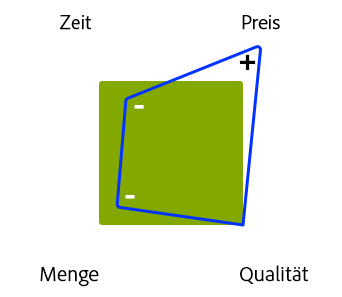

# Verwalten von Projekten – Checkliste mit Best Practices{#managing-projects-best-practices-checklist}

>[!CAUTION]
>
>AEM 6.4 hat das Ende der erweiterten Unterstützung erreicht und diese Dokumentation wird nicht mehr aktualisiert. Weitere Informationen finden Sie in unserer [technische Unterstützung](https://helpx.adobe.com/de/support/programs/eol-matrix.html). Unterstützte Versionen suchen [here](https://experienceleague.adobe.com/docs/?lang=de).

Die Verwaltung eines Projekts zur Implementierung von Adobe Experience Manager (AEM) erfordert Planung und Verständnis, um sicherzustellen, dass Sie sich der Probleme und Entscheidungen bewusst sind, die Sie treffen müssen (sowohl vor als auch während der Implementierung des Projekts).

Die Best Practices beinhalten Folgendes:

* Ein [interaktive Checkliste](/help/managing/best-practices-checklist.md) ermöglicht es Ihnen, den Fortschritt mit diesen Best Practices zu verfolgen und zu überwachen.

   * Definiert Eingaben und Lieferziele nach Phase, Meilenstein und Persona.
   * Bietet automatisierte Übersichten (Qualität, Gesundheit und Vollständigkeit) zur Angabe des Fortschritts und des Projektstatus.

* Dokumentation, direkt basierend auf der [Checkliste](/help/managing/best-practices-checklist.md), der Folgendes beschreibt:

   * [Projekt-Heartbeat](#project-heartbeat-dashboard)-Analyse
   * Überblick über den [Status nach Rolle](#status-by-role)
   * [Phasen und Milestones](#phases-and-milestones).
   * [Schlüsselrolle](#persona) und ihre Beteiligung an allen (relevanten) Phasen.
   * [Glossar](/help/managing/best-practices-glossary.md) der [erforderlichen Dokumente und Ergebnisse](#required-documents-and-deliverables)

* [Weitere Informationen](/help/managing/best-practices-further-reference.md) Material, um weitere Details zu bestimmten Bereichen bereitzustellen.

## Projekt-Heartbeat-Dashboard {#project-heartbeat-dashboard}

Die **Projekt-Heartbeat** Das Arbeitsblatt bietet einen grafischen Überblick über kritische Metriken für Ihr Projekt:

* **Phasenqualität**

   * Gibt die Qualität der [Erforderliche Dokumente und Ergebnisse](#required-documents-and-deliverables) über das Projekt hinweg.

* **Phasenkonsistenz**

   * einen allgemeinen Statusindikator für Ihr Projekt; nützlich sein, um gefährdete Bereiche hervorzuheben.

* **Phasenvollständigkeit**

   * Dies gibt zu jedem Zeitpunkt während des Projekts an, wie viel bereits für jede Phase Ihres Projekts abgeschlossen wurde.

## Status nach Rolle {#status-by-role}

Das Arbeitsblatt **Status nach Rolle** zeigt eine detaillierte Aufstellung der **[Konsistenz, Qualität und Vollständigkeit](#project-heartbeat-dashboard)**, sortiert nach **[Phase](#phases-and-milestones)** und **[Rolle](#persona)**.

## Phasen und Milestones {#phases-and-milestones}

Der Projektplan ist in verschiedene (allgemeine) Phasen unterteilt.

Jede Phase enthält ihre eigenen Milestones. Für jede [Rolle](#persona) werden die zutreffenden Milestones gemeinsam mit den Dokumenten aufgelistet, die zur Erreichung bestimmter Ergebnisse notwendig sind.

>[!NOTE]
>
>Es besteht keine direkte 1:1-Beziehung zwischen den einzelnen erforderlichen Dokumenten und den Lieferzielen.

### Vorbereitung {#preparation}

Die Vorbereitung des Projekts bildet die Grundlage für das gesamte Projekt. Sie müssen wichtige Anforderungen zusammen mit klaren Zielen und Erwartungen für die folgenden Bereiche definieren:

* **Geschäftsgrundsatz**

   * Die wesentlichen Gründe und die Begründung für die Durchführung des Projekts.

* **Umfang und Zeitplan**

   * Es sollte ein grundlegender Umfang und ein grober Zeitplan zur Verfügung gestellt werden, um festzulegen, was erforderlich ist und innerhalb welcher Frist; Wenn dies zur Klärung der Situation beiträgt, können Sie auch festlegen, was außerhalb des Anwendungsbereichs liegt.

Die Art und Weise, wie Sie Ihr Projekt vorbereiten, planen und ausführen und Ihre Lösung implementieren, wird von den Einschränkungen beeinflusst, die Sie unter z.B. festes Budget, feste Zeitleiste, Menge des Inhalts, erforderliche Qualität durchführen.

Wie immer hat die Anpassung eines dieser Faktoren Auswirkungen auf die anderen. Eine Verkürzung der Zeit bei gleichbleibender Qualität beispielsweise führt wahrscheinlich zu einem Preisanstieg bei gleichzeitiger Reduktion der Menge an Inhalten, die bearbeitet werden können. Haushalt ist oft ein Schlüsselfaktor, sodass solche Beziehungen nicht vergessen werden können.

Die vier Faktoren:

#### Milestones {#milestones}

* **Validierung**

   In dieser Phase müssen Sie die Ziele des Projekts validieren und bestätigen. Beispiel:

   * Was möchten Sie erreichen/bereitstellen?
   * Wer wird davon profitieren?
   * Wie sieht der Anwendungsbereich aus?
      * Wenn dies zur Klärung der Situation beiträgt, können Sie auch festlegen, was außerhalb des Anwendungsbereichs liegt.
   * Wie werden Sie Erfolg definieren?
   * Wie wirst du den Erfolg messen?
      * Welche technischen und geschäftlichen Anforderungen gibt es?
      * Gibt es veraltete Systeme, die ersetzt werden müssen, und wenn ja, müssen Daten migriert werden?
      * Wer wird einbezogen?
      * Wie werden Sie den Fortschritt messen?
      * Wie oft werden Sie den Fortschritt während der Projektlaufzeit überprüfen?

* **Budget**

   Bevor Sie ein Projekt beginnen, benötigen Sie eine zuverlässige, realistische Schätzung der Kosten für dessen Implementierung:

   * Verwenden Sie Informationen aus dem Validierungs-Meilenstein als Grundlage für die Schätzungen.
   * Seien Sie realistisch in Ihren Schätzungen.
   * Beachten und beachten Sie alle Client-Richtlinien, Prozesse oder Einschränkungen, denen der Client möglicherweise unterliegt.
   * Überlegungen zu Eventualfällen und Überprüfungen, falls zu einem späteren Zeitpunkt eine Überprüfung oder Verfeinerung des Haushalts erforderlich ist.
   * Beachten Sie, dass die Kosten in vielerlei Hinsicht entstehen. Käufe, Nutzung von Ressourcen und Gebühren.

### Planung {#planning}

Die Planung des Projekts vertieft die Vorbereitung. Hier müssen Sie damit beginnen, die Ziele und Erwartungen in einen klar definierten Fahrplan umzuwandeln, der aus konkreten Aufgaben besteht, die durch klare Kommunikation verbunden sind, mit strengen Überprüfungen zur Messung des Fortschritts.

#### Milestones {#milestones-1}

* **Übergabe**

   Eine saubere Übergabe stellt sicher, dass die entsprechenden Personen/Gruppen ihre Verantwortung im Rahmen des Projekts kennen.

   Umfassende Informationen sollten bereitgestellt/generiert werden, um sicherzustellen, dass sie alle relevanten Aspekte einschließlich Fahrplan, Umfang, Ziele, Anforderungen und KPIs vollständig verstehen.

* **Risikobewertung**

   Um unangenehme Überraschungen zu vermeiden, verwenden Sie die Risikobewertung, um potenzielle Risiken zusammen mit ihren Auswirkungen und Wahrscheinlichkeiten zu ermitteln und zu quantifizieren.

   Dies sollte früh im Projektlebenszyklus erfolgen, um sicherzustellen, dass jegliche Schwächen identifiziert und bewertet werden. Auf der Grundlage der Ergebnisse können Sie Ihren Interessengruppen mitteilen, ob die vollständigen Anforderungen erfüllt werden können und ob es gegebenenfalls möglich ist, geeignete Maßnahmen zu planen und zu verfolgen.

* **Kommunikation**

   Kommunikation ist immer der Schlüssel zum Erfolg eines jeden Projekts. Sie müssen klar und effizient kommunizieren, um sicherzustellen, dass jeder:

   * Auf dieselben grundlegenden Ziele hinarbeiten
   * Aus derselben Informationsbasis
   * Mit denselben Kanälen

* **Kick Off**

   Das Meeting zum Projektstart dient dazu, auf den Start des Projekts hinzuweisen. Es bietet eine gute Gelegenheit,

   * Laden Sie alle interessierten Parteien (oder zumindest Gruppenvertreter) ein.
   * Präsentieren Sie wichtige Fakten zum Projekt.
   * Beantworte Fragen.
   * Stellen Sie sicher, dass alle über dieselbe Wissensgrundlage verfügen.
   * Beziehen Sie sich von allen, die beteiligt sein werden - dies muss verdient werden.
      * Durch die Einbeziehung von Hauptakteuren (einschließlich potenzieller Autoren) zu Beginn des Projekts erhöhen Sie Ihre Chancen, ihr Engagement für das Projekt zu erreichen.

### Entwicklungsvorbereitung {#development-preparation}

Die Planung der Entwicklung ist entscheidend, um sicherzustellen, dass Ihr Projekt auf einem soliden Design eines Teams basiert, das über die erforderlichen Kenntnisse verfügt.

#### Milestones {#milestones-2}

* **Entwicklungsteam - Fortbildung**

   Bevor Sie mit einem Projekt beginnen, sollten Sie sicherstellen, dass Ihr Entwicklungsteam angemessen besetzt ist und dass alle Teammitglieder für die vorliegende Aufgabe geschult sind.

* **Inhaltsarchitektur**

   Die Inhaltsarchitektur definiert und beschreibt die zukünftige Architektur des Inhalts. einschließlich:

   * die Inhaltsstruktur; einschließlich Assets
   * Grundstrukturen; einschließlich Kampagnen usw.
   * Multi-Site- und mehrsprachige Strukturen (MSM, Übersetzung usw.)
   * Unterstützende Inhalte (einschließlich Tags und Tagging-Konzepten)
   * Caching und Strategien zur Wiederverwendung von Inhalten

* **Systemarchitektur**

   Die Systemarchitektur definiert die konzeptionelle Ansicht Ihres Systems. einschließlich (unter anderem):

   * [Systemstruktur](/help/sites-deploying/recommended-deploys.md#deployment-scenarios) für alle erforderlichen Umgebungen
   * Untersysteme
   * Drittanbietersysteme
   * Schnittstellen; Hardware, Software und menschliche Interaktion
   * Server für jede Umgebung; siehe [Technische Anforderungen](/help/sites-deploying/technical-requirements.md) und [Hardware-Skalierungsrichtlinien](/help/managing/hardware-sizing-guidelines.md);
   * Prozesse für jede Umgebung; z. B. Bereitstellungs- und Wartungsanforderungen
   * Wartungsaktivitäten (Datastore GC, TarPM-Optimierung usw.)
   * [Dispatcher](https://helpx.adobe.com/de/experience-manager/dispatcher/user-guide.html)-Caching
   * [Clustering](/help/sites-deploying/recommended-deploys.md#deployment-scenarios) beim Veröffentlichen/automatischen Teilen;
   * Leistung für die Client-Seite (JS minify, concat, css sprites, Gesamtanzahl der HTTP-Anforderungen und andere)

* **Anwendungsarchitektur**

   Die Anwendungsarchitektur definiert und beschreibt das Verhalten der vorgeschlagenen Anwendungen.

   Der Schwerpunkt liegt auf Folgendem:

   * Wie sie miteinander und mit Benutzern interagieren werden.
   * Die Daten, die von Anwendungen genutzt und erzeugt werden sollen, und nicht von ihrer internen Struktur.
   Die Definitionen sollten Folgendes umfassen:

   * Grundlegende Code-Struktur für das Projekt
   * Code-Artefakte (Bundles, Pakete usw.)
   * Aufschlüsselung der Vorlagen/Komponenten und ihrer Beziehungen
   * Allgemeine Details der erforderlichen Anpassungen (spezifische Überlagerungen werden später folgen)
   * Entwurf der für die Lösung erforderlichen Workflows (z. B. Inhaltserstellung, Genehmigung, Veröffentlichung, Transformationen, Importe, Exporte usw.)
   * Besondere Berücksichtigung komplexer Module wie MSM, Commerce, Drittanbieterintegration

* **Systemintegration**

   Für die Systemintegration müssen Sie Folgendes planen (und dann implementieren):

   * Wie alle Teilsysteme und [Lösungsintegrationen](/help/sites-administering/integration.md) zusammengeführt werden, um als einheitliches System zu funktionieren
   * Integrieren von Drittsystemen, gemeinsam mit besonderer Berücksichtigung von offline/online, Client-/Browser-seitig oder Handhabung der Ausfallsicherung, wenn ein Drittsystem ausfällt.

* **Testkonzept**

   Bevor Sie mit der Entwicklung beginnen, sollten Sie ein tiefgehendes und umfassendes Konzept aller [testing](/help/sites-developing/planning.md) Anforderungen für Ihr Projekt.

   Dies sollte (unter anderem) Folgendes umfassen:

   * Details aller durchzuführenden Tests
   * Vorbereitung des für diese Tests erforderlichen Inhalts
   * Angaben zu den zu verwendenden Testwerkzeugen
   * Hochrangige Angabe, wer an den Tests beteiligt sein wird; besonders Gruppen außerhalb des Qualitätssicherungsteams
   * Details zur Testautomatisierung; Beispielsweise im Selenium- oder AEM Entwicklermodus

* **Experience Design**

   Erlebnisdesign (XD) umfasst das Entwerfen des Benutzererlebnisses für Ihre Lösung.

   Das Benutzererlebnis sollte sowohl für Ihre Autoren als auch für die Endbenutzer Ihrer Website analysiert und entwickelt werden.

* **Support-Setup**

   Vor der Entwicklung sollten alle Support-Prozesse eingerichtet werden, die zum Bereitstellen, Freigeben, Testen und Berichten erforderlich sind.

   Siehe auch [Adobe Support-Portal](https://helpx.adobe.com/de/marketing-cloud/contact-support.html).

### Betriebsplanung und -betrieb {#operations-planning-and-operations}

Auf ähnlicher Grundlage müssen auch die Abläufe angemessen geplant werden, um zu gewährleisten, dass Sie über die notwendigen Umgebungen verfügen - in sämtlichen Phasen des Projektzyklus. Sie benötigen auch die entsprechenden Prozesse, um sie zu verwalten.

#### Milestones {#milestones-3}

* **Berechtigungen**

   Sie müssen für alle Benutzer/Gruppen, die die Lösung verwenden, ein Rollen- und Berechtigungskonzept planen und dann implementieren.

   Beispiel:

   * Eine Liste von Rollen (d. h. Gruppen) mit jeweilig festgelegten `read`/`write`-Zugriffsdefinitionen
   * Festlegung der Verwendung von Berechtigungen, die einen Einfluss auf die Veröffentlichungsumgebung haben, z. B. `replicate`
   * Für Benutzer mit minimalen Berechtigungen sollten Workflows definiert werden
   * Benutzer in der Gruppe `editor` sollten weder über `admin`-Rechte verfügen noch Teil der Gruppe `administrators` sein
   Weitere Informationen finden Sie unter [Benutzeradministration und Sicherheit](/help/sites-administering/security.md).

* **Überwachung und Wartung**

   Überwachung und Wartung sind Schlüsselaspekte, um den reibungslosen Ablauf der Lösung nach der Einführung zu gewährleisten. Dazu müssen Sie Folgendes definieren:

   * Was muss überwacht werden?
   * Wartungsaufgaben; regulären und Sonderfällen
   Siehe auch [Überwachung und Wartung](/help/sites-deploying/monitoring-and-maintaining.md) für weitere Informationen.

* **Migration**

   Alle Inhalte aus dem alten System sollten für die Migration überprüft und validiert werden.

* **Wiederherstellungsplan**

   Stellen Sie sicher, dass Sie einen Wiederherstellungsplan haben. Dieser muss in Notfällen verfügbar sein, um die Verwendung von AEM sicherzustellen. Dies sollte Situationen wie Backup, Wiederherstellung, Fallover und andere umfassen.

### Entwicklung {#development}

Entwicklung ist eine entscheidende Phase, die mehr erfordert als nur Programmieren.

#### Milestones {#milestones-4}

* **Entwicklungsumgebung**

   Planen und dokumentieren Sie Ihre Entwicklungsumgebung, einschließlich:

   * Architektur
   * [Entwicklungswerkzeugen](/help/sites-developing/dev-tools.md)
      * Eine typische Umgebung besteht aus:
         * ein System zur Problemverfolgung; wie Jira
         * eine IDE, wie Eclipse
         * ein Buildmanagement-Tool; wie Maven
         * einem Werkzeug für die fortwährende Integration, wie etwa Jenkins;
         * ein Werkzeug zur Versionskontrolle; wie GIT/SVN
         * einen Repository-Manager für Build-Artefakte; wie Archiva/Nexus
   * Integration/Abhängigkeiten von Software von Drittanbietern
   * [Integration/Abhängigkeiten von der Lösung;](/help/sites-administering/integration.md)
   * Bereitstellungskapazität

* **Testsystem**

   Planen und dokumentieren Sie Ihre Testumgebung, einschließlich:

   * Architektur
   * Abhängigkeiten von Entwicklungs-Builds; einschließlich nächtlicher Builds
   * Die Möglichkeiten oder Einschränkungen zum Testen der Softwareintegration/Abhängigkeiten von Drittanbietern
   * Testwerkzeuge
   * Automatisierte Teststrategie

* **Produktionssystem**

   Planen und dokumentieren Sie Ihre Produktionsumgebung, einschließlich:

   * Architektur
   * Bereitstellungskapazität
   * Integration/Abhängigkeiten von Software von Drittanbietern
   * Sicherheitseinstellungen
   * Bestätigung der Grundleistung durch Ausführen eines [Tough Day](/help/sites-developing/tough-day.md)-Tests bei der Produktionskonfiguration;
   * Anforderungen an Leistungstests; see [Best Practices für Qualitätssicherung](/help/sites-deploying/configuring-performance.md#best-practices-for-quality-assurance)

* **Integration**

   Planen, dokumentieren und testen Sie alle Aspekte des Systems und [Lösungsintegration](/help/sites-administering/integration.md), einschließlich:

   * Eine automatisierte Teststrategie
   * Automatisierte Prozesse in [Anwendungen von der Entwicklung in den Test verschieben, dann Produktion](/help/managing/enterprise-devops.md#code-movement)
   * Automatisierte Prozesse in [Verschieben von Inhalten aus der Produktion in die Test- und Entwicklungsumgebung](/help/managing/enterprise-devops.md#content-movement)

* **Migration**

   Planen, dokumentieren und testen Sie alle Aspekte der Inhaltsmigration; einschließlich:

   * Inhaltsarchitektur
   * Migrationsstrategie

* **Kommunikation**

   Stellen Sie sicher, dass alle Team-Mitglieder und Projektmitarbeiter bei Bedarf auf dem neuesten Stand gehalten werden.

* **Dokumentation**

   Dokumentieren Sie die Lösung vollständig. einschließlich:

   * Betriebshandbuch
   * Alle Anpassungen, die sich auf Aktualisierungen auswirken können
   * Versionshinweise

### Leistung und Tests {#performance-and-testing}

Sobald die neue Anwendung verfügbar ist, muss sie strengen Tests unterzogen werden, sowohl hinsichtlich der Funktionalität als auch [Leistung](/help/sites-deploying/configuring-performance.md).

>[!NOTE]
>
>Jedes Testteam sollte die Möglichkeit haben, neutral zu bleiben und die Testergebnisse zu liefern.
>
>Es liegt in der Verantwortung des Projektmanagers, die Auswirkungen der Ergebnisse zu bewerten und geeignete Maßnahmen zu treffen.

#### Milestones {#milestones-5}

* **Endbenutzerakzeptanztest**

   [Anwenderakzeptanztests](/help/sites-developing/acceptance-signoff.md) (UAT) ist entscheidend, um sicherzustellen, dass

   * Die Lösung erfüllt die Benutzer-/Kundenanforderungen
   * Der Kunde/die Benutzer akzeptieren die Lösung (Funktion, Design und Leistung)
   eine formelle Checkliste sollte für die Kundenübergabe erstellt werden, die idealerweise automatisiert ist und nächtlich gegenüber einer Momentaufnahme durchgeführt wird. Die Ergebnisse sollten an den Projekt-Manager oder das Entwickler-Tam weitergeleitet werden.

* **Leistungs- und Belastungstests**

   Leistungs- und Belastungstests werden verwendet, um sicherzustellen, dass die Lösung die erforderlichen Leistungsniveaus bei durchschnittlicher Belastung und Spitzenlast erfüllt.

   Weitere Informationen zu Leistungstests finden Sie unter:

   * [Leistungstests](/help/sites-deploying/configuring-performance.md)
   * [Planen und Ausführen von Tests](/help/sites-developing/planning.md)
   * [Allgemeine Leistungsrichtlinien](/help/sites-deploying/configuring-performance.md#basic-performance-guidelines)
   >[!NOTE]
   >
   >Dieser Prozess muss auch während der normalen Verwendung von AEM fortgeführt werden, diese frühen Phasen sind jedoch am wichtigsten.

### Rollout {#rollout}

Der Rollout einer neuen Anwendung bedarf sorgfältiger Planung, um einen reibungslosen Ablauf der Live-Schaltung zu gewährleisten. Dazu gehört die Bestätigung eines hohen Sicherheitsniveaus, die Schulung aller potenziellen Benutzer und die Durchführung mehrerer Testläufe, um zu bestätigen, dass alle Probleme gelöst wurden.

#### Milestones {#milestones-6}

* **Vorbereitung**

   Die Vorbereitung und Planung tragen zu einem reibungslosen Rollout bei.

* **Schulung**

   Stellen Sie sicher, dass alle beteiligten Mitarbeiter geschult wurden.

   Siehe [Adobe Experience Manager](https://training.adobe.com/training/courses.html#solution=adobeExperienceManager) im Kurskatalog.

* **Trainierte Administratoren**

   Stellen Sie sicher, dass Ihre Lösungsadministratoren über Folgendes verfügen:

   * entsprechend ausgebildet wurden
   * Das entsprechende Lehrmaterial erhalten
   * Die entsprechende Dokumentation erhalten

* **Schulte Benutzer**

   Stellen Sie sicher, dass Ihre Autoren über Folgendes verfügen:

   * entsprechend ausgebildet wurden
   * Das entsprechende Lehrmaterial erhalten
   * die entsprechenden Unterlagen erhalten haben; Beispiel: das Benutzerhandbuch

* **Penetrationstests**

   Penetrationstests simulieren einen Angriff auf ein Computersystem, um potenzielle Sicherheitsmängel zu identifizieren.

* **Penetration/Sicherheitstests**

   Um die Sicherheit Ihrer Lösung zu gewährleisten, führen Sie spezifische Penetrationstests zusammen mit einer größeren Auswahl an Sicherheitstests durch.

   Weitere Informationen finden Sie in der [Sicherheits-Checkliste](/help/sites-administering/security-checklist.md).

### Live-Schaltung {#go-live}

Die Live-Schaltung sollte so reibungslos wie möglich verlaufen. Auch die letzten Schritte müssen für eine saubere Ausführung geplant werden.

#### Milestones {#milestones-7}

* **Vorbereitung**

   Die Vorbereitung und Planung tragen dazu bei, dass ein reibungsloses Leben gewährleistet ist.

* **Sicherheit**

   Bestätigen Sie die Sicherheit Ihrer Lösung für interne und externe Benutzer und deren Inhalt.

* **Notfallversorgung**

   Stellen Sie sicher, dass alle Systeme, Verfahren und Mechanismen, die für Ausweichmanöver erforderlich sind, vorhanden sind, bevor Sie live geschaltet werden.

* **Support**

   Stellen Sie sicher, dass die Support-Services vorhanden und bereit sind.

* **Übergang**

   Planen und führen Sie die Umstellung auf Ihre Produktionsumgebung und -benutzer aus.

* **Rollout**

   Bereiten Sie Ihre Rauchtests vor und führen Sie sie aus.

## Rolle {#persona}

Die Checklisten werden rollenabhängig entworfen. Dies sind die Rollen, die erheblich am Projektlebenszyklus beteiligt sind.

Es gibt auch einige [andere Person](#other-persona) die an bestimmten Aufgaben beteiligt sind.

### Projektsponsor {#project-sponsor}

Der Projektsponsor ist:

* Zuständig für die Bereitstellung/Präsentation des Geschäftsszenarios für das Projekt.
* Schlüssel zur Gestaltung und Definition des Projektumfangs; einschließlich:
   * Definition und Kriterien für den Erfolg
   * die wichtigsten KPIs

* Geben Sie die wichtigsten Meilensteine basierend auf der Client-Roadmap an.

### Projekt-Manager {#project-manager}

Der Projekt-Manager ist:

* Zuständig für die Gesamtbereitstellung des Projekts basierend auf den Anforderungen (z. B. Umfang, KPIs, Erfolgskriterien und Definition), die der Projektsponsor bereitstellt.
* Zuständig für die Festlegung des Budgets und die Bereitstellung der Ressourcen für das Projekt auf der Grundlage dieses Budgets.
* Hauptkommunikation für alle am Projekt beteiligten Personen.

### Architekt {#architect}

Der Lösungsarchitekte:

* ist für das allgemeine Design der Lösung und des Systems verantwortlich.
* hilft dabei, die Implementierungsstrategie für AEM festzulegen; Zum Beispiel, ob eine Clusterinstallation oder ein Cold-Standby implementiert werden soll oder wenn ein Content Delivery Network (CDN) benötigt wird.
* definiert außerdem die Architektur der AEM-Lösung basierend auf den Anforderungen des Kunden, Dies kann das Konzept für Benutzerrollen (mit verwandten Rechten), die Beziehung zwischen Vorlagen und Komponenten oder die Verwendung der Verwaltung mehrerer Sites umfassen.

### Geschäftsanalyst {#business-analyst}

Geschäftsanalyst:

* ist in erster Linie für die Erfassung und Analyse der allgemeinen Anforderungen verantwortlich und wandelt diese dann in Spezifikationen um:
   * zur Verwendung durch den Projekt-Manager bei der Projektplanung;
   * , damit das Entwicklungsteam während der Entwicklung und Entwicklung von dort aus arbeiten kann.

* arbeitet eng mit dem Kunden zusammen, um diese Anforderungen zu analysieren. Diese stimmen mit Folgendem überein:
   * Die Definition von Erfolg.
   * Die Erfolgskriterien.
   * KPIs (sowohl geschäftlich als auch leistungsbasiert).

### Entwicklungsleiter {#development-lead}

Der Entwicklungsvorsprung:

* ist für die technische Durchführung des Projekts verantwortlich.
* ist für die Auswahl einer Entwicklungsmethodik verantwortlich, die den Kundenanforderungen entspricht.
* Erstellung der Entwicklungsstrategie:
   * Sicherstellen, dass sie mit den Geschäfts- und Leistungs-KPIs abgestimmt ist
   * unter Berücksichtigung der Erfolgskriterien und der Definition

* arbeitet eng mit dem Architekten zusammen (insbesondere bei der Erstellung der Entwicklungsstrategie für AEM), um Aspekte wie die Beziehung zwischen Vorlagen und Komponenten, die Integrationsstrategie für Anwendungen von Drittanbietern und spezielle Funktionen zu definieren.

### Qualitätsleiter {#quality-lead}

Qualitätsvorsprung:

* ist für die Qualität der Lieferung verantwortlich; sicherstellen, dass es die Erfolgskriterien und alle vom Kunden definierten KPIs erfüllt.
* Definiert die Qualitätsmetriken, passt sie an alle Interessengruppen an, erstellt die Testpläne und stellt sicher, dass sie ausgeführt werden.
* Erstellt Berichte und stellt sie an Projektbeteiligte bereit.

### Systemtechniker {#system-engineer}

Der Systemtechniker:

* ist für die Überwachung der Projektinfrastruktur verantwortlich.
* ist verantwortlich für:
   * Einrichtung interner Entwicklungs- und Testumgebungen
   * zur Anpassung dieser Systeme an die Client-Systeme

* Bietet Hardware-Empfehlungen, überwacht die verschiedenen Implementierungen und bietet Betriebsunterstützung sowohl vor als auch nach der Live-Schaltung.

### Sicherheitsleitfaden {#security-lead}

Der Sicherheitsleiter:

* ist für das Gesamtsicherheitskonzept der Lösung verantwortlich und stellt sicher, dass sie mit allen Anforderungen und Richtlinien des Kunden übereinstimmt.
* Bietet ein Sicherheitskonzept, Sicherheitsvorgänge und Empfehlungen für hardwarebasierte Sicherheitskonzepte; wie Zonen und Firewalls.

### Sonstige Persona {#other-persona}

* Interessenträger
   * Personen (häufig aus dem Unternehmen), die ein Interesse am Erfolg des Projekts haben. Sie tragen oft zum Budget bei.

* Legal
   * Bei Vertragsverhandlungen ist rechtliche Beratung erforderlich.

* Ausbilder
   * Je nach Umfang und Art des Projekts können spezialisierte Trainer eingesetzt werden, um Schulungen für die jeweiligen Gruppen zu entwickeln und vorzustellen.

* Technische Schriftsteller
   * Je nach Umfang und Art des Projekts können spezialisierte technische Autoren zum Schreiben von Richtlinien und Handbüchern für bestimmte Gruppen verwendet werden. z. B. ein Wartungshandbuch für Systemadministratoren oder ein Benutzerhandbuch für Autoren.

* Systemadministratoren
   * Zuständig für den laufenden Betrieb des Systems.
* Autoren und Endbenutzer
   * Die Personen, die das System verwenden werden, um Ihre Website-Inhalte zu erstellen und zu verwalten.

## Erforderliche Dokumente und Ergebnisse {#required-documents-and-deliverables}

Die Checklisten enthalten die **erforderlichen Dokumente** und **Ergebnisse** für jeden Milestone.

* Es gibt keine 1:1-Beziehung zwischen diesen beiden. Beispielsweise kann eine Gruppe erforderlicher Dokumente zu einem einzelnen Versand führen.
* Ein von einer Person bereitstellbares Dokument kann während desselben Meilensteins für eine andere Person erforderlich sein.

### Erforderliche Dokumente {#required-documents}

Die **Erforderliche Dokumente** werden von der entsprechenden Person bei der Produktion ihrer Ergebnisse benötigt.

Bei jedem **erforderlichen Dokument** sollte die Rolle Folgendes angeben:

* **Y/N**: ob sie eingegangen ist.
* **1-3**: einen Hinweis auf die Qualität des erhaltenen Dokuments.

### Lieferziele {#deliverables}

Für jeden Meilenstein ist die entsprechende Person für den Versand bestimmter Dokumente verantwortlich und erfüllt daher ihre Verantwortung für einen bestimmten Meilenstein.

Bei jedem **Ergebnis** muss die Rolle Folgendes angeben:

* **J/N:** ob es abgeschlossen wurde.

Ergebnisse werden oft als **erforderliche Dokumente** entweder für den derzeitigen oder zukünftige Milestones verwendet.

## Verwandte Best Practices {#related-best-practices}

Best Practices für die Bereitstellung, Verwaltung, Entwicklung oder Bearbeitung finden Sie unter folgenden Themen:

* Andere Best Practices und Richtlinien in Bezug auf die Verwaltung eines AEM-Projektes:
   * [Hardware-Skalierungsrichtlinien](/help/managing/hardware-sizing-guidelines.md)
   * [DevOp-Strategien für Unternehmen](/help/managing/enterprise-devops.md)
   * [Best Practices für SEO und URL-Verwaltung](/help/managing/seo-and-url-management.md)
   * [AEM und Richtlinien für barrierefreies Webdesign](/help/managing/web-accessibility.md)
   * [Die Datenschutz-Grundverordnung](/help/managing/data-protection-and-privacy.md)
* [Best Practices für Bereitstellung und Wartung](/help/sites-deploying/best-practices.md)
* [Best Practices für die Verwaltung](/help/sites-administering/administer-best-practices.md)
* [Best Practices für die Entwicklung](/help/sites-developing/best-practices.md)
* [Best Practices für die Inhaltserstellung](/help/sites-authoring/best-practices.md)

## Schlüsselbereiche der Dokumentation {#key-documentation-areas}

* Dokumentation zu AEM

   Darüber hinaus sind die folgenden Abschnitte AEM Dokumentation von besonderem Interesse (diese Liste ist jedoch nicht vollständig):

   * [Sicherheit](/help/sites-developing/security.md)
   * [Empfohlene Bereitstellungen](/help/sites-deploying/recommended-deploys.md)
   * [DevOp-Strategien für Unternehmen](/help/managing/enterprise-devops.md)
   * [Hardware-Skalierungsrichtlinien](/help/managing/hardware-sizing-guidelines.md)
   * AEM-Konzepte:
      * [Entwickeln – Grundlagen](/help/sites-developing/the-basics.md)
      * [MSM-Konzepte](/help/sites-administering/msm.md)
      * [HTML-Vorlagensprache (HTL)](https://helpx.adobe.com/de/experience-manager/htl/user-guide.html)

* Verwandte Dokumentation
   * Adobe Experience Cloud - [Planen für Adobe Experience Cloud](https://helpx.adobe.com/de/marketing-cloud/how-to/planning.html)
